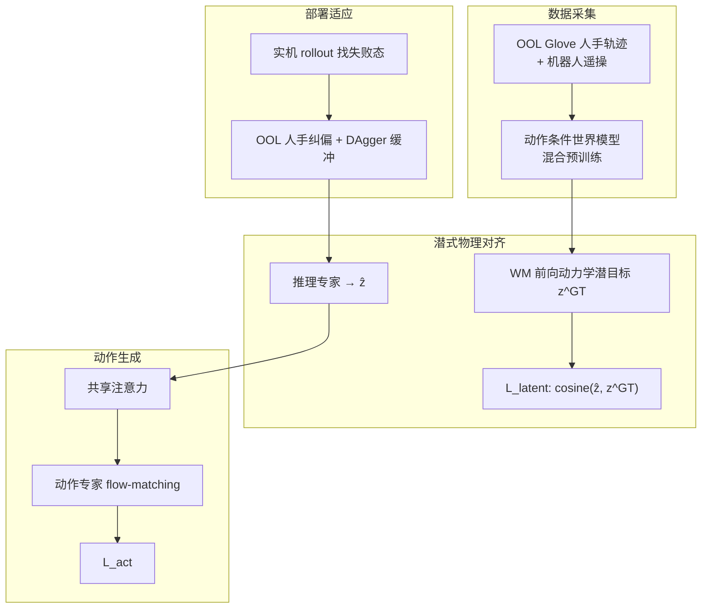

# LaST-HD（Learning Latent Physical Reasoning from Scalable Human Data）

**LaST-HD** 是北京大学、香港中文大学、Simplexity Robotics 与 Aether Tech 等团队的 **人手→机器人操作 VLA** 论文（arXiv:2606.23685）：在 **reasoning-before-acting** 的 **Mixture-of-Transformers (MoT) VLA** 上，用 **动作条件世界模型** 把 **无需严格配对** 的人手与机器人轨迹嵌入 **共享前向动力学潜空间**，以 **物理后果预测特征** 监督推理专家，再经 **共享注意力** 驱动动作专家；配套 **Out-of-Lab (OOL) Glove** 低成本人手采集与 **mixed-to-human** 两阶段训练（混合共训 + 人手在线纠偏），在 **6 项真机任务、3 种本体**（双臂夹爪与灵巧手）上报告 **仅用人类数据泛化** 与 **约 20 分钟纠偏达 >90%** 的部署适应叙事。

## 一句话定义

**不直接模仿人手运动学，而是用世界模型在共享潜空间里对齐「动作会导致什么物理后果」，让人手数据通过 VLA 的潜式物理推理进入机器人控制。**

## 英文缩写速查

| 缩写 | 英文全称 | 简要说明 |
|------|----------|----------|
| VLA | Vision-Language-Action | 视觉-语言-动作多模态基础策略方向 |
| MoT | Mixture-of-Transformers | 推理专家与动作专家分路、共享注意力的 VLA 架构 |
| WM | World Model | 预测环境/观测演化的前向动力学模型 |
| OOL | Out-of-Lab | 论文提出的低成本 IMU 动捕手套与采集平台 |
| IL | Imitation Learning | 从专家演示学习策略，奖励难定义时的主路线 |
| DAgger | Dataset Aggregation | 在策略失败态收集纠偏演示的迭代模仿学习 |

## 为什么重要

- **成本结构：** 机器人遥操演示 **慢、贵**；人手交互数据 **可扩展**，但 **运动学重定向**  alone 难以覆盖 **动力学差异**。
- **方法切口：** 把 **跨具身对齐** 从 **动作/未来帧视觉** 推进到 **动作条件前向动力学潜空间**，与 EgoMimic、EgoScale 等 **表征或动作级共训** 形成对照。
- **工程闭环：** **OOL Glove**（>200 Hz、亚毫米级关键点）+ **mixed co-training** + **人手 DAgger 式在线纠偏**，给出从 **规模化人手预训** 到 **新环境快速适应** 的可操作配方。

## 核心信息

| 字段 | 内容 |
|------|------|
| 机构 | 北京大学（PKU）、香港中文大学（CUHK）、Simplexity Robotics、Aether Tech |
| 出处 | 2026 · arXiv:2606.23685 |
| 论文/项目 | <https://arxiv.org/abs/2606.23685> |
| 项目页 | <https://siriyep.github.io/last-hd-project-page/> |

## 核心结构

| 模块 | 内容 |
|------|------|
| **MoT VLA 骨干** | 基于 Janus-Pro + DeepSeek-LLM 1.5B；SigLIP-Large 视觉编码；**推理专家** 预测 \(N_{\text{lat}}\) 个潜 token，**动作专家** flow-matching 输出动作块；**共享注意力** 传递推理知识。 |
| **世界模型对齐桥** | 在混合人手/机器人轨迹上微调 **动作条件 WM**；抽取 **最深 U-Net 去噪步** 的 **前向动力学特征**，MLP 对齐为潜式监督；**无需轨迹配对**，动作标签作弱锚点。 |
| **OOL Glove** | 6×IMU、21 手关键点 + 1 腕点；<100 g/只；原生人手–环境交互轨迹，可重定向到 **夹爪** 与 **灵巧手**。 |
| **Mixed-to-human** | **Stage 1：** 混合人手+机器人共训（\(\mathcal{L}_{\text{act}}+\lambda\mathcal{L}_{\text{latent}}\)）；**Stage 2：** 实机失败态 **OOL 人手纠偏** + 平衡回放 1–2 epoch。 |

### 流程总览

## 实验与评测（摘要）

- **设置：** 6 任务 × 3 本体；域内 100 机器人 + 50 OOL；泛化场景每类仅 60 OOL 人手轨迹。
- **域内平均 SR：** LaST-HD **73%** > LaST0 **63%** ≈ \(\pi_{0.5}\) **62%** > Cosmos-Policy **52%**。
- **泛化（+未见场景人手）：** LaST-HD **全局 56%** vs LaST0 **46%**；未见背景 **68%**。
- **在线纠偏：** Sort Fruits 上 **60 条 OOL（≈20 min）** 可将未见物体/背景推至 **100%** SR。
- **消融：** 无潜式推理 **60%**；SigLIP 未来帧 / 无动作条件 WM 均弱于 **动作条件 WM 潜监督**；OOL **73%** > 裸手视觉 **63%** > 同时长机器人 Real-12 **60%**。

## 常见误区或局限

- **误区：** 认为 **人手关键点重定向** 已足够；论文显示 **动作级共训 alone** 在去掉潜式推理后明显下降（73%→60%）。
- **局限：** 仍依赖 **目标本体部分机器人数据** 做域内共训；世界模型与 MoT 骨干 **训练与部署栈较重**；Simplexity / 特定 Marvin+WUJI 平台 **复现门槛** 需对照附录。
- **边界：** 与 **纯视频 egocentric IL**（EgoMimic）不同，LaST-HD 强调 **带精确手–腕动作标签** 的 OOL 模态与 **物理潜对齐**。

## 关联页面

- [VLA（Vision-Language-Action）](../methods/vla.md) — reasoning-before-acting 与人数据缩放语境。
- [Imitation Learning](../methods/imitation-learning.md) — 人手演示、DAgger 纠偏与 IL 管线。
- [World Action Models](../concepts/world-action-models.md) — 动作条件前向动力学作为跨具身接口。
- [跨具身迁移（专题）](../overview/topic-cross-embodiment.md) — 人→机器人迁移案例。
- [EgoMimic](./paper-ego-03-egomimic.md) — 第一视角人数据进 IL 的相邻路线。
- [Manipulation（任务）](../tasks/manipulation.md) — 桌面/灵巧操作评测背景。

## 参考来源

- [LaST-HD 论文摘录（arXiv:2606.23685）](../../sources/papers/last_hd_arxiv_2606_23685.md)
- 论文 PDF：<https://arxiv.org/pdf/2606.23685>
- 项目主页：<https://siriyep.github.io/last-hd-project-page/>

## 推荐继续阅读

- LaST0（潜式 CoT VLA 基线，论文 Related Work 对照）
- EgoMimic（arXiv:2410.24221）— 人手 egocentric 与机器人共训 IL
- EgoScale — 大规模 egocentric 人视频预训练 VLA
- \(\pi_{0.5}\) — 论文强 VLA baseline
- Cosmos-Policy — 世界–动作模型 baseline
