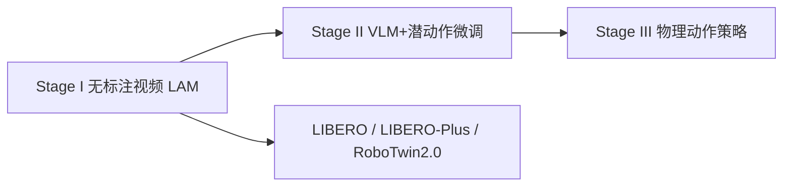
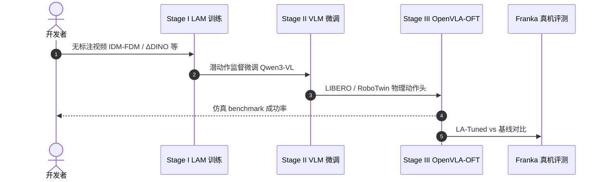

# What Matters for Latent Actions

**What Matters for Latent Actions in Robot Learning**（[arXiv:2608.19613](https://arxiv.org/abs/2608.19613)，[代码](https://github.com/XizoB/What-Matters-for-Latent-Actions-in-Robot-Learning)）——复旦大学；清华大学；小米 EV 等。

## 一句话定义

**潜动作研究需要从模型炫技回到可比实验——41 项设计一次看清。**

## 英文缩写速查

| 缩写 | 英文全称 | 简要说明 |
|------|----------|----------|
| LAM | Latent Action Model | 从无标注视频学紧凑动作代理 |
| LAPO | Latent Action Pretraining from Observations | IDM-FDM 自监督潜动作框架 |
| JAP | Joint Latent-Action Prediction | 潜动作与物理动作并行预测头 |

## 为什么重要

- 纳入 [具身智能小站 2026-08-22 十篇盘点](../../sources/blogs/wechat_embodied_station_video_contact_control_10_papers_2026-08-22.md) 的「视频→接触→控制→VLA 持续学习」主线。
- 开源状态（入库日）：**已开源**。

## 核心信息

| 项 | 内容 |
|----|------|
| **机构** | 复旦大学；清华大学；小米 EV 等 |
| **出处** | arXiv:2608.19613（2026-08） |
| **开源** | **已开源** |

### 流程总览

## 结论

**潜动作设计的可比实证比单点 SOTA 更能指导 VLA/WAM 数据管线。**

- LAPO 与语义帧差 ΔDINO 是强基线
- 潜动作维度 32 跨 7/14-DoF 平台最优
- FDM 重建指标比 probe 更可靠预测下游
- 缩放 Stage-II 视频微调持续改善下游

## 源码运行时序图

## 与其他页面的关系

- [vla](../methods/vla.md)
- [paper-sa-2601-05230-learning-latent-action-world-models-in-the-wild](./paper-sa-2601-05230-learning-latent-action-world-models-in-the-wild.md)
- [imitation-learning](../methods/imitation-learning.md)
- [libero-benchmark](../entities/libero-benchmark.md)
- [视频–接触–控制 10 篇技术地图](../overview/video-contact-control-10-papers-technology-map.md)

## 参考来源

- [latent_actions_matter_arxiv_2608_19613](../../sources/papers/latent_actions_matter_arxiv_2608_19613.md)
- [latent-actions-matter](../../sources/sites/latent-actions-matter.md)
- [latent-actions-matter](../../sources/repos/latent-actions-matter.md)
- [wechat_embodied_station_video_contact_control_10_papers_2026-08-22](../../sources/blogs/wechat_embodied_station_video_contact_control_10_papers_2026-08-22.md)

## 推荐继续阅读

- [arXiv:2608.19613](https://arxiv.org/abs/2608.19613)
- [What Matters for Latent Actions 官方代码](https://github.com/XizoB/What-Matters-for-Latent-Actions-in-Robot-Learning)
