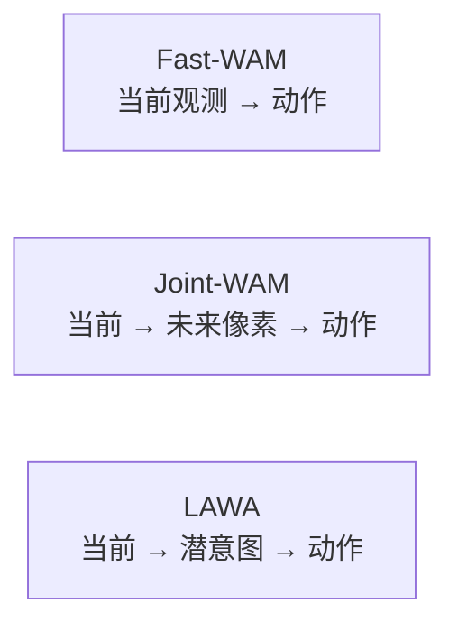

# LAWA：潜动作作未来意图

**LAWA**（*Latent Action as Intention Enables Efficient Future Imagination for World Action Models*，[arXiv:2608.24882](https://arxiv.org/abs/2608.24882)，[项目页](https://getterupper.github.io/LAWA)）由 **清华大学 CollegeAI / AIR** Xiang Li、Wenchao Ding 等与 **中科院自动化所、TARS Robotics、复旦、东南大学、上海交大、NUS、北航** 提出：用离散 tokenizer 把当前→未来的视觉转移压成 **操作中心 codebook**，策略联合去噪该 latent 意图与可执行 action chunk，**推理丢掉未来视频分支**。

## 一句话定义

**未来想象不必渲染像素：把「接下来交互该怎么发生」写成时序 latent action，动作专家读它，就能在 Fast-WAM 的延迟档附近保住 Joint-WAM 的少样本与 OOD。**

## 英文缩写速查

| 缩写 | 英文全称 | 简要说明 |
|------|----------|----------|
| LAWA | Latent Action as Intention WAM | 本文：潜动作作测试时未来意图 |
| WAM | World Action Model | 联合未来观测与动作生成的具身策略 |
| Fast-WAM | Fast World Action Model | 训练有视频、推理关掉未来分支 |
| Joint-WAM | Joint World Action Model | 推理仍滚未来像素再出动作 |
| ViPRA | Video Prediction for Robot Actions | 本文 tokenizer 的视频预测前身 |
| SR | Success Rate | RoboCasa / LIBERO-Plus / 真机成功率 |

## 为什么重要

- **把 Fast vs Joint 从口号变成 matched 对照：** 同数据、同优化、不同分支；Fast 少样本掉点不是实现事故。
- **少样本与人视频真正吃得下：** 无 ego 预训练时 LAWA 仍落后 Joint；加上掩码监督的无动作视频后才反超，且随视频比例继续涨。
- **延迟可读：** A800 每 chunk Fast **196.5** / LAWA **338.5** / Joint **593.1 ms**；相对 Joint **−42.9%**，不是「和 Fast 一样快」。

## 核心信息

| 项 | 内容 |
|----|------|
| **机构** | 清华大学（Tsinghua）；中国科学院自动化研究所（CASIA）；TARS Robotics；复旦大学（Fudan）；东南大学（SEU）；上海交通大学（SJTU）；新加坡国立大学（NUS）；北京航空航天大学（BUAA） |
| **仿真** | RoboCasa 24 桌面任务（few-shot=10% / full=24k 轨迹）；LIBERO-Plus 零样本七扰动 |
| **真机** | UFACTORY xArm7 + D435 基座 + 双腕鱼眼；Gear / Battery / Block / Laboratory |
| **开源** | **宣称将开源 / 待发布**：项目页 *Code (coming soon)*；[getterupper/LAWA](https://github.com/getterupper/LAWA) 仅网页静态文件 |

## 核心原理（方法）

### 三维范式

训练时视频 / latent / 动作三专家联合注意力。结构化掩码：当前观测看不到未来；latent 只看当前观测与自身序列；动作看当前观测 + latent + 动作，**看不到未来视频**。推理省略未来视频 token，cache 当前观测特征，只迭代去噪 latent 与动作。tokenizer 目标是离散 codebook，测试时 latent 专家在连续嵌入上 flow matching，**不去最近邻投影**。

### Tokenizer

DINOv2 帧差量化 + 下一帧重建；辅助 **SAM 2 自动掩码** 把码偏向手/臂/交互区（消融里光流辅助反而掉点）。无动作机器人+egocentric 视频预训练：对齐运动速度，机器人样本期望约 **20%**，避免被海量人视频冲掉本体接地。

## 工程实践

| 项 | 说明 |
|----|------|
| 源码运行时序图 | **不适用**（GitHub 仅项目页，无可运行训练/推理入口） |
| 部署形态 | 推理不生成未来观测；延迟介于 Fast 与 Joint 之间 |
| 预训练杠杆 | 没有 ego 视频时不要指望 latent 分支自动赢 Joint |
| 功能检验 | 推理扰动 latent（高斯 / 时序打乱）会把 RoboCasa full 从 80.8% 打到 52–56%——动作头确实在用这条通路 |

## 实验与评测

### RoboCasa（24 任务均 SR）

| 方法 | 范式 | Few-shot | Full |
|------|------|----------|------|
| DIAL | VLA | 58.3 | 70.2 |
| Fast-WAM† | WAM | 56.0 | 76.3 |
| Joint-WAM† | WAM | 64.1 | 78.8 |
| **LAWA** | WAM | **65.6** | **80.8** |

† 为作者 matched 实现。相对 Fast **+9.6 / +4.5 pt**。

### 其它

- **LIBERO-Plus** 微平均 **74.4%**（Fast 60.0、Joint 70.4、OpenVLA-OFT 69.6）。语言扰动上 Joint 更高（91.8 vs LAWA 62.8），LAWA 赢在相机/噪声/纹理等观测扰动。
- **ego 预训练：** LAWA few-shot 59.7→65.6；Fast 只 +1.5、Joint +1.0。视频从 10%→100%，LAWA full +3.6、few-shot +4.0。
- **真机：** 25% 数据均 **40.0%** vs Fast 8.8%；全数据 **67.5%** vs 33.8%。长程 Block/Laboratory 全数据各 **+45 pt**。

## 结论

**LAWA 的可迁移主张是「测试时保留一条紧凑未来通路」，不是「latent 一定强过像素想象」——没有人视频预训练时它仍落后 Joint。**

1. **少样本是主战场：** few-shot 相对 Fast +9.6 pt，比 full 的 +4.5 更能说明未来意图的价值。
2. **延迟读 338 ms，不要和 Fast 196 ms 混称「低延迟」。** 相对 Joint 才是 −42.9%。
3. **掩码辅助 > 光流辅助；** 光流在消融里掉点。
4. **LIBERO-Plus 不是全面碾压：** 语言扰动弱于 Joint，读「零样本 SOTA」时要看扰动类型。
5. **真机 25% 数据已超 Fast 全数据**，但只有 20 trial/任务，当趋势不当硬榜。
6. **复现：** 代码 Coming soon；不要 clone 网页仓当训练栈。

## 与其他工作对比

| 对比轴 | LAWA | [Being-H0.7](../methods/being-h07.md) | [Rift](./paper-rift-wam.md) | [LD4WAM](./paper-ld4wam.md) |
|--------|------|------------------------------------------|------------------------------|------------------------------|
| 测试时未来 | 连续 latent action 序列 | 训练-only 后验 → 可部署 latent query | 一次 anticipation 写未来 K/V | 仍先滚视频再解动作 |
| 人视频 | tokenizer 无动作预训练 | egocentric 对齐潜先验 | 不强调 | 语义+Delta EE 潜码 |
| 延迟叙事 | 相对 Joint −42.9% | 不滚像素 | ~1.1× current-only | 视频税仍在 |
| 开源 | **待发布** | 方法页 / 部分栈 | **未开源** | **未开源** |

## 局限与风险

- **占位仓：** `getterupper/LAWA` 默认分支只有网页；无 LICENSE。
- **matched 基线不可外验：** Fast/Joint 是作者实现，榜上其它 VLA/WAM 不是同一训练预算。
- **语言 OOD：** LIBERO-Plus Language 上弱于 Joint，紧凑意图可能丢语义细节。
- **真机样本小：** 每任务 20 次评估，长程 +45 pt 方差未知。

## 关联页面

- [World Action Models](../concepts/world-action-models.md) — Fast / Joint / 潜意图坐标
- [Latent Imagination](../concepts/latent-imagination.md) — 紧凑未来表示
- [Being-H0.7](../methods/being-h07.md) — 部署不滚像素的潜空间 WAM
- [WAM 动作后果分类 01](../overview/wm-action-consequence-category-01-wam-action-prediction.md)
- [LD4WAM](./paper-ld4wam.md) — 潜动力学仍滚视频的对照
- [Rift](./paper-rift-wam.md) — 另一条免视频 rollout
- [WAM 实时异步部署](./paper-wam-realtime-async.md) — 延迟在 chunk 切换层
- [VLA](../methods/vla.md)
- [Manipulation](../tasks/manipulation.md)

## 参考来源

- [LAWA 论文摘录](../../sources/papers/lawa_arxiv_2608_24882.md)
- [LAWA 项目页归档](../../sources/sites/getterupper-lawa.md)
- [LAWA 仓归档](../../sources/repos/lawa.md)

## 推荐继续阅读

- 项目页 — <https://getterupper.github.io/LAWA>
- 论文 — <https://arxiv.org/abs/2608.24882>
- Fast-WAM 对照：Yuan et al., arXiv:2603.16666
- Being-H0.7 — <https://arxiv.org/abs/2605.00078>
