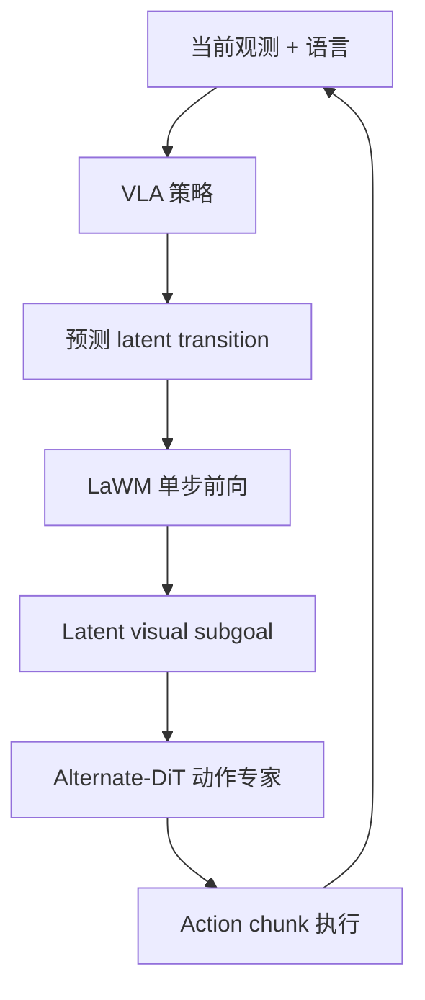
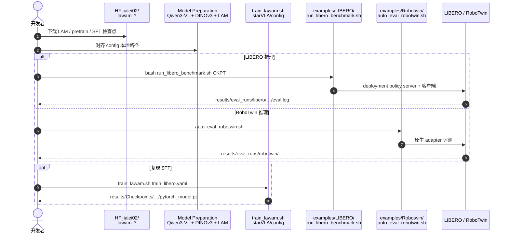

# LaWAM：LeRobot 原生潜空间 World Action Model

**LaWAM**（*Latent World Action Models for Efficient Dynamics-Aware Robot Policies*，[arXiv:2606.15768](https://arxiv.org/abs/2606.15768)，[项目页](https://rlinf.github.io/LaWAM/)，[代码](https://github.com/RLinf/LaWAM)）由 **清华大学**、**吉林大学**、**南开大学**、**北京大学**、**哈尔滨工业大学**、**中关村人工智能研究院**、**跨步智能（Striding.AI）** 与 **无问芯穹（Infinigence AI）** 等联合提出：在冻结 **DINOv3** 视觉特征空间用 **LaWM** 预测 **latent visual subgoal**，替代像素级未来视频，以 **Alternate-DiT** 动作专家生成 chunk；**2026-09 已官方集成 [LeRobot](./lerobot.md)**。

## 一句话定义

**把 WAM 的「未来」从像素视频换成一个潜空间 subgoal——动力学感知仍在，墙钟延迟和冗余像素一起下去。**

## 英文缩写速查

| 缩写 | 英文全称 | 简要说明 |
|------|----------|----------|
| WAM | World-Action Model | 联合预测未来观测与动作的策略 |
| LaWM | Latent World Model | 本文潜动作条件的前向世界模型（~230M） |
| LAM | Latent Action Model | Stage 1 逆动力学 + 前向解码训练 |
| VLA | Vision-Language-Action | Qwen3-VL-2B + 动作专家 |
| LIBERO | Lifelong Robot Learning | 四套件操作 benchmark |
| HF | Hugging Face | 检查点与 LeRobot 格式数据托管 |

## 为什么重要

- **latency–success 帕累托：** LIBERO **98.6%** 且 A100 **187 ms/chunk**，相对 Cosmos-Policy、LingBot-VA 等像素 WAM 最高约 **24×** 墙钟加速（项目页对照表）。
- **LeRobot 原生栈：** 非旁路脚本——官方 `lerobot` 文档页 [`lawam.mdx`](https://github.com/huggingface/lerobot/blob/main/docs/source/lawam.mdx)；HF 提供 `lawam-libero-sft-lerobot` 与 `libero_merged_no_noops_20hz`。
- **真机三角验证：** Franka 刚性/铰接 + Quanta X1 双手机 deformable，三任务均值 **90.0%**。
- **与 [GlanceWAM](./paper-glancewam.md) 互补：** 后者异步单帧视频前瞻；LaWAM 彻底放弃像素生成，改潜特征 subgoal。

## 核心信息

| 项 | 内容 |
|----|------|
| **机构** | 清华大学；吉林大学；南开大学；北京大学；哈尔滨工业大学；中关村人工智能研究院；跨步智能；无问芯穹 |
| **骨干** | Qwen3-VL-2B-Instruct + DINOv3 ViT-B/16 LaWM + Alternate-DiT 动作头 |
| **训练数据** | ~3000 h 机器人视频 + ~1500 h  egocentric 人类视频（LaWM）；策略 SFT 用带语言 robot 轨迹 |
| **开源** | **已开源** MIT：[RLinf/LaWAM](https://github.com/RLinf/LaWAM)；HF [checkpoints 集合](https://huggingface.co/collections/jialei02/lawam-checkpoints) |

## 核心原理（方法）

**Stage 1 — Learn LaWM：** 冻结视觉编码器，逆动力学推断连续 **latent action**，前向解码器预测 horizon **observation feature**（非 RGB）。

**Stage 2 — Distill & act：** **Latent-action distillation** 教 VLA 从 \((o, \ell)\) 预测 transition code；测试时 **一次非迭代** LaWM 前向 → subgoal → chunk 级控制。

### 流程总览

## 源码运行时序图

节点对齐 [`sources/repos/lawam.md`](../../sources/repos/lawam.md) 与 README。

- **最短复现：** 拉 `lawam_libero_sft_release` → `run_libero_benchmark.sh`（见 README LIBERO Inference）。
- **LeRobot：** 优先读官方 `lawam.mdx` 与 `jialei02/lawam-libero-sft-lerobot` 权重。

## 工程实践

| 项 | 建议 |
|----|------|
| 检查点_bundle | 移动 checkpoint 须连同 `config.yaml` + `dataset_statistics.json` |
| 数据 mix | LIBERO 用 `libero`；RoboTwin EEF 用 `robotwin_merged` |
| 依赖 | `flash-attn==2.8.3` 与本地 CUDA/PyTorch 需匹配 |
| 对照 | 像素 WAM（Cosmos-Policy）、[GlanceWAM](./paper-glancewam.md) 异步前瞻、[Harness VLA](./paper-harness-vla.md) agentic 编排 |

## 实验与评测

| 设定 | 数字（论文 / 项目页） |
|------|----------------------|
| LIBERO 平均 SR | **98.6%**（187 ms/chunk，2.3B，A100，10 denoise steps） |
| RoboTwin 50 任务 | **91.22%**（clean 92.52 / randomized 89.48） |
| 真机三任务 | **90.0%** 平均（pick-place 93.3 / drawer 86.7 / towel 90.0） |
| vs 像素 WAM | 墙钟最高 **24×** 加速（同表 latency–SR） |

## 与其他工作对比

> 下表做**定位对照**：LIBERO 98.6% / RoboTwin 91.22% 与 24× 墙钟加速分别取自论文与项目页同表 latency–SR 对照，跨页搬运前须对齐 benchmark 与硬件。

| 对照 | 差异读法 |
|------|----------|
| **像素 WAM**（Cosmos-Policy、LingBot-VA 等，本文要替代的默认做法） | 同为「让策略先想一步未来」，差别在**未来长什么样**：像素 WAM 生成 RGB rollout，LaWAM 只出一个 DINOv3 潜特征 subgoal。省掉像素生成、保留动力学条件，是本页最直接的一条主张 |
| [GlanceWAM](./paper-glancewam.md) | 同为压 WAM 墙钟，路线互补：GlanceWAM 保留像素但改**异步单帧前瞻**，LaWAM 彻底不生成像素。前者对已有视频 WM 改动小，后者要换表征空间 |
| [WAM 实时异步](./paper-wam-realtime-async.md) | 该页讲把预测与执行拆到不同节拍；LaWAM 的 187 ms/chunk 来自**单次非迭代前向**。两条降延迟手段正交，可叠加 |
| [Harness VLA](./paper-harness-vla.md) | 抽象层不同：Harness 在 agent 编排层调度多个策略，LaWAM 换的是单个策略内部的未来表征。选型先确认瓶颈在编排还是单步延迟 |
| [Action Chunking](../methods/action-chunking.md) | LaWAM 的 subgoal 正是喂给 chunk 级动作专家的条件；该页给 chunk 执行语义，读 187 ms 应按「每 chunk 一次」而非「每步一次」计 |
| [LeRobot](./lerobot.md) | 工程分界：LaWAM 已官方进 LeRobot 文档与权重，多数同类 WAM 仍是旁路脚本——复现成本的差别在这里，不在 SR |

## 结论

**LaWAM 证明：WAM 的「未来条件」不必是视频——一个 DINOv3 潜 subgoal 就够撑起 SOTA 级成功率，且直接进 LeRobot 训练栈。**

1. **选 WAM 先看表征空间** — 潜特征 subgoal 比像素 rollout 更适合 chunk 控制接口。
2. **两阶段解耦 LaWM 与 VLA** — 大规模无标签视频学动力学，小数据 robot 轨迹做 SFT 集成。
3. **187 ms 是可用控制频率** — 与 LingBot-VA 秒级生成不在同一部署类。
4. **复现走 HF + auto_eval** — 不要从零训 LaWM；检查点 sidecar 路径必须完整。
5. **真机数字任务少但跨平台** — Franka + 双手机 deformable 作部署信心补充，非主 benchmark。

## 局限与风险

- **依赖 Qwen3-VL + DINOv3 栈** — 权重体积与 flash-attn 环境门槛高于纯 ACT。
- **RoboTwin / 真机协议与 LIBERO 不同** — 混用 data_mix 或 state 契约会静默掉点。
- **CoRL 2026 标注以 README 为准** — 引用请核对最终 proceedings。

## 关联页面

- [World Action Models](../concepts/world-action-models.md) — WAM 概念谱系
- [LeRobot](./lerobot.md) — 官方 LaWAM 集成
- [VLA](../methods/vla.md) — 条件动作生成
- [GlanceWAM](./paper-glancewam.md) — 另一条低延迟 WAM
- [Action Chunking](../methods/action-chunking.md) — chunk 执行语义

## 参考来源

- [lawam_arxiv_2606_15768](../../sources/papers/lawam_arxiv_2606_15768.md)
- [LaWAM 项目页](../../sources/sites/lawam-rlinf-github-io.md)
- [lawam 仓库](../../sources/repos/lawam.md)

## 推荐继续阅读

- [arXiv:2606.15768](https://arxiv.org/abs/2606.15768)
- [GitHub RLinf/LaWAM](https://github.com/RLinf/LaWAM)
- [HF lawam-libero-sft-lerobot](https://huggingface.co/jialei02/lawam-libero-sft-lerobot)
