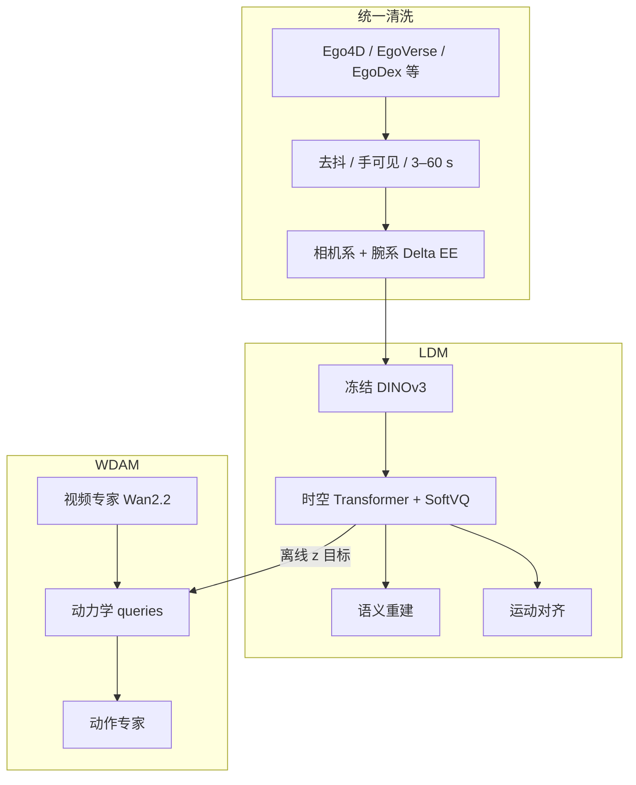

# LD4WAM：跨本体运动对齐潜动力学 WAM

**LD4WAM**（*Learning Latent Dynamics from Human Videos for World Action Models*，[arXiv:2608.22403](https://arxiv.org/abs/2608.22403)）提出 **motion-aligned latent dynamics**：在冻结 **DINOv3** 语义空间用下一帧特征重建 + **相机系末端增量（Delta EE）** 学跨本体动力学码，再由 **Mixture-of-Transformers** 的 World Dynamics Action Model 从生成未来中用 **learnable queries** 读出该码并条件动作专家。通讯作者 **Ruihai Wu**；arXiv HTML **未列作者单位**。

## 一句话定义

**先把「帧间发生了什么运动」压成与本体无关、又钉在真实末端增量上的潜码，再让 WAM 的动作头读这串码，而不是只对像素未来做回归。**

## 英文缩写速查

| 缩写 | 英文全称 | 简要说明 |
|------|----------|----------|
| WAM | World Action Model | 联合未来观测与动作的策略 |
| LDM | Latent Dynamics Model | 语义重建 + 运动对齐的动力学编码器 |
| WDAM | World Dynamics Action Model | 视频 / 动力学 / 动作三专家 MoT |
| MoT | Mixture-of-Transformers | 分专家权重、共享一层自注意 |
| Delta EE | Delta End-Effector | 统一相机/腕坐标系下的帧间末端增量 |

## 为什么重要

- **人视频两条老路都不够：** 像素 WAM 把动力学留在生成通路；重定向把可迁移物理和本体执行缠在一起。[EgoWAM](./paper-egowam-egocentric-human-wam-co-training.md) 换世界目标空间；LD4WAM 进一步要求表征 **可回归真实运动**。
- **可检验的中间量：** 浅层头从冻结 \(z\) 回归 Delta EE——去运动对齐误差放大 **3.7–5.0×**，这比「WAM 又涨了 1 点」更能说明桥是否成立。
- **跨夹爪与灵巧手：** 动作专家共享躯干、只换 I/O 投影；真机同时报 PIPER 夹爪与天玑+无极手。
- **背景泛化诚实：** 未见物体保留 ID 的 88.6%，但背景扰动 **44.4% < π₀.₅ 54.5%**——作者归因于「动作条件在生成视频上」。

## 核心信息

| 项 | 内容 |
|----|------|
| **机构** | 论文未列单位；通讯作者个人主页为加州大学伯克利分校博士后 |
| **语料** | **5,086 h / 274.66M 帧** @15 FPS；人 76.4% / 机 23.6% |
| **LDM** | 冻结 DINOv3 ViT-L/16；SoftVQ 8 code × 4×4 → 512-D \(z\) |
| **WDAM** | Wan2.2 TI2V-5B 视频专家 + query 动力学专家 + flow 动作专家 |
| **注意方向** | video 只看自己 → queries 只看视频 → action 看视频+动力学 |
| **开源** | **确认未开源** — 无项目页、无 GitHub、无权重 URL（2026-08-26） |

## 流程总览

三阶段：I 全数据训视频+动力学（冻动作）；II 机器人数据三视角对齐；III 目标本体后训练。损失权重 \((\lambda_v,\lambda_d,\lambda_a)\) 从 \((1,1,0)\) → \((1,0.5,1)\) → \((1,0.1,1)\)。

## 源码运行时序图

**不适用。** 截至 2026-08-26 未列官方代码或权重。

## 核心原理

- **LDM：** 随机 stride 采样暴露多时间尺度。\(\mathcal{L}_{\text{LDM}}=\mathcal{L}_{\text{sem}}+\lambda_m\mathcal{L}_{\text{mot}}+\mathcal{L}_{\text{vq}}\)。语义损失在 DINOv3 特征上（余弦 + 范数）；运动损失 **只作用在有动作标签的帧**；SoftVQ 用 usage KL + 熵防崩。推理丢解码器，只留 \(z\)。
- **统一坐标系：** 人腕：原点腕点，\(z\) 沿手，\(x\) 掌法向；夹爪：原点安装点，\(z\) 沿指，\(x\) 垂直张合面。导出量为该位姿的帧差。
- **WDAM 桥：** 视频流自包含，保住 Wan 先验；queries 无噪声、无扩散时刻，MSE 回归离线 \(z\)；推理先视频去噪，再对冻结视频 + 一次动力学解动作。
- **数据过滤：** 人数据去大头动、双手长期无标注、腕几乎不动；无动作标签片用光流+MediaPipe。LDM 另用更严子集约 **1,500 h**；运动对齐只在 EgoVerse / EgoDex / Xperience / AgiBot-World。

## 实验与评测

### 仿真 · RoboTwin 50 任务（Table 1）

| 方法 | Clean | Random | 平均 |
|------|-------|--------|------|
| π₀.₅ | 82.74 | 76.76 | 79.8 |
| ACE-Ego-0 | 91.12 | 90.62 | 90.9 |
| Fast-WAM | 91.88 | 91.78 | 91.8 |
| Lingbot-VA | 92.90 | 91.50 | 92.2 |
| **LD4WAM** | **93.96** | **92.78** | **93.4** |

仿真顶部分数挤在 91–93；作者把判别力放到真机。

### 真机七任务（Table 2，各 30 次）

夹爪平台：双臂 AgileX PIPER + Pika；灵巧平台：双天玑臂 + 无极手。每任务 50 条演示。

| 方法 | 夹爪五项 | 灵巧两项 | 平均 |
|------|----------|----------|------|
| π₀.₅ | 63.3 / 43.3 / 73.3 / 76.7 / 70.0 | 76.7 / 40.0 | 63.3 |
| Fast-WAM | 50 / 10 / 53.3 / 46.7 / 63.3 | 76.7 / 30.0 | 47.1 |
| Lingbot-VA | 80 / 40 / 63.3 / 73.3 / 76.7 | 80 / 36.7 | 64.3 |
| **LD4WAM** | **80 / 50 / 70 / 80 / 83.3** | **83.3 / 46.7** | **70.5** |

列顺序：Sorting、Shift Test Tube、Tidy Desk、Fold Shirt、Handover Mug、Place Rubik’s Cube、Spray Water。

### 泛化与消融

- **未见物体** 保留 ID 的 **88.6%**（表内最高）。
- **背景/光照/桌布：** 均 44.4%，低于 π₀.₅ 的 54.5%；相对 Fast-WAM / Lingbot-VA 仍 +10.0 / +34.4（按作者叙述）。
- 架构从 Video-Action 双专家 **40.0%** → 加动力学专家 **48.1%** → 预训练 **58.9%** → Align **63.7%**（三任务泛化表平均）。
- LDM 回归探针（RoboTwin 未见域）：去运动对齐高/低帧率带 0.21→0.78、2.13→10.59。

检索图：同一运动的人手当邻居能拉到机器人臂，反向运动则分开——支持「码跟运动不跟外观」。

## 结论

**LD4WAM 的可迁移部分是「语义空间 + 真实末端增量」钉住的潜动力学；WAM 涨分是它被动作专家读到之后的结果。背景仍怕生成视频，不能当成纹理不变的 VLA。**

1. **真影响指标：** 运动对齐是 LDM 最大杠杆；真机平均 **70.5%** 相对 π₀.₅ / Lingbot-VA 约 +6–7 pt，且覆盖夹爪与灵巧手。
2. **仿真 93.4% 只是入场券：** 与 Lingbot-VA 只差 1.2 pt，不要单独当 SOTA 故事。
3. **预训练几乎全是泛化：** 加 Stage I，ID 只 +1.1，未见背景 +23.3——人视频的价值在覆盖，不在刷 ID。
4. **部署读法：** 推理仍先滚视频再解动作；延迟与纹理 OOD 是 WAM 结构税，潜码只能抑制不能取消。
5. **选型：** 已有大规模人+机视频、要跨夹爪/灵巧手时读本页表征；若现场纹理乱变且不能生成视频，π₀.₅ 类 VLA 可能更稳。
6. **复现：** **未开源**；5k h 配方与坐标系定义可参考，权重与 MoT 实现不可跑。

## 与其他工作对比

| 对比轴 | LD4WAM | EgoWAM | Being-H0.7 | 像素 Joint WAM |
|--------|--------|--------|------------|----------------|
| 人视频用法 | 语义+Delta EE 潜码 | 可替换世界头（DINO/flow） | 潜查询 + 未来后验 | 像素重建 |
| 部署是否滚视频 | 是（先视频后动作） | 否（推理关世界头） | 否 | 是 |
| 运动监督 | 显式 Delta EE | 间接（世界目标） | 机器人动作 | 无 |
| 开源 | 否 | 项目页、代码当时未公开 | 方法页 / 部分栈 | 各异 |

## 工程实践

| 项 | 说明 |
|----|------|
| 源码运行时序图 | **不适用**（无官方仓） |
| 训练硬件（论文） | 64× NVIDIA H20；bf16；DeepSpeed ZeRO-2 |
| LDM | 约 1,500 h 严过滤子集；运动对齐热身后加入 |
| WDAM Stage I/II/III | 单头视 / 头+双腕 L 画布 / 目标本体；峰值 lr \(1\times 10^{-4}\) |
| 动作维 | 共享 Transformer，换输入输出投影适配夹爪 vs 灵巧手 |

## 局限与风险

- **未开源：** 无法复核 5k h 清洗或 MoT 实现。
- **生成视频怕纹理：** 背景 OOD 弱于纯 VLA。
- **机构未在 PDF 头标明：** 引用单位时不要写成「Berkeley 官方工作」；只标注通讯作者个人主页。
- **RoboTwin 拥挤：** 1–2 pt 差距可能被种子与评测协议吃掉。

## 关联页面

- [World Action Models](../concepts/world-action-models.md) — Joint 族 + 人视频桥接
- [VLA](../methods/vla.md) — 反应式对照；背景 OOD 上 π₀.₅ 更稳
- [Being-H0.7](../methods/being-h07.md) — 潜空间世界–动作、部署不滚像素
- [LAWA](./paper-lawa.md) — 测试时显式去噪 latent 意图；相对 Joint 延迟 −42.9%（待发布）
- [EgoWAM](./paper-egowam-egocentric-human-wam-co-training.md) — 人–机共训的世界目标消融
- [Manipulation](../tasks/manipulation.md) — 双臂 / 灵巧操作任务面
- [EgoVerse](./paper-egoverse.md) — 人视频源之一
- [ForeTime-VLA](./paper-foretime-vla.md) — 另一条「WAM 教师 → 部署因果学生」

## 参考来源

- [LD4WAM 论文摘录](../../sources/papers/ld4wam_arxiv_2608_22403.md)

## 推荐继续阅读

- [arXiv:2608.22403](https://arxiv.org/abs/2608.22403) — 附录含坐标系、分任务 RoboTwin 表与训练超参
- [World Action Models 概念页](../concepts/world-action-models.md)
- [EgoWAM 实体页](./paper-egowam-egocentric-human-wam-co-training.md) — 人视频 WAM 对照
