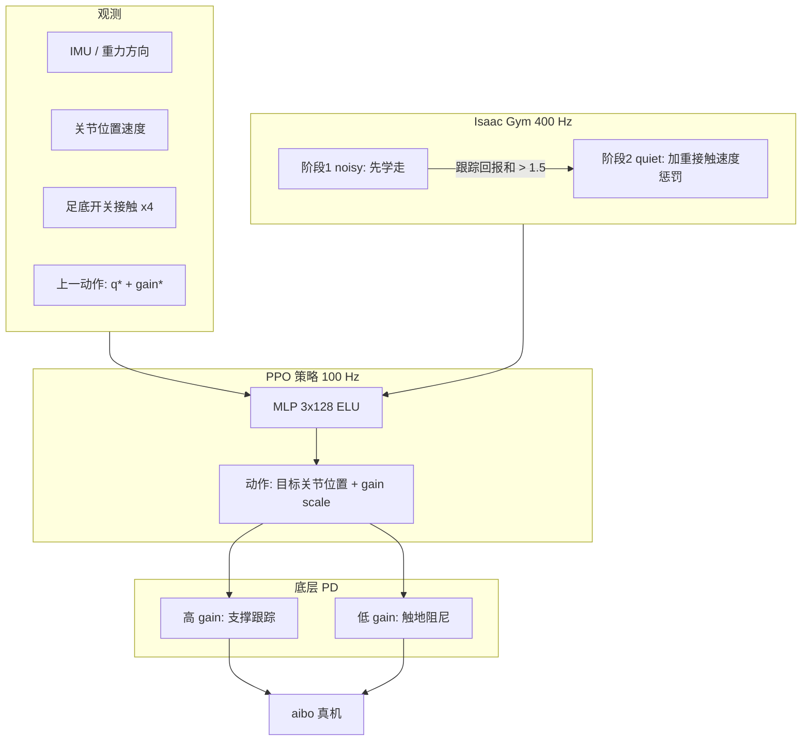

# Learning Quiet Walking：Sony aibo 家庭四足低噪行走

**Learning Quiet Walking for a Small Home Robot**（Watanabe / Miki / Shi 等 · **ETH Zürich RSL / Sony / NUS** 等，[arXiv:2502.10983](https://arxiv.org/abs/2502.10983)，**ICRA 2025**；项目页 [QuietWalk](https://sony.github.io/QuietWalk/)）提出面向 **家用小型四足 aibo** 的 sim-to-real RL：在 Isaac Gym 中最小化与脚步声高度相关的 **足端接触速度**（辅以关节/基座角加速度惩罚），并组合 **策略输出可变 PD gain**、**足底开关接触观测** 与 **noisy→quiet 两阶段课程**；真机声学评测上 **优于 RL 基线与索尼商用 normal/quiet 控制器**，同时用斜坡实验刻画 **安静度–鲁棒性** 权衡。

> **同名辨析：** 项目页称 QuietWalk。本库另有人形 [QuietWalk（arXiv:2604.23702）](./paper-quietwalk-humanoid-locomotion.md)（G1 + PINN 估计竖直 GRF）。二者问题同属「低噪行走」，**代理信号与平台不同**——本文是 **接触速度运动学代理 + aibo**。

## 一句话定义

**仿真里把「踩地有多冲」当成声音代理来罚，再用可变 PD、足底开关和两阶段课程，让 aibo 在家里走得比商用控制器还安静。**

## 英文缩写速查

| 缩写 | 英文全称 | 简要说明 |
|------|----------|----------|
| QuietWalk | — | 本文项目页名；指 aibo 低噪 RL（非人形 PINN-GRF 那篇） |
| RL | Reinforcement Learning | Isaac Gym + PPO 学低噪步态 |
| PPO | Proximal Policy Optimization | 文中 on-policy 优化器 |
| PD | Proportional–Derivative | 策略输出目标位置 + gain scale 调制刚度/阻尼 |
| DR | Domain Randomization | 质量/摩擦/地形等随机化；可调安静–鲁棒权衡 |
| FFT | Fast Fourier Transform | 真机麦克风信号频谱分析（Welch） |
| aibo | — | Sony 家用小型四足陪伴机器人平台 |

## 为什么重要

- **家用场景把「安静」推成一等公民：** 腿足 RL 长期优化鲁棒与能效；aibo 用户反馈直接指向 **脚步噪声**，补上 HRI / 消费机器人产品约束。
- **可仿真的声学代理：** 不在 Isaac Gym 里建声场，而用生物力学相关的 $\|\sim\mathbf{v}_{f}\|^2$ 等可观测量，并在真机上验证代理与听感一致——可迁移到「仿真难直接建模、但有相关物理量」的其他目标（文中举例能耗↔力矩）。
- **消费级传感现实：** 无力/力矩传感时，用 **廉价开关接触** + **可变阻抗式 PD** 完成敏感触地任务，对量产小机器人有工程参考。
- **显式安静–鲁棒权衡：** 最安静策略坡度能力最弱；**调 DR（摩擦/地形高度）** 可在 Pareto 前沿上取点——比只报降噪百分比更贴近部署选型。

## 核心信息

| 字段 | 内容 |
|------|------|
| 机构 | 苏黎世联邦理工（ETH Zürich）、索尼（Sony）、新加坡国立大学（NUS）等 |
| 会议 | ICRA 2025 |
| 平台 | Sony aibo；12 腿关节；足底开关接触；无力传感 |
| 仿真 / 频率 | Isaac Gym；物理 400 Hz / 策略 100 Hz |
| 策略 | PPO；actor–critic MLP 3×128 + ELU |
| 动作 | 每关节目标位置 + PD gain scale（单标量同时调 $P,D$） |
| 部署传感 | IMU / 关节编码器 / **二进制足底接触** |
| 开源 | **确认未开源可运行训练/部署代码**（截至 2026-08-02；仅有项目页） |

## 核心原理（方法）

### 方法栈

| 模块 | 作用 |
|------|------|
| **声学代理奖励** | 主项：足端接触速度 $\|\boldsymbol{v}_{f,xyz}\|^2$；辅项：关节加速度、基座角加速度 |
| **可变 PD** | $P_i=P^*+\alpha\sigma(x_i)$，$D_i=D^*+\beta\sigma(x_i)$；$P^*=3,D^*=0.03,\alpha=4,\beta=0.02$ |
| **接触观测** | 4 维开关接触进策略，支撑「触地阻尼 / 支撑加硬」时序 |
| **两阶段课程** | noisy（接触速度 scale −5）→ 跟踪回报和 >1.5 → quiet（−25；加速度类惩罚 ×2） |
| **任务奖励** | 线/角速度跟踪 $\exp(-\|\cdot\|^2/0.06)$ 等标准 locomotion 项 |
| **DR** | 基座质量、速度扰动、外力力矩、地形高度、摩擦（表 III） |

### 流程总览

### 源码运行时序图

**不适用**（截至 2026-08-02）：官方 [项目页](https://sony.github.io/QuietWalk/) 与 [`sony/QuietWalk`](https://github.com/sony/QuietWalk) 仅为静态展示仓，**无可辨识的训练 / 推理 / 部署入口**。

## 工程实践

| 项 | 做法 |
|----|------|
| 动作接口 | 优先「目标位置 + gain」，而非直接力矩（文中引用接触敏感任务与 locomotion 经验） |
| 课程门槛 | 先把速度跟踪做稳再加噪声惩罚；一步到位易学 **静止** 局部最优 |
| 接触信息 | 无力传感时用开关接触；去掉后 quiet 阶段常频繁摔倒并学会不走 |
| 调权衡 | 加大摩擦/地形高度 DR → 往往更鲁棒、安静度下降；反之亦然 |
| 声学评测 | 机载麦 48 kHz、听阈 20 Hz–20 kHz、Welch；注意麦距足约 10 cm，**相对比较**为主 |
| 复现边界 | 无公开代码/权重；需自备 aibo 开发栈与 Isaac Gym aibo 模型 |

## 实验与评测

| 对比项 | 结果要点 |
|--------|----------|
| 安静度 vs 速度 | 提出方法在多测量速度下平均声级 **低于** RL baseline、Sony normal、Sony quiet |
| 仿真代理（表 IV） | 接触速度 0.417→**0.123** m/s；关节加速度 114.3→76.7；基座角加速度 57.2→23.7 |
| 斜坡鲁棒 | 最响 baseline 可达约 **7°**；提出方法最安静但爬坡最弱 |
| 消融 | 无课程：仅 noisy 权重约一半降噪，quiet 权重不收敛；无接触传感：不走；固定 PD：可降噪但不如可变 PD；More DR：可调 Pareto |

## 结论

**一句话总判：家用四足要把脚步变安静，关键不是「再调一套步态参数」，而是「可仿真的接触速度代理 + 可变 PD/接触开关 + 先学走再加压」三件套；安静度与未知地形鲁棒性天然对冲，DR 是旋钮。**

1. **代理要选对** — $\|\mathbf{v}_f\|^2$ 等在仿真可算，且与真机听感同向，比硬仿声场更可落地。
2. **课程不可省** — 噪声惩罚过早过重会学停走；跟踪回报门槛是实用开关。
3. **消费级接触硬件够用** — 开关传感足以支撑「何时加硬」，但去掉就会塌。
4. **可变 PD 是敏感触地杠杆** — 触地前降 gain、支撑相升 gain；固定 PD 只能吃到部分降噪。
5. **部署要谈权衡** — 报告「比商用 quiet 更安静」时，应同时看坡度/扰动能力与 DR 设定。
6. **与人形 QuietWalk 分工** — 需要力物理一致冲击塑形且无力传感部署时看 [PINN-GRF QuietWalk](./paper-quietwalk-humanoid-locomotion.md)；消费四足/运动学代理路线看本文。

## 局限与风险

- **训练代码未开源**，工程复现依赖自建仿真与 aibo 软件集成。
- **代理非声学本身**：执行器啸叫、机械摩擦等非脚步源未系统处理。
- **鲁棒性代价**：室内平地安静策略可能在更大坡度/未知地面上失效；勿默认「越安静越好」。
- **评测距离**：机载麦近场结果，不宜直接当成人耳远处绝对 dB。
- **命名冲突风险**：检索「QuietWalk」时需用 arXiv 号或平台（aibo vs G1）消歧。

## 与其他工作对比

| 维度 | 本文（aibo QuietWalk） | [人形 QuietWalk](./paper-quietwalk-humanoid-locomotion.md) | [Disney Olaf](../methods/disney-olaf-character-robot.md) | 标准 legged RL |
|------|------------------------|----------------------------------------------------------|----------------------------------------------------------|----------------|
| 平台 | Sony aibo 四足 | Unitree G1 人形 | 角色双足 | 研究/工业四足 |
| 冲击/噪声信号 | **足端接触速度** 等 | **PINN 竖直 GRF** | 奖励中的落地噪声项 | 通常不优化声学 |
| PD | **策略调制 gain** | 固定 PD + 位置增量 | 分层 + 约束项 | 多为固定 PD |
| 部署力传感 | 开关接触 | **无需**力传感 | 平台相关 | 常特权接触力仅训练 |
| 开源 | 仅项目页 | 暂无代码 | 见对应页 | 视项目而定 |

## 关联页面

- [Locomotion](../tasks/locomotion.md) — 足式移动任务总览
- [四足机器人](./quadruped-robot.md) — 四足平台入口
- [Locomotion 奖励设计指南](../queries/locomotion-reward-design-guide.md) — 接触速度/冲击类奖励
- [Kp/Kd 设置指南](../queries/legged-humanoid-rl-pd-gain-setting.md) — 可变 PD 与底层增益
- [人形 QuietWalk（PINN-GRF）](./paper-quietwalk-humanoid-locomotion.md) — 同名低噪线、力估计路线
- [可变阻抗接触 RL](./paper-variable-impedance-contact-rl.md) — 接触敏感任务学增益
- [Sim2Real](../concepts/sim2real.md) — 域随机化与迁移
- [Disney Olaf](../methods/disney-olaf-character-robot.md) — 娱乐机器人降噪奖励对照

## 参考来源

- [Learning Quiet Walking 论文摘录（arXiv:2502.10983）](../../sources/papers/learning_quiet_walking_aibo_arxiv_2502_10983.md)
- [QuietWalk 项目页归档](../../sources/sites/sony-quietwalk-github-io.md)

## 推荐继续阅读

- 项目页：<https://sony.github.io/QuietWalk/>
- 论文 PDF：<https://arxiv.org/pdf/2502.10983>
- [人形 QuietWalk（arXiv:2604.23702）](./paper-quietwalk-humanoid-locomotion.md) — GRF 物理感知低噪对照
- [RL+PD 动作接口论文索引](../../sources/papers/rl_pd_action_interface_locomotion.md)
