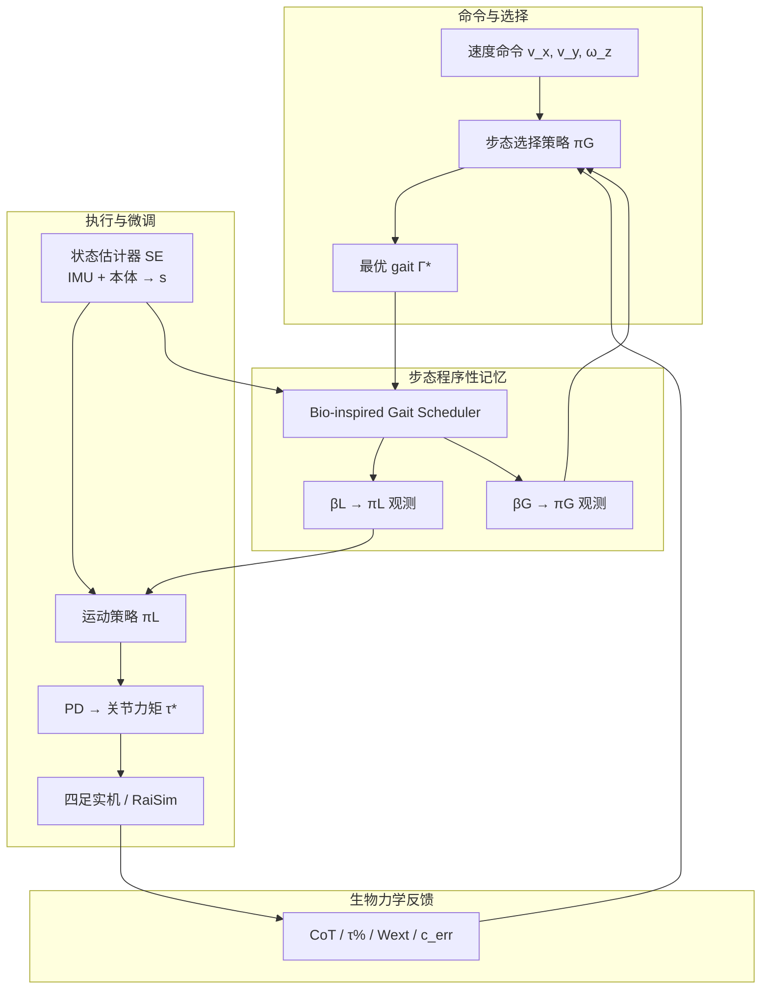

---

type: entity
tags:
  - paper
  - quadruped
  - locomotion
  - multi-gait
  - bio-inspired
  - reinforcement-learning
  - sim2real
  - gait-selection
  - raisim
status: complete
updated: 2026-07-19
doi: "10.1038/s42256-025-01065-z"
venue: "Nature Machine Intelligence 2025"
related:
  - ../concepts/gait-generation.md
  - ../tasks/locomotion.md
  - ../concepts/sim2real.md
  - ../concepts/state-estimation.md
  - ./quadruped-robot.md
  - ./paper-walk-these-ways-quadruped-mob.md
  - ./paper-e-sds-environment-aware-humanoid-locomotion-rl.md
  - ./legged-gym.md
sources:
  - ../../sources/papers/learning_to_adapt_nature_2025.md
  - ../../sources/repos/ihcr_learning_to_adapt.md
summary: "Nature MI 2025：分层 DRL 嵌入步态切换（πG）、BGS 步态程序性记忆与 πL 自适应微调，8 步态盲零样本复杂地形部署；CoT/τ%/Wext/接触误差统一选 gait。"
tags: [paper, quadruped, locomotion, multi-gait, bio-inspired, reinforcement-learning, sim2real, gait-selection, raisim, purdue]

---

# Learning to Adapt：生物启发步态策略与四足 versatile locomotion

**Learning to adapt through bio-inspired gait strategies for versatile quadruped locomotion**（Joseph Humphreys & Chengxu Zhou，*Nature Machine Intelligence* 2025，DOI [10.1038/s42256-025-01065-z](https://doi.org/10.1038/s42256-025-01065-z)）提出 **分层深度强化学习** 四足框架：在 **仅本体感知** 下同时实现 **多步态部署**、**生物力学启发的在线步态切换** 与 **非名义接触态摆腿微调**，并在 **未参与训练的复杂实机地形** 上 **零样本** 验证。

## 一句话定义

**把动物的「选 gait → 调参考 → 改摆腿」拆成 πG + BGS + πL 三层，用 CoT/力矩饱和/外功/接触误差统一驱动步态切换，让单条盲策略在 8 种步态间像哺乳动物一样换档。**

## 英文缩写速查

| 缩写 | 英文全称 | 简要说明 |
|------|----------|----------|
| DRL | Deep Reinforcement Learning | 本文端到端与分层策略训练范式 |
| BGS | Bio-inspired Gait Scheduler | 输出 βL/βG 的步态参考与过渡调度器 |
| CoT | Cost of Transport | 单位距离能耗，步态切换的能量代理指标 |
| SE | State Estimator | 由 IMU/本体反馈估计 s，供 πL 自适应微调 |
| PD | Proportional–Derivative | 关节位置目标经 PD 生成力矩 τ* |
| IMU | Inertial Measurement Unit | 本体感知核心传感器之一 |
| Sim2Real | Simulation to Real | 训练/部署同构控制栈以提升迁移 |
| RL | Reinforcement Learning | 策略优化总框架 |

## 为什么重要

- **补齐「单步态 DRL」短板：** 多数四足 RL 只部署 **一种 gait**，难以覆盖 Froude 表征 locomotion 中 **速度–步态–稳定性** 的连续切换（动物日常运动约 70–90%）。
- **三要素一次集成：** 现有工作常只覆盖 **多 gait 学习** 或 **参考轨迹** 或 **CPG 切换** 之一；本文 **首次在同一 DRL 栈** 嵌入 **切换策略 + 程序性记忆 + 实时微调**。
- **盲部署仍强适应：** **无外感知** 条件下，πL **仅平地训练** 却在 rough sim 与 **十余类实机地形** 成功；说明 **BGS 参考 + SE 状态闭环** 比单纯增大 DR 更直接地传递 **摆腿可调性**。
- **生物力学 ↔ 机器人互证：** πG^uni 的 **过渡相** 与犬马 **CoT / 地面反力 / 外功 / stride CV** 数据同趋势，为 [Gait Generation](../concepts/gait-generation.md) 的 **指标驱动切换** 提供 Nature 级实证。

## 核心机制（提炼）

| 模块 | 生物类比 | 功能 |
|------|----------|------|
| **πG** | 步态切换策略 | 输出 **Γ\* ∈ [0,7]**，对应 stand / trot / run / bound / pronk / limp / amble / hop |
| **BGS** | 小脑程序性记忆 | 由 **s** 与 **Γ\*** 生成 **βL**（πL 观测）与 **βG**（πG 观测），含 **步态对过渡参考** |
| **SE + πL** | 中脑执行 + 小脑微调 | **oL** 含 **βL** 与 **s**；πL 输出 **q\***，经 **PD → τ\***；可 **偏离名义摆腿** 应对 off-nominal 接触 |
| **U^cmd** | 速度 + gait 命令 | **[v_x, v_y, ω_z, Γ\*]** 送入 BGS 与整体控制环 |

**步态分类（论文归纳）：**

- **名义步态：** trot（低速）、run（高速）— 日常效率最优区
- **辅助步态：** bound, pronk, limp, amble, hop — 非名义扰动、rough terrain、稳定性恢复（如实机 **planks / 松散木材** demo）

**πG 统一目标（πG^uni）：** 联合最小化

- **CoT** — 能耗
- **τ%** — 力矩饱和（代理 musculoskeletal / 地面反力）
- **Wext** — 外功
- **c_avg^err** — 足端接触 schedule 跟踪误差（稳定性代理）

单一指标训练的 πG 会出现 **过早切换、无过渡相、或过度混 gait**；**统一指标** 才复现动物 **过渡相** 与多物种数据。

### 流程总览

## 实验要点（归纳）

| 设置 | 要点 |
|------|------|
| 仿真 | RaiSim；πL **仅平地** 训练；roughness 分级 h_terr^0–^3（分形噪声，最高约 20 cm） |
| Locomotion 消融 | **πL^bio** 在 rough 上 **全 trial 成功**；无 **βL** 或无 **SE** 基线 **高速/高 roughness 大量失败** |
| Gait 选择 | **πG^uni** 在 demanding 轨迹上 **优于任一固定 gait**；rough 上启用 **辅助步态** |
| 动物对照 | 加速 **trot↔run 过渡**、stride frequency 上升；与犬马 **CoT / fgrf / Wext / stride CV** 趋势一致 |
| 实机 | **盲零样本**：木屑、台阶、裂缝、深石、草坡、树根、落叶、松散木材、低摩擦坡、扰动、窄木梁等 |
| 效率 | 草地 **CoT** 相对固定 trot / run **−18% / −30%** |
| 代码 | [ihcr/learning_to_adapt](https://github.com/ihcr/learning_to_adapt) + **bio_gait** 子模块；含 **sprint / stresstest / planks / allgaits** 等 demo 与 **figure 复现数据** |

## 常见误区或局限

- **误区：「多步态 = Walk These Ways 换名」。** [MoB](./paper-walk-these-ways-quadruped-mob.md) 用 **连续行为参数 b** 索引多样解；本文用 **离散 Γ\* + BGS 参考 + πG 生物力学切换**，且强调 **辅助步态恢复** 与 **动物指标对齐**。
- **误区：「盲策略不需要状态估计」。** 消融 **πL^noSE** 显示 **SE 误差累积** 会拖垮 rough terrain；**βL 与 s 缺一不可**。
- **误区：「平地训练无法 rough 泛化」。** 本文依赖 **BGS 摆腿参考 + πL 微调**，而非 rough terrain 上重训 πL；与 **纯 DR 堆叠** 是不同机制。
- **局限：** **RaiSim 栈** 与 legged_gym / Isaac 生态 **不直接互通**；**8 gait** 仍属 **手工枚举 + BGS 设计**；**无外感知** 在 **深坑/悬空** 等需前瞻的任务上仍有上限；与同作者 [E-SDS](./paper-e-sds-environment-aware-humanoid-locomotion-rl.md) **人形感知奖励** 路线互补而非替代。

## 与其他工作对比

| 维度 | Learning to Adapt | Walk These Ways（MoB） | 单步态 legged_gym RL | CPG / 参考 motion |
|------|-------------------|------------------------|----------------------|-------------------|
| 步态接口 | **Γ\* + BGS β** | **行为参数 b** | 单一涌现 gait | 相位/轨迹驱动 |
| 切换逻辑 | **πG 生物力学指标** | 人类/上层调 **b** | 无 | 规则或振荡器 |
| 感知 | **仅 interoceptive** | 通常盲/低维 | 各异 | 各异 |
| 微调 | **πL(βL, s)** | 策略 **π(a\|c,b)** | 隐式 | 跟踪误差 |
| 实机验证 | **Nature MI 多地形零样本** | MoB 调参泛化 | 依具体工作 | 常限控速/室内 |

## 关联页面

- [Gait Generation（步态生成）](../concepts/gait-generation.md) — CPG / 参数化 / RL 涌现 vs **生物力学切换**
- [Locomotion（移动任务）](../tasks/locomotion.md) — 四足 RL + PD 论文子页索引
- [Sim2Real](../concepts/sim2real.md) — 训练/部署同构与盲迁移
- [State Estimation](../concepts/state-estimation.md) — SE 在 **πL 闭环** 中的作用
- [四足机器人](./quadruped-robot.md) — 形态与平台入口
- [Walk These Ways（MoB）](./paper-walk-these-ways-quadruped-mob.md) — 多样行为参数化对照
- [E-SDS](./paper-e-sds-environment-aware-humanoid-locomotion-rl.md) — 同作者 UCL **感知 + VLM 奖励** 延伸

## 参考来源

- [Learning to Adapt 论文摘录（Nature MI 2025）](../../sources/papers/learning_to_adapt_nature_2025.md)
- [ihcr/learning_to_adapt 代码归档](../../sources/repos/ihcr_learning_to_adapt.md)

## 推荐继续阅读

- 论文全文：<https://www.nature.com/articles/s42256-025-01065-z>
- 官方代码：<https://github.com/ihcr/learning_to_adapt>
- bio_gait 子模块：<https://github.com/ihcr/bio_gait>
- Margolis & Agrawal, *Walk These Ways* — [MoB 实体页](./paper-walk-these-ways-quadruped-mob.md)
- Yalcin et al., *E-SDS* — [人形感知 VLM 奖励路线](./paper-e-sds-environment-aware-humanoid-locomotion-rl.md)
