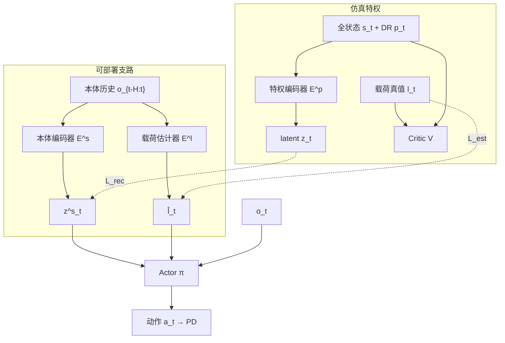

# Legged Load Adapt（未知动态载荷四足行走）

**Legged Load Adapt**（*Beyond Robustness: Learning Unknown Dynamic Load Adaptation for Quadruped Locomotion on Rough Terrain*，[arXiv:2507.07825](https://arxiv.org/abs/2507.07825)；Chang / Nai / Chen / Yang · **浙江大学国际联合学院（ZJU-UIUC）**）针对箱载**未知动态载荷**（滑动/滚动导致 CoM 持续漂移），提出 **load characteristics modeling**，并嵌入 teacher–student + concurrent estimator 的 RL 训练管线，使 [Unitree Go2](./unitree.md) 仅用本体感觉在崎岖地形上稳定行走并稳住载荷。项目页：<https://leixinjonaschang.github.io/leggedloadadapt.github.io/>。

## 一句话定义

**不要把箱载动态载荷只当 DR 扰动：用质量/摩擦/位姿/速度的 load characteristics 做特权监督与并发估计，再蒸馏到盲本体策略，才能在重动态载荷 + 崎岖地形上接近 Oracle。**

## 英文缩写速查

| 缩写 | 英文全称 | 简要说明 |
|------|----------|----------|
| LC | Load Characteristics | 载荷质量、摩擦、位置、速度组成的 8 维特征 |
| NLW | Non-Load-privileged Walk | 无载荷特权/无载荷奖励的鲁棒性基线 |
| LW | Load-privileged Walk | 载荷特征仅进特权支路、不进 actor 估计器 |
| PPO | Proximal Policy Optimization | Teacher / student reinforce 的 on-policy 算法 |
| DR | Domain Randomization | 机身质量、摩擦、PD、动作延迟等随机化 |
| Sim2Real | Simulation to Real | Isaac Gym 训练 → MuJoCo 评测 → Go2 真机 |

## 为什么重要

- **工程场景真实：** 配送/巡检常见「箱内可滑动重物」，载荷与机身互耦，静态载荷辨识与纯鲁棒控制器都不够。
- **对「只靠鲁棒性」的反证：** NLW（对齐 Dao et al. 式「加扰动 + DR」）在 rough + 7 kg 低摩擦下跟踪差甚至摔倒；显式建模载荷动力学才接近 Oracle。
- **盲走可部署：** 部署仅 IMU + 关节编码器；载荷估计器与本体编码器吃历史 $\boldsymbol{o}_{t-H:t}$（$H=15$）。
- **与人形负载适配正交：** [SplitAdapter](./paper-splitadapter-load-aware-loco-manipulation.md) 做人形冻结策略上的因子化在线适配；本文是**四足箱载动态载荷**的端到端特权+估计管线。

## 核心信息

| 项 | 内容 |
|----|------|
| 机构 | 浙江大学国际联合学院（ZJU-UIUC Institute） |
| 平台 | Unitree Go2；PD $k_p=20$, $k_d=0.5$；Isaac Gym 8192 并行训练 |
| 场景 | 基座上方 $0.6\times0.8$ m 托盘 + 可滑动立方载荷；楼梯 / 离散障碍 / rough / 斜坡课程 |
| 观测 | 本体 $\boldsymbol{o}_t\in\mathbb{R}^{45}$（角速度、重力、速度命令、关节、上一步动作） |
| 特权 | 全状态 $\boldsymbol{s}_t$、DR 参数 $\boldsymbol{p}_t$、载荷真值 $\boldsymbol{l}_t$ |
| 方法 | 特权 latent + 本体重建 + concurrent load estimator + student reinforce |
| 开源 | **宣称将开源 / 待发布**（项目页 Code coming soon；核查日 2026-08-02） |

## 核心原理（方法）

### Load characteristics

$$
\boldsymbol{l}_t = [\text{pos}, \text{vel}, \text{mass}, \text{fric. coef.}] \in \mathbb{R}^{8}
$$

- **质量 + 位置** → 系统总质量与 CoM 偏移；
- **速度 + 摩擦** → 该偏移随时间变化的快慢。

作者对比过直接建模外力 wrench：维度更低但策略更难吃准分布，最终采用 LC。

### 训练两阶段

| 阶段 | 内容 |
|------|------|
| **Teacher–student**（7500 iter） | 特权编码器 $E^p: (s_t,p_t)\to z_t$；actor 吃 $(z_t,o_t,\hat{l}_t)$；critic 吃全状态 + 真值 $l_t$；本体编码器重建 $z^s_t$；载荷估计器监督回归 $\hat{l}_t$ |
| **Student reinforce**（1500 iter） | 固定仿真设定下用 PPO 微调本体编码器 + actor，消化 $z$ 与 $z^s$ 残差 |

### 流程总览

## 源码运行时序图

**不适用。** 截至 2026-08-02：项目页 Code 按钮为 **coming soon**，无公开训练/推理仓库或权重；无法对齐 README 入口绘制运行时序。

## 工程实践（含开源状态）

| 项 | 内容 |
|----|------|
| 开源状态 | **宣称将开源 / 待发布**（核查日 2026-08-02；见 [项目页归档](../../sources/sites/leggedloadadapt-github-io.md)） |
| 源码运行时序图 | **不适用**（无可运行官方入口） |
| 仿真栈 | Isaac Gym 训练；MuJoCo 对比评测 |
| 载荷 DR | 质量 $[0.001,8]$ kg；尺寸 $[0.025,0.15]$ m；摩擦 $[0.001,0.2]$；初速 $[0,0.5]$ m/s |
| 机体 DR | 连杆质量、基座/腿 CoM、地面摩擦、PD、电机强度、动作延迟；每 15 s 随机推扰 2 m/s |
| 关键奖励 | load lin. vel. $1/(1+v_{\text{load}})$，权重 2.0 |
| 部署观测 | 仅本体；历史长度 15；控制 50 Hz |
| 真机 | Go2 + 4 kg 铅球软台阶穿越；静止跌落 2/4/6 kg |

**实操口诀：** 动态载荷任务先问「策略能否看到/估计 LC」，再问「DR 是否够广」——只有后者时，崎岖 + 重滑载荷上容易输给显式估计管线。

## 实验与评测

### 对照设定（Table V）

| 策略 | 环境含载荷 | 载荷进特权 | 载荷进 actor | 估计器 | 载荷奖励 |
|------|------------|------------|--------------|--------|----------|
| NLW | ✓ | ✗ | ✗ | ✗ | ✗ |
| LW | ✓ | ✓ | ✗ | ✗ | ✓ |
| Oracle | ✓ | ✓ | ✓（真值） | ✗ | ✓ |
| Ours | ✓ | ✓ | ✓（估计） | ✓ | ✓ |

### 动态实验（7 kg，μ=0.01）

在 plane / stair / rough / slope 上测速度跟踪误差、基座 roll、载荷相对速度：Ours 接近 Oracle，显著优于 NLW/LW；**LW 在 rough 上摔倒**。斜坡上相对基线优势作者自承不清晰。

### 静止跌落（7 kg，μ=0.02）

载荷自上方带初速落下：Ours 最短 settling、载荷相对速度收敛；NLW/LW roll 发散；载荷轨迹更集中。

### 真机

零样本：软台阶 4 kg 铅球；静止冲击 2/4/6 kg——项目页与论文视频展示成功适应。

## 结论

**一句话总判：箱载未知动态载荷不能只靠「鲁棒 + DR」；用 load characteristics 做特权监督并并发估计，再经 student reinforce，才能在盲本体 + 崎岖地形上接近 Oracle 并完成 Go2 零样本部署。**

1. **LC 比 wrench 更管用** — 结构化低维特征（质量/摩擦/位姿/速度）比直接回归外力更易被策略利用。
2. **估计器是部署关键** — Oracle 证明建模有效；Ours 用 $\hat{l}_t$ 逼近 Oracle，LW（只进特权不估计）在 rough 上仍可能失败。
3. **两阶段缺一不可** — 重建 loss  alone 会留下 $z$–$z^s$ 残差；student reinforce 用奖励把可部署策略拉回来。
4. **载荷相对速度奖励驱动涌现水平姿态** — 无需显式「机身水平」项即可稳住滑移载荷。
5. **斜坡与开源仍是短板** — 坡面优势弱；代码 coming soon，数字复现需等官方仓。

## 与其他工作对比

| 对照 | 差异读法 |
|------|----------|
| [RMA](./paper-rma-rapid-motor-adaptation.md) | 估计环境 extrinsics（摩擦/质量等）做在线适应；本文额外**结构化箱载动态状态**并加载荷稳定奖励 |
| 模型基静态载荷辨识（Liu / Sombolestan / Jin 等） | 多假设载荷刚接或准静态；本文显式处理机–载互耦与滑动 |
| Dao et al. 式动态载荷 RL | 主要靠 DR 当扰动；对应本文 NLW，实验显示不足 |
| [DreamWaQ++](./dreamwaq-plus.md) | 地形/障碍上下文估计；本文焦点是**载荷特征**而非外感知地形 |
| [SplitAdapter](./paper-splitadapter-load-aware-loco-manipulation.md) | 人形搬箱冻结策略上的因子化适配；本文四足端到端箱载动态载荷 |

## 局限与风险

- **场景边界：** 限定托盘/箱载滑动立方；拉车、悬吊杆等其他挂载形态未覆盖。
- **坡面：** 作者报告斜坡上相对基线优势不显著。
- **开源：** **待发布**——无法本地复现训练曲线与权重。
- **误区：** 把「训练时见过随机载荷」等同于「部署时能适应未知动态载荷」；NLW 已证伪这一点。

## 关联页面

- [Privileged Training](../concepts/privileged-training.md)
- [RMA](./paper-rma-rapid-motor-adaptation.md)
- [Locomotion](../tasks/locomotion.md)
- [Terrain Adaptation](../concepts/terrain-adaptation.md)
- [Sim2Real](../concepts/sim2real.md)
- [Domain Randomization](../concepts/domain-randomization.md)
- [SplitAdapter](./paper-splitadapter-load-aware-loco-manipulation.md)
- [Unitree](./unitree.md)

## 推荐继续阅读

- 项目页与视频：<https://leixinjonaschang.github.io/leggedloadadapt.github.io/>
- 论文 PDF：<https://arxiv.org/pdf/2507.07825.pdf>
- RMA 经典适应管线：[paper-rma-rapid-motor-adaptation](./paper-rma-rapid-motor-adaptation.md)

## 参考来源

- [sources/papers/legged_load_adapt_arxiv_2507_07825.md](../../sources/papers/legged_load_adapt_arxiv_2507_07825.md)
- [sources/sites/leggedloadadapt-github-io.md](../../sources/sites/leggedloadadapt-github-io.md)
