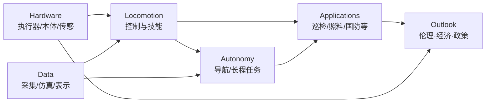
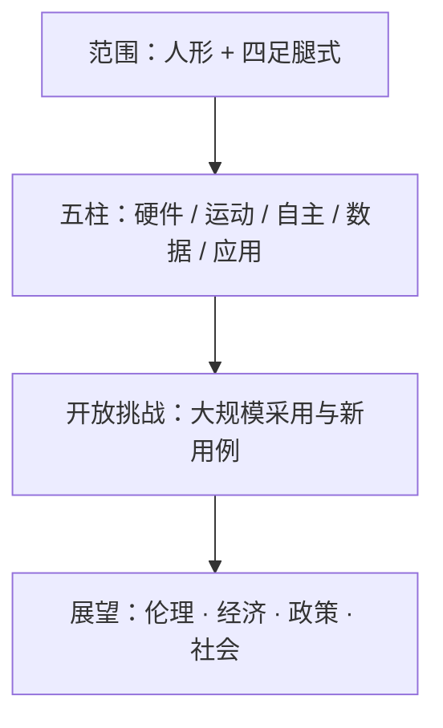

# 腿式机器人进展、挑战与机遇综述

**Advances, challenges, and opportunities for legged robots**（Jonas Frey、Matías Mattamala、Hae-Won Park、Mayank Mittal、Georg Martius、Maike Osborne、Robert Sparrow、Marco Hutter；**ETH Zurich 牵头**，联合 Stanford / UC Berkeley / Edinburgh / KAIST / NVIDIA / Tübingen / MPI-IS / Oxford / Monash / RAI Institute；**Science Robotics 2026** Vol. 11 Issue 116，[DOI:10.1126/scirobotics.aee0787](https://doi.org/10.1126/scirobotics.aee0787)）是一篇 **Review**：沿 **硬件 · locomotion · 自主 · 数据 · 应用** 五柱评估人形与四足系统，并给出伦理、经济与政策展望。

## 一句话定义

**把人形与四足腿式机器人当作「技术能力 × 社会部署」一体问题：用硬件 / 运动 / 自主 / 数据 / 应用五柱盘点现状与卡点，再用伦理–经济–政策语言问「谁有权决定这些机器走进社会」。**

## 英文缩写速查

| 缩写 | 英文全称 | 简要说明 |
|------|----------|----------|
| RL | Reinforcement Learning | 腿式 locomotion 的主流学习范式（本文引用图重心） |
| Sim2Real | Simulation to Real | 仿真策略迁移真机；五柱中跨硬件/数据/运动 |
| VLA | Vision-Language-Action | 腿式导航与高层自主的新兴接口（如 NaVILA 等被引） |
| SubT | DARPA Subterranean Challenge | 地下多机器人自主的里程碑用例轴 |
| HRI | Human–Robot Interaction | 外形、陪伴、监视等社会层问题入口 |

## 为什么重要

- **五柱坐标对齐本库主线：** 不是又一篇「只谈 RL reward」的综述，而是把硬件上限、长程自主、数据瓶颈与落地用例绑在同一张图上。
- **作者阵容覆盖 RSL / 学习控制 / 哲学伦理：** ETH–Hutter 线 + Park（高动态硬件）+ Martius（学习）+ Sparrow（伦理）→ 技术与治理同页。
- **同刊对照：** 与 [仿生多模态综述](./paper-bioinspired-multimodal-robotics.md)（Issue 116）互补——本页聚焦 **腿式人形/四足陆地主线**，彼页聚焦跨介质多模态评测语言。
- **部署前必读社会层：** 养老监视、服务业就业、军事问责在投资叙事里常被省略。

## 核心信息

| 项 | 内容 |
|----|------|
| **机构** | 苏黎世联邦理工（ETH Zürich）；斯坦福大学（Stanford）；加州大学伯克利分校（UC Berkeley）；爱丁堡大学（University of Edinburgh）；韩国科学技术院（KAIST）；英伟达（NVIDIA）；图宾根大学（University of Tübingen）；马克斯·普朗克智能系统研究所（MPI-IS）；牛津大学（University of Oxford）；莫纳什大学（Monash University）；RAI Institute |
| **类型** | Science Robotics **Review**（非单一系统论文） |
| **平台** | 综述覆盖人形与四足多类系统，无单一硬件 |
| **开源** | **不适用** — 综述无官方代码 / 数据集 / 项目页（截至 2026-07-31） |

## 核心原理

### 问题定义

- **评估对象：** 人形与四足腿式机器人如何改变工作、交互与人机共存；同时能否支撑科学发现。
- **成功标准（综述视角）：** 不仅「能走 / 能操作」，而是五柱能力是否足以支撑 **大规模采用与新用例**，并经得起伦理与政策审视。

### 五柱评估框架（摘要主结构）

| 柱 | 回答的问题 | 本库对照入口 |
|----|------------|--------------|
| **Hardware** | 执行器带宽、冲击、能耗、形态是否封顶？ | [人形硬件 101](../overview/humanoid-hardware-101-technology-map.md)、[四足](./quadruped-robot.md)、[ANYmal](./anymal.md) |
| **Locomotion** | 盲/感知、跑酷、人形全身技能是否可用？ | [Locomotion](../tasks/locomotion.md)、[RL](../methods/reinforcement-learning.md)、[challenging terrain](./paper-notebook-learning-quadrupedal-locomotion-over-challenging.md)、[APT-RL](./paper-apt-rl-agile-perceptive-quadruped-locomotion.md) |
| **Autonomy** | 长程野外、地下、巡检闭环是否成立？ | 导航 / 可通行性 / SubT 类系统页 |
| **Data** | 真机轨迹、自我中心视频、仿真是否够训？ | [Sim2Real](../concepts/sim2real.md)、数据集与世界模型相关页 |
| **Applications** | 哪些行业真有 ROI 与可接受风险？ | 工业巡检、农业、行星、建筑、服务与国防叙事 |

### 技术侧线索（引用图抽样，非全文逐节）

全文付费墙下，技术细节主要依据 **OpenAlex 约 113 篇参考文献** 与作者既有工作重心归纳（详见 [sources 归档](../../sources/papers/legged_robots_advances_challenges_scirobotics_2026.md)）：

1. **运动学习主叙事：** 从早期 policy gradient 四足，到 Hwangbo / Lee Science Robotics 线、RMA、ANYmal parkour、DTC、实机人形 RL，再到 Ha et al. IJRR 2025 学习型腿式综述——**Sim2Real RL + 感知** 已是缺省路径。
2. **自主不等于室内 demo：** CERBERUS / SubT、森林清查、AutoInspect、可通行性与因子图融合等被引，指向 **长程、全天候、退化感知**。
3. **数据与表示成为并行瓶颈：** Ego4D、SubT-MRS、NeRF / 3DGS 等进入引用，说明「只会训 locomotion policy」不够。
4. **硬件仍设天花板：** Cheetah 本体感受执行器、SEA、电液/软体腿、开源人形（如 ARTEMIS）等提醒：算法进步会被冲击与热管理卡住。

### 展望：伦理 · 经济 · 政策（通稿对齐）

据 [Monash / TechXplore 通稿](../../sources/blogs/techxplore_legged_robots_ethics_monash_2026-07-30.md)（共同作者 Robert Sparrow）：

| 主题 | 主张（通稿复述） |
|------|------------------|
| 养老与陪伴 | 勿默认机器人可替代人际连接；故障依赖可能加剧孤立 |
| 监视 | 家用摄像头腿式平台 → 亲密数据控制权 |
| 外形与偏见 | 性别化人形设计；对机器人施暴可能外溢到人/动物态度 |
| 军事 | 降低杀戮心理门槛与冲突阈值；战场问责滞后 |
| 就业 | 冲击服务业（部分发达经济体约 **80%** 就业）风险被低估 |
| 治理 | **最重要的不是腿，而是政策与民主授权** |

## 流程总览

## 源码运行时序图

**不适用。** 本文为 Science Robotics **Review**，截至入库日（2026-07-31）**无官方可运行代码、权重或项目页**。复现应落到被综述的具体系统论文（如 Lee 2020 challenging terrain、APT-RL、ANYmal parkour 等）。

## 工程实践

| 项 | 建议 |
|----|------|
| 立项用五柱填表 | 硬件上限 / 运动技能 / 自主里程 / 数据来源 / 目标行业各写一栏，避免只报「sim 成功率」 |
| 先对齐用例风险 | 巡检 ≠ 养老 ≠ 国防；HRI 与问责要求差一个数量级 |
| 运动栈默认假设 | 以 [RL Sim2Real](../concepts/sim2real.md) + 感知 loco 为基线，再问硬件是否撑得住 |
| 自主单独预算 | 长程定位、可通行性、故障恢复不要塞进 locomotion reward |
| 数据策略先于刷分 | 真机日志 / 自我中心视频 / 高保真仿真缺谁补谁 |
| 读社会层再谈融资叙事 | 用通稿六题做红队：监视、就业、军事、外形、陪伴、民主授权 |
| 源码运行时序图 | **不适用**（综述无代码） |

## 实验与评测

- **本文是综述，无单一系统实验表。** 贡献是五柱盘点 + 社会展望框架。
- **读法：** 评一篇腿式系统论文时，先问它落在哪一柱、哪一用例；再问社会层风险是否被作者显式讨论。
- **对照指标语言：** 跨介质多模态请改用 [仿生多模态五指标](./paper-bioinspired-multimodal-robotics.md)（Nmode / MCM / CRP / Tij / PI）；本页不引入那套指标。

## 结论

**腿式机器人已走出实验室叙事，但「能部署」取决于五柱齐短板，而「该不该大规模部署」取决于伦理与民主授权——只优化步态或只讲估值都不够。**

1. **用五柱做差距分析** — 硬件 / 运动 / 自主 / 数据 / 应用缺一即卡大规模采用。
2. **运动主线默认 RL Sim2Real + 感知** — 但仍受执行器与热管理上限约束。
3. **自主与 locomotion 拆开算账** — 长程野外、地下、巡检是另一条工程链。
4. **数据是并行瓶颈** — 真机、自我中心与仿真表示决定可扩展性。
5. **用例决定治理优先级** — 养老监视、服务业就业、军事问责不能事后补。
6. **社会层与技术层同页阅读** — Sparrow 线：政策与民主授权重于「腿」。
7. **本综述无代码** — 工程复现落到具体系统论文；本页提供坐标系与红题清单。

## 与其他工作对比

| 维度 | 本文（SciRobotics Review 2026） | [仿生多模态综述](./paper-bioinspired-multimodal-robotics.md) | [Ha et al. IJRR 2025 学习型腿式（被引）](https://doi.org/10.1177/02783649241312698) | [Locomotion 任务页](../tasks/locomotion.md) |
|------|--------------------------------|--------------------------------------------------------------|-----------------------------------------------------------------------------------|-----------------------------------------------|
| 范围 | 人形+四足 **陆地腿式** 五柱 + 社会展望 | 跨介质仿生多模态 | **学习控制** 状态与展望 | 本库任务索引与论文入口 |
| 贡献形态 | 能力盘点 + 开放挑战 + 伦理/政策 | 五指标 + 切换分类 + 三模块架构 | 方法谱系与未来方向 | 工程导航 |
| 社会层 | **显式**（通稿对齐） | 弱 / 非主线 | 弱 | 无 |
| 代码 | 无 | 无 | 无（综述） | 指向各系统页 |

## 局限与风险

- **全文付费墙：** Science.org PDF 在入库环境 **403**；技术节细节主要编译自 **开放摘要 + OpenAlex 引用图 + Monash/TechXplore 通稿**。解除付费墙后应回填各节精确主张。
- **通稿偏伦理侧：** Sparrow 发言不能替代全文对硬件/控制的定量判断。
- **引用图 ≠ 章节提纲：** 上表「技术侧线索」是推断，避免当作原文小标题。
- **综述无单一基线实现：** 五柱落地仍需各系统自报口径。
- **开源状态：** **确认无官方代码 / 项目页**；勿误解为可复现软件包。

## 关联页面

- [Locomotion](../tasks/locomotion.md) — 腿式运动任务中心
- [四足机器人](./quadruped-robot.md) — 四足平台总览
- [Sim2Real](../concepts/sim2real.md) — 运动柱主迁移范式
- [仿生多模态机器人综述](./paper-bioinspired-multimodal-robotics.md) — 同刊 Issue 116 跨介质对照
- [Challenging Terrain Locomotion](./paper-notebook-learning-quadrupedal-locomotion-over-challenging.md) — Lee et al. Science Robotics 2020 经典被引
- [APT-RL](./paper-apt-rl-agile-perceptive-quadruped-locomotion.md) — 感知敏捷四足前沿实例
- [ANYmal](./anymal.md) — ETH 四足平台与野外自主语境
- [Reinforcement Learning](../methods/reinforcement-learning.md) — 运动学习底座
- [人形硬件 101 技术地图](../overview/humanoid-hardware-101-technology-map.md) — 硬件柱入口

## 参考来源

- [legged_robots_advances_challenges_scirobotics_2026.md](../../sources/papers/legged_robots_advances_challenges_scirobotics_2026.md) — 本库论文归档与开源核查
- [TechXplore / Monash 通稿归档](../../sources/blogs/techxplore_legged_robots_ethics_monash_2026-07-30.md) — 伦理–经济–政策侧复述
- Frey et al., *Advances, challenges, and opportunities for legged robots*, [Science Robotics 2026](https://doi.org/10.1126/scirobotics.aee0787)
- [PubMed:42525724](https://pubmed.ncbi.nlm.nih.gov/42525724/) — 开放摘要
- [OpenAlex W7171713488](https://openalex.org/W7171713488) — 引用图

## 推荐继续阅读

- [Science Robotics 原文](https://www.science.org/doi/10.1126/scirobotics.aee0787)
- [TechXplore 通稿](https://techxplore.com/news/2026-07-legged-robots-surveillance-job-battlefield.html)
- [SMBtech 平行报道](https://smbtech.au/news/monash-researcher-warns-ethical-frameworks-for-legged-robots-are-not-keeping-pace-with-the-technology/)
- Ha, Lee, van de Panne, Yu, Khadiv, *Learning-based legged locomotion: State of the art and future perspectives*, [IJRR 2025](https://doi.org/10.1177/02783649241312698) — 学习控制专向综述对照
- [仿生多模态机器人综述（同刊）](./paper-bioinspired-multimodal-robotics.md)
