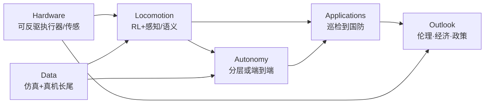
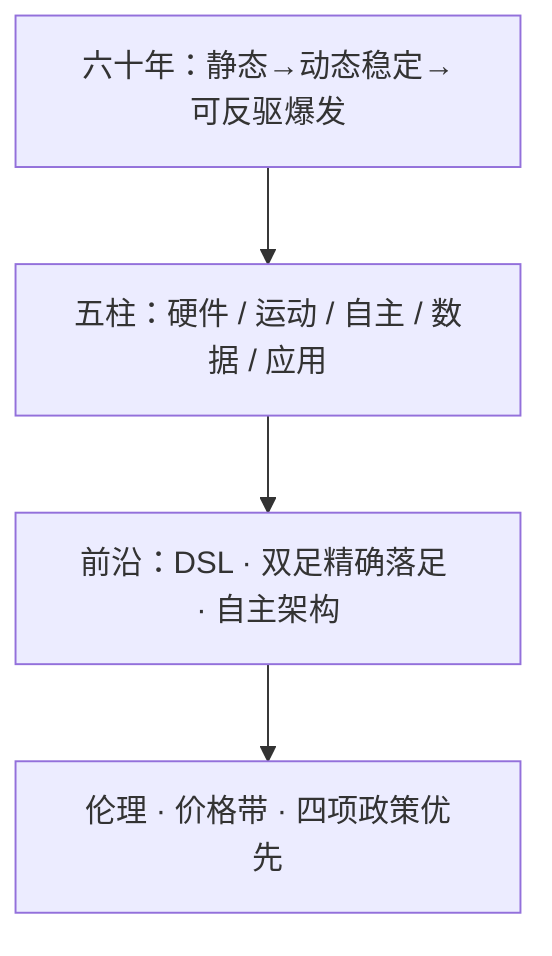

# 腿式机器人进展、挑战与机遇综述

**Advances, challenges, and opportunities for legged robots**（Jonas Frey、Matías Mattamala、Hae-Won Park、Mayank Mittal、Georg Martius、Maike Osborne、Robert Sparrow、Marco Hutter；**ETH Zurich 牵头**，联合 Stanford / UC Berkeley / Edinburgh / KAIST / NVIDIA / Tübingen / MPI-IS / Oxford / Monash / RAI Institute；**Science Robotics 2026** Vol. 11 Issue 116，[DOI:10.1126/scirobotics.aee0787](https://doi.org/10.1126/scirobotics.aee0787)，作者版 [arXiv:2607.28952](https://arxiv.org/abs/2607.28952)）是一篇 **Review**：沿 **硬件 · locomotion · 自主 · 数据 · 应用** 五柱评估人形与四足系统，并给出伦理、经济与政策展望。

## 一句话定义

**把人形与四足腿式机器人当作「技术能力 × 社会部署」一体问题：用硬件 / 运动 / 自主 / 数据 / 应用五柱盘点现状与卡点，再用伦理–经济–政策语言问「谁有权决定这些机器走进社会」。**

## 英文缩写速查

| 缩写 | 英文全称 | 简要说明 |
|------|----------|----------|
| RL | Reinforcement Learning | 腿式 locomotion 主流学习范式；导读称四足行走已可解 |
| Sim2Real | Simulation to Real | SysID + 域随机化 / 自适应；视觉域仍是缺口 |
| SEA | Series Elastic Actuator | 齿轮后加弹簧的历史路径；带宽与建模代价高 |
| MPC | Model Predictive Control | 经典动态行走栈；今多与 RL 混合做长时程规划 |
| CBF | Control Barrier Function | 形式化安全工具之一；与可实现行为仍有鸿沟 |
| VLA | Vision-Language-Action | 高层自主新兴接口；IL 导航鲁棒性仍落后经典 |
| SubT | DARPA Subterranean Challenge | 四足成熟度里程碑；国防/地下自主主线 |
| DSL | Dexterous Semantic Locomotion | 导读转述综述命名：几何+语义+交互预判+施力意识 |

## 为什么重要

- **五柱坐标对齐本库主线：** 硬件上限、运动栈、长程自主、数据瓶颈与落地用例同一张图。
- **作者版全文已开放：** [arXiv:2607.28952](https://arxiv.org/abs/2607.28952)（2026-07-31）可直接核对频率分层、DSL、价格带与四项政策；[微信导读](../../sources/blogs/wechat_robot_lecture_legged_robots_survey_2026-07-31.md) 仍可作中文交叉读。
- **同刊对照：** 与 [仿生多模态综述](./paper-bioinspired-multimodal-robotics.md)（Issue 116）互补——本页聚焦陆地人形/四足，彼页聚焦跨介质评测语言。
- **治理与技术同页：** 服务业约 **80%** 劳动力冲击叙事 + 民主授权，不宜只读 PPO 成功故事。

## 核心信息

| 项 | 内容 |
|----|------|
| **机构** | 苏黎世联邦理工（ETH Zürich）；斯坦福大学（Stanford）；加州大学伯克利分校（UC Berkeley）；爱丁堡大学（University of Edinburgh）；韩国科学技术院（KAIST）；英伟达（NVIDIA）；图宾根大学（University of Tübingen）；马克斯·普朗克智能系统研究所（MPI-IS）；牛津大学（University of Oxford）；莫纳什大学（Monash University）；RAI Institute |
| **类型** | Science Robotics **Review**（非单一系统论文） |
| **平台** | 综述覆盖人形与四足多类系统，无单一硬件 |
| **开源** | **不适用** — 综述无官方代码 / 数据集 / 项目页（截至 2026-08-04） |
| **开放全文** | **有** — 作者版 [arXiv:2607.28952](https://arxiv.org/abs/2607.28952)；正式 DOI 另见出版社 |

## 核心原理

### 问题定义

- **评估对象：** 人形与四足如何改变工作、交互与人机共存，并能否支撑科学发现。
- **成功标准：** 五柱是否足以支撑大规模采用与新用例，并经得起伦理与政策审视。

### 五柱评估框架

### 硬件：可反驱电驱动是爆发起点

据 [arXiv:2607.28952](https://arxiv.org/abs/2607.28952)（与[微信导读](../../sources/blogs/wechat_robot_lecture_legged_robots_survey_2026-07-31.md)交叉）：

| 线索 | 要点 |
|------|------|
| 形态 | 四足偏承载/操作（负载可达 **180 kg**，Fig. 1E）；人形工作空间大但更依赖动态稳定 |
| 执行器需求 | 高力矩 + 冲击响应 → **低阻抗、高可反驱**（异于工业臂） |
| 历史路径 | 高减速比不可反驱 → SEA（带宽代价）→ 液压（BigDog/Atlas，成本/噪声/漏油后降温）→ **定制高力矩低减速比电驱动**（大间隙半径、短轴向长度电机 + 低减速比） |
| 透明传动 | 力矩≈电流×Kt×减速比 → 可无额外 F/T 做高带宽力矩控制；Katz 等开源执行器助推 Unitree、ARTEMIS |
| 传感 | 编码器+IMU；LiDAR / RGB-D；接触与多轴 F/T；触觉皮肤耐久/集成仍限 |
| 软体/人工肌肉 | 潜力在紧凑与力重比，制造/耐久/控制未进商业系统 |

### 运动控制：四足可解，双足与语义未解

| 线索 | 要点 |
|------|------|
| 频率分层 | 执行器 **∼200–1000 Hz**；运动 **∼50–200 Hz**；高层 **<30 Hz**（PDF） |
| 经典栈 | 静态支撑多边形 → ZMP → LIP/SLIP → MPC；今 MPC 多与 RL 混合 |
| RL 范式 | 仿真训策略输出 **执行器位置目标**，低层 PD/阻抗转力矩；SysID + 域随机化支撑零样本迁移（Fig. 2） |
| 模型规模 | 普遍 MLP/RNN，参数 **below 10 million**（非十亿级 VLM）；偶见更小扩散/Transformer |
| 开放问题 | 奖励塑形、多阶段训练、多技能蒸馏、离线 RL；形式化安全（CBF / Lyapunov / HJ）与可实现行为鸿沟 |
| 前沿命名 | **dexterous semantic locomotion（DSL）**：多模态 affordance + 精细运动 + 长时程协作 |

### 自主：分层拆解还是端到端融合

- 感知含接触/外力；**腿式里程计** + 多传感器融合是状态估计主线。
- **可通行性估计** 把硬件与控制器能力打进地图分数；亦有隐式前向动力学路线。
- **跑酷** 是打破导航–运动解耦的试验田（分层 RL + 潜在场景表征）。
- VLA / 大行为模型支撑自然语言指令与边缘推理，但导读转述：IL 导航在鲁棒性、可解释性与本体感知整合上仍落后经典方法与仿真 RL。
- 硬实时持续塑造「接口怎么切、要不要切」的架构争论。

### 数据：比自动驾驶更贵、更难

- 数据深度绑定本体、传感、驱动与环境；长尾难采。
- 底层运动/导航/全身控制多在仿真训（特权信号 + 域随机化 / 残差 / SysID）；植被缠绕、可变形地形、语义杂乱仍超仿真；**视觉 sim-to-real** 未解。
- 真机：遥操作与动捕；**GrandTour、SubT** 等开始填空白，规模远不及自动驾驶。
- 展望：神经渲染/场景重建、神经增强物理、可微仿真、生成式环境；缺共享真机基准使系统比较困难。

### 应用速查

| 场景 | 导读要点 |
|------|----------|
| 巡检监测 | ANYmal 海上油气；Spot 矿山/核电等；工地安全进度 |
| 农林 | 多科研演示；偏四足稳定 |
| 配送 | RIVR 等最后一公里「货车到门口」共享自主 |
| 人形制造/家用 | 「人形热潮」进工厂仓储；家用简单任务商用试点约 **2026** |
| 照护 | 日本领先；瓶颈在柔顺操作、人身安全、意图理解 |
| 国防/灾难 | BigDog/LS3、Atlas/DRC、**SubT**；最清晰商业化路径之一 + 严肃伦理 |
| 科学/太空 | 环境采样；NASA LEMUR；ESA 洞穴/陨石坑替代轮式 |
| 娱乐 | 迪士尼双足乐园部署；RoboCup / 人形赛事 |

### 伦理 · 经济 · 政策

伦理（导读 + [Monash 通稿](../../sources/blogs/techxplore_legged_robots_ethics_monash_2026-07-30.md)）：技术性失业与不平等；**民主授权**；养老意愿与情感需求；家中数据权；军事心理门槛与问责；伴侣机器人孤立；种族/性别编码。

| 经济/政策数字（PDF，as of 2025） | 值 |
|----------------------------------|-----|
| Spot 等商用四足价带 | 约 **$30,000–$90,000** |
| 电池 / 半径 | **90 min–6 h** / 约 **4–20 km** |
| 入门小四足 / 人形起售 | 约 **$2700 / $4900** |
| 服务业劳动力占比（部分发达经济体） | 约 **∼80%** |
| 从「会走」到「会社交」窗口 | 约 **10–15 年** |
| 四项政策优先 | capability-based regulation · international coordination · strategic industrial policy · anticipatory workforce programs |

监管分化：欧盟 AI Act；日本 Society 5.0；中国工信部人形路线；国际协调亦指向致命自主武器框架与 ISO/TC 299。IFR 语境：全球工业机器人约 **4.28M** 台，中国安装占比约 **51%**，亚洲部署约 **70%**；中国工业机器人密度约 **470 / 万人**。

## 流程总览

## 源码运行时序图

**不适用。** 本文为 Science Robotics **Review**，截至 **2026-08-04** **无官方可运行代码、权重或项目页**（有的是开源软件生态与被引系统，非本文仓）。复现应落到被综述的具体系统论文；全文读 [arXiv:2607.28952](https://arxiv.org/abs/2607.28952)。

## 工程实践

| 项 | 建议 |
|----|------|
| 立项用五柱填表 | 硬件上限 / 运动技能 / 自主里程 / 数据来源 / 目标行业各写一栏 |
| 硬件先问可反驱 | 高减速比工业臂思路不适配冲击腿式；对齐低阻抗力矩控制 |
| 运动栈默认假设 | 仿真 PPO + 位置/阻抗接口 + SysID；策略保持小容量便于实时 |
| 自主与 loco 拆账 | 可通行性、里程计、跑酷融合单独预算；勿只塞进 reward |
| 数据策略 | 仿真覆盖几何长尾；真机补视觉/语义；对照 GrandTour/SubT 缺口 |
| 用例定治理级别 | 「只会走路」≠ 家用社交；按能力阶梯升级合规（导读四优先） |
| 价格带锚定预期 | 商用四足 3–9 万美元级 vs 入门套件千美元级，勿混谈 |
| 源码运行时序图 | **不适用**（综述无代码） |

## 实验与评测

- **本文是综述，无单一系统实验表。** 贡献是五柱盘点 + 社会/政策框架。
- **读法：** 先定位落在哪一柱与哪一用例；再问是否讨论 DSL、视觉 sim2real、安全认证与民主授权。
- **对照指标语言：** 跨介质多模态改用 [仿生多模态五指标](./paper-bioinspired-multimodal-robotics.md)；本页用五柱 + 能力阶梯监管语言。

## 结论

**四足行走在几何已知条件下已被 RL 推成可解问题，但语义灵巧、双足精确落足、视觉 sim2real 与治理窗口（约 10–15 年走到社交能力）才是下一场竞赛——硬件可反驱只是入场券。**

1. **五柱齐短板** — 硬件 / 运动 / 自主 / 数据 / 应用缺一即卡大规模采用。
2. **可反驱电驱动是硬件分水岭** — SEA/液压是历史，低减速比透明传动是现状。
3. **四足可解 ≠ 双足/DSL 可解** — 前沿在语义、交互预判与精确落足。
4. **自主要重新谈分层** — 跑酷与 VLA 推动融合，但硬实时与鲁棒性未让 IL 导航胜出。
5. **数据比自动驾驶更贵** — 仿真为主、视觉域与共享真机基准仍空。
6. **按能力升级监管** — 价格带与服务业 80% 冲击要求 10–15 年窗口内做劳动力计划。
7. **权力问题不可省略** — 民主授权与隐性偏见同技术指标一起读；本综述无代码。

## 与其他工作对比

| 维度 | 本文（SciRobotics Review 2026） | [仿生多模态综述](./paper-bioinspired-multimodal-robotics.md) | [Ha et al. IJRR 2025](https://doi.org/10.1177/02783649241312698) | [Locomotion 任务页](../tasks/locomotion.md) |
|------|--------------------------------|--------------------------------------------------------------|------------------------------------------------------------------|-----------------------------------------------|
| 范围 | 人形+四足陆地五柱 + 社会/政策 | 跨介质仿生多模态 | 学习控制专向 | 本库任务索引 |
| 贡献形态 | 能力盘点 + DSL 命名 + 四项政策优先 | 五指标 + 切换分类 + 三模块 | 方法谱系 | 工程导航 |
| 社会层 | **显式**（PDF + 通稿） | 弱 | 弱 | 无 |
| 代码 | 无 | 无 | 无（综述） | 指向各系统页 |

## 局限与风险

- **作者版 vs 正式版：** 技术数字以 [arXiv:2607.28952](https://arxiv.org/abs/2607.28952) 作者版为准；AAAS 声明个人使用、禁止再分发。出版社正式排版若有修订，以 DOI 为准。
- **综述无单一基线实现：** 五柱落地仍需各系统自报口径；勿把本页当排行榜。
- **开源状态：** **确认无官方代码 / 项目页**（综述）。
- **社会层预测窗口宽：** 10–15 年「会社交」与价格带是展望性表述，不是保证交付时间表。

## 关联页面

- [Locomotion](../tasks/locomotion.md) — 腿式运动任务中心
- [四足机器人](./quadruped-robot.md) — 四足平台总览
- [Sim2Real](../concepts/sim2real.md) — SysID / 域随机化主迁移范式
- [MPC](../methods/model-predictive-control.md) — 经典动态行走与 RL 混合对照
- [Capture Point / DCM](../concepts/capture-point-dcm.md) — 与 ZMP/动态平衡史对照
- [仿生多模态机器人综述](./paper-bioinspired-multimodal-robotics.md) — 同刊 Issue 116 跨介质对照
- [Challenging Terrain Locomotion](./paper-notebook-learning-quadrupedal-locomotion-over-challenging.md) — Lee et al. 2020 经典被引
- [APT-RL](./paper-apt-rl-agile-perceptive-quadruped-locomotion.md) — 感知敏捷四足前沿
- [ANYmal](./anymal.md) — 巡检/野外自主语境
- [Reinforcement Learning](../methods/reinforcement-learning.md) — 运动学习底座
- [人形硬件 101 技术地图](../overview/humanoid-hardware-101-technology-map.md) — 硬件柱入口

## 参考来源

- [legged_robots_advances_challenges_scirobotics_2026.md](../../sources/papers/legged_robots_advances_challenges_scirobotics_2026.md) — 本库论文归档、OA/arXiv 核查
- Frey et al., *Advances, challenges, and opportunities for legged robots*, [arXiv:2607.28952](https://arxiv.org/abs/2607.28952) / [Science Robotics 2026](https://doi.org/10.1126/scirobotics.aee0787)
- [微信导读：腿式机器人进展/挑战/机遇](../../sources/blogs/wechat_robot_lecture_legged_robots_survey_2026-07-31.md) — 中文交叉读
- [TechXplore / Monash 通稿](../../sources/blogs/techxplore_legged_robots_ethics_monash_2026-07-30.md) — 伦理–经济侧复述
- [PubMed:42525724](https://pubmed.ncbi.nlm.nih.gov/42525724/) — 开放摘要

## 推荐继续阅读

- [arXiv:2607.28952（作者版 PDF）](https://arxiv.org/abs/2607.28952)
- [Science Robotics 正式版](https://www.science.org/doi/10.1126/scirobotics.aee0787)
- [微信公众号导读](https://mp.weixin.qq.com/s/yFZs7SLN5naqty0PBTk0Xw)
- [TechXplore 通稿](https://techxplore.com/news/2026-07-legged-robots-surveillance-job-battlefield.html)
- Ha et al., *Learning-based legged locomotion*, [IJRR 2025](https://doi.org/10.1177/02783649241312698) — 学习控制专向对照
- [仿生多模态机器人综述（同刊）](./paper-bioinspired-multimodal-robotics.md)
