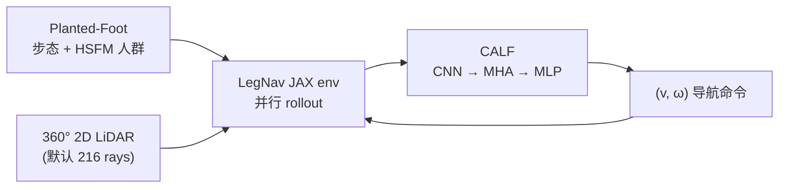
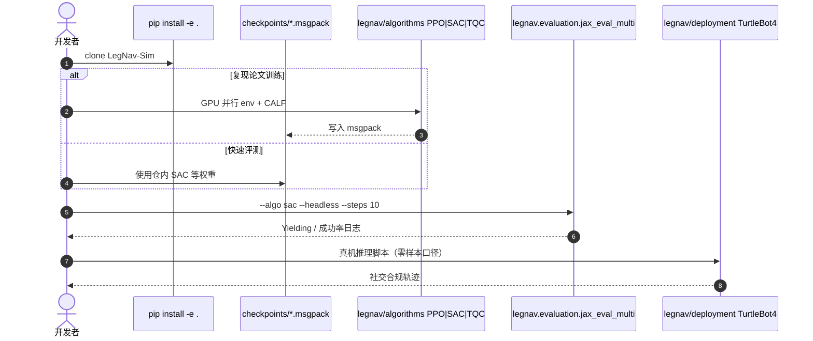

# LegNav / CALF：从感知人腿学习社交机器人导航

**LegNav + CALF**（*Learning Robot Social Navigation By Sensing Human Legs*，[arXiv:2607.27922](https://arxiv.org/abs/2607.27922)；[LegNav-Sim](https://github.com/otr-ebla/LegNav-Sim)，[视频](https://youtu.be/P6gFTvi3k7w)）由 **锡耶纳大学 DIISM**（Alberto Vaglio 等）提出：**IROS 2026 workshop** 官方实现。核心论点是：社交导航常用 **行人圆盘** 抽象，但 **10–20 cm 高度 2D LiDAR** 实际只见 **独立运动的双足簇** 与鞋部盲区；本文用 **LegNav** 仿真显式建模腿部步态，并用 **CALF**（Convolutional Attention for Leg Features）直接从扫描学习安全速度。

## 一句话定义

**把踝高 LiDAR 的「双腿签名」写进仿真与网络结构（CALF），用 JAX 大规模 RL 训出可零样本上 TurtleBot 4 的社交合规局部导航策略。**

## 英文缩写速查

| 缩写 | 英文全称 | 简要说明 |
|------|----------|----------|
| CALF | Convolutional Attention for Leg Features | 1D-CNN + 时序自注意力 + MLP 策略 |
| HSFM | Headed Social Force Model | 行人群体社会力模型 |
| PPO | Proximal Policy Optimization | 默认深度 RL 基线之一 |
| SAC | Soft Actor-Critic | 仓库默认快速评测算法 |
| DWA | Dynamic Window Approach | 经典局部规划对照 |

## 为什么重要

- **感知–表示对齐：** 与 [iCrowdNav](./paper-icrowdnav.md) 等 BEV/整人表征不同，本工作针对 **2D 腿簇 LiDAR** 这一常见硬件现实。
- **仿真可吞吐：** 全栈 **JAX 向量化**（~**135k env steps/s** on RTX 3080），论文口径 ~**30 分钟** 训出可部署 CALF。
- **社交指标显式：** 奖励塑造 **yielding**（停等行人），并报告 **Yielding Score** 而不仅是到达率。
- **真机闭环：** **TurtleBot 4** **零样本** 部署（无域适应），见官方视频。

## 核心信息

| 项 | 内容 |
|----|------|
| **机构** | 锡耶纳大学（University of Siena，DIISM） |
| **arXiv** | [2607.27922](https://arxiv.org/abs/2607.27922) |
| **代码** | [otr-ebla/LegNav-Sim](https://github.com/otr-ebla/LegNav-Sim) |
| **权重** | 仓库 [`checkpoints/`](https://github.com/otr-ebla/LegNav-Sim/tree/eb46ad1b6c3aae126542ad5a6ebc15439ef7aca0/checkpoints)（PPO/SAC/TQC 等 `.msgpack`） |
| **开源** | **已开源** |

## 流程总览

## 核心原理

### 相对「圆盘行人」抽象

| 设定 | 常见社交 Nav 仿真 | LegNav |
|------|-------------------|--------|
| 行人几何 | 填充圆盘 / 圆柱 | **双足独立簇 + 鞋形 footprint** |
| LiDAR 高度 | 常忽略踝高盲区 | 显式 **scan plane vs 鞋** 盲区 |
| 策略输入 | 低维 social state 或 BEV | **原始（堆叠）LiDAR 扫描** → CALF |

CALF 对多帧扫描做 **共享 1D 卷积** 编码，再 **多头自注意力** 聚合时序，**隐式推断运动** 而无需检测/跟踪模块。

### 训练与对照

- **RL：** PPO、SAC、TQC（仓库内置 trainer）。
- **Baselines：** DWA、MPPI、HSFM planner、NavRep、TAGD、vanilla-MLP PPO 等（`legnav/baselines/`）。

## 源码运行时序图

官方 [LegNav-Sim](https://github.com/otr-ebla/LegNav-Sim)（归档 [sources/repos/legnav-sim.md](../../sources/repos/legnav-sim.md)）：

- **最短路径：** `pip install -e .` → `python -m legnav.evaluation.jax_eval_multi --algo sac --headless --steps 10`（依赖仓内 checkpoint）。
- **权重路径：** [checkpoints @ eb46ad1](https://github.com/otr-ebla/LegNav-Sim/tree/eb46ad1b6c3aae126542ad5a6ebc15439ef7aca0/checkpoints)。

## 实验与评测

| 维度 | 文内 / README 口径 |
|------|---------------------|
| 仿真 | LegNav 2D LiDAR + 静态障碍 + HSFM 动态人群 |
| 指标 | 导航性能 + **社交合规**（含 **Yielding Score**） |
| 对照 | 经典（DWA/MPPI/HSFM）+ 学习（NavRep/TAGD/vanilla PPO 等） |
| 真机 | **TurtleBot 4** 零样本；轨迹平滑且社交合规（视频） |
| 训练成本 | ~30 min / consumer GPU（README，RTX 3080 吞吐 ~135k steps/s） |

## 工程实践

| 项 | 说明 |
|----|------|
| Python | 3.11–3.13（推荐 3.12） |
| 训练 GPU | Linux / WSL2 + NVIDIA；CPU 可跑短评测 |
| 克隆 | 建议 `--depth 1`（README）；**不要** `--recurse-submodules` |
| Nav2 | **非 Nav2 插件**；局部 RL 策略，可与全局规划栈组合（见 [导航栈总览](../overview/navigation-slam-autonomy-stack.md)） |

## 局限与风险

- **2D 踝高 LiDAR** 设定：对 3D Velodyne / 相机社交导航 **不直接迁移**。
- **仿真–真机** 仍依赖传感器噪声与 gait 参数；零样本结果以论文/视频为准。
- 仓库 **无根目录 LICENSE 文件**；商用前需自行确认作者授权。

## 与其他页面关系

| 页面 | 关系 |
|------|------|
| [iCrowdNav](./paper-icrowdnav.md) | 同为学习型 **人群导航**；表征与传感器假设不同 |
| [SPLC](./paper-splc.md) | 社交 **偏好** Offline RL；非 LiDAR 腿特征 |
| [导航 SLAM 栈总览](../overview/navigation-slam-autonomy-stack.md) | Nav2 / SLAM 全局层 vs 本文 **局部社交 RL** |

## 结论

**总判：LegNav 把「踝高 LiDAR 看见的是腿不是人」这一硬件事实写进仿真与 CALF 结构，并用 JAX 吞吐把社交局部策略训到真机可零样本试跑。**

1. 选型时先确认机器人 **LiDAR 安装高度** 是否落在 10–20 cm 腿感知 regime。
2. 复现优先走 **仓内 checkpoint + jax_eval_multi**，再考虑自训 PPO/SAC。
3. 与 Nav2 组合时把 CALF 当 **local controller / critic 层**，不要期待替代 SLAM。
4. 对照 baseline 时同时看 **Yielding Score**，避免只看到达率。
5. 权重以 `checkpoints/` 子目录为准，缺失 checkpoint 时评测会直接报错（不会静默随机权重）。

## 关联页面

- [iCrowdNav](./paper-icrowdnav.md)
- [导航与 SLAM 开源栈总览](../overview/navigation-slam-autonomy-stack.md)
- [Vision-Language Navigation](../tasks/vision-language-navigation.md)

## 参考来源

- [LegNav 论文归档](../../sources/papers/legnav_calf_social_navigation_arxiv_2607_27922.md)
- [LegNav-Sim 仓库归档](../../sources/repos/legnav-sim.md)

## 推荐继续阅读

- [arXiv:2607.27922](https://arxiv.org/abs/2607.27922)
- [GitHub: otr-ebla/LegNav-Sim](https://github.com/otr-ebla/LegNav-Sim)
- [实验视频](https://youtu.be/P6gFTvi3k7w)
