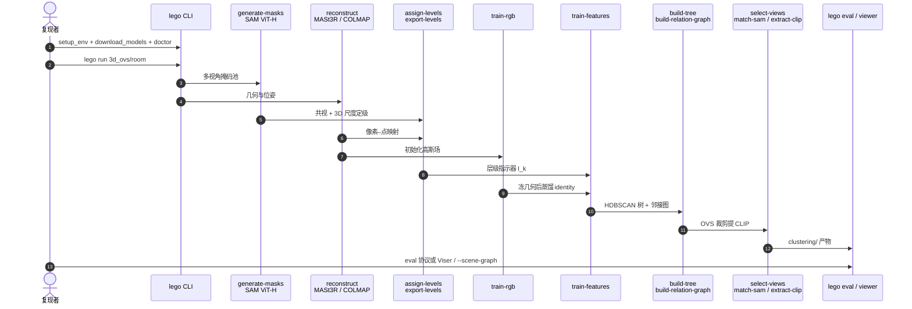

# LEGO：层级语言高斯溅射

**LEGO**（*LEveled Gaussian splatting for Open-vocabulary understanding*；论文 *LEGO: Leveled Language Gaussian Splatting*，[arXiv:2608.10057](https://arxiv.org/abs/2608.10057)，[项目页](https://pz0826.github.io/LEGO-Webpage/)，[代码](https://github.com/WHU-USI3DV/LEGO)）由 **武汉大学 / 香港科技大学**（Peng / Wang / Liu / Lu / Dong / Yang）提出：不把 [SAM](./paper-segment-anything.md) 的 2D 粒度或绝对物理尺度直接当 3D 层级，而是按共视与 3D 尺度把多视角掩码 **重分级** 成结构层级，再蒸馏到解耦的 3D Gaussian Splatting 特征场，并用 CLIP 与层级语言场景图做开放词汇 grounding 与 LLM Chain-of-Retrieval。

## 一句话定义

**别把 SAM 的 2D 粒度或物体的绝对尺寸当成 3D 语义层级：先在共视邻域里定结构级，再按级训互不干扰的高斯特征，才能稳定切出「花盆 → 花束 → 花蕾 → 花瓣」。**

## 英文缩写速查

| 缩写 | 英文全称 | 简要说明 |
|------|----------|----------|
| LEGO | LEveled Gaussian splatting for Open-vocabulary understanding | 本文框架：结构层级 3DGS + 语言场景图 |
| 3DGS | 3D Gaussian Splatting | 可微高斯场；本文在其上挂层级 identity 特征 |
| SAM | Segment Anything Model | 多视角 2D 掩码来源（ViT-H）；粒度随视距变 |
| CLIP | Contrastive Language–Image Pretraining | 最优视角裁剪后的开放词汇特征 |
| CoR | Chain-of-Retrieval | LLM 把复合查询拆成 coarse-to-fine 图搜索 |
| OVS | Optimal View Selection | 可见度 × 覆盖 × SAM IoU，选 top-τ 视角提 CLIP |
| HDBSCAN | Hierarchical Density-Based Spatial Clustering | 自顶向下切嵌套簇的聚类器 |
| LERF | Language Embedded Radiance Fields | 开放词汇评测集之一（LangSplat 标注） |

## 为什么重要

- **对准 [2D→3D 语义提升 Gap](../concepts/2d-to-3d-semantic-lifting-gap.md) 的第五类失败：** 除尺度/遮挡/时序/语义–几何分离外，SAM 提升还会 **把 2D 粒度或绝对尺度误当成语义层级**。近景花瓣、远景花蕾、大花被切碎、小花保持完整，都是同一病。
- **开放词汇不能停在物体级：** 操作与语言 grounding 常要零件（壶柄、钢琴踏板、洋葱片）。扁平 CLIP 场会 bag-of-words；层级图才能用粗物体当锚点再下钻。
- **可复现：** 项目页 Code 指向完整 [`WHU-USI3DV/LEGO`](https://github.com/WHU-USI3DV/LEGO)，`lego run` / `eval` / `viewer` 可辨识。许可是 **CC BY-NC-SA 4.0**，无现成场景权重。
- **名字别混：** 不是斯坦福 [LEGS](./paper-legs-embodied-gaussian-splatting-vla.md)（3DGS 合成 VLA 演示），也不是 LEGO-SLAM。

## 核心信息

| 字段 | 内容 |
|------|------|
| 作者 | Yuning Peng, Haiping Wang, Yuan Liu, Yipeng Lu, Zhen Dong, Bisheng Yang |
| 机构 | 武汉大学（WHU）；香港科技大学（HKUST） |
| 出处 | ECCV 2026；arXiv:2608.10057（2026-08） |
| 栈 | SAM ViT-H；MASt3R-SfM / COLMAP；gsplat；OpenCLIP；HDBSCAN；可选 OpenRouter LLM |
| 默认层级 | \(L=8\) 层 × \(d=8\) 维；经验上真实物体很少超过 8 级 |
| 开源（截至 2026-08-16） | **已开源、可运行**：[`WHU-USI3DV/LEGO`](https://github.com/WHU-USI3DV/LEGO)，CC BY-NC-SA 4.0 |

## 方法与核心结构

| 模块 | 作用 |
|------|------|
| **掩码提升** | 像素 → 3D 点；尺度 \(s_i=2\sqrt{\sum_d\mathrm{std}^2}\) |
| **局部峰值定级** | 共视邻域直方图取峰，\(l_i=\arg\min_l\|s_i-p_l\|\) |
| **稠密指示器 \(\mathbb{I}_k\)** | 单调性 / 递归包含 / 向最近粗层继承，补单层稀疏监督 |
| **解耦 \(\mathbf{f}\in\mathbb{R}^{L\times d}\)** | 每层独立对比蒸馏，避免跨层特征搅在一起 |
| **损失** | 面积反比对比 + 正对 \(L_2\) + 3D/2D 单位球；负对 cosine 做 zero-clamp |
| **树** | 自顶向下 HDBSCAN，按子层特征切父簇 |
| **OVS + CLIP** | 可见度 × 2D 覆盖 × SAM IoU，top-τ 平均 |
| **场景图** | \(\mathcal{E}_{hier}\) 部分–整体；\(\mathcal{E}_{adj}\) 包围球相交（与 hier 重叠则删 adj） |

单词/短语查询只在前三层做 CLIP 相似度，**不走 LLM**。复合查询才解析成 \((\mathcal{O},\mathcal{R})\) 再 beam search。

### 流程总览

```mermaid
flowchart TB
  rgb["多视角 RGB"]
  sam["SAM 多粒度掩码"]
  sfm["MASt3R-SfM / COLMAP"]
  lift["提升 + 共视尺度峰检测"]
  ind["层级稠密指示器 I_k"]
  rgbgs["RGB 3DGS 30k"]
  feat["冻几何 · 层级特征 10k"]
  tree["HDBSCAN 嵌套树"]
  clip["OVS → CLIP"]
  graph["层级 + 邻接场景图"]
  q1["单词/短语 · 前三层 CLIP"]
  q2["复合查询 · LLM CoR"]
  rgb --> sam --> lift
  rgb --> sfm --> lift
  sfm --> rgbgs --> feat
  lift --> ind --> feat
  feat --> tree --> clip --> graph
  graph --> q1
  graph --> q2
```

结构层级对视距和绝对尺寸不变：大车和小车可以同时落在同一「整车 / 部件」级，不必手调全局尺度。

## 源码运行时序图

官方仓 [`WHU-USI3DV/LEGO`](https://github.com/WHU-USI3DV/LEGO) 的 `lego` CLI 对齐 `src/lego/pipeline/runner.py` 的 `STAGE_NAMES`。复现入口：`scripts/setup_env.sh` → `scripts/download_models.sh --accept-mast3r-license` → `lego doctor` → `lego run <dataset/scene>` → `lego validate` / `lego eval` / `lego viewer`。



断点续跑用 `--from-stage train-rgb --to-stage build-tree`。上游阶段重跑会作废下游 manifest。CoR 查看器要 `LLM_API_KEY`，标注放在 `$LEGO_DATA_ROOT/cor`。

## 工程实践

| 项 | 建议 / 论文与仓库设定 |
|----|----------------------|
| **何时用** | 多视角静态场景，要自动多粒度开放词汇分割，或复合空间查询（「滚针旁边那只壶的手柄」） |
| **何时不用** | 机载在线建图、动态场景、只要 2D 框；那是 [FindAnything](./findanything.md) / [OV-SAM3D](./ov-sam3d.md) / 检测器路线 |
| **环境** | Ubuntu 20.04、Python 3.11、PyTorch 2.5.1、CUDA 12.1、约 24GB 显存 |
| **数据** | `LEGO_DATA_ROOT` / `LEGO_OUTPUT_ROOT`；场景放 `mipnerf360/room/images` 等；CoR 四场景另下 Drive 标注 |
| **分辨率** | `data.factor` 控重建与 GS；`semantics.factor` / `evaluation.factor` 可单独改 |
| **初始化** | 默认 COLMAP 位姿；`gaussian.init=mast3r` 才用 MASt3R 位姿；`both` 保留全部 COLMAP 点再用 MASt3R 补预算 |
| **层级** | `hierarchy.num_levels=L` 学 1…L；level 0 是未分割根。公开编号始终 1-based |
| **聚类** | `clustering.end_level=K` 切到 K；`use_spatial` 把归一化 XYZ 拼进 HDBSCAN；`recursive_sample_limit=0` 全点但更贵 |
| **查看** | `lego viewer 3d_ovs/room --port 8080`；复合查询加 `--scene-graph` |
| **许可** | 仓本身非商用；MASt3R 下载必须 `--accept-mast3r-license` |
| **源码运行时序图** | 适用（见上节） |

## 实验与评测

| 设定 | 结果读法 |
|------|----------|
| NVOS 可提示分割 | mIoU **94.2** / mAcc **98.7**；相对 SAGA **+1.6** mIoU（饱和基准上的非平凡差） |
| SPIn-NeRF | mIoU **94.2** / mAcc **99.3** |
| LERF-OVS | 定位 **88.4** / 分割 **68.4**；相对最强基线约 **+4.1 / +4.4** |
| Mip-NeRF 360 | 定位 **92.6** / 分割 **73.0**；约 **+3.9 / +3.6** |
| 细粒度（Ramen） | 「玉米 / 洋葱片」相对最强基线约 **+11.2 mAcc / +11.9 mIoU** |
| 3D-OVS（附录） | overall mIoU **96.5** |
| CoR 120 query | LEGO **51.6**；去 CoR **22.7**；LaGa+CoR **14.3** |
| Room 消融 | 去面积重加权 mAcc **−6.9**；去 \(L_{pos}\) 与归一化再各掉约 1.3–1.6 mIoU |
| 训练时间 | RTX 4090 约 **20–60 min** GS + **5–10 min** 树/CLIP |

可提示分割：把参考视角 scribble / mask 反投到 3D 簇再渲染到评测视角。开放词汇：在得分最高的那一层取 \(S\ge 0.9\cdot S_{\max}\) 的全部簇，以覆盖同层多实例。

## 结论

**LEGO 真正改的是「3D 层级从哪来」：用共视结构级替换视距绑定的 SAM 粒度和手调物理尺度，解耦特征只是把这个监督灌进 3DGS 的手段。**

1. **真影响：层级定义** — 粒度蒸馏和尺度蒸馏都会在类内尺寸差或变视距时拆错家族；局部峰值定级让大/小实例落在同一语义级。
2. **真影响：解耦 + 稠密指示器** — 跨层特征搅在一起会糊边界；单层重分级掩码太稀，必须沿层级继承才能稳住优化。
3. **真影响：复合查询要图** — 扁平 CLIP 吃 bag-of-words；CoR 从 22.7 拉到 51.6，图模块不是装饰。
4. **次要代价：按场景离线优化** — 20–60 分钟/场景，不是机载语义 SLAM。
5. **评测读法：** 饱和可提示分割看 +1.6 mIoU；开放词汇看细零件和 CoR，不要只报 overall。
6. **部署读法：** 仓可跑但无场景权重、许可非商用；单词查询走前三层 CLIP，复合查询才花钱调用 LLM。

## 与其他工作对比

| 对照 | 差异读法 |
|------|----------|
| LangSplat / HiL-Splat / OccamLGS | 把 SAM 三档 2D 粒度直接当 3D 层；LEGO 重分级，层数不锁死在 3 |
| GARField / SAGA | 全局物理尺度或相似度阈值；LEGO 用局部结构级，免逐实例调尺 |
| [OV-SAM3D](./ov-sam3d.md) | 训练无关的点云开放词汇实例；LEGO 是按场景优化的辐射场 + 层级图 |
| [FindAnything](./findanything.md) | 机载对象级体素子地图；LEGO 离线、更深零件层级 |
| [OccAnyScene](./paper-occanyscene.md) | 3DGS 做跨室内外占据；LEGO 做语言层级，不输出占据栅格 |
| [LEGS](./paper-legs-embodied-gaussian-splatting-vla.md) | 同名易混；LEGS 是 3DGS 合成人形 VLA 数据，不是场景理解 |
| [SAM](./paper-segment-anything.md) | 2D 掩码前端；LEGO 消费它并显式修好多视角粒度不一致 |

## 局限与风险

- 静态多视角；动态、透明、强反光未充分评。
- 依赖 SfM/COLMAP 质量；位姿坏则定级与蒸馏一起坏。
- 低纹理零件仍难，只是比「和父物体特征平均」好。
- CoR 依赖 LLM 解析关系类型（hier / adj）；解析错则整条链偏。
- **无官方场景 checkpoint**，复现成本是每场景数十分钟级训练。
- 许可非商用；第三方权重另有条款。

## 关联页面

- [2D→3D 语义提升 Gap](../concepts/2d-to-3d-semantic-lifting-gap.md) — 本页把「粒度/尺度 ≠ 结构层级」补进提升失败模式
- [机器人视觉感知栈选型闭环](../queries/robot-perception-stack-selection-loop.md) — 第③层离线多粒度开放词汇建图样本
- [Segment Anything](./paper-segment-anything.md) — 2D 掩码前端
- [OV-SAM3D](./ov-sam3d.md) — 训练无关点云开放词汇对照
- [FindAnything](./findanything.md) — 机载对象级开放词汇对照
- [OccAnyScene](./paper-occanyscene.md) — 另一条 3DGS 感知（占据，不是语言层级）
- [LEGS](./paper-legs-embodied-gaussian-splatting-vla.md) — 易混名的 3DGS×VLA 数据工厂

## 参考来源

- [lego_leveled_language_gs_arxiv_2608_10057.md](../../sources/papers/lego_leveled_language_gs_arxiv_2608_10057.md)
- [项目页归档](../../sources/sites/pz0826-lego-webpage.md)
- [官方仓归档](../../sources/repos/lego.md)
- Peng et al. — <https://arxiv.org/abs/2608.10057>
- 项目页 — <https://pz0826.github.io/LEGO-Webpage/>
- 代码 — <https://github.com/WHU-USI3DV/LEGO>

## 推荐继续阅读

- 项目页演示与层级对比图 — <https://pz0826.github.io/LEGO-Webpage/>
- 官方 README（`lego run` / 阶段表）— <https://github.com/WHU-USI3DV/LEGO>
- 同组前作 GAGS（粒度感知 CLIP 蒸馏）— <https://pz0826.github.io/GAGS-Webpage/>
- LangSplat — <https://arxiv.org/abs/2312.16084>
- SAGA — <https://jumpat.github.io/SAGA/>
