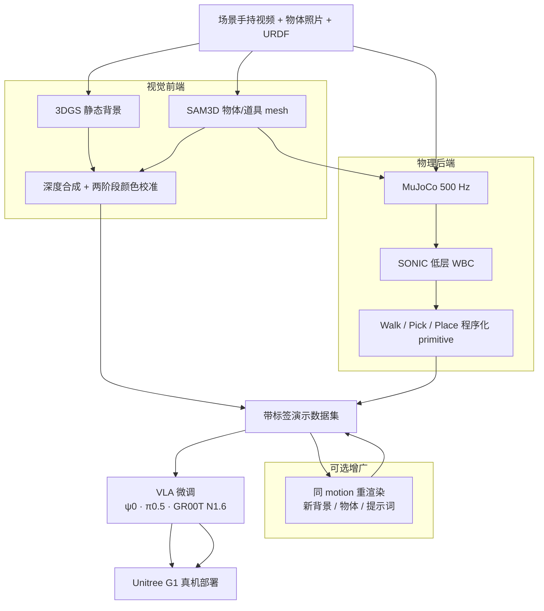

# LEGS（Loco-manipulation via Embodied Gaussian Splatting）

**LEGS** 是斯坦福团队提出的 **人形 loco-manipulation VLA 数据工厂**（arXiv:2606.01458，2026-05）：在 **无真人遥操作、无种子演示、无人视频** 的前提下，用 **程序化仿真** 生成带标签演示，并通过 **3D Gaussian Splatting（3DGS）背景 + mesh 前景合成 + 两阶段颜色校准**，使合成图像接近 **Unitree G1 头载 RealSense** 的真机分布。论文在三个递难 pick-place 与 **ψ0、π0.5、GR00T N1.6** 上报告：**纯 LEGS 数据微调** 的策略 **匹配或超过 50 条 teleop**，且全面优于 **SAM3D mesh-only** 消融。

## 英文缩写速查

| 缩写 | 英文全称 | 简要说明 |
|------|----------|----------|
| Sim2Real | Simulation to Real | 把仿真中学到的策略迁移落地真机的工程主线 |
| MuJoCo | Multi-Joint dynamics with Contact | 接触丰富的刚体物理仿真引擎 |
| GPU | Graphics Processing Unit | 图形处理器，大规模并行仿真训练的算力基础 |
| G1 | Unitree G1 Humanoid | 宇树入门级教育科研人形平台 |
| VLA | Vision-Language-Action | 视觉-语言-动作多模态基础策略方向 |
| RL | Reinforcement Learning | 通过与环境交互最大化长期回报来学习策略的范式 |
| Manipulation | Robot Manipulation | 抓取、移动、操作物体的任务总称 |
| URDF | Unified Robot Description Format | 统一机器人描述格式 |
| WBC | Whole-Body Control | 协调全身关节满足多任务/约束的控制基础设施 |
| Teleop | Teleoperation | 人遥操作机器人采集演示数据 |
| IL | Imitation Learning | 从专家演示学习策略，奖励难定义时的主路线 |
| RGB | Red-Green-Blue | 彩色图像通道，常与深度 (RGB-D) 配合 |

## 为什么重要

- **对准 VLA 数据瓶颈：** 人形 loco-manip 需要同时覆盖 **行走与操作**；teleop 绑定操作员与机时，换场景/物体/语言提示往往要 **重采整条轨迹**。
- **双通道可信：** 仅物理对不够（mesh 渲染域差）；仅视觉像不够（动作不可执行）。LEGS 把 **MuJoCo 接触物理** 与 **3DGS 光真实感** 放在同一条可扩展管线里。
- **motion–appearance 解耦：** 18-D 命令流与渲染输入分离 → **同一段 motion 可 GPU 重渲染** 到新桌面/物体/提示词（论文 Table 1：新条件 teleop **>1.5 h** vs LEGS **~0.1 h**）。
- **与姊妹路线对照：** [VIRAL](./paper-viral-humanoid-visual-sim2real.md) / [DoorMan](./paper-doorman-opening-sim2real-door.md) 走 **特权 RL + 视觉蒸馏**；LEGS 走 **预训练 VLA 微调 + 合成模仿数据**，互补阅读 [Loco-Manipulation](../tasks/loco-manipulation.md) 数据面。

## 流程总览

## 核心机制（归纳）

### 视觉前端

- **背景：** ~1–2 分钟手持视频 → COLMAP 位姿 + 3DGS 优化；novel view 贴近真实照片分布。
- **前景：** 机器人 URDF + SAM3D 从单图重建的物体/道具 mesh；每帧栅格化后与背景 **深度合成**。
- **颜色校准：** 固定曝光/白平衡；**per-mesh 线性缩放** 修正 SAM3D 反照率 + **全局 3×3 矩阵**（ColorChecker）对齐部署相机——论文将 close-range 成功率差距 largely 归因于此管线相对 mesh-only。

### 物理后端与接口

- **MuJoCo** 在 mesh 碰撞几何上解动力学，与渲染 **解耦**。
- **SONIC** 作为仿真/真机一致的低层 WBC；高层 **18-D 命令**（双臂腕 SE(3)+夹爪 + 底座速度/高度）。
- **程序化 episode：** 参数化 primitive 组合；仅保留验证成功轨迹；记录命令流后可 **只换渲染** 增广（LEGS-aug）。

### 实验设定（论文）

| Task | 内容 |
|------|------|
| 1 | 基本不移动，桌面 pick-place 橙子→盘 |
| 2 | 走到桌边再 pick-place |
| 3 | 走–拿–转身–到低桌 **蹲放**（长时程 loco-manip） |

- **对比数据：** Teleop(50)、SAM3D(200)（无 3DGS/校准）、LEGS(200)、LEGS(50)。
- **报告指标：** 每 (backbone, task) **10 次** 端到端成功率；Task 3 上 teleop **全线 0/10** 而 LEGS(200) 仍有个位数到 **6/10** 成功。

## 常见误区或局限

- **不是「消灭 teleop」：** teleop 在短程 Task 1 仍可比；LEGS 优势在 **长时程 + 外观增广 + 规模化合成**。
- **不是纯 NeRF/纯 mesh：** 去掉 **3DGS+校准** 的 SAM3D 基线平均成功率约 **减半**（论文 ~33% vs ~67%）。
- **依赖栈：** 需要已有 **SONIC**、手持场景扫描、**静态背景**；对透明/反光/动态场景与跨人形硬件 **未充分验证**（§5）。

## 关联页面

- [Loco-Manipulation](../tasks/loco-manipulation.md) — 任务定义与路线谱系
- [VLA](../methods/vla.md) — 微调对象抽象
- [SONIC](../methods/sonic-motion-tracking.md) — 低层全身控制器
- [π0.7 Policy](../methods/pi07-policy.md) — 论文骨干之一
- [Unitree G1](./unitree-g1.md) — 评测平台
- [GS-Playground](./gs-playground.md) — 另一条 3DGS×仿真视觉 RL 路线
- [VIRAL](./paper-viral-humanoid-visual-sim2real.md) — 视觉 sim 数据 + loco-manip（RL 蒸馏而非 VLA 合成 IL）
- [OASIS](./paper-loco-manip-04-oasis.md) — 仿真 teleop + 离线渲染域随机化 + Flow Matching（arXiv:2606.08548）
- [Teleoperation](../tasks/teleoperation.md) — 数据成本对照
- [MotionWAM](./paper-motionwam-humanoid-loco-manipulation-wam.md) — 同 G1+SONIC 栈的 **WAM 预训练** 路线对照（arXiv:2606.09215）

## 实验与评测

- 主表：**9 组 (backbone × task)** 端到端成功率 + **外观随机化**（default / 蓝桌 / 苹果+盒子 / 联合偏移）；阶段累积成功率见论文 Appendix B。
- 本页为 **知识库编译摘要**；完整消融与 1110 trials 协议见 [参考来源](#参考来源)。

## 与其他工作对比

| 维度 | LEGS | Teleop(50) | SAM3D mesh-only | [MotionWAM](./paper-motionwam-humanoid-loco-manipulation-wam.md) | [VIRAL](./paper-viral-humanoid-visual-sim2real.md) |
|------|------|------------|-----------------|----------------------------------------------------------------|-----------------------------------------------------|
| 数据入口 | 程序化仿真 + 3DGS 渲染 | 真人 VR 遥操作 | 同 LEGS 但无 3DGS/校准 | egocentric 视频预训练 + VR 全身遥操作 | 特权 RL 教师 → 视觉学生 |
| 目标策略 | 微调预训练 **VLA** | 微调 VLA | 微调 VLA | **WAM**（Video+Motion DiT） | RGB 策略（非 VLA 微调叙事） |
| 新场景成本 | ~0.1 h GPU 重渲染 | >1.5 h 重采 | 可重渲染但视觉域差大 | 需重新仿真训练管线 |
| Task 3（长时程） | LEGS(200) 2–6/10 | **0/10**（三 backbone） | 低于 LEGS | 不同任务设定（行走–放置循环） |

## 参考来源

- [legs_arxiv_2606_01458.md](../../sources/papers/legs_arxiv_2606_01458.md) — arXiv 摘录与 Table 1 摘要
- [wechat_embodied_ai_lab_legs_vla_3dgs_loco_manip.md](../../sources/blogs/wechat_embodied_ai_lab_legs_vla_3dgs_loco_manip.md) — 具身智能研究室微信公众号策展导读
- [legsvla-github-io.md](../../sources/sites/legsvla-github-io.md) — 项目页归档
- Kim, Chen, Sun, Osterberg, Chen, Wang, Schwager, *LEGS: Fine-Tuning Teleop-Free VLAs for Humanoid Loco-manipulation in an Embodied Gaussian Splatting World*, arXiv:2606.01458, 2026. <https://arxiv.org/abs/2606.01458>

## 推荐继续阅读

- [VLA 开源复现景观（2025）](../overview/vla-open-source-repro-landscape-2025.md) — ψ0 / π 系与 GR00T 工程上下文
- [人形 RL 身体系统栈](../overview/humanoid-rl-motion-control-body-system-stack.md) — 第 7 层任务接口 / VLA 调用
- [VIRAL（论文实体）](./paper-viral-humanoid-visual-sim2real.md) — 同任务设定下的视觉 Sim2Real RL 全栈
