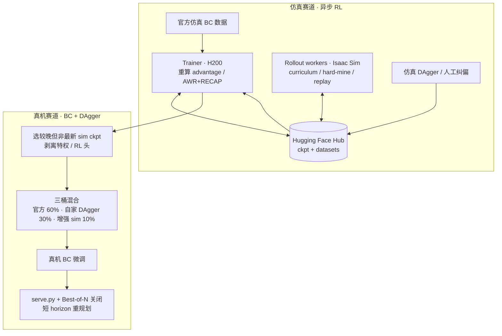
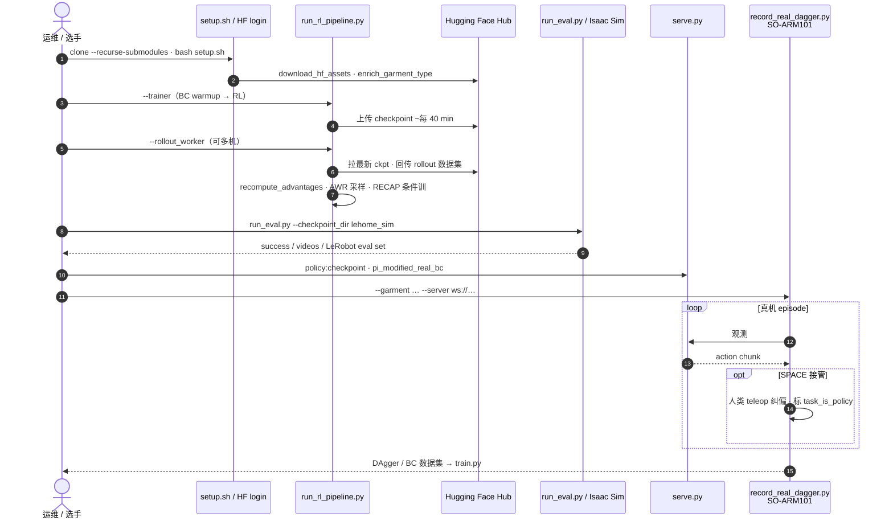

# Learning to Fold（LeHome Challenge 2026 · arXiv:2606.27163）

**Learning to Fold**（[arXiv:2606.27163](https://arxiv.org/abs/2606.27163)，[项目博客](https://ilialarchenko.com/projects/lehome2026)，[代码](https://github.com/IliaLarchenko/lehome_solution)）是 Ilia Larchenko 在 ICRA 2026 **LeHome Challenge** 上的个人夺冠方案：廉价 **双臂 SO-ARM101** 上折叠四类衣物。线上仿真 **第 1 / 62 队（79.63%）**，维也纳线下实体决赛 **第 2（865/1080）**。核心是把 **π₀.₅ VLA** 做成「自带价值函数」的策略，用 **AWR + RECAP** 异步 RL 飞轮（**Hugging Face Hub** 作消息总线）在 Isaac Sim 里推高鲁棒性，再用剥特权头的 **真机 BC + DAgger** 跨 sim→自家机→评测机。

## 一句话定义

**用带辅助价值/进度头的 π₀.₅，在仿真里跑 AWR+RECAP 异步 RL，再在真机上用三桶数据与 DAgger 做可迁移微调——整条采集–训练–推理链与双赛道权重均已开源。**

## 英文缩写速查

| 缩写 | 英文全称 | 简要说明 |
|------|----------|----------|
| VLA | Vision-Language-Action | 视觉–语言–动作策略；本文骨干为 π₀.₅ |
| AWR | Advantage-Weighted Regression | 按 advantage 重采样/加权的离策 RL 更新 |
| RECAP | Reward / advantage Conditioning（竞赛方案语境） | 将 advantage 作为条件输入，并解锁推理期 CFG |
| CFG | Classifier-Free Guidance | 推理时放大 advantage 条件，方案中收敛到约 7–9 |
| DAgger | Dataset Aggregation | 策略 rollout 失败处由人接管纠偏并回灌训练 |
| GAE | Generalized Advantage Estimation | 将多层奖励信号聚合成帧级 advantage |
| SO-ARM101 | Solo Arm 101（LeRobot） | 竞赛用廉价 6-DoF 臂；双臂 + 三相机 |
| HF Hub | Hugging Face Hub | 异步 Trainer / Worker 之间的 checkpoint 与数据集总线 |

## 核心信息

| 字段 | 内容 |
|------|------|
| **作者 / 机构** | 伊利亚·拉尔琴科（Ilia Larchenko，独立参赛） |
| **竞赛** | [LeHome Challenge 2026](https://github.com/lehome-official/lehome-challenge)（ICRA 2026） |
| **arXiv** | [2606.27163](https://arxiv.org/abs/2606.27163) |
| **开源** | **已开源（完整工程）** — [`lehome_solution`](https://github.com/IliaLarchenko/lehome_solution)（Apache-2.0）+ [`lehome_sim`](https://huggingface.co/IliaLarchenko/lehome_sim) + [`lehome_real`](https://huggingface.co/IliaLarchenko/lehome_real) |
| **硬件** | 双臂 SO-ARM101、12 维关节动作、顶视 + 双腕 RGB |
| **仿真成绩** | **1st / 62**，总体 **79.63%**（长袖 74.5% / 短袖 70.0% / 长裤 80.5% / 短裤 93.5%） |
| **真机成绩** | **2nd**，**865 / 1080**（冠军 895） |

## 为什么重要

- **可复现的竞赛全栈：** 相对多数「只发权重或只发 demo」的夺冠方案，本仓库覆盖 **训练、分布式采集、评测、真机 DAgger 与推理服务**，并附成功/失败完整推理视频。
- **VLA + RL 工程配方可拆用：** AWR 重采样、RECAP 条件化 + CFG、自预测价值头、Thompson 推理调参、HF Hub 无屏障异步，可单独迁移到其他 π 系后训练。
- **廉价臂 + 可变形物体的 sim2real：** 与 [Sunday ACT-2](./sunday-robotics-act2.md) 的闭源叠衣高成功率叙事对照，本页提供 **开源可复现** 的 SO-ARM101 路线；亦与 [NVIDIA SO-101 实验课](./nvidia-so101-sim2real-lab-workflow.md) 同硬件族。
- **对照 RECAP 生态：** 与 [STEAM](./paper-steam-advantage-modeling.md)（离线自监督 advantage + CFGRL、无需在线采样）形成「**在线异步 rollout** vs **纯离线打分**」选型对照。

## 核心原理

### 任务与评分

- **仿真：** 关键点几何谓词自动判定成功/失败；品类在评测时隐藏，策略需回合初推断 garment type。
- **真机：** 评委综合「是否叠成 + 折叠质量」；未见衣物额外加权；参赛者**无法长期使用最终评测机**，存在额外机间泛化。

### 策略结构（单策略四衣物）

在 BEHAVIOR-1K 夺冠改版 π₀.₅ 上叠加：

1. **辅助头**（共享 query token）：成功概率、任务完成度、衣物类型、约 30 帧后的关键点距离与 Q 残差——同一前向既出动作 chunk，又出训练/推理用的价值信号。
2. **条件化：** garment-type token；RECAP 式 advantage 条件 + multi-signal AdaRMS 注入 action expert。
3. **廉价「世界模型」：** 只预测任务相关标量（关键点距等），不预测整帧未来。

作者明确：**多数改动未做充分消融**，竞赛优先，细节供复现参考。

### 流程总览

### 源码运行时序图

对齐 [`IliaLarchenko/lehome_solution`](https://github.com/IliaLarchenko/lehome_solution) README 三入口：`run_rl_pipeline.py`、`run_eval.py`、`serve.py` + `record_real_dagger.py`。

复现路径：`bash setup.sh` → `uv run huggingface-cli login` → 拉 `lehome_sim` / `lehome_real` → 仿真用 `run_eval.py --all`，真机用 `serve.py` + `record_real_dagger.py`。完整飞轮需自备 HF model/dataset repo 写入 `configs/rl_pipeline_sim.yaml`。

## 工程实践

| 项 | 要点 |
|----|------|
| **安装** | `git clone --recurse-submodules` + `bash setup.sh`（含 Isaac Sim / 资产；可用 `--no-data`） |
| **仿真权重** | `uv run hf download IliaLarchenko/lehome_sim --local-dir outputs/checkpoints/lehome_sim` |
| **真机权重** | 同上拉 `IliaLarchenko/lehome_real`；`configs/real_robot.yaml` 改串口与相机 |
| **RL 飞轮** | `run_rl_pipeline.py --trainer` + 任意数量 `--rollout_worker`；Hub 异步同步 |
| **快速只看成功率** | `run_eval.py … --metrics_only`（跳过 pkl / 数据集 / debug 视频） |
| **推理超参** | 执行长度、playback、overlap、CFG、noise temperature、Best-of-N；可用 Thompson bandit 在线搜 |
| **真机混合比** | 官方 BC **60%** / 自家 teleop+DAgger **30%** / 增强 sim replay **10%** |
| **开源边界** | 完整链路已开；依赖作者 `lehome-challenge` fork 采特权数据；作者标注**非生产级** |

## 实验要点（索引级）

> 数字以 [项目博客](https://ilialarchenko.com/projects/lehome2026) / [arXiv:2606.27163](https://arxiv.org/abs/2606.27163) 为准。

| 设定 | 本方案 | 对照要点 |
|------|--------|----------|
| **仿真 Overall（80 ep 量级）** | **79.63%** | 第 2 名 73.50%；领先约 **6.1 pp** |
| **仿真四衣** | 74.5 / 70.0 / 80.5 / **93.5** | 三类第一；短袖相对最难 |
| **真机决赛** | **865 / 1080（2nd）** | sZs **895**；第 3 名 762.5 |
| **CFG 收敛** | guidance **7–9** | 远高于作者先验预期 ~2 |
| **重规划** | 约每 **5** 步 | 优于执行完整 30-step chunk |
| **Best-of-N** | **N=2–3** 足够 | Q 头选 chunk |

**失败模式（博客）：** 灵巧不足、过拟合仿真伪影、近成功卡住；debug overlay 实时打印 S/A/R/C/T 预测。

## 局限与风险

- **误区：** 把「仿真第 1」直接当「真机可复现 80%」——真机赛换了评分、硬件与数据配方，且评测机不可长期占用。
- **误区：** 认为所有辅助头都是增益来源——作者未充分消融；迁移时优先验证 action + garment/completion 头。
- **局限：** 仿真 RL 与真机 BC+DAgger **两套半截配方**；作者自评若统一价值信号驱动真机 advantage / Best-of-N，仍有上升空间。
- **工程风险：** H200 级训练、500+ GB 磁盘、Isaac Sim 与双 venv（主环境 + lehome-challenge）；竞赛代码命名与报告不完全一致。
- **开源状态：** **已开源**（代码 + 双赛道权重 + 博客视频）；以项目页 / README 链接为准（核查日 2026-07-22）。

## 关联页面

- [VLA](../methods/vla.md) — π₀.₅ 骨干与竞赛后训练语境
- [AWR](../methods/awr.md) — 优势加权回归
- [DAgger](../methods/dagger.md) — 真机/仿真人类纠偏闭环
- [Sim2Real](../concepts/sim2real.md) — 可变形物体与机间泛化
- [LeRobot](./lerobot.md) — SO-ARM101 与数据/Hub 生态
- [VLA 开源复现景观](../overview/vla-open-source-repro-landscape-2025.md) — 与 OpenPI / RLinf RECAP 栈对照入口
- [Manipulation](../tasks/manipulation.md) — 可变形衣物操作任务族
- [STEAM](./paper-steam-advantage-modeling.md) — 离线 RECAP/CFGRL 对照
- [DreamSteer](./paper-dreamsteer-vla-deployment-steering.md) — 推理时 chunk 选择另一路线
- [NVIDIA SO-101 Sim2Real workflow](./nvidia-so101-sim2real-lab-workflow.md) — 同硬件族官方动手课
- [ACT-2（Sunday）](./sunday-robotics-act2.md) — 闭源叠衣高成功率对照

## 推荐继续阅读

- [项目博客（含成功/失败视频）](https://ilialarchenko.com/projects/lehome2026)
- [tech report PDF（arXiv:2606.27163）](https://arxiv.org/pdf/2606.27163)
- [lehome_solution README 三工作流](https://github.com/IliaLarchenko/lehome_solution)
- [官方竞赛仓 lehome-challenge](https://github.com/lehome-official/lehome-challenge)
- [openpi（π₀.₅）](https://github.com/Physical-Intelligence/openpi)

## 参考来源

- [论文摘录](../../sources/papers/lehome_learning_to_fold_arxiv_2606_27163.md)
- [项目博客归档](../../sources/sites/ilialarchenko-lehome2026.md)
- [仓库归档](../../sources/repos/lehome_solution.md)
- [HF lehome_sim](../../sources/sites/huggingface-lehome-sim.md)
- [HF lehome_real](../../sources/sites/huggingface-lehome-real.md)
