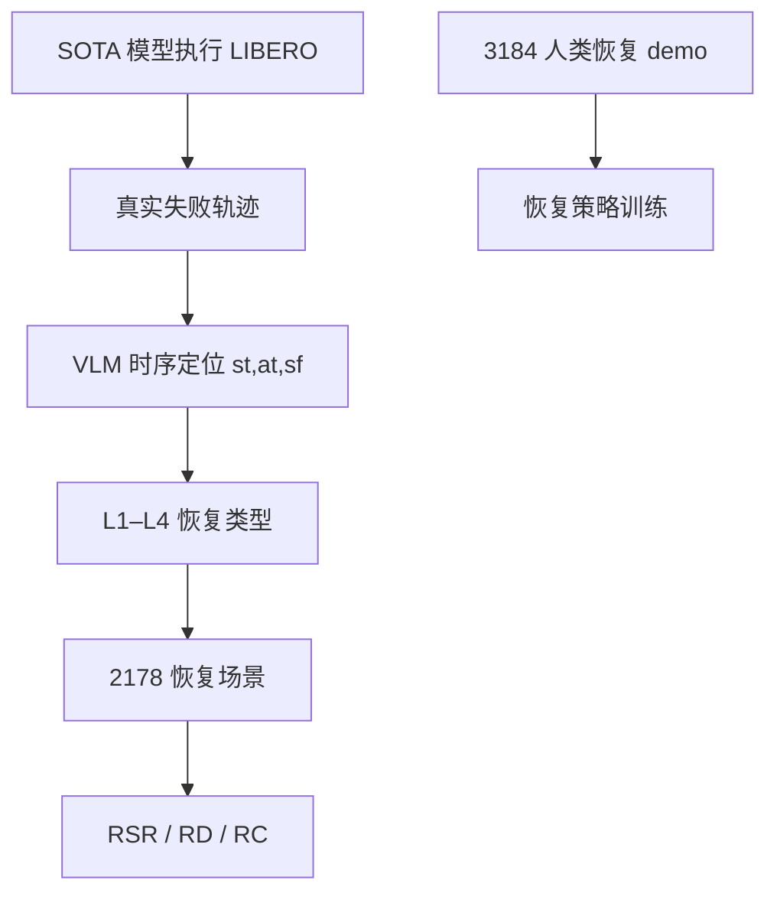
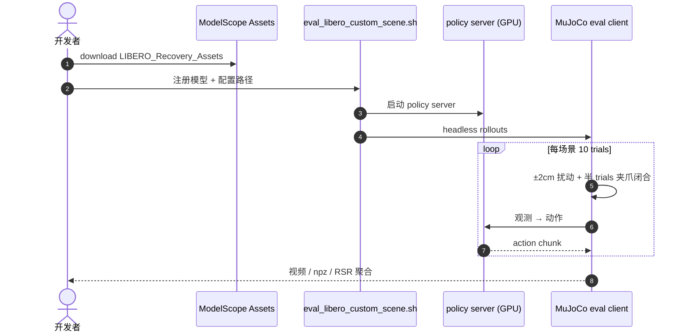

# LIBERO-Recover：机器人失败恢复基准

**LIBERO-Recover**（*Beyond Task Success Towards Failure Recovery in Robotic Manipulation Models*，[arXiv:2609.05178](https://arxiv.org/abs/2609.05178)，[项目页](https://liulin815.github.io/LIBERO-Recovery/)）由 **大连理工大学（DUT）** 等提出：VLA/WAM 在标准 LIBERO 上接近 **100%**，但理想初态下的成功 **不能** 代表真机鲁棒性——抓取失败、碰撞、物体意外位移等 **执行期失败** 普遍未测。LIBERO-Recover 从 **SOTA 具身模型真实执行** 收集失败，经 VLM 定位与表征，构造 **2178** 恢复场景（**L1–L4** 四级难度），并提供 **3184** 条人类恢复 demo（**625731** 帧 @20Hz）。评测问 **「失败后能否恢复并完成原任务？」** 而非 **「能否一次成功？」**

## 一句话定义

**LIBERO 饱和之后，该测的是：从模型自己跑出来的失败态，还能不能把任务做完。**

## 英文缩写速查

| 缩写 | 英文全称 | 简要说明 |
|------|----------|----------|
| LIBERO-Recover | — | 本文失败恢复基准（项目页拼写 Recovery） |
| RSR | Recovery Success Rate | 进入失败态后仍完成原任务的比例 |
| RD | Recovery Degradation | 失败对执行能力的三阶段衰减 |
| RC | Recovery Consistency | 同任务跨失败态恢复稳定性 |
| L1–L4 | Recovery Levels 1–4 | 从动作重试到环境恢复的递进难度 |
| WAM | World Action Model | 被评模型族之一（Cosmos/Wan 等） |

## 为什么重要

- **暴露 LIBERO 虚高：** 六模型在真实失败态上 **普遍跌超 50%**；Wan vs GR00T 在 LIBERO-100 上的排名 **可反转**。
- **首个大规模执行失败恢复基准：** 失败来自 **真实 rollout**，非人工扰动初态或注入失败。
- **分级诊断：** L1/L2（局部修正）与 L3/L4（状态/环境恢复）差距揭示 **动作级 vs 状态级** 能力鸿沟。
- **训练数据可获取：** ModelScope 发布 Expert / Assets / 失败前历史三套数据。

## 方法

| 项 | 内容 |
|----|------|
| **机构** | 大连理工大学（DUT） |
| **规模** | **2178** 场景 / **130** 子任务 / 四 LIBERO suite |
| **构造** | π₀、π₀-FAST、GR00T、OpenVLA-OFT、Wan2-Policy、Cosmos-Policy 作 **失败生成器** → VLM 定位 → L1–L4 标注 |
| **人类数据** | **3184** episodes，LeRobot 格式，第三人称 + 腕部相机 |
| **指标** | RSR、RD、RC（仅 execution 轨迹 + 成功标签） |
| **开源** | **已开源** — GitHub 评测管线 + ModelScope 三数据集 |

### 流程总览

### 四级恢复难度

| 级别 | 名称 | 所需能力 |
|------|------|----------|
| **L1** | Action Retry | 场景未实质改变，重试失败动作 |
| **L2** | Action Adaptation | 微调下一步动作 |
| **L3** | Object State Recovery | 推理并恢复任务相关物体状态 |
| **L4** | Environmental Recovery | 恢复阻塞任务的环境/拓扑状态 |

## 评测要点

| 发现 | 数字 / 读法 |
|------|-------------|
| **成功率断崖** | 相对标准 LIBERO，六模型 RSR **普遍 −50%+** |
| **排名不可迁移** | LIBERO-100：Wan **+14.4%** vs GR00T；对应失败态 Wan **−5.0%** |
| **难度单调** | L1/L2 ≫ L3/L4；**L2→L3** 是动作修正到状态恢复的鸿沟 |
| **chunk 大小** | chunk 4→32，RSR **单调下降**（需更细 closed-loop） |
| **WAM vs VLA** | Cosmos **RC 0.884**、Wan **0.870** vs VLA **0.749–0.798** |
| **联合训练** | +recovery 数据升 RSR（GR00T 17.8→21.2%），标准 LIBERO **几乎不变或略降** |
| **时序上下文** | 提供任务初帧作 anchor，OpenVLA-OFT 平均 20.8→**26.8%** |

## 结论

**LIBERO 接近满分只说明「理想初态下会做」；LIBERO-Recover 证明「从自己失败里爬出来」完全是另一套能力。**

- 标准榜排名 **不能** 当恢复能力代理；评测必须换问法。
- L1/L2 高、L3/L4 低说明当前模型擅长 **局部动作修正**，不擅长 **状态/环境推理**。
- 更小 action chunk  consistently 更好——恢复需要 **高频 closed-loop**，不是更长 open-loop 承诺。
- WAM 的 RC 更高，可能来自 **动作条件状态转移** 归纳偏置；VLA 纯模仿成功轨迹在失败态泛化弱。
- 加 recovery 训练 **不自动** 提升标准 LIBERO，也 **不保证** 在线识别自身失败——恢复与失败检测仍是两回事。

## 源码运行时序图

训练数据 `LIBERO_Recovery_Expert` 与失败前历史 `LIBERO_10_LL` 为 **可选** 训练集，评测仅需 Assets。

## 工程实践

| 项 | 建议 |
|----|------|
| 评测必需 | `ataier/LIBERO_Recovery_Assets` → `$STARVLA/assets/scenes/` |
| 入口 | `eval_libero_custom_scene.sh` + starVLA policy server |
| 协议 | 每场景 10 rollouts（5 close + 5 open gripper），±2 cm xy |
| 训练 | Expert demo + 可选 LIBERO_10_LL 初帧上下文 |
| 误用 | 不要把标准 LIBERO 高分外推为「可部署鲁棒」 |

## 局限与风险

- 论文页仍为 **double-blind 匿名**（ICLR 2027 submission）。
- 失败生成依赖 **特定 SOTA 集合**；分布随新模型迭代而变。
- 仿真 LIBERO 域；真机失败形态可能更复杂。
- RSR 高 **不等于** 在线 failure detection——联合训练实验已提示二者可分离。

## 与其他工作对比

| 对照 | 差异读法 |
|------|----------|
| 标准 LIBERO | 理想初态任务成功；Recover 从 **执行 born 失败态** 起跑 |
| [MINERVA](./paper-minerva-libero.md) | 量 **容量下限**；Recover 量 **失败恢复** |
| [FailBench](./paper-failbench.md) | VLM **判** 成败；Recover **做** 恢复 |
| LIBERO-Plus/Pro/X | 预定义分布偏移；Recover 用 **真实失败轨迹** |

## 关联页面

- [VLA](../methods/vla.md)
- [Manipulation](../tasks/manipulation.md)
- [具身评测基准枢纽](../overview/hub-embodied-eval-benchmark.md)
- [评测基准选型闭环](../queries/embodied-eval-benchmark-selection-loop.md)
- [MINERVA](./paper-minerva-libero.md)
- [FailBench](./paper-failbench.md)

## 推荐继续阅读

- [arXiv:2609.05178](https://arxiv.org/abs/2609.05178)
- [LIBERO-Recover 项目页](https://liulin815.github.io/LIBERO-Recovery/)
- [liulin815/LIBERO-Recovery](https://github.com/liulin815/LIBERO-Recovery)
- [ModelScope LIBERO_Recovery_Expert](https://www.modelscope.cn/datasets/ataier/LIBERO_Recovery_Expert)

## 参考来源

- [libero_recover_arxiv_2609_05178](../../sources/papers/libero_recover_arxiv_2609_05178.md)
- [LIBERO-Recover 项目页](../../sources/sites/libero-recovery-github-io.md)
- [liulin815/LIBERO-Recovery](../../sources/repos/liulin815-libero-recovery.md)
