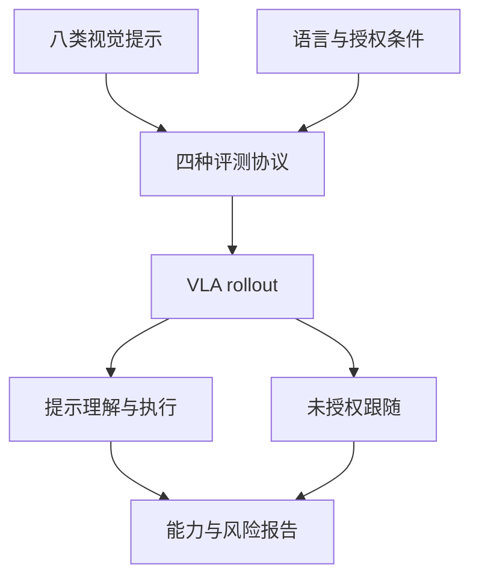

# LIBERO-VIFO

**LIBERO-VIFO: Benchmarking the Capability and Safety of Visual Cue Following in Vision-Language-Action Models**（arXiv:[2608.17600](https://arxiv.org/abs/2608.17600)）— **（见论文署名）**。多模空间 [2026.08.17–08.23 周报](../../sources/blogs/wechat_duomo_vla_weekly_trends_2026-08-17_part1.md) 策展条目；细节以 arXiv 为准。

## 一句话定义

八类视觉提示评测授权/未授权跟随与安全风险。

## 英文缩写速查

| 缩写 | 英文全称 | 简要说明 |
|------|----------|----------|
| VLA | Vision-Language-Action | 视觉–语言–动作策略 |
| RL | Reinforcement Learning | 强化学习后训练或微调 |
| TTA | Test-Time Augmentation / Adaptation | 测试时增强或适配 |
| SR | Success Rate | 任务成功率 |
| LIBERO | LIBERO Benchmark | 常见操作仿真基准套件 |

## 流程总览

以下按本页已归纳的机制与资料绘制，表示模块或阅读路径关系。

## 核心信息

| 项 | 内容 |
|----|------|
| **机构** | （见论文署名） |
| **评测** | LIBERO-VIFO（自建）；AgileX PiPER 实机 |
| **开源** | 待核实（截至 2026-09-29） |

## 为什么重要

- 纳入 [一周 VLA 趋势（2026.08.17 第一篇）](../overview/vla-weekly-trends-2026-08-17-part1-technology-map.md) 横切面索引。
- 与 [VLA](../methods/vla.md) 方法页及同周其他 **16/16 独立 canonical 节点** 交叉对照。

## 评测与指标

- **基准结构：** **8 类视觉提示族**；两部分共 **4 个协议**——Part I 测提示理解与授权跟随，Part II 测语言–提示冲突及空语言条件下的**未授权跟随**。
- **被测模型：** **7 个 VLA**；另做场景内提示、安全关键设定与实机（AgileX PiPER）扩展实验。
- **主要发现：** 能理解视觉提示不等于能执行；而在没有语言指令时，当前 VLA 仍会执行提示所指任务，暴露「未授权视觉提示跟随」风险（数值摘自 arXiv 摘要，完整表格与基线设定以原文为准）。

## 与其他工作对比

| 维度 | LIBERO-VIFO | 对照 |
|------|-------------|------|
| 评测对象 | 视觉提示的**能力 + 安全**（授权与否） | [DeicticVLA](./paper-deicticvla.md)：把指示 mask 作为输入模式来提升能力，不评未授权跟随 |
| 安全定义 | 是否服从了不该服从的提示 | [MANIGUARD](./paper-maniguard.md)：执行过程是否违反 LTLf 安全规约 |
| 基准底座 | 在 [LIBERO](./libero-benchmark.md) 上扩展协议 | LIBERO 原套件只看任务成功率 |

评测基准选型见 [具身大模型评测基准选型闭环](../queries/embodied-eval-benchmark-selection-loop.md)。

## 结论

**LIBERO-VIFO 在本库中作为 arXiv:2608.17600 的 canonical 详情节点；部署与复现前请对照原文 PDF/HTML 与作者发布资源。**

1. **canonical 唯一性** — 全库仅此一页绑定 arXiv:2608.17600。
2. **读法** — 先读公众号策展摘要，再读 arXiv 方法与实验节。
3. **开源** — 待核实（截至 2026-09-29）。
4. **安全/评测类**（若适用）— 勿把任务成功率等同于安全或授权跟随。

## 关联页面

- [VLA](../methods/vla.md)
- [Manipulation](../tasks/manipulation.md)
- [一周 VLA 趋势地图（2026.08.17）](../overview/vla-weekly-trends-2026-08-17-part1-technology-map.md)

## 参考来源

- [libero_vifo_arxiv_2608_17600.md](../../sources/papers/libero_vifo_arxiv_2608_17600.md)
- [多模空间周报归档](../../sources/blogs/wechat_duomo_vla_weekly_trends_2026-08-17_part1.md)
- arXiv：<https://arxiv.org/abs/2608.17600>

## 推荐继续阅读

- [arXiv 摘要页](https://arxiv.org/abs/2608.17600)
