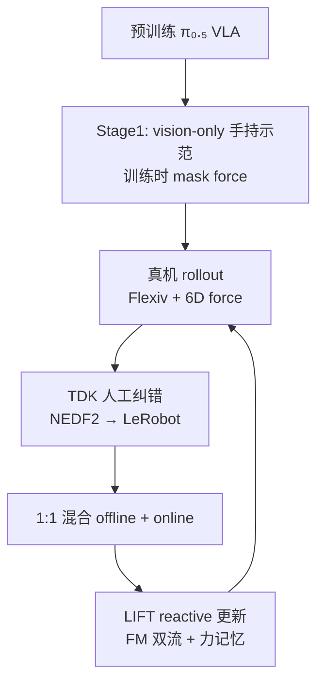
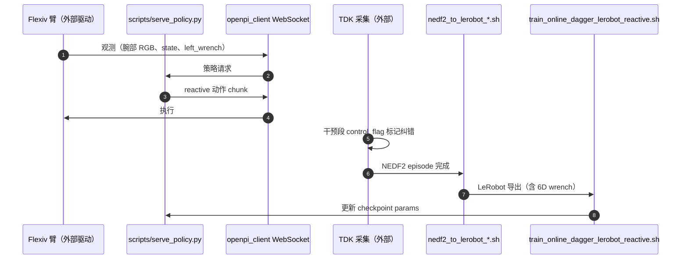

# LIFT（Late Reactive Force · VLA Post-Training · arXiv:2607.14236）

> **名称消歧：** 本页 **LIFT** = *L**ate Reactive **I**njection of **F**orce for VLA Post-**T**raining*（[lift-policy.github.io](https://lift-policy.github.io/)）。库内 [LIFT（人形 RL）](./lift-humanoid.md) 为 BIGAI **大规模 SAC 预训练 + 模型微调**（arXiv:2601.21363，`bigai-ai/LIFT-humanoid`），缩写相同、路线无关。

**LIFT**（*Never Too Late for Force: Accelerating VLA Post-Training with Reactive Force Injection*，[arXiv:2607.14236](https://arxiv.org/abs/2607.14236)，**CoRL 2026**，上海交大 / 上海创智学院 / 南科大 / Noematrix 等）在 **π₀.₅** 上做 **力感知后训练**：旁路 graft **reactive action expert**（复制预训练 action 权重），用 **因果 6D 末端力记忆 + 零初始化 cross-attention** 在 **action chunk 内** 刷新输出，且 **训练前与原 VLA 输出等价**；配合 **online DAgger**（**1:1** offline vision 对齐 : online 力启用人工纠错）缓解 **策略依赖的力分布偏移**。

## 一句话定义

**预训练 VLA 不必重训力模态——late reactive expert + 零初始化力路径保留初始策略，online DAgger 把真机接触纠错灌回 chunk 内可刷新的力记忆。**

## 英文缩写速查

| 缩写 | 英文全称 | 简要说明 |
|------|----------|----------|
| LIFT | Late Reactive Injection of Force for VLA Post-Training | 本文框架 |
| VLA | Vision-Language-Action | 基座 **π₀.₅**（OpenPI / flow matching） |
| DAgger | Dataset Aggregation | **在线** 收集当前策略访问态上的人工纠错 |
| EE | End-Effector | **6D** 腕部力/力矩（Flexiv 实测） |
| TDK | （Flexiv 遥操作/干预采集栈） | 力启用 **human correction** 录制（仓外） |
| FM | Flow Matching | 对 **base + reactive** 双流联合监督 |
| OOD | Out-of-Distribution | 力反馈随 **当前策略** 诱导状态剧烈偏移 |

## 为什么重要

- **「Never too late for force」：** 力难进 **预训练规模**（硬件异构、采集贵）；**后训练** 在已有 VLM 先验上补 **接触反应性** 更现实。
- **chunk 内反应 vs 开环 chunk：** 视觉前缀 **缓存一次**；力更新触发 reactive 流 **重解码**，不必整段 VLM 前向——对齐 **接触动力学快于视觉推理** 的 mismatch（cf. RDP / ImplicitRDP 线）。
- **初始化等价（O2）：** shifted causal attention + **零初始化** 力 cross-attn 输出 → 力路径训练前 **残差为 0**，避免一加入力就 **冲掉 π₀.₅ 泛化**。
- **力 OOD 与 online 环：** 离线力数据难覆盖 **策略自己走进的接触态**；**反复 deploy–correct–train** 优于 **固定 offline 力 buffer**（项目页：book insertion **零分**）。
- **与同库对照：** [ForceVLA](./paper-forcevla.md) 在 **π₀ 预训练/微调期** 做 FVLMoE；LIFT 专 **late post-training + reactive execution**。[TACO](./paper-taco-tactile-wm-vla-posttrain.md) 用触觉 WM **合成** 纠错数据；LIFT **直接学 full action** 于 mixed offline/online。

## 核心信息

| 项 | 内容 |
|----|------|
| 机构 | SJTU；Shanghai Innovation Institute；SUSTech；致远学院；Noematrix |
| 硬件 | Flexiv Rizon 4S + **6D EE force**；手持 **vision-only** 示范 + Flexiv **TDK** 在线纠错 |
| 基座 | **π₀.₅**（预训练 VLA，vision-driven） |
| 开源（2026-09-27） | **部分开源** — [`y-wng/lift`](https://github.com/y-wng/lift) 含 OpenPI 训练/online launcher/`serve_policy`；**无** 真机驱动、TDK、NEDF2 SDK |

## 核心结构与方法

| 模块 | 要点 |
|------|------|
| **Reactive expert（O1）** | 复制原 action expert；**因果力记忆**编码最近 6D 力；**零初始化 cross-attn** 注入 reactive 流 |
| **Runtime** | VLM 前缀 **缓存**；chunk 内每次刷新 **重编码 latency-aligned 力历史** → reactive 输出 **全动作** |
| **Prior preserve（O2）** | **Shifted causal attention**：reactive token 见 VLM 前缀 + 后续 base token + 因果 reactive 前缀 → init 等价原 MOT action token |
| **Heterogeneous train（O3）** | Vision-only batch **mask 力**；online batch 启用实测力；**additive FM** 监督 **base + reactive**（推理仍只送 reactive 动作） |
| **Two-stage + DAgger** | Stage1  handheld **mask force** 任务对齐；Stage2 **1:1** offline:online，Flexiv 上 **on-policy 纠错** |

### 后训练与 online DAgger 闭环

## 源码运行时序图

官方仓 **部分开源**；下图对齐 [`sources/repos/y-wng-lift.md`](../../sources/repos/y-wng-lift.md) README **online 环**（真机 IO 在仓外）。

## 实验要点

| 轴 | 报告口径（以论文/项目页为准） |
|----|-------------------------------|
| **任务** | 毛巾折叠（分级分）、书本插入、汉诺塔环放置 |
| **Q1 力是否加速/提升** | 相对 **π₀.₅ + online DAgger（无力）** 学习更快、**峰值与最终** 更高 |
| **Q2 反应性** | **Reactive 力历史** 在书/汉诺塔关键；毛巾 **单帧力** 也可接近 full LIFT |
| **Q3 泛化** | 最终 ckpt 在对象/桌布/光照 shift 下 **未见明显 in-dist 退化** |
| **Q4 online 数据** | **Offline DAgger 固定 buffer** 全任务差，book **0 分** |
| **Q5 residual** | 轻量 residual 在测试协议下 **显著低于 LIFT** |
| **Q6 offline 比例** | 毛巾 **online-only 0:1** 远差于 **1:1**；主实验 **1:1** |
| **评测** | 每 checkpoint **n=30**（3×10）自主 rollout，95% CI |

## 结论

**LIFT 证明「力可以晚到」：在不动预训练 VLA 主体的前提下，用初始化等价的 reactive 专家把 6D 接触反馈接进 chunk 内控制，再用 online DAgger 对准策略自己诱导的力分布。**

- **架构上** 三件事缺一不可：**复制 action 权重 + shifted causal attention** 保住 π₀.₅ 初始行为；**因果力记忆 + 零初始化 cross-attn** 才能在 chunk 内刷新而不破坏先验；缺 reactive 历史时书/汉诺塔会退回 **单帧力** 的相位/冲击混淆。
- **数据上** 固定 offline 力纠错 **不能** 替代 on-policy 聚合——offline-only 在 book 上 **归零**，说明 force OOD 必须跟着 **当前策略访问态** 走。
- **对比上** vision-only online DAgger 是强基线但仍 **接触盲**；residual 在弱 base + 稀疏干预下难学 **何时** 大改动作，full-action LIFT 从示范与纠错 **端到端** 学更稳。
- **工程上** 官方 [`y-wng/lift`](https://github.com/y-wng/lift) 给训练/推理 launcher，**Flexiv 驱动、TDK、NEDF2 SDK** 仍外部——复现预算主要在 **真机 + 人工纠错吞吐**（论文亦列为局限）。
- **选型读法：** 已有 π₀.₅ 类 VLA、平台带 **6D 腕力**、任务过 **插入/折叠/卡滞** 等接触相位 → 优先评估 LIFT 相对 **加力但不 reactive** 与 **纯视觉 DAgger** 的曲线；预训练期就要力模态则看 [ForceVLA](./paper-forcevla.md) / TA-VLA 线。

## 与其他工作对比

| 工作 | 关系 |
|------|------|
| **[ForceVLA](./paper-forcevla.md)** | **预训练/微调期** FVLMoE 力路由；LIFT **late post-train + reactive chunk** |
| **[TACO](./paper-taco-tactile-wm-vla-posttrain.md)** | WM **合成** 纠错段；LIFT **真机 DAgger + full action** |
| **π₀.₅ + online DAgger** | 同环 **无力**；LIFT 主对比基线 |
| **ImplicitRDP / RDP** | slow-fast **反应式** 力；LIFT 目标是把 **非 reactive MOT VLA** 变成 reactive |
| **CR-DAgger / residual** | compliant residual；LIFT **full policy** + 自定义 residual 基线更低 |
| **[LIFT 人形 RL](./lift-humanoid.md)** | 同名不同题：JAX SAC + 世界模型 **locomotion** |

## 常见误区或局限

- **误区：** 认为任意时刻加 6D 力即可；**无 reactive 历史** 在 **同负载不同相位**（书插入）会误判。
- **误区：** offline 力纠错库够大即可；**策略偏移** 下 **online DAgger** 必要。
- **局限：** **人工纠错** 限制规模；当前 **单 Flexiv 臂**；TDK/驱动 **未随仓发布**；长程多任务泛化未充分展开。

## 与其他页面的关系

- [VLA](../methods/vla.md) — π₀.₅ 族与 **部署经验后训练** 索引
- [contact-rich-manipulation](../concepts/contact-rich-manipulation.md) — 接触丰富操作概念层
- [manipulation](../tasks/manipulation.md) — 操作任务上下文
- [RoboDrop](./paper-robodrop-vla-post-training.md) — 另一类 **后训练数据** 策展（梯度兼容性）

## 推荐继续阅读

- [LIFT 论文（arXiv:2607.14236）](https://arxiv.org/abs/2607.14236)
- [LIFT 项目页](https://lift-policy.github.io/)
- [官方代码（y-wng/lift）](https://github.com/y-wng/lift)
- [ForceVLA 实体页](./paper-forcevla.md)

## 参考来源

- [LIFT 论文归档（arXiv:2607.14236）](../../sources/papers/lift_reactive_force_vla_arxiv_2607_14236.md)
- [LIFT 项目页归档](../../sources/sites/lift-policy-github-io.md)
- [y-wng/lift 仓库归档](../../sources/repos/y-wng-lift.md)
