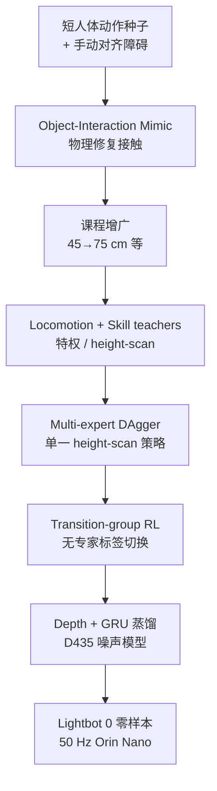

# Light-Loco-Parkour（LightLP）

**Light-Loco-Parkour**（*Versatile Perceptive Whole-Body Locomotion via Multi-Skill Distillation*，亦称 **LightParkour** / **LightLP**；[项目页](https://light-loco-parkour.github.io/)，[PDF](https://light-loco-parkour.github.io/paper.pdf)；**Light Origins**，项目页日期 **2026-08-03**）在自研人形 **Lightbot 0** 上，把稀疏人体动作种子经 **Real2Sim2Real** 扩成地形条件全身技能，再蒸馏为**单一机载深度策略**：只读深度与速度指令，自主在行走 / 攀爬 / vault 间切换。

> **落地状态：** 入库时 **无 arXiv、无公开代码**；以项目页 PDF 为准。

## 一句话定义

**用「物理修复 + 课程增广」把短种子变成可执行接触族，再用多专家蒸馏与转移组 RL 压成一个无技能标签的深度策略，让人形在感知 locomotion 与承重全身跑酷之间无缝切换。**

## 英文缩写速查

| 缩写 | 英文全称 | 简要说明 |
|------|----------|----------|
| LightLP | Light-Loco-Parkour | 本文系统 / 策略总称 |
| R2S2R | Real-to-Sim-to-Real | 真种子 → 仿真修复/扩张 → 真机部署 |
| DAgger | Dataset Aggregation | 多专家蒸馏主监督；配合 PPO |
| GRU | Gated Recurrent Unit | 深度学生短时记忆，缓解遮挡与缺速度 |
| PHP | Perceptive Humanoid Parkour | 主要人形跑酷对照（需参考/技能指令） |
| QDD | Quasi-Direct Drive | Lightbot 0 关节驱动形态 |
| AMP | Adversarial Motion Prior | 转移阶段风格/先验切换用 |

## 为什么重要

- **补上「感知 loco ↔ 全身接触」缺口：** 纯跟踪富表达但绑场景；纯 reward locomotion 又偏腿主导。LightLP 用同一策略两者兼顾。
- **数据配方可复用：** 不靠大体量动作库，而靠**单技能短种子 + 仿真抬障课程**（climb 45→75 cm ≈ 0.83H）。
- **部署约束干净：** 无 one-hot 技能、无运行时 motion generator；对比 [PHP](./paper-hrl-stack-22-perceptive_humanoid_parkour.md) / MGMT 的指令与双网推理负担。
- **边缘算力诚实：** Jetson Orin Nano（~67 INT8 TOPS）上 50 Hz，强调「不必再挂专用算力盒」。

## 核心信息

| 项 | 内容 |
|----|------|
| **机构** | 光原点（Light Origins） |
| **平台** | Lightbot 0：90 cm / 18.9 kg / 21 DoF；腰下肢 45 N·m、臂 15 N·m QDD；D435 + 骨盆 IMU；Orin Nano |
| **仿真** | IsaacLab |
| **输入（部署）** | 机载深度 + 本体 + \((v_x,v_y,\omega_z)\) |
| **开源** | **未开源**（仅项目页/PDF/视频；无训练仓） |
| **arXiv** | 暂无 |

## 核心原理

### 方法栈

| 模块 | 作用 |
|------|------|
| Object-Interaction Mimic | 重定向种子 + 物理修复穿透/浮动；训特权 skill teacher |
| Reference augmentation | 成功 rollout 抬障 5–10 cm 再训 → 地形配对参考族 |
| Perceptive locomotion teacher | 速度跟踪 + 稀疏落足（illegal-footstep 等） |
| Multi-expert DAgger | 合成单一 height-scan 学生（无技能标签） |
| Transition-group RL | 稀疏奖励学 loco↔技能切换；去该组可掉到 0% |
| Depth distillation | GRU 学生 + 扫描重建辅助 + D435 噪声模型 + FT |

### 流程总览

### 与 PHP / MGMT 的设计差

| 维度 | LightLP | PHP / 典型 MGMT |
|------|---------|-----------------|
| 技能选择 | 深度 + 速度指令，**无** one-hot | 常依赖技能指令或被障碍「磁吸」 |
| 参考 | 部署期**无**参考 / motion graph | 离线合成或运行时生成器 |
| 算力 | 单策略边缘盒 | MGMT 类常需额外算力单元 |
| 数据 | 稀疏种子 + 仿真扩张 | 更依赖原子技能库 / matching |

## 源码运行时序图

**不适用**（截至 2026-08-04：项目页未列 GitHub 训练/推理入口，组织仓仅为 github.io 站点）。待代码发布后按 README 补 `sequenceDiagram`。

## 工程实践

| 项 | 建议 |
|----|------|
| 复现入口 | 项目页 PDF / 视频；**代码未发布** |
| 种子采集 | 每技能一条短 clip + 障碍对齐（人工仍是扩展瓶颈） |
| 课程 | 成功即抬障；只手工对齐初始对，其余靠物理 |
| Teacher 设计 | actor 观测对齐学生可推断量，避免「过知情教师」 |
| 深度域 | 必须标定噪声/延迟；蒸馏后务必 **RL fine-tune**（踏石 w/o FT 34.6%→Ours 99.9%） |
| 记忆 | 无 GRU 时踏石/高攀可塌到 0；遮挡场景优先循环学生 |
| 转移 | 务必保留 transition group；仅拼 loco+skills 不够 |
| 源码运行时序图 | **不适用**（未开源） |

## 实验与评测

### 仿真（Table V，节选；500 trials/格）

| 任务 | Ours | w/o FT | w/o GRU | Teacher | PHP |
|------|------|--------|---------|---------|-----|
| climb 60 cm (0.66H) | 99.2 | 88.4 | 54.0 | 99.9 | 99.9 |
| climb 75 cm (0.83H) | 33.4 | 17.0 | 0.0 | 98.6 | ✗ |
| reverse-vault 50 cm | 96.8 | 72.8 | 25.4 | 99.4 | ✗ |
| speed-vault 50 cm | 93.4 | 61.8 | 23.2 | 99.6 | ✗ |
| Stepping stones | 99.9 | 34.6 | 0 | 99.9 | / |
| Stairs (high) | 83.4 | 80.8 | 12.4 | 83.0 | / |

未见鞍马形障碍（Table VI）：reverse / speed-vault **93.4% / 95.3%**。转移组（Table VII）：有 **98%** vs 无（plane）**0%**。

### 真机

室内外零样本：reverse/speed-vault、climb-and-step（含未见鞍马）、木板桥、踏石、高台、室外路缘楼梯；策略自主切换，无外部技能提示。

## 结论

**一句话总判：人形感知跑酷的关键不只是「会某个 vault」，而是把稀疏接触意图扩成地形族，并用转移学习接到可部署深度策略——标签与运行时运动图都可以拿掉。**

1. **种子扩张 > 堆库** — 45→75 cm 课程把单参考变成操作包络。
2. **深度蒸馏必须 FT** — 换 RealSense 域后，踏石等任务靠最后 1k RL 救回。
3. **记忆不可省** — 无 GRU 在稀疏落足与高障碍上崩盘。
4. **转移要单独训** — 只蒸馏技能不会自动「走到障碍再爬」。
5. **对照 PHP 时看指令与算力** — LightLP 押「单网 + 速度指令忠实」。
6. **扩展仍卡人工对齐** — 作者自承技能集增速天花板。
7. **代码未开源** — 选型与复现先看视频与表，勿假设可跑仓。

## 与其他工作对比

| 对照 | 差异读法 |
|------|----------|
| [PHP](./paper-hrl-stack-22-perceptive_humanoid_parkour.md) | PHP 用 motion matching 长程参考 + 技能指令；LightLP 用种子扩张 + 无标签转移，攀爬高度包络更激进（至 0.83H） |
| [Humanoid Parkour Learning](./paper-notebook-humanoid-parkour-learning.md) | 更偏跟踪/课程跑酷；LightLP 强调感知端到端与边缘单策略 |
| [Deep Whole-Body Parkour](./paper-deep-whole-body-parkour.md) | 全身跑酷数据/策略族对照 |
| [HIL](../methods/hil-hybrid-imitation-learning.md) | 论文消融指出纯稀疏奖励（HIL 式无专家蒸馏）学暴力接触难收敛 |
| [Robot Parkour Learning / Extreme Parkour](./paper-robot-parkour-learning.md) | 四足端到端深度跑酷前驱；本稿迁到人形全身接触 |
| [ParkourFormer](./paper-parkourformer.md) | G1 上 query 历史 + 未来两步 AMP 监督，无种子扩张/转移组；平台与数据配方不同 |

## 局限与风险

- **未开源 / 无 arXiv：** 数字以项目页 PDF 为准；无法本地复现训练。
- **人工种子对齐：** 扩展技能仍线性吃人力。
- **障碍密集/重叠：** 转移在稀疏奖励下尚未完全解决。
- **相机固定胸前：** 技能中段遮挡会丢感知；作者指向主动感知/场景记忆。
- **平台绑定：** 结果在 90 cm Lightbot 0；迁到 G1 等需重做动力学与力矩档。

## 关联页面

- [Perceptive Humanoid Parkour（PHP）](./paper-hrl-stack-22-perceptive_humanoid_parkour.md) — 主对照人形感知跑酷
- [Humanoid Parkour Learning](./paper-notebook-humanoid-parkour-learning.md) — 人形跑酷笔记锚点
- [Deep Whole-Body Parkour](./paper-deep-whole-body-parkour.md) — 全身跑酷对照
- [Robot Parkour Learning](./paper-robot-parkour-learning.md) — 四足跑酷前驱
- [Humanoid Locomotion](../tasks/humanoid-locomotion.md) — 人形运动任务
- [Locomotion](../tasks/locomotion.md) — 腿式任务中心
- [楼梯/障碍感知 locomotion](../tasks/stair-obstacle-perceptive-locomotion.md) — 感知穿越任务
- [DAgger](../methods/dagger.md) — 多专家蒸馏骨架
- [HIL](../methods/hil-hybrid-imitation-learning.md) — 视频跑酷模仿对照
- [HIL vs MTRG vs ZEST](../comparisons/hil-vs-mtrg-vs-zest-parkour-imitation.md) — 跑酷模仿选型
- [ParkourFormer](./paper-parkourformer.md) — G1 未来监督 Transformer 跑酷对照

## 参考来源

- [Light-Loco-Parkour 论文归档](../../sources/papers/light_loco_parkour_light_origins_2026.md)
- [light-loco-parkour.github.io 项目页归档](../../sources/sites/light-loco-parkour-github-io.md)
- [项目页 PDF](https://light-loco-parkour.github.io/paper.pdf)

## 推荐继续阅读

- [官方项目页](https://light-loco-parkour.github.io/)
- [演示视频（YouTube）](https://youtu.be/96Rfm7OmHjY)
- [PHP 项目页](https://php-parkour.github.io/) — 人形感知跑酷对照
