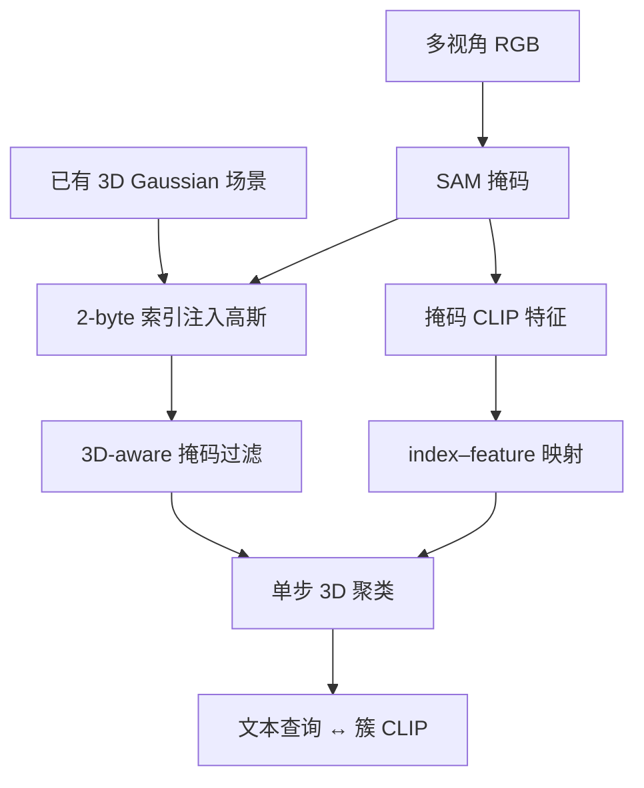

# LightSplat

**LightSplat**（*Fast and Memory-Efficient Open-Vocabulary 3D Scene Understanding in Five Seconds*，[arXiv:2603.24146](https://arxiv.org/abs/2603.24146)，[项目页](https://vision3d-lab.github.io/lightsplat/)，[GitHub](https://github.com/vision3d-lab/lightsplat)）由 **蔚山国立科学技术院（UNIST）** 与 **浦项工科大学（POSTECH）** 提出：在已有 3D Gaussian 场景上，用多视角 **SAM + CLIP** 构建 2D 语义库存，以 **2-byte 语义索引** 替代逐高斯稠密语言特征，经 3D 掩码过滤与单步聚类得到 **对象级簇语义**，实现秒级、低内存的开放词汇 3D 分割与文本驱动对象选择。

## 一句话定义

**开放词汇 3D 语义不必给每个高斯挂 CLIP 向量：只存 2-byte 掩码索引、在簇上比对语言特征，就能在约五秒内完成特征注入并保持 SOTA 级分割。**

## 英文缩写速查

| 缩写 | 英文全称 | 简要说明 |
|------|----------|----------|
| OVS | Open-Vocabulary Segmentation / Selection | 开放词汇 3D 分割或文本选对象 |
| 3DGS | 3D Gaussian Splatting | 场景几何与渲染的 3D 高斯表示 |
| SAM | Segment Anything Model | 多视角 2D 掩码来源 |
| CLIP | Contrastive Language–Image Pretraining | 掩码裁剪与文本查询的语义特征 |
| FD | Feature Distillation | 把 2D 语义注入 3D 表示的阶段（本文 ~5 s） |
| LERF-OVS | LERF Open-Vocabulary Selection | 开放词汇 3D 对象选择基准之一 |
| DL3DV-OVS | DL3DV Open-Vocabulary Selection | 大尺度室内外场景 OVS 基准 |

## 为什么重要

- **对准感知栈第③层瓶颈：** 多数 3DGS 开放词汇路线把 FD 做成 **迭代优化 + 逐高斯特征**，分钟到小时级且占显存；LightSplat 把语义压到 **索引 + 簇映射**，适合「先有好几何、再要快语义」的离线管线（见 [感知栈选型闭环](../queries/robot-perception-stack-selection-loop.md)）。
- **与 [2D→3D 语义提升 Gap](../concepts/2d-to-3d-semantic-lifting-gap.md) 相关：** 通过 3D 掩码过滤与几何–语义联合聚类，减轻 2D 渲染 CLIP 模糊带来的 3D 漂移；但仍是 **簇级** 语义，不等同于零件层级（对照 [LEGO](./paper-lego-leveled-language-gaussian-splatting.md)）。
- **机器人读法：** 语言驱动 3D 对象定位/分割是导航与操作的中间表示；若 FD 从 40–100 min 降到 **~5 s**，多场景批处理与迭代标注成本显著下降（仍非机载在线 SLAM）。

## 核心信息

| 字段 | 内容 |
|------|------|
| 作者 | Jaehun Bang, Jinhyeok Kim, Minji Kim, Seungheon Jeong, Kyungdon Joo |
| 机构 | UNIST（AIGS）；POSTECH（GSAI） |
| 出处 | CVPR 2026；arXiv:2603.24146 |
| 栈 | 3D Gaussian 场景 + SAM 掩码 + CLIP；training-free 索引注入与单步 3D 聚类 |
| 开源（截至 2026-09-27） | **待发布**：[`vision3d-lab/lightsplat`](https://github.com/vision3d-lab/lightsplat) README 为「Code will be released soon」；维护者称 2026 年 6–7 月发码 |

## 方法与核心结构

| 模块 | 作用 |
|------|------|
| **多视角 SAM + CLIP** | 构建 2D 掩码及其 CLIP 特征库 |
| **Indexed feature injection** | 高斯只存 **2-byte 掩码索引**，非完整语言向量 |
| **3D-aware mask filtering** | 按 3D 支撑剔除不可靠掩码 |
| **Index–feature mapping** | 轻量表把索引映射到 CLIP 特征 |
| **Context-aware 3D clustering** | 几何重叠 + 语义相似，单步对象级簇 |
| **簇级推理** | 文本与 **簇特征** 匹配，避免逐高斯/query 全场景扫描 |

### 流程总览

## 源码运行时序图

**不适用**（截至 2026-09-27：官方仓 [`vision3d-lab/lightsplat`](https://github.com/vision3d-lab/lightsplat) 无训练/推理脚本；维护者在 [issue #1](https://github.com/vision3d-lab/lightsplat/issues/1) 称代码将于 2026 年 6–7 月发布。见 [`sources/repos/lightsplat.md`](../../sources/repos/lightsplat.md)。）

## 工程实践

| 项 | 建议 / 论文与项目页口径 |
|----|-------------------------|
| **何时用** | 已有 3DGS 重建、要 **快速** 开放词汇 3D 分割/OVS；能接受 **对象级簇** 语义 |
| **何时不用** | 需要零件层级 / LLM 复合查询图（→ [LEGO](./paper-lego-leveled-language-gaussian-splatting.md)）；机载在线建图（→ [FindAnything](./findanything.md) / [OV-SAM3D](./ov-sam3d.md)） |
| **前置** | 多视角图像 + 已优化 3D 高斯；SAM、CLIP 推理成本仍计入总管线 |
| **内存** | 报告 **2 B/Gaussian** 语义存储 vs LUDVIG **2048 B**、Dr.Splat **128 B** |
| **开源** | **待发布** — 复现前以项目页 Code 区与 GitHub README 为准 |

## 实验与评测

项目页与 CVPR 摘要报告（2026-09-27 核查）：

| 基准 | 指标读法 | LightSplat（论文/页） | FD Time |
|------|----------|----------------------|---------|
| LERF-OVS | Mean mIoU / mAcc@0.25 | **47.58** / **68.32** | **4.2 s** |
| DL3DV-OVS | Mean mIoU / mAcc@0.25 | **44.98** / **60.82** | **4.8 s** |
| ScanNet 19-cl | mIoU / mAcc | **37.11** / **58.66** | **4.1 s** |
| ScanNet 10-cl | mIoU / mAcc | **47.78** / **68.21** | 同上 |
| 相对 LangSplat | 速度 / 内存 | 约 **50–400×** FD 加速、**64×** 更低内存（页内对比图） | — |

**消融（LERF-OVS）：** 去 3D 过滤 mIoU **29.31**；去 semantic-aware **19.56**；去 geometry-aware **2.01** — 三模块对精度均关键，FD 仍 ~4.4 s。

## 结论

**LightSplat 把开放词汇 3D 理解的代价从「逐高斯优化语言场」改成「索引 + 簇级 CLIP」，用 ~5 s FD 和 2 B/高斯换 SOTA 级分割，适合批量离线语义标注；代码待发布前只能跟论文与项目页指标选型。**

1. **真影响指标：** 去掉迭代 CLIP 优化与稠密高斯特征 → FD **秒级**、内存 **64×** 量级下降（相对 LUDVIG 等）。
2. **真影响精度：** 3D 掩码过滤 + 几何/语义聚类 → LERF/DL3DV/ScanNet 上 mIoU/mAcc 优于 Dr.Splat、OpenGaussian 等（见上表）。
3. **次要代价：** 语义在 **簇** 上，细粒度零件与复合语言图不如层级 3DGS（LEGO）。
4. **部署读法：** training-free ≠ 无 SAM/CLIP；仍依赖多视角与已有 3DGS，不是 SLAM 替代品。
5. **复现读法：** 截至入库日 **待发布**；勿把 PDF/页脚「开源」当成可跑仓库。

## 与其他工作对比

| 对照 | 差异读法 |
|------|----------|
| LangSplat / OpenGaussian / Dr.Splat | 迭代或稠密高斯语言特征；LightSplat **索引 + 簇**，FD 分钟 → 秒 |
| LUDVIG | 亦强调效率；LightSplat 报告更高 DL3DV mIoU 与 **2 B** 存储 |
| [LEGO](./paper-lego-leveled-language-gaussian-splatting.md) | 按场景 **训练** 层级 3DGS + 场景图；LightSplat **无特征优化**、更快但簇级语义 |
| [OV-SAM3D](./ov-sam3d.md) | 点云开放词汇、训练无关另一路线；LightSplat 绑 3DGS 辐射场 |
| [FindAnything](./findanything.md) | 机载对象级开放词汇子地图；LightSplat 离线、绑固定重建 |

## 局限与风险

- 动态场景、透明/强反光未充分展开。
- 依赖 SAM/CLIP 质量与 3DGS 几何；重建差则索引与聚类连锁失败。
- **代码待发布**，超参与工程细节以未来官方实现为准。
- 簇级语义可能不够支撑精细操作（把手、按钮级）。

## 关联页面

- [2D→3D 语义提升 Gap](../concepts/2d-to-3d-semantic-lifting-gap.md)
- [机器人视觉感知栈选型闭环](../queries/robot-perception-stack-selection-loop.md)
- [Segment Anything](./paper-segment-anything.md)
- [LEGO：层级语言高斯溅射](./paper-lego-leveled-language-gaussian-splatting.md)
- [OV-SAM3D](./ov-sam3d.md)
- [FindAnything](./findanything.md)

## 参考来源

- [lightsplat_cvpr_2026_arxiv_2603_24146.md](../../sources/papers/lightsplat_cvpr_2026_arxiv_2603_24146.md)
- [项目页归档](../../sources/sites/lightsplat.md)
- [GitHub 归档](../../sources/repos/lightsplat.md)
- Bang et al. — <https://arxiv.org/abs/2603.24146>
- 项目页 — <https://vision3d-lab.github.io/lightsplat/>

## 推荐继续阅读

- CVPR 2026 Open Access — <https://openaccess.thecvf.com/content/CVPR2026/html/Bang_LightSplat_Fast_and_Memory-Efficient_Open-Vocabulary_3D_Scene_Understanding_in_Five_CVPR_2026_paper.html>
- LangSplat — <https://arxiv.org/abs/2312.16084>
- [LEGO 项目页](https://pz0826.github.io/LEGO-Webpage/) — 层级开放词汇 3DGS 对照
