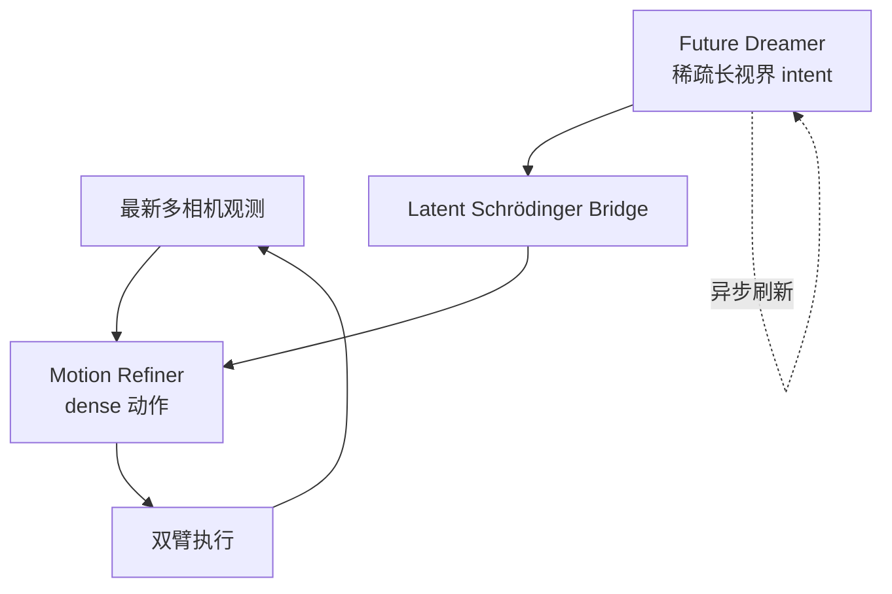
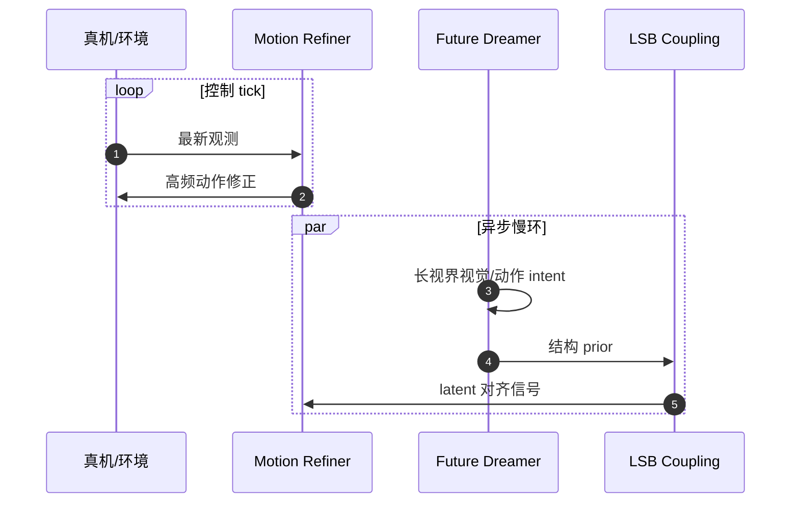

# LiMA（异步扩散 WAM 灵巧操作）

**LiMA: Bridging Long-term Imagination to Real-time Dexterous Manipulation via Asynchronous Diffusion**（Ning Chen、Yankai Fu 等；**北京大学** × **北京智源人工智能研究院（BAAI）**；**CoRL 2026**，[arXiv:2609.28431](https://arxiv.org/abs/2609.28431)，[项目页](https://ccdcs.github.io/LiMA_repo/)）用 **慢–快双系统** 解耦 **长视界想象** 与 **接触级反应**：Dreamer 周期性刷新视觉/动作意图，Refiner 在最新观测上 **dense 修正**，并通过 **Latent Schrödinger Bridge** 把稀疏 intent 对齐到可执行轨迹。

## 一句话定义

**长视界 WAM 不必阻塞控制环：慢扩散 Dreamer 定意图，快 Refiner 跟接触改动作，Schrödinger Bridge 在 latent 里做概率运输而不是每次从白噪声重采样。**

## 英文缩写速查

| 缩写 | 英文全称 | 简要说明 |
|------|----------|----------|
| WAM | World Action Model | 联合建模世界动态与动作 |
| VLA | Vision-Language-Action | LiMA 对比的语义强、物理细粒度弱的一类基线 |
| PSR | Partial Subtask Success Rate | 项目页分任务子步骤成功率 |
| SR | Success Rate | 20 trials/任务 的整体成功 |
| LSB | Latent Schrödinger Bridge | 熵正则 latent 运输，耦合 Dreamer 与 Refiner |

## 为什么重要

- **WAM 延迟是接触任务瓶颈：** Cosmos-Policy 类迭代生成在 **600 ms** 级（H100），接触变化时 intent 过期。
- **VLA 与 WAM 互补叙事：** VLA 擅 high-level；LiMA 显式补 **物理动态 + 空间细粒度** 与 **实时环**。
- **双臂长时任务：** Stack cup、做饭、咖啡等 **多子步骤** — 需要 **长 horizon intent + 短 horizon correction**。

## 核心信息

| 项 | 内容 |
|----|------|
| **机构** | 北京大学（PKU）；BAAI |
| **评测** | 6 真机双臂任务 × 20 trials；未见场景泛化（摘要） |
| **汇总** | Overall SR **70.8%**；平均 subtask SR **78.5%** |
| **延迟** | **325 ms**（H100）；较 Cosmos-Policy **−45.8%** |
| **开源** | **待发布**（2026-09-25 项目页无 GitHub） |

## 核心原理

### 异步双系统

| 系统 | 频率角色 | 功能 |
|------|----------|------|
| **Future Dreamer** | 慢 | 稀疏刷新 **长 horizon** 视觉 + 动作 intent |
| **Motion Refiner** | 快 | 从 **最新观测** 输出高频 fine-grained 动作修正 |

### Latent Schrödinger Bridge Coupling

- 将 refinement 表述为 **熵正则最优传输**：Dreamer 结构 intent 作 **prior**，而非 Refiner 每次从 **无结构高斯** 去噪。

### Spatiotemporal Adaptive Modulation

- **View-aligned** 融合想象未来与 live 相机；
- 当前机器人状态 **ground** 局部 motion correction。

## 流程总览

## 源码运行时序图

**不适用** — 官方代码 **待发布**。逻辑运行时序如下（设计层）：

## 实验与评测（项目页表）

| Method | Latency (H100) | 相对 LiMA |
|--------|----------------|-----------|
| GR00T N1.6 | 270 ms | SR 略低或相近分任务 |
| Cosmos-Policy | 600 ms | SR 多数任务低于 LiMA |
| **LiMA** | **325 ms** | **70.8%** overall SR |

任务含 Stack Cup、Roll T-shirt、Cook Rice、Make Sandwich、Make Coffee、Assemble Package。

## 结论

**LiMA 把「世界模型想象」从控制环里拆成异步慢意图 + 同步快修正，是用系统结构换 WAM 延迟与接触鲁棒性的可复现模板。**

1. **别用单速率 WAM 做长时双臂** — 接触变化会打穿单次迭代 intent。
2. **Schrödinger Bridge 是耦合关键** — 稀疏 intent 需要 **运输式** 对齐而非硬拼接。
3. **延迟数字要看 GPU** — 325 ms @ H100；真机环还要加 I/O 与整机关节控制。
4. **VLA 仍可能是语义入口** — LiMA 定位在 **WAM 执行/refine 层**，非替代全部 VLA。
5. **代码待发布** — baseline 表复现前无法本地核对。
6. **未见场景泛化** — 摘要声称保持性能；细节以 PDF 为准。

## 与其他工作对比

| 维度 | LiMA | [Ctrl-World](./paper-ctrl-world.md) |
|------|------|-------------------------------------|
| 目标 | **真机双臂 dexterous + 低延迟** | 多视角 **policy-in-the-loop** 视频 WM |
| 时间结构 | **显式 async 双系统** | 同步想象 rollout |
| 耦合 | LSB + 时空调制 | 帧级动作 + 记忆检索 |

## 关联页面

- [World Action Models](../concepts/world-action-models.md)
- [Bimanual Manipulation](../tasks/bimanual-manipulation.md)
- [VLA](../methods/vla.md)
- [Generative World Models](../methods/generative-world-models.md)

## 参考来源

- [`lima_arxiv_2609_28431.md`](../../sources/papers/lima_arxiv_2609_28431.md)
- [`lima-ccdcs-github-io.md`](../../sources/sites/lima-ccdcs-github-io.md)
- Chen et al., *LiMA: Bridging Long-term Imagination to Real-time Dexterous Manipulation via Asynchronous Diffusion*, CoRL 2026, arXiv:2609.28431

## 推荐继续阅读

- [项目页](https://ccdcs.github.io/LiMA_repo/)
- [arXiv:2609.28431](https://arxiv.org/abs/2609.28431)
