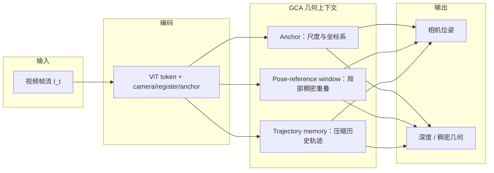
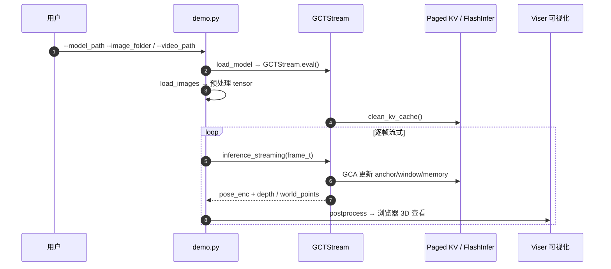

# LingBot-Map：流式 3D 重建几何上下文 Transformer

**LingBot-Map**（*LingBot-Map: Geometric Context Transformer for Streaming 3D Reconstruction*，arXiv:[2604.14141](https://arxiv.org/abs/2604.14141)，[项目页](https://technology.robbyant.com/lingbot-map)，[代码](https://github.com/Robbyant/lingbot-map)，[HF 权重](https://huggingface.co/robbyant/lingbot-map)）由 **蚂蚁灵波（Robbyant）** 提出：面向**连续视频流**的前馈 **3D 基础模型**，用 **Geometric Context Attention（GCA）** 在单一流式框架内同时维护坐标接地、稠密几何线索与长程漂移校正，配合 **Paged KV Cache** 实现万帧级近似常数每帧推理。

## 一句话定义

**用可学习的三类几何上下文（锚点 / 局部位姿参考窗 / 轨迹记忆）替代传统 SLAM 手工后端，在单目视频流上以前馈 Transformer 实时输出相机位姿与稠密几何。**

## 英文缩写速查

| 缩写 | 英文全称 | 简要说明 |
|------|----------|----------|
| GCT | Geometric Context Transformer | 本文骨干架构总称 |
| GCA | Geometric Context Attention | 三类几何上下文的注意力机制 |
| SLAM | Simultaneous Localization and Mapping | 同步定位与建图；本文设计受其原则启发 |
| KV | Key-Value Cache | 流式推理中的注意力缓存 |
| BA | Bundle Adjustment | 经典全局重投影优化；本文不走迭代 BA |
| FPS | Frames Per Second | 官方报告 ~20 FPS（518×378） |

## 核心信息

| 字段 | 内容 |
|------|------|
| **机构** | 蚂蚁灵波科技（Robbyant / Ant Group） |
| **arXiv** | [2604.14141](https://arxiv.org/abs/2604.14141)（v3，2026-09-08） |
| **venue** | **ECCV 2026 oral**（README 标注） |
| **骨干** | DINOv2 系 ViT + 与 VGGT 系一致的 Frame / Cross-frame 交替块 |
| **输出** | 相机位姿 + 深度 / 稠密点图 |
| **实时指标** | ~**20 FPS**（518×378）；**>10,000 帧** 稳定流式推理 |
| **开源（截至 2026-09-11）** | **已开源** — 代码 + HF/ModelScope 权重 + `benchmark/` 评测脚本 |
| **许可** | **Apache-2.0** |

## 为什么重要

- **流式几何一等公民：** 把 SLAM 式「参考系 + 局部重叠 + 全局地图」映射为 **anchor / pose-reference window / trajectory memory**，用端到端注意力替代部分手工后端，面向机器人、AR、车端**在线几何状态**。
- **长序列可部署：** **Paged KV（FlashInfer）** 控制每帧上下文增长；README 给出 **keyframe_interval**、**windowed** 模式与 **~320 views** RoPE 训练窗的工程边界——对真机 VIO 融合与 VLA 几何先验有直接参考价值。
- **开源栈完整：** `demo.py`（Viser 交互）、`demo_render/batch_demo.py`（离线长视频渲染）、多基准 `benchmark/` 与 HF 三档 checkpoint（`lingbot-map` / `lingbot-map-long` / `lingbot-map-stage1`）。
- **Robbyant 感知栈一环：** 与 [LingBot-VLA 2.0](./lingbot-vla-v2.md)、[LingBot-World 2.0](./paper-sa-2607-07534-infinite-worlds-with-versatile-interactions-ling.md) 同属 **感知–世界–动作** 产品线；本页负责 **在线 3D 几何** 选型。

## 流程总览

## 核心原理

### 1. Geometric Context Attention（GCA）

- **Anchor context**：前若干帧锚定**尺度与坐标系**（流式下无法依赖离线全局点云归一化）。
- **Pose-reference window**：保留最近 \(k\) 帧**完整 image token**，提供稠密重叠；窗口内施加**相对位姿损失**强化局部轨迹一致。
- **Trajectory memory**：更早帧仅保留 camera / register 等少量 token（约 6 token/帧量级），叠加时序位置编码，用于**长程漂移校正**。

### 2. 训练与推理

- **两阶段训练**：短序列全局注意力预训练几何基础 → 替换为 GCA 并以渐进增加视点数的课程学习流式一致性。
- **Paged KV Cache**：推理侧用 FlashInfer paged 布局降低滑动窗口与轨迹淘汰的缓存重分配；无 FlashInfer 时回退 SDPA（`--use_sdpa`）。

## 源码运行时序图

`demo.py` 的典型 **streaming** 推理路径（`GCTStream.inference_streaming`）：

**复现路径：** `conda` 环境 → `pip install -e .` + `flashinfer-python` → 从 [HF](https://huggingface.co/robbyant/lingbot-map) 下载 `lingbot-map.pt` → `python demo.py --model_path ... --image_folder example/courthouse --mask_sky`。超长序列用 `--keyframe_interval` 或 `--mode windowed`。

## 评测要点

| 基准 / 维度 | 要点 |
|-------------|------|
| **Oxford Spires / KITTI / 7-Scenes / ETH3D / T&T 等** | 论文报告相对既有**流式**与**迭代优化**类方法的优势；仓库 `benchmark/` 已发布评测管线 |
| **实时性** | ~20 FPS @ 518×378；Paged KV 支撑 >10k 帧 |
| **对照** | [Glob3R](./paper-glob3r.md) 在 T&T / KITTI **离线**精度常更高；[VGG-T³](./paper-vgg-ttt.md) 偏**离线千图**批处理；[R³](./paper-r3-relative-regression.md) 用相对位姿回归 + keyframe bank |

## 对比定位

| 对照 | LingBot-Map 差异 |
|------|------------------|
| [Glob3R](./paper-glob3r.md) | Glob3R 偏 **离线 tracks→BA 精炼**；LingBot 偏 **在线流式前馈** |
| [SLAMFormer-∞](./paper-slamformer-infinity.md) | ∞ 保留显式 frontend/backend + PGGO；LingBot 更 **端到端 GCA + Paged KV** |
| [VGG-T³](./paper-vgg-ttt.md) | VGG-T³ **离线** TTT 线性化 VGGT；LingBot 维持 **视频流式 ~20 FPS** |
| [R³](./paper-r3-relative-regression.md) | R³ 用 DA3 + **成对相对位姿**；LingBot 用 **GCA 三类上下文** |
| COLMAP / 经典 SLAM | 传统迭代优化与手工模块；LingBot **前馈 + 学习式状态管理** |

## 工程实践

| 项 | 建议 |
|----|------|
| **权重选型** | 长序列/大场景 → `lingbot-map-long`；论文基准与离线 demo → `lingbot-map`；双向实验 → `lingbot-map-stage1` 载入 VGGT |
| **超长序列** | KV 超过训练 RoPE（~320 views）时用 `--keyframe_interval` 或 `--mode windowed --overlap_keyframes` |
| **依赖** | 推荐 **torch 2.8.0 + cu128**（Kaolin 预编译轮）；交互 demo 需 `[vis]`；批量渲染需 Kaolin + ffmpeg |
| **加速** | `--compile` + FlashInfer；`gct_profile.py` 验证硬件 |
| **许可** | Apache-2.0 — 相对 NC 世界模型更易产品化集成 |

## 结论

**LingBot-Map 把「流式 SLAM 的三类空间记忆」收进可学习 GCA，用 Paged KV 把万帧推理做成可部署的前馈几何模块——它赢的是在线一致性与工程完整度，不是离线 BA 的极限精度。**

- **GCA 是核心结构选择：** anchor / pose-reference window / trajectory memory 分别对应坐标接地、局部稠密配准与长程漂移抑制——把 SLAM 原则写进注意力掩码，而非堆叠手工后端。
- **Paged KV 决定可部署性：** FlashInfer paged 布局 + keyframe/windowed 策略是超过训练 RoPE 窗仍能跑长视频的关键；无 FlashInfer 可回退 SDPA 但性能下降。
- **开源完整度已可复现：** 代码、三档权重、评测脚本与 Viser/batch 渲染管线齐备；Apache-2.0 利于机器人栈集成。
- **离线精度不是主赛道：** T&T / KITTI 等表上 [Glob3R](./paper-glob3r.md) 等离线方法常更强——选型要分清 **在线几何状态** vs **离线高精度 SfM**。
- **工程边界要诚实：** 超过训练分布最长距离可能需重置或 windowed；第三方通稿倍数对比应以论文表与 `benchmark/` 为准。

## 局限与风险

- **训练 RoPE 上限：** 默认约 320 views；超长序列依赖 keyframe 抽稀或滑动窗，质量可能下降。
- **单目尺度：** anchor 依赖起始帧；剧烈运动或纹理贫乏场景仍可能坍塌。
- **项目页镜像：** 用户给定 `robbyant.github.io/lingbot-map` 截至 2026-09-11 **404**；以 README 主站与 GitHub 为准。
- **离线 SfM 替代性有限：** 需要最高精度离线位姿 / 神经渲染初值时应并行评估 Glob3R、VGG-T³ 等路线。

## 关联页面

- [LingBot-Map（方法页）](../methods/lingbot-map.md) — 机制与选型展开
- [Glob3R](./paper-glob3r.md) — 离线全局 SfM 精炼对照
- [SLAMFormer-∞](./paper-slamformer-infinity.md) — 学习型 dense mono SLAM 对照
- [VGG-T³](./paper-vgg-ttt.md) — 离线线性化 VGGT 对照
- [R³](./paper-r3-relative-regression.md) — 相对回归流式重建对照
- [State Estimation](../concepts/state-estimation.md) — 几何估计在控制链上游
- [导航·SLAM 开源栈总览](../overview/navigation-slam-autonomy-stack.md)
- [VLA](../methods/vla.md) — 可选几何先验下游
- [LingBot-VLA 2.0](./lingbot-vla-v2.md) — 同栈动作模型

## 参考来源

- [LingBot-Map 论文摘录](../../sources/papers/lingbot_map_arxiv_2604_14141.md)
- [LingBot-Map 官方项目页](../../sources/sites/lingbot-map-technology-robbant.md)
- [LingBot-Map GitHub Pages 镜像核查](../../sources/sites/lingbot-map-github-io.md)
- [LingBot-Map 官方仓库](../../sources/repos/lingbot-map.md)
- Chen et al., *LingBot-Map: Geometric Context Transformer for Streaming 3D Reconstruction* — <https://arxiv.org/abs/2604.14141>

## 推荐继续阅读

- 官方项目页：<https://technology.robbyant.com/lingbot-map>
- 代码与 demo：<https://github.com/Robbyant/lingbot-map>
- HF 权重：<https://huggingface.co/robbyant/lingbot-map>
- VGGT 骨干相关：<https://github.com/facebookresearch/vggt>
- FlashInfer：<https://github.com/flashinfer-ai/flashinfer>
