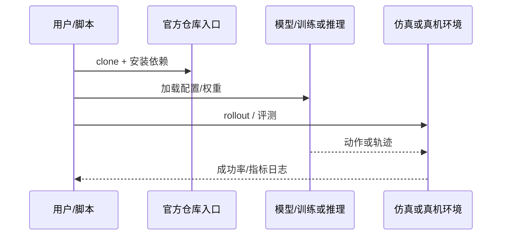

# LIT（arXiv:2609.12641）

**LIT**（[Breaking the Vision-Action Shortcut: Latent Interface Training for Generalizable Robotics Foundation Models](https://arxiv.org/abs/2609.12641)）来自 [具身智能小站 11 篇 VLA/TAMP 盘点](../../sources/blogs/wechat_embodied_station_11_papers_vla_tamp_planning_2026-09-14.md)。视觉分布偏移时策略易走捷径；LIT 约束视觉入口，在 Pi0.5、MolmoAct2、FAST-WAM、ImageWAM 上提升 OOD 成功率。

## 一句话定义

**两阶段潜接口训练：先学无图像动作先验，再以终点 SE(3) 监督的潜 token 接入视觉。**

## 英文缩写速查

| 缩写 | 英文全称 | 简要说明 |
|------|----------|----------|
| VLA | Vision-Language-Action | 视觉-语言-动作策略 |
| VLM | Vision-Language Model | 视觉-语言多模态模型 |
| WM | World Model | 预测未来观测或表征的动力学模型 |
| TAMP | Task and Motion Planning | 任务与运动规划 |
| OOD | Out-of-Distribution | 分布外泛化评测 |

## 为什么重要

- 视觉分布偏移时策略易走捷径；LIT 约束视觉入口，在 Pi0.5、MolmoAct2、FAST-WAM、ImageWAM 上提升 OOD 成功率。
- 开源状态：**已开源**（步骤 2.5 核查，2026-09-14）。
- 与 [11 篇技术地图](../overview/vla-tamp-planning-11-papers-technology-map.md) 中同类工作可横向对照。

## 核心机制

| 项 | 内容 |
|----|------|
| **arXiv** | [2609.12641](https://arxiv.org/abs/2609.12641) |
| **项目页** | https://magiclab-nus.github.io/LIT/ |
| **代码** | https://github.com/jianmanlincjx/LIT |
| **开源** | **已开源** |
| **文内指标** | LIBERO-Plus 总体成功率提升 3.87–10.70 个百分点（四种骨干）；真机 YAM 双臂三任务 OOD 场景均有增益。 |

## 源码运行时序图

## 实验与评测

| 项 | 文内口径 |
|----|----------|
| 要点 | LIBERO-Plus 总体成功率提升 3.87–10.70 个百分点（四种骨干）；真机 YAM 双臂三任务 OOD 场景均有增益。 |

- **读法：** 本页为索引级摘要，上表取自 [公众号盘点](../../sources/blogs/wechat_embodied_station_11_papers_vla_tamp_planning_2026-09-14.md) 与项目页；具体对照方法、任务集与逐项指标以 **原文 PDF** 为准。

## 与其他工作对比

- **端到端一阶段 VLA 微调** — 视觉与动作一起学，模型容易抄视觉捷径（背景、初始位姿、相机位）；LIT 先在 **无图像** 条件下学动作先验，再用终点 SE(3) 监督的潜 token 把视觉接回来，等于把捷径的入口先堵上。
- **[DATAFARM](./paper-datafarm.md)（同批）** — 对同一个「微调不动 VLA」问题给 **数据侧** 答案（生成时对齐分布），LIT 给 **模型侧** 答案（换接口）；两条正交，可叠加。
- **[Dynin-Robotics](./paper-dynin-robotics.md)（同批）** — 都报 LIBERO-Plus：LIT 是 **跨四种骨干的相对增量 3.87–10.70 pt**（可插拔改造），Dynin 是 **单一统一骨干的绝对值 73.0%**（重训）；口径不同，两个数字不可直接横比。
- **[World Action Models](../concepts/world-action-models.md)** — LIT 的潜 token 与 WAM 的潜动作同属「在像素与关节指令之间插一层可迁移表征」，差别在监督信号：LIT 用 **终点 SE(3)**，WAM 系多用 **未来观测重建**。
- **[LIBERO 基准](./libero-benchmark.md)** — LIBERO-Plus 是其扰动增强变体（相机/布局/语言/噪声/纹理）；LIT 的增益正是冲着这批扰动去的，在原版 LIBERO 上未必等幅体现。

- **读法：** 以上为知识库内 **路线级** 对照；与原文 baseline 的逐项定量比较以 **原文 PDF** 为准（[参考来源](#参考来源)）。

## 结论

**LIT 适合作为本期「已开源」边界下的快速索引页，部署前请核对项目页/仓库可运行性。**

1. 核心贡献：视觉分布偏移时策略易走捷径；LIT 约束视觉入口，在 Pi0.5、MolmoAct2、FAST-WAM、ImageWAM 上提升 OOD 成功率。
2. 开源结论：**已开源** — 以项目页实际链接为准（入库日 2026-09-14）。
3. 横向对照见 [11 篇技术地图](../overview/vla-tamp-planning-11-papers-technology-map.md)，避免与同 arXiv 重复造页。

## 关联页面

- [11 篇技术地图](../overview/vla-tamp-planning-11-papers-technology-map.md)
- [VLA（Vision-Language-Action）](../methods/vla.md)
- [Generative World Models](../methods/generative-world-models.md)
- [Manipulation](../tasks/manipulation.md)

## 参考来源

- [lit-latent-interface-training_arxiv_2609_12641.md](../../sources/papers/lit-latent-interface-training_arxiv_2609_12641.md)
- [wechat_embodied_station_11_papers_vla_tamp_planning_2026-09-14.md](../../sources/blogs/wechat_embodied_station_11_papers_vla_tamp_planning_2026-09-14.md)
- [arXiv:2609.12641](https://arxiv.org/abs/2609.12641)

## 推荐继续阅读

- [arXiv PDF](https://arxiv.org/pdf/2609.12641)
- [项目页](https://magiclab-nus.github.io/LIT/)
- [https://github.com/jianmanlincjx/LIT](https://github.com/jianmanlincjx/LIT)
