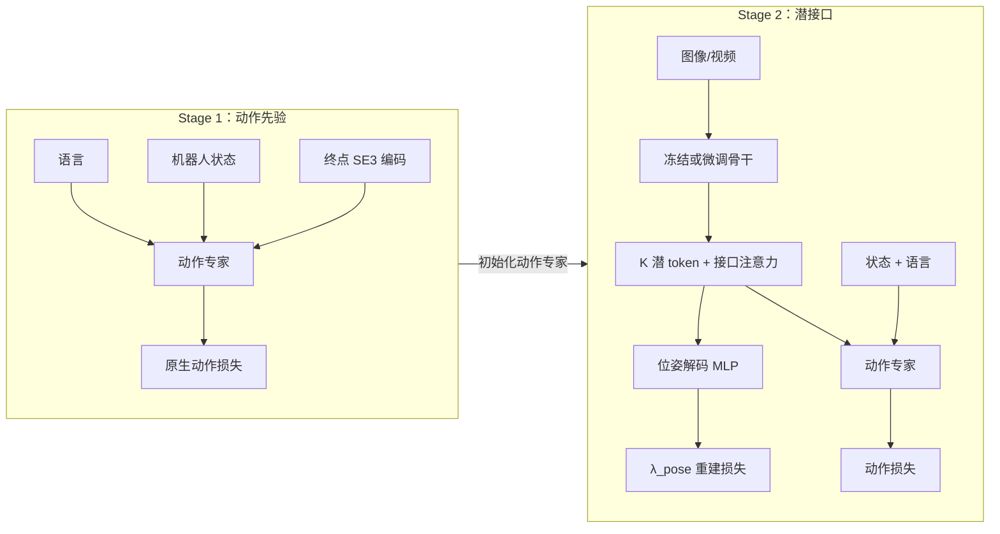
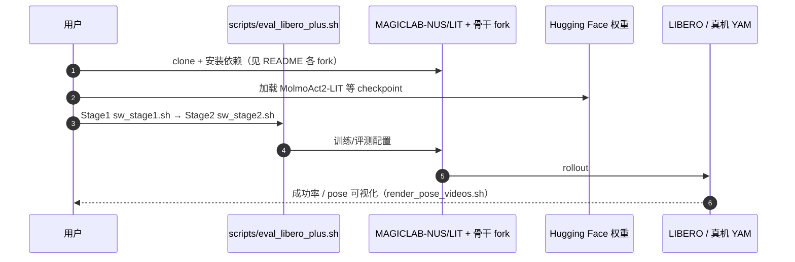

# LIT（arXiv:2609.12641）

**LIT**（[Breaking the Vision-Action Shortcut: Latent Interface Training for Generalizable Robotics Foundation Models](https://arxiv.org/abs/2609.12641)）由 **华南理工大学 / 新加坡国立大学（MAGIC Lab）/ 南洋理工大学** Jianman Lin、Shailesh Shailesh 等提出。视觉分布偏移时策略易走捷径；LIT **不改骨干与动作专家**，只在二者之间插入 **终点 SE(3) 监督的潜接口**：Stage 1 无图像学动作先验，Stage 2 让视觉 **只能** 经潜 token 到达动作头。在 π0.5、MolmoAct2、FAST-WAM、ImageWAM 上提升 OOD 成功率。

## 一句话定义

**两阶段潜接口训练：先学无图像动作先验，再以终点 SE(3) 监督的潜 token 接入视觉。**

## 英文缩写速查

| 缩写 | 英文全称 | 简要说明 |
|------|----------|----------|
| LIT | Latent Interface Training | 本文两阶段潜接口训练框架 |
| VLA | Vision-Language-Action | 视觉-语言-动作策略 |
| WAM | World Action Model | 视频/世界模型 + 动作联合骨干 |
| SE(3) | Special Euclidean Group | 末端位姿（位置 + 轴角朝向 + 夹爪） |
| OOD | Out-of-Distribution | 分布外泛化评测（LIBERO-Plus 等） |
| HF | Hugging Face | 官方 MolmoAct2 权重与 YAM 真机数据托管 |

## 为什么重要

- **可插拔改造：** 同一六步集成流程不改动作表示与预测 horizon，在 **两种 VLA + 两种 WAM** 上复用。
- **抗捷径机制明确：** 去掉动作专家对图像 token 的直接注意力/注入，强迫视觉经 **K=100 潜 token + 位姿重建** 接地。
- **数字可读：** LIBERO-Plus Overall 相对基线 **+3.87–10.70 pt**；YAM 双臂真机 OOD 光照/相机/干扰物 **+13.3–16.7 pt**。
- **开源完整度提升：** 官方 [MAGICLAB-NUS/LIT](https://github.com/MAGICLAB-NUS/LIT) + HF checkpoint / 数据集（2026-09-15 核查）。

## 核心机制

| 项 | 内容 |
|----|------|
| **机构** | 华南理工大学；新加坡国立大学（MAGIC Lab）；南洋理工大学 |
| **arXiv** | [2609.12641](https://arxiv.org/abs/2609.12641) |
| **项目页** | https://magiclab-nus.github.io/LIT/ |
| **代码** | https://github.com/MAGICLAB-NUS/LIT |
| **权重** | https://huggingface.co/shailes-h/Molmoact2-LIT |
| **数据** | https://huggingface.co/datasets/shailes-h/yam_bimanual_manipulation |
| **开源** | **已开源** |
| **文内指标** | LIBERO-Plus Overall +3.87–10.70 pt（四骨干）；真机 YAM 三任务 OOD 均有增益。 |

## 流程总览

## 源码运行时序图

复现主路径：`archive/paper_runs/sw_stage{1,2}.sh`（MolmoAct2 示例）→ `scripts/eval_libero_plus.sh`；四骨干 fork 链见官方 README「Code repositories」节。

## 实验与评测

| 项 | 文内口径 |
|----|----------|
| 仿真 | LIBERO-Plus 七类扰动；π0.5 Overall 68.97→**79.67**（+10.70 pt）等 |
| 真机 | YAM 双臂三任务；光照 OOD 53.3→**70.0**（+16.7 pt）等 |
| 消融 | 去掉 Stage 1 或 pose 监督均显著掉点（MolmoAct2 表） |

- **读法：** 与 [Dynin](./paper-dynin-robotics.md) 的 LIBERO-Plus **绝对值 73.0%** 不可横比（底座与协议不同）。

## 与其他工作对比

- **端到端一阶段 VLA 微调** — 易抄视觉捷径；LIT 先堵直连再接视觉。
- **[DATAFARM](./paper-datafarm.md)（同批）** — 数据侧规划对齐 vs 本文模型侧潜接口；可叠加。
- **[Dynin-Robotics](./paper-dynin-robotics.md)（同批）** — 统一扩散骨干重训 vs LIT 可插拔接口改造。
- **[World Action Models](../concepts/world-action-models.md)** — LIT 用 **终点 SE(3)** 监督，WAM 系多用未来观测重建。

## 结论

**LIT 用「无图动作先验 + 位姿监督潜接口」把视觉捷径从结构上拆开，在四骨干与真机 OOD 上稳定增益，且官方仓与 HF 资产已可复现 MolmoAct2 主线。**

1. **真影响指标：** LIBERO-Plus 相机/噪声/语言扰动增益最大；原版 LIBERO ID 性能保持或略升。
2. **次要代价：** 两阶段训练与接口超参（K=100、λ_pose=0.3）需按骨干 fork 调；bf16 下新模块需检查是否进 checkpoint。
3. **部署读法：** 推理只需图像+语言+状态，**不需** Stage 1 目标编码器与 Stage 2 位姿解码器。
4. **复现入口：** [MAGICLAB-NUS/LIT](https://github.com/MAGICLAB-NUS/LIT) + [Molmoact2-LIT](https://huggingface.co/shailes-h/Molmoact2-LIT)；勿用旧链 `jianmanlincjx/LIT` 作官方源。

## 关联页面

- [11 篇技术地图](../overview/vla-tamp-planning-11-papers-technology-map.md)
- [VLA（Vision-Language-Action）](../methods/vla.md)
- [DATAFARM](./paper-datafarm.md)
- [Manipulation](../tasks/manipulation.md)

## 参考来源

- [lit-latent-interface-training_arxiv_2609_12641.md](../../sources/papers/lit-latent-interface-training_arxiv_2609_12641.md)
- [lit-latent-interface-training.md](../../sources/repos/lit-latent-interface-training.md)
- [lit-magiclab-nus.md](../../sources/sites/lit-magiclab-nus.md)
- [wechat_embodied_station_11_papers_vla_tamp_planning_2026-09-14.md](../../sources/blogs/wechat_embodied_station_11_papers_vla_tamp_planning_2026-09-14.md)

## 推荐继续阅读

- [arXiv PDF](https://arxiv.org/pdf/2609.12641)
- [项目页](https://magiclab-nus.github.io/LIT/)
- [MolmoAct2-LIT 权重](https://huggingface.co/shailes-h/Molmoact2-LIT)
- [YAM 双臂数据集](https://huggingface.co/datasets/shailes-h/yam_bimanual_manipulation)
