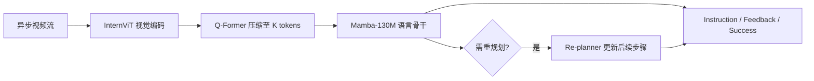
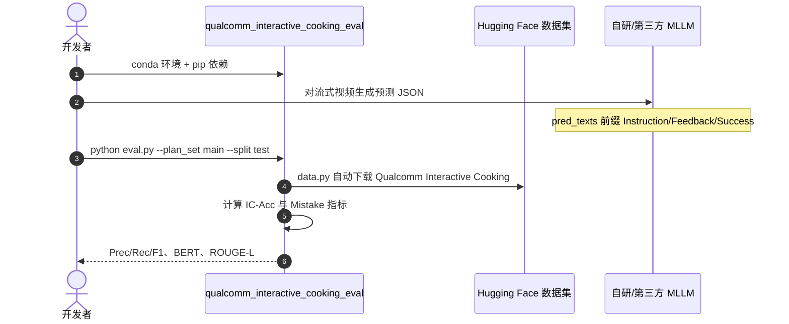

# LiveCook：流式多模态烹饪指导与 LiveMamba

**LiveCook**（*Can Multi-Modal LLMs Provide Live Step-by-Step Task Guidance?*，[arXiv:2511.21998](https://arxiv.org/abs/2511.21998)，[NeurIPS 2025](https://neurips.cc/virtual/2025/poster/118991)，[项目页](https://apratimbh.github.io/livecook/)）提出 **Qualcomm Interactive Cooking** 流式指导基准与数据集，并给出 **LiveMamba** 流式多模态 LLM 基线。续作见 [Streaming Interventions](./paper-streaming-interventions.md)（Ego-MC-Bench / Ego-CoMist）。

## 一句话定义

**把「AI 教练」从回合式问答推进到对视频流的异步反应：既要按时给步骤，又要在错误刚出现时就纠错——现有 MLLM 在流式设定下几乎全线失效，数据与架构需专门为 mistake-aware streaming 设计。**

## 英文缩写速查

| 缩写 | 英文全称 | 简要说明 |
|------|----------|----------|
| MLLM | Multimodal Large Language Model | 多模态大语言模型 |
| IC-Acc | Instruction Completion Accuracy | 步骤是否被正确判定为完成 |
| CFAug | Counterfactual Mistake Augmentation | 反事实错误数据增强 |
| ICAug | Instruction Completion Augmentation | 步骤完成检测增强 |

## 为什么重要

- 首个面向 **live、 situated coaching** 的专用基准：基于 [CaptainCook4D](https://captaincook4d.github.io/captain-cook/)，密集标注定时 instruction 与 mistake alert。
- 明确 **streaming vs turn-based** 双评测：前者反映真实多步误差传播，后者隔离单步能力。
- **LiveMamba** 用 Mamba-130M 骨干在相近显存下容纳更多每帧 token，配合 ICAug/CFAug 与可选 Re-planner，成为可复现强基线（权重未开源）。
- 官方 **评测代码 + HF 数据集** 已发布；[CVPR 2026 VAR Workshop AI Coach](https://varworkshop.github.io/challenges/) 提供 Qwen3-VL 入门基线。

## 核心信息

| 项 | 内容 |
|----|------|
| **机构** | 高通人工智能研究院（Qualcomm AI Research）等 |
| **venue** | NeurIPS 2025 |
| **上游数据** | CaptainCook4D（含用户执行错误） |
| **开源** | **部分开源** — 评测 + 数据集 + 竞赛入门；LiveMamba 训练/权重 **未发布** |

### 流程总览

## 评测与指标

| 设定 | 读法 |
|------|------|
| **Streaming zero-shot** | SOTA MLLM mistake F1 接近 0；Gemini-2.5-Flash IC-Acc 23.1% 已属前列 |
| **Streaming fine-tuned LiveMamba** | Main Set IC-Acc **31.5%**，mistake F1 **0.13**；Advanced Planning mistake F1 **0.19** |
| **Turn-based fine-tuned** | 单步隔离后 LiveMamba IC-Acc **51.0%**，mistake F1 **0.19** — 说明多步误差传播是主要难点 |
| **指标族** | IC-Acc；Mistake Prec / Rec / F1；BERTScore；ROUGE-L |

## 结论

**LiveCook 的价值在于把「流式烹饪教练」做成可度量的基准，并证明 mistake 数据与流式架构缺一不可；但开源边界停在评测侧，复现 LiveMamba 仍需自研训练栈。**

- 真问题不是「会不会做菜步骤」，而是 **异步视频流上的完成检测 + 及时纠错**；turn-based 分数远高于 streaming，部署必须按 streaming 口径验收。
- **ICAug + CFAug** 对 IC-Acc 与 mistake F1 均有显著贡献；无 mistake 监督的纯 instruction 数据不够。
- LiveMamba 的 Mamba 骨干用更少显存换更多每帧 token，是边缘端 streaming 助手的合理工程取向。
- 官方 [qualcomm_interactive_cooking_eval](https://github.com/Qualcomm-AI-research/qualcomm_interactive_cooking_eval) 可自动拉 HF 数据并算全套指标，是横向对比的**唯一标准入口**。
- CVPR 2026 [ai_coach_cooking_2026](https://github.com/varworkshop/ai_coach_cooking_2026) 给出 Qwen3-VL turn-based 基线，适合竞赛入门，不等同于论文 streaming 设定。
- 续作 [Streaming Interventions](./paper-streaming-interventions.md) 把难点进一步推到真机 Ego-MC-Bench 与 Ego-CoMist 反事实训练。

## 源码运行时序图

## 工程实践

| 步骤 | 说明 |
|------|------|
| 环境 | Python 3.11.10；`bert_score`、`rouge-score`、`huggingface-hub`、`datasets` |
| 预测格式 | JSON 列表：`video_id`、`pred_texts`（index 0 为 instruction）、`pred_timestamps` |
| 评测命令 | `PYTHONPATH=./ python eval.py --plan_set main --split test --predictions_file_path <path>` |
| 竞赛入门 | 先按 [ai_coach_cooking_2026](https://github.com/varworkshop/ai_coach_cooking_2026) 下载 CaptainCook4D 并抽帧，再对接同一 `eval.py` |
| 复现 LiveMamba | **无官方训练仓**；需自建 streaming 训练管线并自行实现 ICAug/CFAug |

## 与其他工作对比

| 维度 | LiveCook / LiveMamba | Turn-based VLM 教练 | 离线视频字幕/步骤生成 |
|------|---------------------|---------------------|----------------------|
| 输入 | **异步视频流** | 单步 clip 或用户回合 | 整段视频离线处理 |
| 纠错时机 | mistake **视觉出现即** alert | 通常事后回顾 | 无实时干预 |
| 评测 | Streaming + Turn-based 双轨 | 多为单步准确率 | BLEU/步骤对齐 |
| 开源 | 评测+数据；**模型未发布** | 竞赛入门基线（Qwen3-VL） | 视具体工作而定 |

- 与 [Streaming Interventions](./paper-streaming-interventions.md)：**同一评测仓**延续到真机 Ego-MC-Bench；后者专注 mistake intervention 难度与 Ego-CoMist 合成数据。
- 与通用 [VLA](../methods/vla.md)：**不输出机器人动作**，而是自然语言 instruction/feedback；但「流式感知 + 语言」部署约束相近。

## 局限与风险

- **模型未开源：** 只能评测自有模型，无法直接复现 LiveMamba 数字。
- **Streaming 极难：** 多步设定下 SOTA 普遍接近失效，勿用 turn-based 分数代替部署预期。
- **域窄：** 以烹饪 procedural activity 为主，迁移到其他技能需新标注。
- **依赖 CaptainCook4D：** 竞赛入门需额外下载原始 GoPro 视频并抽帧。

## 关联页面

- [Streaming Interventions / Ego-MC-Bench](./paper-streaming-interventions.md) — 续作：真机纠错基准与 Ego-CoMist
- [VLA](../methods/vla.md) — 更广义的视觉–语言–动作与具身助手脉络
- [Manipulation](../tasks/manipulation.md) — 操作任务与 procedural 技能交叉
- [Awesome Egocentric Vision](./awesome-egocentric-vision.md) — 第一视角视觉策展索引

## 参考来源

- [livecook_arxiv_2511_21998.md](../../sources/papers/livecook_arxiv_2511_21998.md)
- [LiveCook 项目页](../../sources/sites/livecook.md)
- [qualcomm-interactive-cooking-eval](../../sources/repos/qualcomm-interactive-cooking-eval.md)
- [ai-coach-cooking-2026](../../sources/repos/ai-coach-cooking-2026.md)

## 推荐继续阅读

- [LiveCook 项目页](https://apratimbh.github.io/livecook/)
- [arXiv:2511.21998](https://arxiv.org/abs/2511.21998)
- [CaptainCook4D](https://captaincook4d.github.io/captain-cook/)
