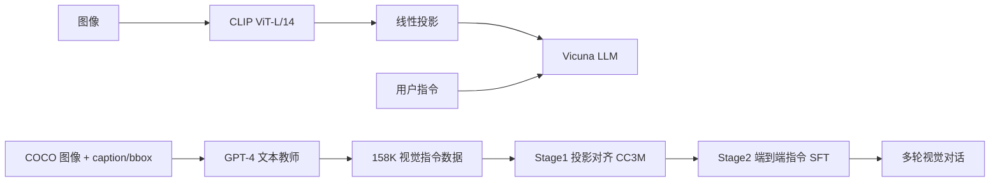
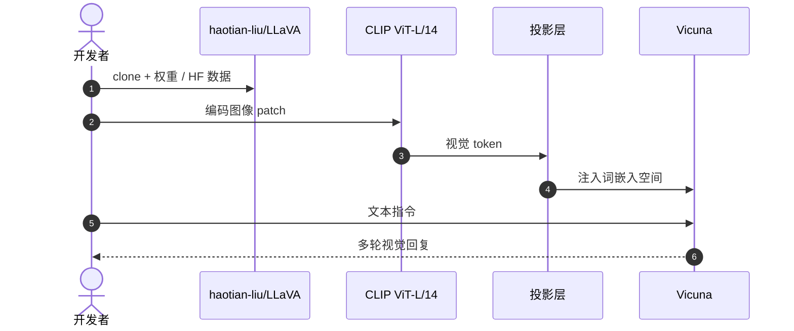

# LLaVA：Visual Instruction Tuning

**LLaVA**（*Visual Instruction Tuning*，[arXiv:2304.08485](https://arxiv.org/abs/2304.08485)，[项目页](https://llava-vl.github.io/)，[代码](https://github.com/haotian-liu/LLaVA)）由 **威斯康星大学麦迪逊分校 / 微软研究院 / 哥伦比亚大学** 提出：用 **language-only GPT-4** 从图文对生成多模态指令数据，将 **CLIP ViT-L/14** 经投影层接到 **Vicuna** LLM 并两阶段微调。模型实体见 [llava](./llava.md)；**本页是论文 canonical 节点**。

## 一句话定义

**CLIP 对齐之后，LLaVA 把「看图对话」做成可复现流水线——多数开源 VLA 沿同一骨架接动作头。**

## 英文缩写速查

| 缩写 | 英文全称 | 简要说明 |
|------|----------|----------|
| LLaVA | Large Language and Vision Assistant | 本工作 |
| LMM | Large Multimodal Model | 视觉–语言多模态模型 |
| SFT | Supervised Fine-Tuning | 指令微调阶段 |
| VLM | Vision-Language Model | VLA 常见上游 |
| VLA | Vision-Language-Action | 具身动作延伸 |

## 为什么重要

- 首次系统把 **Alpaca/Vicuna 式文本指令微调** 扩展到 **视觉指令** 域。
- 架构极简（**线性投影 + 冻结 CLIP + 微调 LLM**），成为 [FluxVLA LlavaVLA](./fluxvla-engine.md)、NaVILA、RoboInter-VLM 等 VLA 变体的默认起点。
- 与 [CLIP](./paper-clip.md) 串联：CLIP 管对齐，LLaVA 管 **多轮语义接口**——[VLA 方法页](../methods/vla.md) 中大量系统仍走「VLM + 动作解码器」。
- **已开源** 代码、权重与 LLaVA-Instruct-150K 数据。

## 核心信息

| 项 | 内容 |
|----|------|
| **机构** | 威斯康星大学麦迪逊分校（UW–Madison）、微软（Microsoft Research）、哥伦比亚大学（Columbia） |
| **视觉塔** | CLIP ViT-L/14@336px（冻结或部分解冻） |
| **语言侧** | Vicuna（LLaMA 指令微调版） |
| **桥接** | 线性投影矩阵（Stage1 预训练） |
| **数据** | GPT-4 生成 **158K** 指令样本（对话 / 描述 / 推理） |
| **开源** | **已开源** [haotian-liu/LLaVA](https://github.com/haotian-liu/LLaVA) + [HF 数据集](https://huggingface.co/datasets/liuhaotian/LLaVA-Instruct-150K) |

### 流程总览

## 评测

- **LLaVA-Bench**：相对 GPT-4 评分 **85.1%**（合成多模态指令集）。
- **Science QA**：LLaVA + GPT-4 judge **92.53%**，发表时（2023-04）该基准最高分（原文）。
- 机器人侧：本页 **不直接输出动作**；价值在 **指令跟随与语义 grounding**，供 VLA 动作头消费。

## 结论

**搭 VLA 时：CLIP 选视觉语义，LLaVA 选对话式 VLM 接口，动作头另训。**

- GPT-4 生成指令数据是可扩展范式，但需过滤幻觉样本
- 两阶段训练（先投影、后 LLM）降低算力门槛
- 默认 CLIP 塔几何弱于 [DINOv2](./paper-dinov2.md)；操作任务常换双塔（见 [OpenVLA](./paper-openvla.md)）
- 许多 VLA 复用 LLaVA 训练脚本与 JSON 格式（如 RoboInter、EmbodiedKit）
- 跟进 LLaVA-1.5（arXiv:2310.03744）刷榜改进，但架构主线不变

## 源码运行时序图

关键复现路径：`LLaVA` README 中 Stage1 `pretrain` → Stage2 `finetune` → `llava/serve` Gradio demo。

## 局限与风险

- **非动作模型**：输出文本，部署 VLA 须另接连续/离散动作头。
- **GPT-4 数据依赖**：自动生成指令可能带偏见或事实错误。
- **CLIP 几何短板**：细粒度空间/接触推理弱，纯 LLaVA 视觉塔难支撑高精度操作。
- **许可**：Vicuna/LLaMA 权重协议与商用场景需单独核查。

## 与其他工作对比

| 工作 | 相对本页 |
|------|----------|
| [CLIP](./paper-clip.md) | 上游对比对齐，无多轮对话 |
| [BLIP-2](./paper-blip2.md) | Q-Former 桥接，非 Vicuna 指令栈 |
| [OpenVLA](./paper-openvla.md) | 在 VLM 栈上接机器人动作 token |
| [RT-2](./paper-rt-2.md) | 闭源 PaLM-E 路线，非 LLaVA 开源栈 |

## 关联页面

- [LLaVA 模型实体](./llava.md)
- [CLIP 论文实体](./paper-clip.md)
- [VLA 方法](../methods/vla.md)
- [多模态 LLM 发展路线](../overview/multimodal-llm-development.md)

## 推荐继续阅读

- [arXiv:2304.08485](https://arxiv.org/abs/2304.08485)
- [LLaVA 项目页](https://llava-vl.github.io/)
- [haotian-liu/LLaVA](https://github.com/haotian-liu/LLaVA)

## 参考来源

- [llava_arxiv_2304_08485](../../sources/papers/llava_arxiv_2304_08485.md)
- [llava-vl 项目页](../../sources/sites/llava-vl.md)
- [haotian-liu-llava](../../sources/repos/haotian-liu-llava.md)
