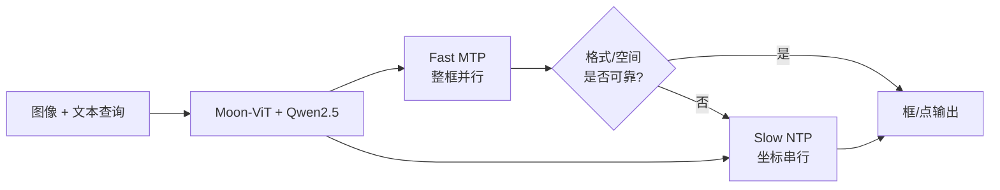
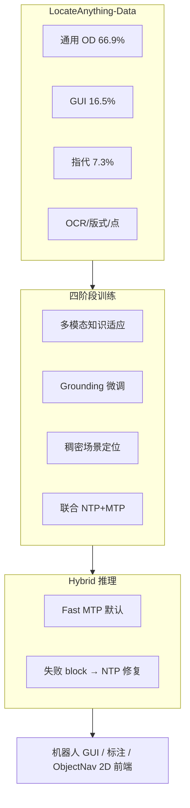
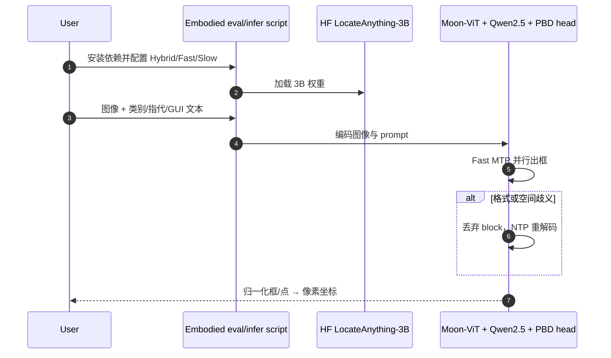

# LocateAnything：基于并行框解码的快速高质量视觉-语言定位

**LocateAnything**（*Fast and High-Quality Vision-Language Grounding with Parallel Box Decoding*，[arXiv:2605.27365](https://arxiv.org/abs/2605.27365)，[项目页](https://research.nvidia.com/labs/lpr/locate-anything/)，[代码](https://github.com/NVlabs/Eagle/tree/main/Embodied)，[权重](https://huggingface.co/nvidia/LocateAnything-3B)）由 **NVIDIA** 等提出：在统一 VLM 框架下用 **Parallel Box Decoding（PBD）** 把 **bounding box / point** 作为 **定长原子单元** 单步并行预测，缓解坐标 token 逐字自回归带来的几何不一致与推理瓶颈；配套 **LocateAnything-Data**（12M 图、138M 查询、785M 框）与 **3B** 公开模型。

## 一句话定义

**用 PBD 在一步内输出完整框坐标，把视觉-语言定位与检测收成同一生成式 VLM，在 Hybrid 推理下同时抬高吞吐与高精度 IoU 定位质量。**

## 英文缩写速查

| 缩写 | 英文全称 | 简要说明 |
|------|----------|----------|
| PBD | Parallel Box Decoding | 框/点原子单元并行解码 |
| VLM | Vision-Language Model | 图像+文本统一模型 |
| MTP | Multi-Token Prediction | Fast 模式：整块并行预测 |
| NTP | Next-Token Prediction | Slow 模式：坐标 token 自回归 |
| BPS | Boxes Per Second | 吞吐指标（单 H100，论文设定） |
| GUI | Graphical User Interface | ScreenSpot-Pro 等 agent 界面 grounding |
| IoU | Intersection over Union | 定位质量；高 IoU 为论文强项 |

## 核心信息

| 字段 | 内容 |
|------|------|
| **机构** | 英伟达（NVIDIA）；作者含港理工、普林斯顿、南京大学、UIUC 等 |
| **arXiv** | [2605.27365](https://arxiv.org/abs/2605.27365) |
| **规模** | **3B**（Moon-ViT + Qwen2.5-3B-Instruct） |
| **吞吐** | Hybrid **12.7 BPS**；Fast **15.3 BPS**；Slow 精度上限 |
| **数据** | [NVEagle/LocateAnything-Data](https://huggingface.co/datasets/NVEagle/LocateAnything-Data) |
| **开源** | 代码 **Apache 2.0**；权重 **NVIDIA License**（非商业研究） |

## 为什么重要

- **机器人/agent 感知前端：** GUI grounding、指代表达、稠密场景 OD、OCR/版式与 **点定位** 共用一套 VLM，适合 embodied agent、车载与文档流水线的一刀切 **2D 定位层**（见 [感知栈选型闭环](../queries/robot-perception-stack-selection-loop.md)）。
- **速度-精度前沿：** 相对 **Qwen3-VL**（1.1 BPS）与 **Rex-Omni**（5.0 BPS）叙事，Hybrid **12.7 BPS** 且 LVIS 高 IoU 更强——对机载/边缘 **延迟敏感** 的 grounding 有选型意义。
- **可复现资产齐全：** [Eagle/Embodied](https://github.com/NVlabs/Eagle/tree/main/Embodied) + HF 权重 + 2.41TB 数据发布；与闭源产品叙事区分清晰。

## 核心原理

### PBD vs 传统坐标 token 化

| 路线 | 解码方式 | 问题 |
|------|----------|------|
| 文本数字 / 量化坐标 NTP | 坐标拆成多个 token **串行** 生成 | 框内几何耦合被破坏；吞吐低 |
| **PBD** | 每个框为 **定长 block**，**一步** 输出 \((x_1,y_1,x_2,y_2)\) | 保持 intra-box 一致性；可并行 |

### 架构

- **视觉：** Moon-ViT，原生分辨率 token，保留细粒度空间细节。
- **语言：** Qwen2.5-3B-Instruct + MLP projector。
- **输出：** block 级 box/point 预测；联合优化 NTP 与 MTP。

### 三种推理模式

| 模式 | 适用 | 论文要点 |
|------|------|----------|
| **Fast（MTP）** | 低延迟、机载 agent | 最高 **15.3 BPS** |
| **Slow（NTP）** | 标注/离线高精度 | COCO ablation F1 **52.1** |
| **Hybrid（默认）** | 生产推荐 | **12.7 BPS**；歧义 block 回退 NTP 重解码 |

**On-Demand NTP Re-decoding：** 遇 **格式不规则**（类别边界语法错误）或 **空间歧义**（密集物体间中间坐标）时，丢弃问题 block，从最近已验证前缀用 NTP 补全后再回到 MTP。

## 流程总览（训练 → 推理）

## 实验与评测

> 下列为项目页/技术报告 **Hybrid Mode、3B、单 H100** 口径；复现以 [Eagle/Embodied](https://github.com/NVlabs/Eagle/tree/main/Embodied) 与 `document/RESULTS.md` 为准。

### 吞吐（BPS）

| 模型 | BPS |
|------|-----|
| Qwen3-VL（文本坐标） | 1.1 |
| Rex-Omni（量化坐标） | 5.0 |
| **LocateAnything Hybrid** | **12.7** |
| LocateAnything Fast | 15.3 |

### 检测与 grounding（mean F1 等）

| 基准 | LocateAnything | 对照要点 |
|------|----------------|----------|
| **LVIS** | +3.8% mean F1 vs Rex-Omni；IoU=0.95 **31.1 vs 20.7** | 高 IoU 优势 |
| **COCO** | +1.8% mean F1 vs Rex-Omni | 同规模 |
| **Dense200 / VisDrone** | **58.7 / 39.9** | 稠密场景 |
| **ScreenSpot-Pro** | **60.3** SOTA | GUI agent |
| **DocLayNet / M6Doc** | **76.8 / 70.1** | 文档版式 |
| **TotalText OCR** | **43.3** | 文本定位 |
| **HumanRef** | **78.7** | 指代表达 |

**主要对比：** Rex-Omni、Qwen3-VL、Grounding DINO、SEED1.5-VL、GUI-Owl 等（项目页表格）。

## 与其他工作对比

| 对照 | 差异读法 |
|------|----------|
| **Rex-Omni / 量化坐标 VLM** | 同走「生成式检测」，但坐标仍多 token 串行；LocateAnything 用 **PBD block** 抬吞吐与几何一致性 |
| **Qwen3-VL** | 通用 VLM 坐标解码慢（1.1 BPS 叙事）；LocateAnything 专精 **定位/det 统一** |
| **Grounding DINO** | 经典两阶段开放集检测；LocateAnything 是 **端到端 VLM 生成式** 路线 |
| [SAM 3](./paper-sam3.md) | 输出 **掩码+概念实例**；LocateAnything 输出 **框/点**，更适合检测榜与 GUI bbox |
| [ENEAS](./paper-eneas.md) | 强调 **视频实例跟踪 + 本体验证**；LocateAnything 强调 **单图/统一 det+grounding 吞吐** |

## 源码运行时序图

官方入口 [NVlabs/Eagle/Embodied](https://github.com/NVlabs/Eagle/tree/main/Embodied) + [nvidia/LocateAnything-3B](https://huggingface.co/nvidia/LocateAnything-3B)：

关键复现路径：克隆 Eagle → 进入 `Embodied/` 按 README 装环境 → 下载 HF 权重 → 跑评测脚本或 Spaces 同级推理 API → 再接机器人感知节点（注意 **NVIDIA License** 非商业限制）。

## 工程实践

| 项 | 建议 |
|----|------|
| **许可** | 权重 **非商业**；产品化需另谈 NVIDIA 条款；代码 Apache 2.0 |
| **模式选择** | 在线 agent / 机器人 **Hybrid**；极限吞吐用 **Fast**；标注管线可用 **Slow** |
| **数据复现** | 全量 ~2.41TB；用 `download_subset.py` 按数据集 ID 拉子集；7 个上游集需 `hydrate_restricted_media.py` |
| **与分割栈分工** | 要像素掩码接 [SAM 3](./paper-sam3.md)；要 **框+语言统一+高 BPS** 用 LocateAnything |
| **下游** | ObjectNav / 操作：框作 2D 前端，仍需深度/LiDAR 提升（[2D→3D gap](../concepts/2d-to-3d-semantic-lifting-gap.md)） |

## 局限与风险

- **许可边界：** 3B 权重非商业；与 Apache 代码混用时注意部署合规。
- **输出形态：** 框/点为主，不直接给实例掩码；精细轮廓需后接分割器。
- **算力口径：** BPS 在 **H100** 上报；边缘 Orin 需自行 profile Fast/Hybrid。
- **与 Duke/Eagle 其他「EAGLE」易混：** 本实现属 **NVlabs/Eagle VLM 家族**，非人形 WBC 论文 EAGLE。

## 结论

**总判：LocateAnything 把「VLM 做检测/grounding」的瓶颈从坐标串行解码挪到 PBD 并行 block，在 3B 规模上同时买到吞吐与高 IoU 精度，适合当 agent/机器人的统一 2D 定位前端选型参考。**

1. **先确认任务形态** — 要框/点/GUI/OCR 统一且要低延迟 → 优先评估 Hybrid；要像素掩码 → 仍看 SAM 系。
2. **吞吐与精度可切换** — Fast/Hybrid/Slow 三档明确；生产默认 Hybrid，别在真机链路上硬绑 Slow。
3. **数据与代码可审计** — Eagle/Embodied + 138M 查询数据已公开，但全量训练成本高、部分媒体需上游 hydrate。
4. **许可先行** — 研究复现友好；商业机器人产品需单独处理 NVIDIA 模型许可。
5. **部署读法** — 2D 框输出后必须接坐标后处理与（如需）3D 提升，勿把 mean F1 直接等同导航成功率。

## 关联页面

- [机器人视觉感知栈选型闭环](../queries/robot-perception-stack-selection-loop.md)
- [目标检测模型选型](../queries/object-detection-model-selection.md)
- [Object Detection（方法）](../methods/object-detection.md)
- [SAM 3](./paper-sam3.md) — 掩码级开放词汇对照
- [零样本目标导航](../tasks/zero-shot-object-navigation.md)

## 参考来源

- [locateanything 论文摘录](../../sources/papers/locateanything_arxiv_2605_27365.md)
- [NVIDIA 项目页归档](../../sources/sites/nvidia-locate-anything.md)
- [Eagle Embodied 代码归档](../../sources/repos/eagle_embodied_locateanything.md)

## 推荐继续阅读

- 项目页：<https://research.nvidia.com/labs/lpr/locate-anything/>
- 论文 PDF：<https://research.nvidia.com/labs/lpr/locate-anything/LocateAnything.pdf>
- HF 模型卡：<https://huggingface.co/nvidia/LocateAnything-3B>
