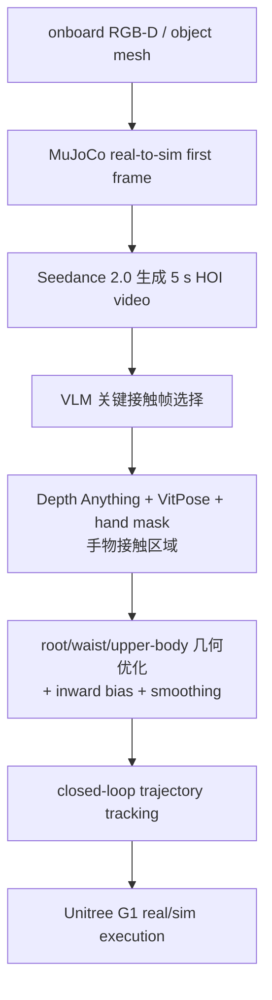

# GenHOI

**GenHOI**（*Contact-Aware Humanoid-Object Interaction by Imitating Generated Videos without Task-Specific Training*）探索一条极轻量的生成式路线：不为每个任务训练新策略，也不收集真实示范，而是让机器人基于自身观测生成一段任务视频，再从视频中提取接触几何约束，优化成可跟踪的全身轨迹。

## 一句话定义

GenHOI 把生成视频当作接触先验，通过关键帧接触检测、几何约束和闭环跟踪，让 Unitree G1 零样本执行多类物体交互。

## 英文缩写速查

| 缩写 | 英文全称 | 简要说明 |
|------|----------|----------|
| GenHOI | Generated-video Humanoid-Object Interaction | 本文框架名 |
| HOI | Human/Humanoid-Object Interaction | 人形机器人与物体交互 |
| OOD | Out-of-Distribution | 未见机器人-物体相对位置评测 |
| VLM | Vision-Language Model | Doubao-Seed-2.0/GPT-5.5 用于关键帧选择 |
| RGB-D | RGB + Depth | onboard 物体 pose / real-to-sim 重建输入 |
| GMR | General Motion Retargeting | 视频恢复人体动作到机器人轨迹的重定向工具 |

## 为什么重要

- **生成视频不直接控制机器人**：GenHOI 只把视频中的接触事件、接触区域和粗运动作为优化先验，避免把 2D 视频尺度错误直接下发。
- **无需 task-specific training**：对 box、chair、table、cylinder 四类任务，每个任务从生成视频提取参考，不像 HDMI 需要约 70 min 单任务训练。
- **接触约束是成败关键**：去掉 contact detection、trajectory smoothing 或 inward bias 后平均成功率均低于 50%，说明生成视频必须被几何/接触校正。
- **部署传感闭环**：真实机器人用 D435i + Mid360 LiDAR 估计对象和全局位姿，再在线优化轨迹。

## 流程总览

## 核心原理（详细）

### 1. Real-to-sim video generation

GenHOI 先根据 onboard RGB-D 估计对象 6D pose（FoundationPose 或 AprilTag）并在 MuJoCo 中渲染机器人-物体首帧，然后把首帧和语言命令送入 Seedance 2.0 生成 **5 s** 固定视角视频。生成视频提供「该怎么接触」的视觉示例。

### 2. Contact-aware geometric constraints

系统在生成视频最后 **3 s** 内每 **0.5 s** 采样候选帧，拼接后交给 VLM 选出首次双手接触关键帧。之后用 Depth Anything 恢复 metric depth，用 VitPose/hand mask 得到左右手 3D 接触点；如果手被物体遮挡，则沿相机射线取与物体 mesh 的最后交点。

### 3. Geometry-guided trajectory optimization

优化变量只包含终端 root position/yaw、root height、waist pitch 和 14 个上肢关节，而不是全身轨迹。位置权重 `w_p=20`、旋转权重 `w_R=5`、正则 `w_reg=0.25`，并加入 **δ=0.06 m inward bias**，让双手目标略向内压，形成虚拟夹持趋势。终端修正用 **K=90 frames（最后 3 s）** quintic smoothstep 平滑回传。

### 4. Closed-loop tracking

优化后的轨迹由通用 humanoid tracking controller 执行：下肢跟 global root trajectory，上身跟 waist/arm joint trajectory。真机平台为 Unitree G1，传感含 Mid360 LiDAR 与 Intel RealSense D435i，计算工作站为 i9 + RTX 4080。

## 关键实验数字

| 指标 | 结果 |
|------|------|
| 四类物体 | box、asymmetric chair carrying、table lifting from below、cylinder enveloping |
| 平均成功率 | Ours **76.7%**；ExoActor **11.7%**；无平滑 **28.3%**；无接触检测 **41.7%**；无 inward bias **43.3%** |
| 平均手-接触点误差 | Ours **0.22 m**；ExoActor **0.75 m** |
| 学习/生成时间 | HDMI ~**70 min**；GenHOI **1 min 51 s** |
| OOD 距离 | Ours 在 -1.0/+1.5 m 相对偏移仍 **8/10**；ExoActor 全 0/10 |
| VLM 关键帧 | Doubao-Seed-2.0 **95.0%**；GPT-5.5 **96.7%** |
| 失败分析 | 50 次 box-grasping 中 **34/50** 全流程成功 |

## 源码运行时序图

**不适用**：项目页 <https://genhoi-humanoid.github.io/> 和 arXiv 页面未列出官方 GitHub/可运行代码链接。截至 2026-07-22 仅确认项目展示与论文。

## 工程实践（含开源状态）

| 项 | 结论 |
|----|------|
| 项目页 | <https://genhoi-humanoid.github.io/> |
| 代码 | 未列出官方代码仓库 |
| 依赖资产 | 物体 mesh、MuJoCo 场景、Seedance 2.0、Depth Anything、VitPose、GMR、tracking controller |
| 真机 | Unitree G1 + Mid360 LiDAR + RealSense D435i |
| 主要风险 | 生成视频质量、接触关键帧检测、低层 tracking 误差 |

## 与其他工作对比

对照论文在 [为什么重要](#为什么重要) 与 [关键实验数字](#关键实验数字) 中直接比较的工作，均为定性维度（具体数字见评测表）：

| 维度 | GenHOI | ExoActor | HDMI |
|------|--------|----------|------|
| 先验来源 | 生成视频的接触事件 / 接触区域 | 视频恢复人体动作后直接重定向 | 任务专属示范 / 训练 |
| 是否 task-specific 训练 | **否**（零样本，分钟级准备） | 依赖重定向策略 | **是**（单任务约一小时级） |
| 接触约束 | 显式接触检测 + inward bias + 几何优化 | 无显式接触校正 | 隐含于任务训练 |
| 对生成 / 2D 尺度误差 | 只取接触先验，几何 + tracking 兜底 | 直接下发，易被 2D 尺度污染 | — |
| OOD 相对位置泛化 | 明显更鲁棒（见评测） | 明显退化 | — |

核心差异在于 GenHOI 把生成视频当作 **可被几何校正的接触先验** 而非可执行轨迹：相对 [ExoActor](../methods/exoactor.md) 的直接重定向，接触检测与 inward bias 是成败关键；相对 HDMI 的单任务训练，GenHOI 以零样本换取跨物体的快速部署。

## 局限与风险

- **需要准确物体 mesh**：未见物体需要在线重建或 shape completion。
- **受视频生成质量制约**：失败包括 camera drift、object deformation、hallucination。
- **当前手部不灵巧**：缺少 dexterous hands，任务主要是粗接触/包络/搬运。
- **不是策略学习范式替代品**：低层 tracker 能力仍决定执行上限。

## 关联页面

- [Loco-Manip 接触分类 03：生成式路线补数据](../overview/loco-manip-contact-category-03-generative-data.md)
- [Loco-Manip 8 篇 · 生成与仿真数据](../overview/loco-manip-category-02-synthetic-data.md)
- [SimGenHOI](./paper-notebook-simgenhoi-physically-realistic-whole-body-humano.md)
- [GRAIL](./paper-grail.md)
- [OASIS](./paper-loco-manip-04-oasis.md)
- [GMR](../methods/motion-retargeting-gmr.md)

## 参考来源

- [loco_manip_survey_03_genhoi.md](../../sources/papers/loco_manip_survey_03_genhoi.md)
- [loco_manip_8_papers_catalog.md](../../sources/papers/loco_manip_8_papers_catalog.md)
- [wechat_embodied_ai_lab_loco_manip_8_papers_survey.md](../../sources/blogs/wechat_embodied_ai_lab_loco_manip_8_papers_survey.md)
- [loco-manip-contact-category-03-generative-data](../overview/loco-manip-contact-category-03-generative-data.md)
- [wechat_embodied_ai_lab_loco_manip_contact_survey.md](../../sources/blogs/wechat_embodied_ai_lab_loco_manip_contact_survey.md)
- Bi et al., *GenHOI: Contact-Aware Humanoid-Object Interaction by Imitating Generated Videos without Task-Specific Training*, arXiv:2606.12995, 2026. <https://arxiv.org/abs/2606.12995>
- 官方项目页：<https://genhoi-humanoid.github.io/>

## 推荐继续阅读

- [GenHOI 项目页](https://genhoi-humanoid.github.io/)
- [Seedance 2.0](https://arxiv.org/abs/2604.14148)
- [Depth Anything V2](https://depth-anything-v2.github.io/)
