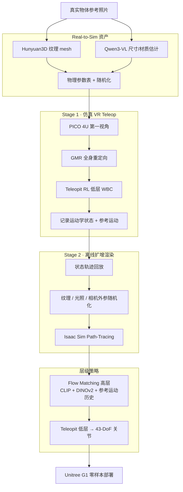

# OASIS（From Simulation Data Collection to Real-World Humanoid Loco-Manipulation）

**OASIS** 是中国电信 TeleAI 等团队提出的人形 **loco-manipulation 纯仿真数据框架**（arXiv:2606.08548，2026-06）：用 **真实物体照片** 自动生成物理仿真资产，在 **Isaac Sim** 中通过 **便携 VR teleop** 采集全身轨迹状态，再 **离线高保真渲染 + 视觉域随机化** 把少量操作员时间扩成大规模多样训练集；层级 **Flow Matching** 高层规划器配合 **Teleopit** 低层 WBC，在 **Unitree G1** 上 **零样本** 完成四类行走–操作任务。论文报告：在相同轨迹预算下，**仅仿真数据** 训练的策略在真机成功率 **不低于甚至高于** 纯真机 teleop，**混合数据** 最优。

本页同时收录于 [Loco-Manip 8 篇技术地图](../overview/loco-manip-8-papers-technology-map.md) **第 04/8** 篇（[02 生成与仿真数据](../overview/loco-manip-category-02-synthetic-data.md)）。

## 英文缩写速查

| 缩写 | 英文全称 | 简要说明 |
|------|----------|----------|
| Loco-Manip | Loco-Manipulation | 行走与操作动力学耦合的全身任务 |
| Sim2Real | Simulation to Real | 把仿真中学到的策略迁移落地真机的工程主线 |
| WBC | Whole-Body Control | 协调全身关节满足多任务/约束的控制层 |
| VLM | Vision-Language Model | 视觉-语言多模态模型，本文用于估计物体物理属性 |
| FM | Flow Matching | 生成式动作建模，回归噪声到目标动作的速度场 |
| GMR | General Motion Retargeting | 将人体/操作员运动重定向到人形参考运动的模块 |
| G1 | Unitree G1 Humanoid | 宇树入门级教育科研人形平台 |
| VR | Virtual Reality | 虚拟现实，本文用 PICO 4U 等便携设备做第一视角 teleop |
| IL | Imitation Learning | 从专家演示学习策略，奖励难定义时的主路线 |
| RGB | Red-Green-Blue | 彩色图像通道；策略使用三视角 RGB 观测 |
| DoF | Degrees of Freedom | 自由度；G1 身体 29-DoF + 双手 14-DoF |

## 为什么重要

- 在 [运动小脑 64 篇技术地图](../overview/humanoid-motion-cerebellum-technology-map.md) 中归类为 **H 真实任务**（58/64）：任务数据：仿真数据驱动真实 Loco-Manip 部署。
- **对准数据瓶颈：** 人形 loco-manip 需要大规模高质量演示；真机 teleop 轨迹对齐本体但 **复位慢、空间贵、硬件易损**（论文擦屏任务曾损坏显示器）。
- **解耦 teleop 成本与数据规模：** 实时阶段只录 **运动学状态**；视觉多样性在 **离线回放** 中用 Path-Tracing + 域随机化批量生成——少量操作员时间 → 大量训练样本。
- **挑战「真机数据唯一标准」：** 与 [LEGS](./paper-legs-embodied-gaussian-splatting-vla.md)（3DGS 合成 IL）、[VIRAL](./paper-viral-humanoid-visual-sim2real.md)（RL 特权教师）并列，展示 **仿真数据在 G1 loco-manip 上可替代或增强真机 teleop** 的另一条可扩展路线。
- **工程闭环完整：** Real-to-Sim 资产（Hunyuan3D + Qwen3-VL）→ VR teleop（GMR + Teleopit）→ 渲染扩增 → Flow Matching 策略 → 真机零样本，并开源 [TeleHuman/OASIS](https://github.com/TeleHuman/OASIS)。

## 流程总览

## 核心机制（归纳）

### Real-to-Sim 场景构建

- **Hunyuan3D** 从单张参考图生成高分辨率纹理 mesh。
- **Qwen3-VL** 根据类别描述估计 **长宽高（cm）** 与 **材质类别**；尺寸缩放 mesh，材质查表赋 **密度、摩擦、恢复系数**；所有物理量在预测值附近 **随机化** 以抗估计误差。
- 附录对 5 个物体报告尺寸预测与卡尺测量平均误差约 **0.3–3.0 cm**。

### 两阶段解耦数据采集

| 阶段 | 模式 | 记录内容 | 目的 |
|------|------|----------|------|
| Teleop | Isaac Sim **Real-Time** | 机器人+刚体运动学状态；GMR 参考运动 | 低延迟 VR 闭环；操作员成本 |
| 离线渲染 | **Path-Tracing** | 随机视觉条件下的 RGB 观测 | 扩增数据规模与视觉多样性 |

- **VR 栈：** PICO 4U（头显 + 手柄 + 双踝 tracker），无需动捕棚。
- **控制链：** GMR 重定向 → Teleopit 驱动仿真 G1。
- **扩增：** 每条轨迹渲染 **20** 个随机环境（消融：15–20 趋于饱和）。

### 层级 visuomotor 策略

- **高层（25 Hz）：** Transformer action-chunking + **Flow Matching**；条件 = 冻结 **CLIP** 文本 + 冻结 **DINOv2** 三视角图 + 最近 **H=2** 帧 **参考运动命令**（67-D，TextOp 格式；**不用** 带噪机器人状态，避免跟踪误差反馈）。
- **预测：** 未来 **F=32** 帧参考运动 chunk；推理 10 步 Euler 去噪。
- **低层（50 Hz）：** Teleopit 跟踪参考运动 → **29-DoF** 身体 + **14-DoF** 双手。
- **Curriculum rollout：** 训练前 20% 仅 GT 历史，之后 rollout 概率升至 **0.8**；无 rollout 时长时域任务近崩（如 Kneel and Wipe **0/10** vs **10/10**）。

### 真机配置与任务

- **平台：** 29-DoF G1 + 7-DoF 三指灵巧手；头载 RealSense **D435i** + 双腕 **D405**。
- **任务：** Place Cup in Box、Wipe Monitor、Lift Basket and Place Cup、Kneel and Wipe Under Table（桌面操作、全身搬运、跪姿桌下擦拭）。

## 实验要点

### 采集效率（50 条成功轨迹/任务）

| Task | OASIS | Real | Speedup |
|------|-------|------|---------|
| Place Cup in Box | 15.2 min | 17.5 min | 1.15× |
| Wipe Monitor | 19.1 min | 26.8 min | 1.40× |
| Lift Basket and Place Cup | 25.2 min | 40.2 min | 1.60× |
| Kneel and Wipe Under Table | 28.4 min | 44.8 min | 1.84× |

差距主要来自真机 **场景复位** 与 **易碎物体** 导致的谨慎操作，而非单条轨迹执行时间。

### 域随机化消融（零样本，10 次/任务）

- 关闭全部随机化：平均成功率 **5%**；全开：**83%**。
- **光照** 单项去掉影响最大；纹理、相机外参与全开组合 **互补**。
- 渲染数从 5→15 单调上升，**20** 环境为论文默认。

### 仿真 vs 真机数据（各 50 轨迹）

- **纯 OASIS 仿真数据** 在多数任务 **≥ 纯真机 teleop**；论文归因于仿真覆盖更广光照/背景，真机数据环境相对固定。
- **等量混合** 优于任一单源——仿真供视觉泛化，真机补接触与感知细节。

## 与其他工作对比

同属 [Loco-Manip 8 篇技术地图](../overview/loco-manip-8-papers-technology-map.md) 中「绕开真机 teleop 规模瓶颈」一脉，OASIS 与 [LEGS](./paper-legs-embodied-gaussian-splatting-vla.md)、[VIRAL](./paper-viral-humanoid-visual-sim2real.md) 给出三条互补路线：

| 维度 | OASIS（本页） | LEGS | VIRAL |
|------|---------------|------|-------|
| 数据来源 | 仿真 VR teleop（人类演示） | 3DGS 合成轨迹，无 teleop | RL 特权教师 rollout |
| 视觉合成 | Isaac Sim Path-Tracing + 域随机化 | 3D Gaussian Splatting 重建渲染 | 仿真渲染 + 视觉蒸馏 |
| 策略学习 | 层级 Flow Matching IL | 合成数据 IL | 特权 RL → 视觉学生蒸馏 |
| motion 多样性来源 | 操作员 VR teleop（受人类上限） | 合成轨迹生成 | RL 探索（覆盖更广） |
| 真机验证 | G1 零样本，四类 loco-manip 任务 | G1 操作任务 | G1 视觉 sim2real |

- **相对 LEGS：** 两者都把「视觉多样性」从真机数据中解耦，但 OASIS 仍保留 **VR teleop** 提供接触可行的全身轨迹，LEGS 则连 teleop 都省去、纯靠 3DGS 合成——OASIS 接触/动力学更贴真机，LEGS 采集成本更低。
- **相对 VIRAL：** OASIS 的 motion 来自 **人类 teleop**（多样性受操作员上限、未做轨迹动力学扰动），VIRAL 的 PPO 教师靠 **RL 探索** 拓宽 motion 覆盖；OASIS 胜在演示语义自然、易对齐任务，VIRAL 胜在探索式覆盖更广。
- **共同结论：** 三条路线都验证了 **仿真/合成数据可在 G1 loco-manip 上替代或增强真机 teleop**；OASIS 进一步给出「**纯仿真 ≥ 等量真机、混合最优**」的量化证据。

## 常见误区或局限

- **不是「消灭真机」：** 混合数据最优；仿真单独已在多数任务可用，但接触丰富任务仍受 **资产精度** 限制。
- **不是 RL 探索数据：** 与 [VIRAL](./paper-viral-humanoid-visual-sim2real.md) 的 PPO 教师不同，OASIS 数据来自 **人类 VR teleop**，motion 多样性受操作员上限；**未做** 全身轨迹动力学扰动（易破坏平衡）。
- **视觉随机化为主：** 不做 motion-level 扩增；复杂反光/透明物体资产仍可能拉宽 sim2real gap。
- **栈绑定：** Hunyuan3D、Qwen3-VL、Isaac Sim、Teleopit、GMR 与 G1+RealSense 配置需整体复现。

## 关联页面

- [Loco-Manip 8 篇技术地图](../overview/loco-manip-8-papers-technology-map.md) — 四组数据入口总览
- [02 生成与仿真数据](../overview/loco-manip-category-02-synthetic-data.md) — 与 GenHOI 同组
- [Loco-Manipulation](../tasks/loco-manipulation.md) — 任务定义与路线谱系
- [Teleoperation](../tasks/teleoperation.md) — 真机 teleop 成本对照
- [LEGS](./paper-legs-embodied-gaussian-splatting-vla.md) — 3DGS 无 teleop 合成 IL 路线
- [VIRAL](./paper-viral-humanoid-visual-sim2real.md) — RL 特权教师 + 视觉蒸馏
- [Sim2Real](../concepts/sim2real.md)
- [Domain Randomization](../concepts/domain-randomization.md)
- [Whole-Body Control](../concepts/whole-body-control.md)
- [Imitation Learning](../methods/imitation-learning.md)
- [Motion Retargeting (GMR)](../methods/motion-retargeting-gmr.md)
- [Unitree G1](./unitree-g1.md)
- [Isaac Gym / Isaac Lab](./isaac-gym-isaac-lab.md)

## 实验与评测

- 量化指标、消融与真机视频见 **原文 PDF**、[项目页](https://oasis-humanoid.github.io/) 与 [参考来源](#参考来源)；本页侧重管线结构与知识库交叉引用。

## 参考来源

- [oasis_humanoid_loco_manip_2606_08548.md](../../sources/papers/oasis_humanoid_loco_manip_2606_08548.md) — arXiv 全文精读摘录
- [loco_manip_survey_04_oasis.md](../../sources/papers/loco_manip_survey_04_oasis.md) — Loco-Manip 8 篇策展摘录
- [telehuman_oasis.md](../../sources/repos/telehuman_oasis.md) — 官方代码仓库归档
- [oasis-humanoid-github-io.md](../../sources/sites/oasis-humanoid-github-io.md) — 项目页归档
- Yu, Zheng, Xie, Shi, Zhang, Bai, Li, *OASIS: From Simulation Data Collection to Real-World Humanoid Loco-Manipulation*, arXiv:2606.08548, 2026. <https://arxiv.org/abs/2606.08548>

## 推荐继续阅读

- [OASIS 项目主页](https://oasis-humanoid.github.io/)
- [TeleHuman/OASIS](https://github.com/TeleHuman/OASIS) — 官方代码
- [Loco-Manip 8 篇技术地图](../overview/loco-manip-8-papers-technology-map.md)
- [LEGS 论文实体](./paper-legs-embodied-gaussian-splatting-vla.md) — 对照合成数据路线
