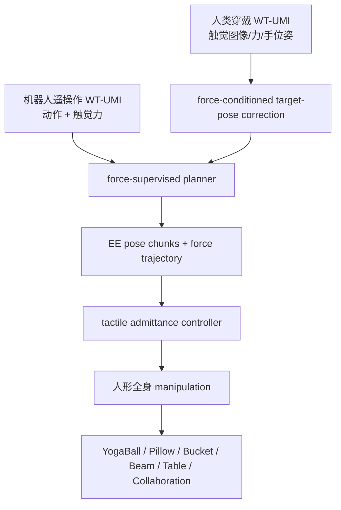

# WT-UMI

**WT-UMI**（*Whole-Body Tactile UMI for Force-Supervised Humanoid Manipulation*）把 UMI 式示范接口扩展为 **全身触觉与力监督**：同一套穿戴式触觉系统可由人类示范者穿戴，也可安装在人形机器人上，从而桥接「人类自然受力」与「机器人可执行动作」。

## 一句话定义

WT-UMI 用全身触觉图像和接触力把人类/遥操作示范转成力监督末端轨迹，并由触觉 admittance controller 在接触丰富任务中闭环调节执行。

## 英文缩写速查

| 缩写 | 英文全称 | 简要说明 |
|------|----------|----------|
| WT-UMI | Whole-Body Tactile Universal Manipulation Interface | 全身触觉 UMI 示范/控制接口 |
| UMI | Universal Manipulation Interface | 轻量示范采集接口谱系 |
| RMSE | Root Mean Square Error | 力预测误差指标，单位 N |
| IK | Inverse Kinematics | 人手轨迹转机器人目标位姿时的几何求解 |
| FMT | Flow Matching Transformer | 项目页评测的策略骨干之一 |
| DiT | Diffusion Transformer | 项目页评测的扩散/生成式策略骨干之一 |

## 为什么重要

- **接触状态不只靠视觉猜**：枕头、瑜伽球、水桶、横梁、协作搬运等任务中，压住、滑动、偏心载荷很难从 RGB 可靠判断，触觉/力提供直接监督。
- **人类示范和机器人遥操作互补**：人类示范有自然力分布但无机器人动作；遥操作有机器人动作但受力不自然。WT-UMI 把两者拉到同一触觉/位姿空间。
- **力不是后处理指标**：planner 直接预测 end-effector pose chunks 与 contact-force trajectories，预测力再作为 admittance controller 参考。
- **跨策略骨干有效**：项目页对 ViT-FMT、ViT-DiT、π0.5、Ψ0 做 admittance ablation，接触漂移和成功率在多个任务上改善。

## 流程总览

## 核心原理（详细）

### 1. 全身触觉接口

WT-UMI 的传感目标不是只给腕部视觉，而是提供 **tactile images、contact forces、end-effector poses**。这使示范数据能显式包含接触分布和力幅值，适合笨重、柔性、共享负载对象。

### 2. Target-Pose Correction

人类手轨迹不能直接作为机器人末端目标，因为人体接触点、臂长、躯干姿态与机器人不同。WT-UMI 用测得的 tactile、pose、force 输入学习 correction，把人类手轨迹修正为更接触感知的机器人目标。

### 3. Force-Supervised Planner

planner 输出的不只是位置块，还包括接触力轨迹。项目页报告力预测：Human 数据 Force RMSE **1.05 N**、lag **68 ms**；Teleoperation 数据 Force RMSE **2.07 N**、lag **151 ms**。这说明自然人类力更平滑，但和机器人动作空间之间仍要 correction。

### 4. Admittance 执行层

预测接触力作为 admittance controller 的参考：当实际触觉力偏离目标时，末端目标产生柔顺修正。关键效果体现在 contact establishment time 从 **1.08 s** 降到 **0.58 s**，contact drift 从 **18.69 mm** 降到 **12.47 mm**。

## 关键实验数字

| 对比 | 平均成功率 | 接触漂移 | 建立接触时间 |
|------|------------|----------|--------------|
| Raw Human | Failed | - | - |
| Raw Teleoperation | 85.35% | 18.60 mm | 1.00 s |
| Human Correction | 89.29% | 18.69 mm | 1.08 s |
| Human Correction + Admittance | **96.15%** | **12.47 mm** | **0.58 s** |

跨骨干 admittance ablation 中，ViT-FMT 在 Bucket 任务成功率 **80% → 92%**；π0.5 在 Yogaball **88% → 92%**、Pillow **68% → 76%**。也存在 π0.5 Bucket **84% → 76%** 的退化，说明 admittance 需要和策略分布匹配，不是无条件增益。

## 源码运行时序图

**不适用**：项目页按钮标注 **Code (Coming Soon)**。截至 2026-07-22 未在官方页面确认可运行训练/推理仓库；页面列出 Dataset 与 Hardware Guide，但当前 wiki 不把它们等同为可运行代码发布。

## 工程实践（含开源状态）

| 项 | 结论 |
|----|------|
| 项目页 | <https://wt-umi.github.io/WTUMI/> |
| 代码 | Code Coming Soon；未确认可运行 GitHub |
| 数据/硬件 | 项目页列出 Dataset、Hardware Guide 入口，需后续核查具体 URL 与许可证 |
| 控制接口 | 力监督 planner + tactile admittance controller |
| 适用对象 | bulky rigid、deformable objects、human-humanoid collaboration |

## 局限与风险

- **硬件复制成本高**：全身触觉接口比纯视觉/手柄遥操作更难规模化。
- **力监督依赖传感一致性**：触觉阵列安装位置、标定和延迟会直接影响 admittance 稳定性。
- **admittance 不是总是提升成功率**：部分策略/任务组合出现成功率下降，说明控制层与策略输出分布要联合调参。
- **代码未开放**：截至核查日不能完整复现实验，只能依据项目页和论文理解方法。

## 关联页面

- [Loco-Manip 接触分类 02：接触表示](../overview/loco-manip-contact-category-02-contact-representation.md)
- [Loco-Manip 8 篇技术地图](../overview/loco-manip-8-papers-technology-map.md)
- [触觉阻抗控制](../methods/tactile-impedance-control.md)
- [力位混合控制](../concepts/hybrid-force-position-control.md)
- [CHIP](./paper-hrl-stack-36-chip.md)
- [HMC](./paper-loco-manip-161-039-hmc.md)

## 参考来源

- [loco_manip_survey_07_wt_umi.md](../../sources/papers/loco_manip_survey_07_wt_umi.md)
- [loco_manip_8_papers_catalog.md](../../sources/papers/loco_manip_8_papers_catalog.md)
- [wechat_embodied_ai_lab_loco_manip_8_papers_survey.md](../../sources/blogs/wechat_embodied_ai_lab_loco_manip_8_papers_survey.md)
- [motion_cerebellum_64_catalog.md](../../sources/papers/motion_cerebellum_64_catalog.md)
- [loco-manip-contact-category-02-contact-representation](../overview/loco-manip-contact-category-02-contact-representation.md)
- [wechat_embodied_ai_lab_loco_manip_contact_survey.md](../../sources/blogs/wechat_embodied_ai_lab_loco_manip_contact_survey.md)
- 官方项目页：<https://wt-umi.github.io/WTUMI/>
- arXiv: <https://arxiv.org/abs/2606.13232>

## 推荐继续阅读

- [WT-UMI 项目页](https://wt-umi.github.io/WTUMI/)
- [BifrostUMI](./paper-bifrost-umi.md) — UMI 谱系对照
- [Contact-Rich Manipulation](../concepts/contact-rich-manipulation.md)
