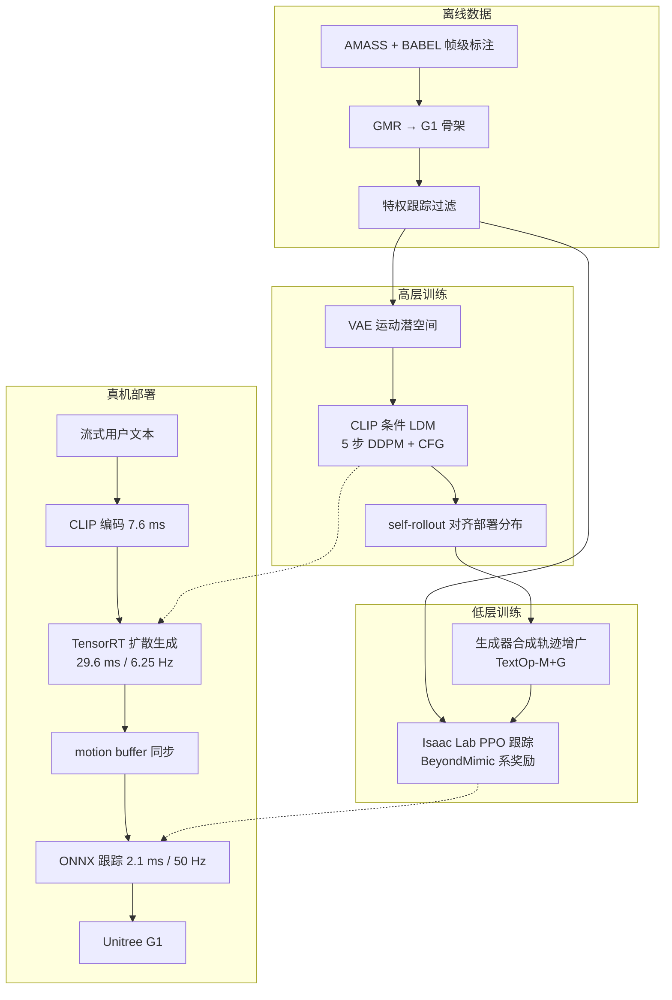
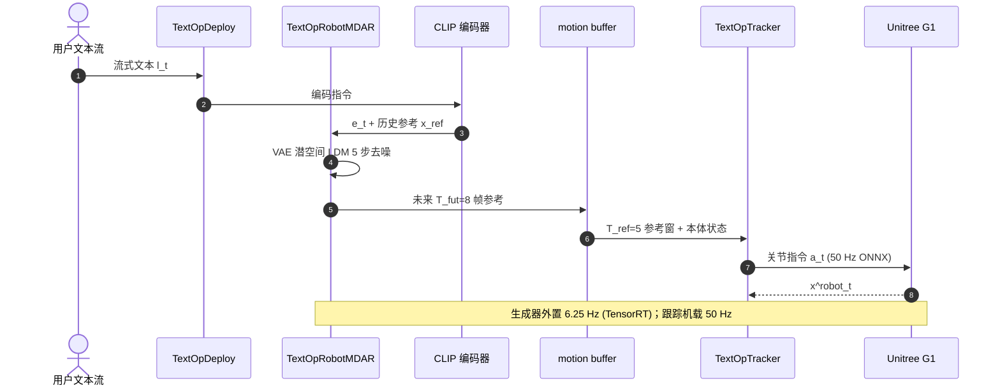

# TextOp

**TextOp**（[arXiv:2602.07439](https://arxiv.org/abs/2602.07439)，[项目页](https://text-op.github.io/)，[GitHub](https://github.com/TeleHuman/TextOp)）由 **中国电信人工智能（TeleAI）**、**上海交通大学（SJTU）**、**华东理工大学（ECUST）**（Weiji Xie / Jiakun Zheng / Jinrui Han / Jiyuan Shi / Weinan Zhang / Chenjia Bai / Xuelong Li）提出：把 **流式自然语言** 当作可中途改写的控制信号，用 **高层自回归运动扩散 + 低层通用跟踪** 在 **Unitree G1** 上实现实时交互式全身运动。收录于 [人形 Loco-Manip 161 篇](../overview/humanoid-loco-manip-161-papers-technology-map.md) **#022 / 01 运控基座** 与 **#105 / 04 生成式语言控制**（canonical 仅此页）。

## 一句话定义

**语言与运动都是时变流：高层每步用 CLIP 条件扩散自回归产出 8 帧机器人骨架参考，低层 RL 跟踪器在 50 Hz 把它落成 G1 关节指令，从而支持执行中随时改令。**

## 英文缩写速查

| 缩写 | 英文全称 | 简要说明 |
|------|----------|----------|
| TextOp | Text-driven humanoid motion generation and control | 本文框架：流式文本 + 两层生成–跟踪 |
| LDM | Latent Diffusion Model | 高层运动生成骨干，配合 VAE 潜空间 |
| CFG | Classifier-Free Guidance | 推理语义对齐；scale \(\sigma_{\mathrm{CFG}}=5\) |
| WBC | Whole-Body Control | 低层全身跟踪将参考转为可执行力矩/位置 |
| G1 | Unitree G1 Humanoid | 29 DoF 真机平台；机载 ONNX + 外置 TensorRT |
| MPJPE | Mean Per Joint Position Error | 跟踪保真度；真机长时域约 34–154 mm 量级 |

## 为什么重要

- **填补交互缺口：** 通用人形跟踪已成熟，但多数系统仍靠预录轨迹或持续遥操作；TextOp 把 **动画界的流式文本生成** 接到 **真机 WBC**，语言可在执行中改写。
- **机器人骨架表征：** 相对 HumanML3D / RobotMDM，**DoF 局部增量特征** 更贴合单 DoF 关节；BABEL val 上段级 FID **3.072**、R@1 **0.300** 优于多种表征基线。
- **生成器–跟踪器对齐：** 用生成器产出 **31.48 h** 合成轨迹增广跟踪训练（TextOp-M+G），Sim2Sim 对生成参考 Succ **0.993**。
- **真机证据完整：** 「一镜到底」多技能串联、扰动恢复、用户交互延迟 **0.73±0.10 s**；截至 **2026-09-16 已开源**（MIT）。
- **后续工作的基线锚点：** [SafeFlow](./paper-loco-manip-161-104-safeflow.md) 以其为物理安全对照；[ADAPT](./paper-adapt-text-driven-humanoid.md) 用其跟踪策略采数据，并报告 Offline TextOp Success **0.522**；[PAMoR](./paper-pamor.md) / [ReactiveBFM](./paper-reactivebfm.md) 将其纳入文本运动或开环级联对照。

## 核心信息

| 项 | 内容 |
|----|------|
| **机构** | 中国电信人工智能（TeleAI）；上海交通大学（SJTU）；华东理工大学（ECUST） |
| **venue** | arXiv 预印本（2026-02-06；arXiv:2602.07439） |
| **平台** | Unitree G1（29 DoF）；跟踪 **50 Hz** 机载，生成 **6.25 Hz** 外置 RTX 4090 |
| **数据** | AMASS+BABEL（83,478 段–文本对）+ 私有舞蹈/武术；GMR 重定向 + 特权跟踪过滤 |
| **开源** | **已开源** — [TeleHuman/TextOp](https://github.com/TeleHuman/TextOp)；`TextOpRobotMDAR` / `TextOpTracker` / `TextOpDeploy` |
| **161 坐标** | #022 · [01 运控基座](../overview/loco-manip-161-category-01-motion-base-wbt.md)；#105 · [04 生成式语言控制](../overview/loco-manip-161-category-04-generative-language-trajectory.md) |

## 流程总览

## 核心原理

### 两层分解

每步 \(t\) 接收语言 \(l_t\) 与历史参考 \(x^{\mathrm{ref}}_{t-T_{\mathrm{hist}}:t-1}\)（\(T_{\mathrm{hist}}=2\)），生成器输出未来 \(T_{\mathrm{fut}}=8\) 帧参考；跟踪策略 \(\pi\) 结合本体状态与 \(T_{\mathrm{ref}}=5\) 帧参考窗输出关节指令 \(a_t\)。

### 高层：自回归运动扩散

- **表征：** 根姿态三角编码、接触、关节位姿与增量等 **DoF 局部增量特征**（非 HumanML3D 人体表征）。
- **架构：** DART 式 **VAE + Transformer LDM**；CLIP 文本嵌入；训练用 self-rollout 把预测未来当作下段历史。
- **推理：** 5 步 DDPM 去噪，CFG scale 5。

### 低层：动态运动跟踪

- **训练：** 单阶段 PPO + MLP；奖励/域随机化沿 BeyondMimic。
- **TextOp-M+G：** 动捕 + 生成器合成轨迹混合训练，部署时对生成参考 Succ **0.993**（表 IV），优于仅动捕 TextOp-M 与 GMT / TWIST2 / Any2Track 等公开 checkpoint。

### 与相邻范式

| 维度 | TextOp | [ADAPT](./paper-adapt-text-driven-humanoid.md) | [SafeFlow](./paper-loco-manip-161-104-safeflow.md) |
|------|--------|-----------------------------------------------|-----------------------------------------------------|
| 架构 | 生成参考 + 跟踪（两阶段） | 端到端扩散先验 + 残差 | 物理引导流 + 安全门 + 跟踪 |
| 交互 | 流式改令，延迟 ~0.73 s | 50 Hz 在线换 prompt | 流式，全栈 ~67.7 Hz |
| 物理安全 | 依赖跟踪兜底 | 残差防摔 | 生成期物理引导 + 运行时门控 |
| 开源 | **已开源** | 未开源 | 未开源 |

## 评测

### 真机长时域（30 s，表 I）

| 文本流 | Succ | \(E_{\mathrm{g-mpjpe}}\) ↓ | \(E_{\mathrm{mpjpe}}\) ↓ |
|--------|------|---------------------------|--------------------------|
| Random 采样 | 16/20 | 337.2 mm | 153.9 mm |
| Loop "punch" | 10/10 | 355.6 mm | 123.6 mm |
| "wave right hand" | 8/10 | 316.5 mm | 72.2 mm |
| "strum guitar…" | 10/10 | 191.6 mm | 88.7 mm |
| "play the violin" | 10/10 | 107.6 mm | 33.9 mm |

手动扰动下可恢复并继续执行文本指令（图 5）。

### 实时性能（表 II）

| 阶段 | 延迟 |
|------|------|
| 文本编码 | 7.64±2.56 ms |
| 运动生成器 | 29.63±3.56 ms |
| 跟踪策略 | 2.15±0.11 ms |
| **用户交互**（打字→物理响应） | **0.73±0.10 s** |

### 离线生成（BABEL val，表 III 节选）

| 方法 | FID ↓ | R@1 ↑ | 过渡 FID ↓ |
|------|-------|-------|------------|
| DART+Retarget | 4.837 | 0.230 | 5.249 |
| HumanML3D 表征 | 6.599 | 0.197 | 9.310 |
| RobotMDM 表征 | 5.134 | 0.262 | 6.514 |
| **TextOp** | **3.072** | **0.300** | **3.238** |

### 跟踪（生成器参考，Sim2Sim，表 IV 节选）

| 方法 | Succ ↑ | \(E_{\mathrm{mpjpe}}\) ↓ |
|------|--------|---------------------------|
| TextOp-M+G | **0.993** | **34.7 mm** |
| TWIST2 | 0.922 | 58.5 mm |
| GMT | 0.834 | 103.1 mm |
| Any2Track | 0.714 | 139.2 mm |

## 结论

**TextOp 把「流式改令」做成了可部署的两阶段栈：机器人骨架扩散负责语义与多模态采样，RL 跟踪负责物理可执行；开源仓库覆盖训练到 G1 部署，但尚无环境感知。**

1. **交互延迟 ~0.73 s 是系统级指标** — 含人机打字与网络同步，不是单模块 30 ms 生成延迟；评估交互性应读表 II 全链路。
2. **表征选择直接决定生成质量** — DoF 增量特征在 FID/R@1 上显著优于 HumanML3D/RobotMDM 适配；过渡平滑略逊于 DART+Retarget（重定向带来关节平滑）。
3. **跟踪器必须用生成器数据增广** — TextOp-M+G 在生成参考上 Succ 0.993；仅动捕 TextOp-M 在未见 SnapMoGen 上泛化更好，部署应优先 M+G 混合。
4. **真机长时域并非 100%** — Random 流 16/20、「wave」8/10；读 demo 时应连同指令难度与 MPJPE 一起看。
5. **物理安全不是本文重点** — [SafeFlow](./paper-loco-manip-161-104-safeflow.md) 报告其 JV **43.14%**、系统 Succ **80.6%**；若面向开放域文本，需额外安全层或物理引导生成。
6. **开环级联有系统性风险** — [ReactiveBFM](./paper-reactivebfm.md) 指出 TextOp+SONIC 开环扰动成功率仅 **64.5%**；快速改令场景应评估闭环重规划。
7. **复现入口已开放** — [TeleHuman/TextOp](https://github.com/TeleHuman/TextOp)（MIT）；README 注明 2026-02 后部分数据集仍在更新，但三模块入口清晰。

## 源码运行时序图

部署时生成器在外置 GPU 工作站上以 TensorRT 运行，跟踪策略在 G1 机载 ONNX Runtime 执行；`TextOpDeploy` 负责 sim2sim（MuJoCo）与 sim2real 网络同步。详见 [textop 仓库](../../sources/repos/textop.md) 与 [USAGE.md](https://github.com/TeleHuman/TextOp/blob/main/USAGE.md)。

## 工程实践

| 项 | 内容 |
|----|------|
| 仓库 | [TeleHuman/TextOp](https://github.com/TeleHuman/TextOp)（MIT） |
| 模块 | `TextOpRobotMDAR`（训练/推理扩散）· `TextOpTracker`（PPO 跟踪）· `TextOpDeploy`（部署） |
| 权重 | README 提供 RobotMDAR 与 Tracker 预训练 checkpoint |
| 数据 | `dataset/` 脚本处理 AMASS+BABEL/LAFAN1；官方称仅用公开数据可接近论文性能 |
| 依赖栈 | Isaac Lab 训练跟踪；BeyondMimic 系奖励；GMR 重定向 |
| 已知限制 | 无相机/障碍感知；2026-02 后「最新数据集」仍在更新（README News） |
| 源码运行时序图 | 见上节（适用） |

## 常见误区

1. **把 TextOp 当成端到端语言策略** — 它是 **生成 + 跟踪** 两阶段；与 [ADAPT](./paper-adapt-text-driven-humanoid.md) / LangWBC 的端到端扩散不同。
2. **忽略开环 exposure bias** — 跟踪偏差会使上层生成脱离训练分布；扰动场景需 [ReactiveBFM](./paper-reactivebfm.md) 类闭环。
3. **用情感 prompt 当连续风格控制** — [PAMoR](./paper-pamor.md) 显示 TextOp 加情感词 Top-1 仅 chance；V-A 平面是更可解释替代。
4. **161 双槽位 ≠ 两篇论文** — #022 与 #105 是同一 canonical 实体在不同策展分类下的坐标。

## 与其他页面的关系

- 技术地图：[humanoid-loco-manip-161-papers-technology-map.md](../overview/humanoid-loco-manip-161-papers-technology-map.md)
- 物理安全对照：[SafeFlow](./paper-loco-manip-161-104-safeflow.md)
- 端到端扩散对照：[ADAPT](./paper-adapt-text-driven-humanoid.md)
- 情感/风格调制：[PAMoR](./paper-pamor.md)
- 闭环重规划：[ReactiveBFM](./paper-reactivebfm.md)
- 硬件平台：[Unitree G1](./unitree-g1.md)

## 参考来源

- [textop_arxiv_2602_07439.md](../../sources/papers/textop_arxiv_2602_07439.md) — arXiv 深读归档（主来源）
- [textop 项目页](../../sources/sites/textop.md) — 开源核查与演示
- [textop 仓库](../../sources/repos/textop.md) — GitHub 结构与复现入口
- [loco_manip_161_survey_022_textop.md](../../sources/papers/loco_manip_161_survey_022_textop.md) — 161 策展摘录（#022）
- [loco_manip_161_survey_105_textop.md](../../sources/papers/loco_manip_161_survey_105_textop.md) — 161 策展摘录（#105）

## 推荐继续阅读

- 官方演示：<https://youtu.be/nKxE7ff1FwY>
- 深读笔记（Robot_Learning_Paper_Notebooks）：<https://imchong.github.io/Robot_Learning_Paper_Notebooks/papers/04_Loco-Manipulation_and_WBC/TextOp__Real-time_Interactive_Text-Driven_Humanoid_Robot_Motion_Generation_and_C/TextOp__Real-time_Interactive_Text-Driven_Humanoid_Robot_Motion_Generation_and_C.html>
- DART 交互运动生成（高层架构渊源）：<https://arxiv.org/abs/2410.05260>
