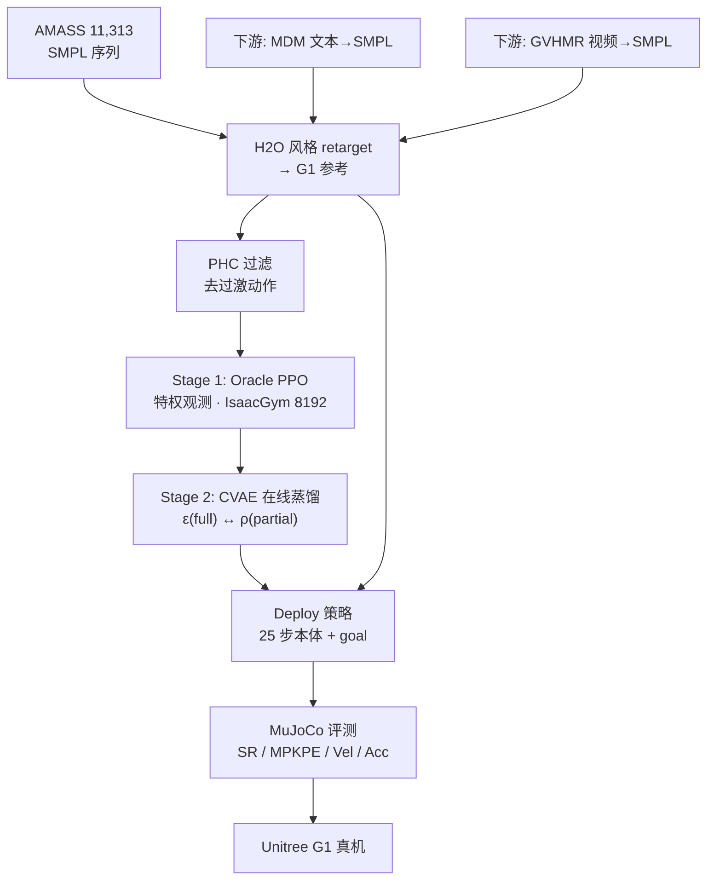

# UniTracker：通用全身运动跟踪（CVAE + 特权蒸馏）

**UniTracker**（*Learning Universal Whole-Body Motion Tracker for Humanoid Robots*，[arXiv:2507.07356](https://arxiv.org/abs/2507.07356)，[项目页](https://yinkangning0124.github.io/Humanoid-UniTracker/)）由 **上海交通大学、上海人工智能实验室、上海创智学院、北京大学** 等联合提出：在 **Unitree G1** 上用 **两阶段** 管线——仿真 **Oracle 特权策略（PPO）** → **CVAE 在线蒸馏** 为可部署通才 tracker，在部分观测下仍保持动作多样性与全局一致性，并支持 **MDM 文本生成** 与 **GVHMR 视频估计** 等训练外参考源。

本页同时收录于 [人形 Loco-Manip 161 篇长文](https://mp.weixin.qq.com/s/pACh9EhsISiyPGdiiR0C3A) **第 024/161** 篇（**01 运控基座与通用全身跟踪**）；161 清单早期摘要误写「相机/多视角观测」，**以 arXiv 正文为准：deploy 侧为 25 步本体历史 + 稀疏 goal，不依赖视觉**。

## 一句话定义

**用仿真特权 Oracle 训出高保真跟踪，再以 CVAE 把 full-observation 的全局意图对齐到 partial-observation prior，蒸馏成单策略 G1 tracker——相对 MLP+DAgger 更稳、更泛化，并可直接接文本/视频生成的参考流。**

## 英文缩写速查

| 缩写 | 英文全称 | 简要说明 |
|------|----------|----------|
| WBT | Whole-Body Tracking | 全身参考运动跟踪 |
| CVAE | Conditional Variational Autoencoder | 条件变分自编码器；本文用于 latent 运动多样性建模 |
| PPO | Proximal Policy Optimization | Oracle 阶段策略优化算法 |
| SR | Success Rate | 跟踪成功率 |
| MPKPE | Mean Per Keypoint Position Error | 关键点位置平均误差 |
| PHC | Perpetual Humanoid Control | AMASS 动作可行性过滤（去过激序列） |
| SMPL | Skinned Multi-Person Linear Model | 人体网格参数化；AMASS 与 retarget 中间表示 |
| G1 | Unitree G1 Humanoid | 29 DoF 人形平台；本文控 23 DoF（锁腕） |
| OOD | Out-of-Distribution | 训练分布外参考动作 |
| MDM | Motion Diffusion Model | 文本→人体 motion 生成（下游之一） |
| GVHMR | （项目引用）单目视频→SMPL | 视频 motion 估计（下游之一） |

## 为什么重要

- **结构对症：** 指出 MLP 在 **部分观测** 下难以维持 **全局朝向/意图**，teacher–student 纯 DAgger 还会 **牺牲 motion diversity**；CVAE + prior/encoder 对齐是显式补 latent 多样性。
- **161 地图坐标：** 属 **01 运控基座与通用全身跟踪**，与 [TWIST](./paper-twist.md)、[Humanoid-GPT](./paper-humanoid-gpt.md) 等同列「通才 tracker」线，但路线是 **CVAE 蒸馏** 而非 Transformer scaling 或遥操作数据环。
- **下游可接：** 同一 deploy 策略可跟踪 **AMASS retarget**、**MDM 文本 motion**、**GVHMR 视频 motion**，适合作为 loco-manip 上层「参考从哪来都行」的底座。
- **真机证据：** G1 上拉伸、武术、舞蹈、高踢、踢球、深蹲等 **单网络** 演示（项目页 + 论文 Fig. 1）。

## 核心信息

| 字段 | 内容 |
|------|------|
| 编号（161 清单） | 024/161 · 01 运控基座与通用全身跟踪 |
| arXiv | [2507.07356](https://arxiv.org/abs/2507.07356)（2025-07-10） |
| 项目页 | <https://yinkangning0124.github.io/Humanoid-UniTracker/> |
| **机构** | 上海交通大学（SJTU）；上海人工智能实验室；上海创智学院；北京大学（PKU）；浙江大学（ZJU）；复旦大学（Fudan）；香港科技大学（广州）（HKUST-GZ）；上海科技大学（ShanghaiTech） |
| 平台 | Unitree G1，29 DoF → **控 23 DoF**（6 腕关节锁定）；真机高约 1.3 m |
| 仿真 | IsaacGym，**8192** 并行 env，domain randomization；MuJoCo sim-to-sim |
| 数据 | AMASS → **11,313** SMPL 序列；H2O 风格两阶段 retarget；**PHC** 过滤过激动作 |
| 开源（截至 2026-09-18） | **确认未开源**：GitHub 仅为项目页镜像；Code 按钮未启用；无权重 |

## 核心原理

### 两阶段训练（arXiv v1）

| 阶段 | 输入观测 | 输出 | 要点 |
|------|----------|------|------|
| **Oracle（teacher）** | 仿真特权：刚体位姿/速度、关节量、goal 一帧差分等 | 23D 关节 PD 目标 | PPO + 课程奖励/终止/RSI |
| **CVAE 蒸馏（student）** | Deploy：25 步本体历史 + 稀疏 goal | 同动作空间 | online distillation；**ε(z\|full)** 对齐 **ρ(z\|partial)** |

> **项目页文案** 另述「第三阶段 adaptation module」微调难序列；**arXiv v1 正文以两阶段 CVAE 管线为主**。若后续版本或代码发布 third stage，以官方仓库为准更新。

### Deploy 观测（与 161 清单纠偏）

- **本体：** \(q_{t-25:t}, \dot q_{t-25:t}\)，根角速度、重力向量、历史动作（**无相机/多视角**）。
- **Goal：** 参考高度、根朝向/速度差、相对根位移等稀疏目标量。
- **CVAE：** Actor 输入 \((s^{p-deploy}, s^{g-deploy}, z)\)；若把 reference **再显式喂给 actor**，latent 作用消失，行为退化为普通 DAgger（论文消融）。

### 流程总览

## 源码运行时序图

**不适用**（截至 2026-09-18）：[yinkangning0124/Humanoid-UniTracker](https://github.com/yinkangning0124/Humanoid-UniTracker) 仅托管项目页静态文件，**无** `train` / `eval` / checkpoint 入口（归档见 [sources/repos/humanoid-unitracker.md](../../sources/repos/humanoid-unitracker.md)）。

代码发布后预期路径：AMASS+retarget → IsaacGym Oracle PPO → CVAE distillation → MuJoCo 评测 → G1 真机 PD 环。

## 工程实践

| 项 | 建议 / 论文设定 |
|----|----------------|
| **何时考虑 UniTracker** | 需要 **单策略** 跟大量 retarget 参考，且 deploy **只有本体+稀疏 goal**；怀疑 MLP+DAgger 在 OOD/朝向上漂移 |
| **何时先用别的** | 今天要跑通复现 → [TWIST](./paper-twist.md) / [YAHMP](./paper-yahmp.md) / [Humanoid-GPT](./paper-humanoid-gpt.md) 等 **已开源** tracker；要极致 scaling → Humanoid-GPT；要消融试验台 → YAHMP |
| **数据** | 务必 **PHC 过滤**；未过滤训练会过激、MPKPE 与 action rate 恶化（Fig. 4） |
| **架构** | 第二段 **保留 CVAE latent**；勿把 reference 再堆进 actor 输入（latent 会被忽略） |
| **开源** | 截至入库日 **无训练代码**；选型时按「方法可读、代码待发布」处理 |

## 评测与指标

**仿真（Table I · All AMASS Train Dataset）：**

| 方法 | SR↑ | MPKPE↓ | Vel-Dist↓ | Acc-Dist↓ |
|------|-----|--------|-----------|-----------|
| Train from Scratch | 58.32 | 145.59 | 12.35 | 10.11 |
| DAgger w/o CVAE | 88.21 | 84.79 | 5.60 | 2.97 |
| **UniTracker (Ours)** | **91.83** | **82.62** | **4.27** | **1.83** |

- 论文称 **单网络** 可跟 **8k+**  motions（含高动态）；指标另有 sim-to-sim、噪声级消融与 lateral squat 等 OOD 定性例（Fig. 3）。
- **真机：** G1 多样动作；未在本页搬运全部逐条 benchmark。
- **下游：** MDM 文本、GVHMR 视频 → retarget → 仿真/真机均可跟踪。

## 结论

**UniTracker 的价值在于用 CVAE 把「全局运动意图」锁进 latent，让 partial-observation 的 deploy 策略不必在 MLP+DAgger 里牺牲多样性——G1 上单策略 SR/MPKPE 全面优于无 CVAE 基线，但工程上仍等官方训练栈。**

1. **真影响：CVAE + prior/encoder 对齐** — 相对 DAgger w/o CVAE，SR **+3.6 pt**、MPKPE **−2.2**（同表）；显式 reference 进 actor 则 latent 失效。
2. **真影响：PHC 数据过滤** — 未过滤 AMASS 训练明显更过激、更不适合真机部署。
3. **真影响：Oracle 特权阶段** — 相对 from-scratch，SR 自 58→92 量级，说明 distill 之前的高保真 teacher 是前提。
4. **部署读法：** Deploy **不依赖视觉**；25 步本体历史 + 稀疏 goal，适合作为 loco-manip 低层 tracker。
5. **下游读法：** 同一策略可吃 MDM/GVHMR 外部参考，适合「参考源多样化」系统栈。
6. **工程读法：** **确认未开源**（2026-09-18）；复现前只能读论文/settings，不能假设 GitHub 仓可跑。
7. **与 scaling 路线对照：** [Humanoid-GPT](./paper-humanoid-gpt.md) 走 **2B 帧 + Transformer**；UniTracker 走 **CVAE 结构 + 蒸馏**，数据规模论文未强调到 billion 级。

## 常见误区

1. **161 清单「相机/多视角」描述已过时** — 正文为 proprio + goal，不是 VLA 式视觉跟踪。
2. **GitHub 仓 ≠ 训练代码** — 仅为 Nerfies 项目页；Code 按钮在 HTML 中被注释。
3. **通才 tracker ≠ 任务语义** — 本工作解决 reference tracking，不替代上层 loco-manip 规划或操作意图。
4. **项目页「三阶段」与 arXiv v1** — 以 PDF 两阶段为准；第三 adaptation 待代码/新版论文核实。

## 与其他页面的关系

- 161 技术地图：[humanoid-loco-manip-161-papers-technology-map.md](../overview/humanoid-loco-manip-161-papers-technology-map.md)
- 分类 hub：[loco-manip-161-category-01-motion-base-wbt.md](../overview/loco-manip-161-category-01-motion-base-wbt.md)
- 选型指南：[humanoid-motion-tracking-method-selection.md](../queries/humanoid-motion-tracking-method-selection.md)
- 同 teacher–student 线：[TWIST](./paper-twist.md)
- Scaling 对照：[Humanoid-GPT](./paper-humanoid-gpt.md)、[YAHMP](./paper-yahmp.md)

## 参考来源

- [unitracker_arxiv_2507_07356.md](../../sources/papers/unitracker_arxiv_2507_07356.md) — arXiv 摘要、方法、Table I 与开源核查
- [humanoid-unitracker-github-io.md](../../sources/sites/humanoid-unitracker-github-io.md) — 项目页与 Code 未启用结论
- [humanoid-unitracker.md](../../sources/repos/humanoid-unitracker.md) — GitHub 镜像仓结构
- [loco_manip_161_survey_024_unitracker.md](../../sources/papers/loco_manip_161_survey_024_unitracker.md) — 161 篇策展摘录
- [wechat_embodied_ai_lab_humanoid_loco_manip_161_survey.md](../../sources/blogs/wechat_embodied_ai_lab_humanoid_loco_manip_161_survey.md)

## 推荐继续阅读

- [Loco-Manipulation 任务页](../tasks/loco-manipulation.md)
- [Privileged Training 概念页](../concepts/privileged-training.md)
- 官方 arXiv PDF：<https://arxiv.org/pdf/2507.07356>
