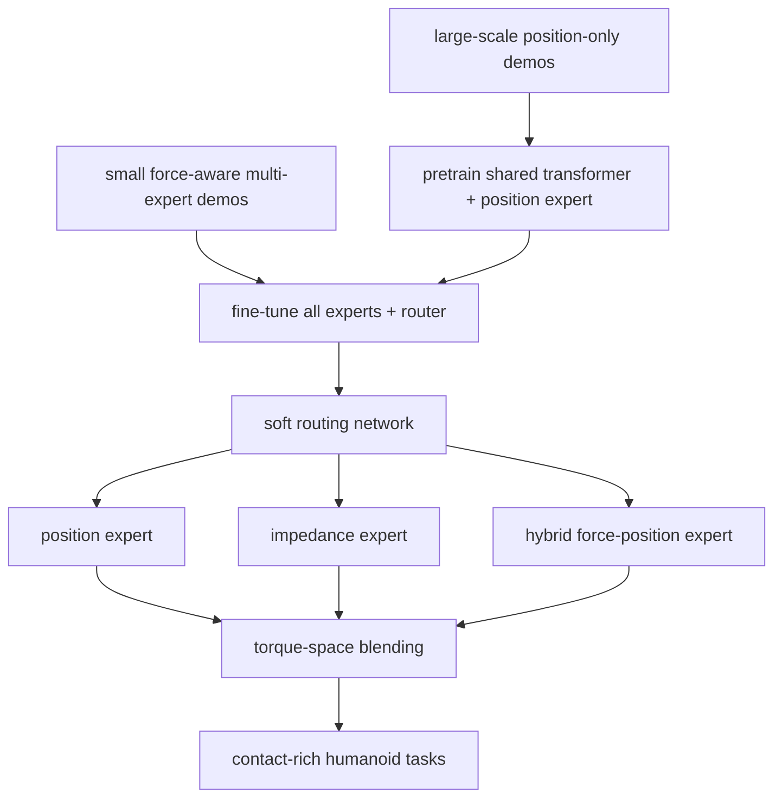

# HMC

**HMC**（*Learning Heterogeneous Meta-Control for Contact-Rich Loco-Manipulation*）关注一个工程上很真实的问题：同一个人形任务里，free-space 需要精准位置控制，擦拭/插入需要柔顺，抽屉/门又需要力位混合。HMC 用 torque-space blending 和 mixture-of-experts policy 学习何时切换/混合这些控制模式。

## 一句话定义

HMC 是一种异构元控制框架，用连续控制模式混合和专家路由，让人形机器人在接触丰富任务中自适应选择位置、阻抗和力位混合控制。

## 英文缩写速查

| 缩写 | 英文全称 | 简要说明 |
|------|----------|----------|
| HMC | Heterogeneous Meta-Control | 异构元控制，本文核心方法 |
| MoE | Mixture of Experts | HMC-Policy 的专家路由结构 |
| ACT | Action Chunking Transformer | 对比 imitation policy 基线 |
| IK | Inverse Kinematics | 位置控制/遥操作中常见几何层 |
| WBC | Whole-Body Control | 多模式 torque blending 的身体控制背景 |
| C.S. | Cartesian Space | 策略专家的笛卡尔空间输出之一 |

## 为什么重要

- **控制模式单一会失败**：高刚度插入会抖动/过力；低刚度又不能对齐/发力。HMC 把模式选择作为策略输出的一部分。
- **遥操作和 policy 共用接口**：HMC-Controller 同时服务人类示范采集与自主策略部署，减少示范/执行接口不一致。
- **数据利用更现实**：大量 position-only demonstrations + 少量 fine-grained force-aware demonstrations，比全量高质量力控示范更可获得。
- **真机任务贴近接触本质**：螺母插入拧紧、peg-in-hole、擦白板、开门、整理椅子、微波炉、穿衣/拍背按摩等。

## 流程总览

## 核心原理（详细）

### 1. HMC-Controller

HMC-Controller 将 position、impedance、hybrid force-position controller 的 action 连续混合到 torque space。它不是硬切状态机，而是允许 stiffness/force profile 平滑变化；这对插入、擦拭、开门等任务尤其重要。

### 2. HMC-Policy

策略采用异构专家结构：先用大量位置示范训练 shared transformer trunk 和 position expert，获得强泛化的 free-space prior；再用较少力感知多专家数据微调所有参数，soft router 学习在不同接触阶段混合专家输出。

### 3. 为什么比 ACT(meta) 更合适

ACT 适合动作 chunk imitation，但如果输出只落在单一控制 profile，遇到 contact-rich 任务时要么太硬，要么太软。HMC 把控制 profile 本身显式纳入动作空间，降低模仿策略承担的物理补偿难度。

## 评测与结果

> 论文与项目页 <https://loco-hmc.github.io> 未公开逐任务量化表，本节按可核实的定性结论整理，具体数字以原文为准（索引级）。

- **任务族：** 螺母插入拧紧、peg-in-hole、擦白板、开门 / 开抽屉、整理椅子、微波炉开关、穿衣 / 拍背按摩等接触丰富真机任务，覆盖 free-space、柔顺接触与力位混合三类物理需求。
- **主对照：** 以 ACT(meta) 等单一控制 profile 的模仿基线为参照——单 profile 遇 contact-rich 任务要么太硬（抖动 / 过力）要么太软（对不齐 / 发不出力）。
- **主结论：** 在上述 challenging 真机任务上，HMC 相对基线取得 **超过 50% 的相对提升**（论文口径）。
- **配方取向：** 强调「大量 position-only 示范预训练 + 少量 force-aware 多专家数据微调 + soft router」的组合价值；论文未公开逐项消融数字，本页不臆造具体百分比。

## 源码运行时序图

**不适用**：官方项目页 <https://loco-hmc.github.io> 未列出训练/部署 GitHub；可访问的 `loco-hmc` GitHub 账户仅有项目页仓库。暂无官方可运行实现。

## 工程实践（含开源状态）

| 项 | 结论 |
|----|------|
| 项目页 | <https://loco-hmc.github.io> |
| 代码 | 未开放可运行训练/部署代码，仅见项目页仓库 |
| 控制接口 | position / impedance / hybrid force-position torque-space blending |
| 策略 | shared transformer trunk + multi-expert heads + soft router |
| 报告效果 | 真机 challenging tasks 相对 baselines **over 50% relative improvement** |

## 与其他工作对比

对照本页 [核心原理](#核心原理详细) 中明确点名的基线与 [关联页面](#关联页面) 的相关工作，均为定性维度：

| 维度 | HMC | ACT(meta) 单 profile 模仿 | [WT-UMI](./paper-loco-manip-07-wt-umi.md) |
|------|-----|---------------------------|-------------------------------------------|
| 控制模式 | position / impedance / hybrid 力位在 torque space **连续混合** | 单一控制 profile | tactile admittance 柔顺执行 |
| 模式选择 | soft router **显式纳入动作空间** | 由网络隐式补偿物理 | 力监督参考 + admittance 修正 |
| 数据配方 | 大量位置示范 + 少量力感知示范 | 单类示范 | 人类 / 遥操作触觉力数据 |
| 力信息角色 | 混合控制目标之一 | 无显式力项 | planner 预测力 + 执行参考 |
| 主要侧重 | **控制模式路由** | 动作 chunk 模仿 | 示范接口 + 力监督规划 |

核心差异在于 HMC 把 **控制 profile 本身** 显式纳入动作空间，降低模仿策略承担的物理补偿难度；这与 [WT-UMI](./paper-loco-manip-07-wt-umi.md) 从触觉力监督侧、admittance 执行侧切入接触丰富任务形成互补，而非替代。

## 局限与风险

- **需要力感知示范**：少量即可，但采集与标注 stiffness/profile 仍是工程成本。
- **控制器实现依赖硬件力矩接口**：不同人形的低层力矩/阻抗可控性会影响迁移。
- **未开放代码**：难以复现实验和 profile blending 细节。
- **高层任务规划不在本文核心**：HMC 解决接触控制模式，不自动解决任务分解。

## 关联页面

- [Loco-Manip 接触分类 04：接触后如何稳住](../overview/loco-manip-contact-category-04-post-contact-stability.md)
- [161 篇 · 02 上半身接口](../overview/loco-manip-161-category-02-upper-body-interface.md)
- [力位混合控制](../concepts/hybrid-force-position-control.md)
- [阻抗控制](../concepts/impedance-control.md)
- [WT-UMI](./paper-loco-manip-07-wt-umi.md)
- [FALCON](./paper-loco-manip-161-109-falcon.md)

## 参考来源

- [loco_manip_161_survey_039_hmc.md](../../sources/papers/loco_manip_161_survey_039_hmc.md)
- [humanoid_loco_manip_161_catalog.md](../../sources/papers/humanoid_loco_manip_161_catalog.md)
- [wechat_embodied_ai_lab_humanoid_loco_manip_161_survey.md](../../sources/blogs/wechat_embodied_ai_lab_humanoid_loco_manip_161_survey.md)
- [loco-manip-contact-category-04-post-contact-stability](../overview/loco-manip-contact-category-04-post-contact-stability.md)
- [wechat_embodied_ai_lab_loco_manip_contact_survey.md](../../sources/blogs/wechat_embodied_ai_lab_loco_manip_contact_survey.md)
- 官方项目页：<https://loco-hmc.github.io>

## 推荐继续阅读

- [HMC 项目页](https://loco-hmc.github.io)
- [Hybrid Force-Position Control](../concepts/hybrid-force-position-control.md)
- [Tactile Impedance Control](../methods/tactile-impedance-control.md)
