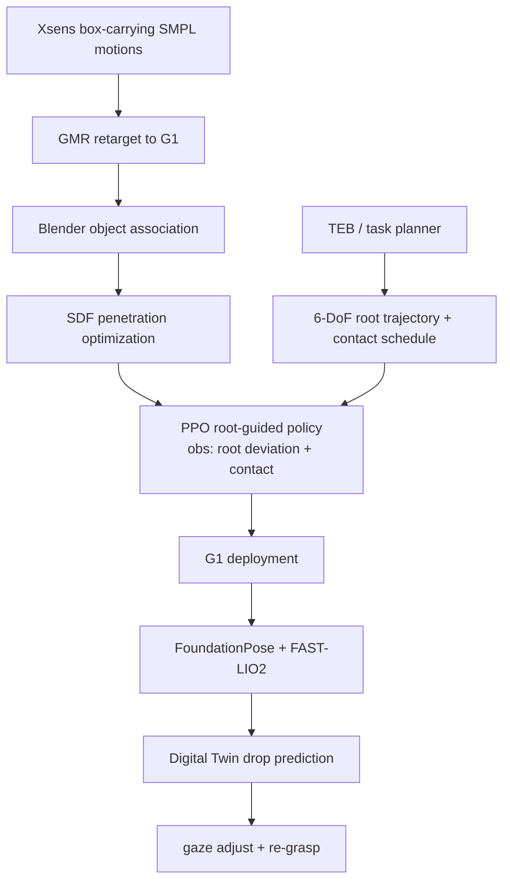

# Pro-HOI

**Pro-HOI**（*Perceptive Root-guided Humanoid-Object Interaction*）把人形抱箱/搬运任务的高层接口改写为 **root trajectory + desired contact state**：策略不再观测完整参考动作，而只根据根轨迹、接触状态和本体信息学习何时蹲、抓、走、放，并通过数字孪生处理物体掉落后的恢复。

## 一句话定义

Pro-HOI 用根轨迹作为可规划接口、用接触状态编码任务阶段、用 digital twin 做失效恢复，从而让 Unitree G1 在箱子搬运中实现可控、泛化和可恢复的闭环 HOI。

## 英文缩写速查

| 缩写 | 英文全称 | 简要说明 |
|------|----------|----------|
| Pro-HOI | Perceptive Root-guided Humanoid-Object Interaction | 根轨迹引导的人形物体交互框架 |
| HOI | Humanoid/Human-Object Interaction | 人形机器人与物体交互任务 |
| SDF | Signed Distance Field | 用于修正手物穿透的几何损失 |
| PPO | Proximal Policy Optimization | 训练 root-guided policy 的 RL 算法 |
| TEB | Timed Elastic Band | 部署时用于长程避障的局部路径规划器 |
| FAST-LIO2 | Fast LiDAR-Inertial Odometry 2 | 真机根位姿估计模块 |

## 为什么重要

- **根轨迹成为高层通用接口**：导航、避障、搬运不再靠完整全身参考轨迹驱动，而由 root trajectory 编码任务进展。
- **参考动作只做奖励**：避免策略过拟合一条人类/重定向全身轨迹，提升物体初始位置和目标位置泛化。
- **恢复机制清晰**：物体掉落后，FoundationPose 视野丢失时用 MuJoCo digital twin 预测落点，再调整 gaze 和 re-grasp。
- **真机部署完整**：论文声称全部模块运行在 Unitree G1 onboard Jetson NX，D435i + Mid-360 LiDAR 支撑闭环。

## 流程总览

## 核心原理（详细）

### 1. 数据准备：从人体抱箱到机器人参考

论文采集 box-carrying human motions（SMPL）并用 GMR 重定向到 G1。由于普通 HOI 重定向缺少物体状态，作者在 Blender 中用 `Child Of` 约束手工关联物体与末端，再用 SDF loss 优化接触阶段手物穿透。这个过程不是为了让策略逐帧跟踪，而是为了提供奖励中的风格/接触参考。

### 2. Root-guided observation

目标观测为 `g_t = [Δp_root, Δr_root, c_t]`：根位置/朝向偏差 + 二值接触状态。垂直根运动提示蹲/站，水平根运动提示运输，`c_t` 提示是否应保持接触。策略动作是 **29 DoF joint position targets**，由 PD 转为力矩。

### 3. 训练与部署差异

critic 可访问 privileged 信息，actor 只用真机可得观测；训练时加入摩擦、恢复系数、关节偏置、质心偏移、物体质量、外推扰动等 domain randomization。部署时 D435i 给物体，Mid-360 + FAST-LIO2 给根状态，控制环约 **50 Hz**，物体感知约 **40 Hz**，状态估计约 **200 Hz**。

### 4. Digital Twin recovery

掉落检测逻辑：当期望接触 `c_t=1` 但相对物体位置偏差在窗口 `N=10` 内超过安全区域（约 **0.4 × 0.2 × 0.4 m**）时触发。Digital Twin 用最近物体状态和速度在 MuJoCo 中模拟落体/碰撞，预测最终落点后让机器人转头重新检测并 re-grasp。

## 关键实验数字

| 指标 | 结果 |
|------|------|
| MuJoCo 场景规模 | OOD 网格、物体 yaw、4 m 目标圈共 **5,756** distinct scenarios |
| OOD grasp success | Ours w/ FR. **99.93%**；PhysHSI **82.54%** |
| OOD task success | Ours w/ FR. **88.38%**；PhysHSI **70.17%** |
| Root tracking | Ours RPE **0.22 ± 0.02 m**，ROE **5.77 ± 0.41 rad** |
| 真机速度档 | Slow 0.2 m/s、Middle 0.4 m/s、Fast 0.6 m/s |
| 真机中速长测 | **21/28** grasp success，placement precision **0.16 m** |
| 连续搬运 | 论文/图示报告 **over 15 continuous carrying cycles** |

## 源码运行时序图

**不适用**：官方项目页 <https://pro-hoi.github.io/> 在本次核查中未确认可运行 GitHub 仓库；arXiv HTML 仅提供方法与项目页说明。若后续项目页补代码，应增加 `train/play/deploy` 运行图。

## 工程实践（含开源状态）

| 项 | 结论 |
|----|------|
| 项目页 | <https://pro-hoi.github.io/> |
| 代码 | 截至 2026-07-22 未确认官方可运行仓库 |
| 硬件 | Unitree G1，D435i，Mid-360 LiDAR，Jetson Orin/NX 级 onboard compute |
| 软件模块 | FoundationPose、FAST-LIO2、MuJoCo digital twin、TEB local planner、LCM 通信 |
| 训练 | Isaac Lab，高性能平台 8×RTX 3090；PPO Actor MLP `[512,256,128]` |

## 与其他工作对比

对照论文在 [关键实验数字](#关键实验数字) 中直接比较的基线与 [关联页面](#关联页面) 的相关工作，均为定性维度（具体数字见评测表）：

| 维度 | Pro-HOI | [PhysHSI](./paper-amp-survey-15-physhsi.md) | 完整参考动作跟踪类 |
|------|---------|---------------------------------------------|--------------------|
| 高层接口 | root trajectory + desired contact state | 全身参考驱动 | 逐帧全身参考 |
| 参考动作角色 | **只做奖励**，不作观测 | 作为跟踪目标 | 观测 + 跟踪目标 |
| 泛化 | 物体初始 / 目标位置泛化更强（见评测） | OOD 明显退化 | 易过拟合单条轨迹 |
| 失效恢复 | digital twin 预测落点 + re-grasp | 无显式恢复 | 一般无 |
| 感知闭环 | FoundationPose + FAST-LIO2 onboard | — | — |

核心差异在于 Pro-HOI 用 **root trajectory + contact state** 取代完整参考动作作为可规划接口，并把参考动作降级为奖励项——相对 [PhysHSI](./paper-amp-survey-15-physhsi.md) 等把全身参考作为跟踪目标的方法，这带来更强的物体位置泛化，并叠加 digital twin 的掉落恢复能力。

## 局限与风险

- **对象类别窄**：核心实验围绕 box carrying，root-guided 接口对抽屉、门、工具等接触拓扑是否足够仍待验证。
- **仍需 mesh/pose 估计**：FoundationPose 与 Digital Twin 假设有对象模型；未知/变形物体会更难。
- **recovery 是工程状态机 + 仿真预测**：鲁棒但不等于 learned recovery policy，复杂碰撞可能误判落点。
- **代码未开放**：目前无法复现训练 pipeline 与真机部署细节。

## 关联页面

- [Loco-Manip 接触分类 02：接触表示](../overview/loco-manip-contact-category-02-contact-representation.md)
- [161 篇 · 03 视觉感知驱动](../overview/loco-manip-161-category-03-visuomotor.md)
- [CEER](./paper-motion-cerebellum-ceer.md)
- [FALCON](./paper-loco-manip-161-109-falcon.md)
- [PhysHSI](./paper-amp-survey-15-physhsi.md)
- [OmniRetarget](./paper-hrl-stack-03-omniretarget.md)

## 参考来源

- [loco_manip_161_survey_074_pro-hoi.md](../../sources/papers/loco_manip_161_survey_074_pro-hoi.md)
- [humanoid_loco_manip_161_catalog.md](../../sources/papers/humanoid_loco_manip_161_catalog.md)
- [wechat_embodied_ai_lab_humanoid_loco_manip_161_survey.md](../../sources/blogs/wechat_embodied_ai_lab_humanoid_loco_manip_161_survey.md)
- [loco-manip-contact-category-02-contact-representation](../overview/loco-manip-contact-category-02-contact-representation.md)
- [wechat_embodied_ai_lab_loco_manip_contact_survey.md](../../sources/blogs/wechat_embodied_ai_lab_loco_manip_contact_survey.md)
- Lin et al., *Pro-HOI: Perceptive Root-guided Humanoid-Object Interaction*, arXiv:2603.01126, 2026. <https://arxiv.org/abs/2603.01126>

## 推荐继续阅读

- [Pro-HOI arXiv HTML](https://arxiv.org/html/2603.01126)
- [FoundationPose](https://nvlabs.github.io/FoundationPose/)
- [FAST-LIO2](https://github.com/hku-mars/FAST_LIO)
