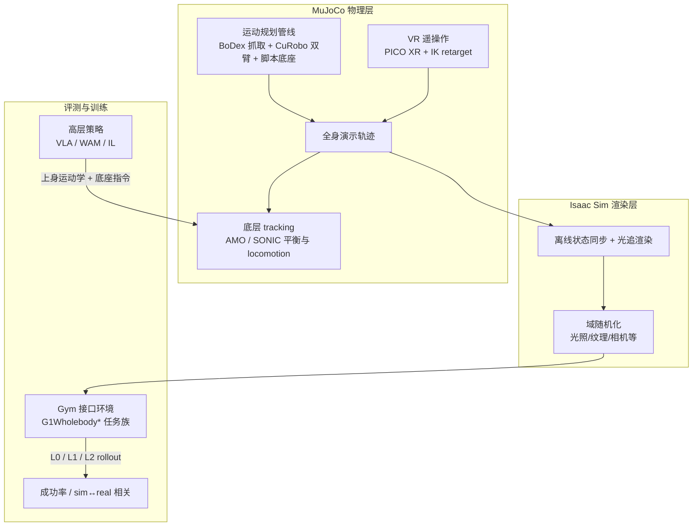

# SIMPLE（Simulation-Based Policy Learning and Evaluation for Humanoid Loco-manipulation）

**SIMPLE** 是 [USC Physical Superintelligence (PSI) Lab](https://psi-lab.ai/) 提出的 **人形全身 loco-manipulation 统一仿真 testbed**（arXiv:2606.08278，2026-06）。它同时覆盖 **策略评测、演示数据采集与 Gym 式训练接口**，而非单篇 VLA/WAM 算法论文。本页亦收录于 [具身智能研究室 · 人形 Loco-Manip 161 篇长文](https://mp.weixin.qq.com/s/pACh9EhsISiyPGdiiR0C3A) **第 075/161** 篇（03 视觉感知驱动的人形移动操作）；**161 策展初稿将 SIMPLE 误述为「VLA+世界模型预测轨迹」**，以本文与 [arXiv 原文](https://arxiv.org/abs/2606.08278) 为准。

## 一句话定义

SIMPLE 用 **MuJoCo（接触物理）+ Isaac Sim（光追渲染）** 双引擎构建大规模人形 loco-manipulation 仿真环境（60 任务、50 室内场景、1000+ 物体），内置 **运动规划** 与 **VR 遥操作** 两条数据采集管线，并以 **L0/L1/L2 域随机化** 统一 benchmark **Ψ₀、GR00T、π₀.₅、DreamZero** 等 9 类策略；实验表明 **仿真排序与真机高度一致**，且纯仿真数据可 **零样本迁移真机**。

## 英文缩写速查

| 缩写 | 英文全称 | 简要说明 |
|------|----------|----------|
| SIMPLE | SIMulation-based Policy Learning and Evaluation | 本文 benchmark 与全栈仿真 testbed 名称 |
| Loco-Manip | Loco-Manipulation | 行走与操作动力学耦合的全身任务 |
| VLA | Vision-Language-Action | 视觉-语言-动作多模态策略（SIMPLE 评测对象之一） |
| WAM | World-Action Model | 世界-动作模型（如 DreamZero，SIMPLE 评测对象之一） |
| DR | Domain Randomization | 域随机化；SIMPLE 评测分 L0/L1/L2 三级 |
| WBC | Whole-Body Control | 全身控制；底层 AMO/SONIC tracking 维持平衡与 locomotion |
| IK | Inverse Kinematics | 逆运动学；VR 遥操作手部 retarget 与运动规划双臂轨迹 |

## 为什么重要

- **填补评测空白：** 桌面/轮式仿真 benchmark（LIBERO、SimplerEnv、RoboCasa 等）难覆盖 **动态行走 + 全身平衡 + 灵巧操作**；SIMPLE 是首批 **full-stack 人形 loco-manipulation testbed** 之一。
- **可预测的 sim↔real 排序：** 在 9 策略 × 6 任务族上，**仿真成功率排序与真机实验强相关**——使「先在 SIMPLE 里筛 checkpoint」对人形 foundation model 具备工程可信度（与 [仿真评测基础设施](../concepts/simulation-evaluation-infrastructure.md) 叙事对齐）。
- **数据采集标准化：** 运动规划（BoDex + CuRobo）与 PICO XR VR 遥操作共用同一 MuJoCo 物理栈；仿真内遥操作 **310 demos/hr**（全身 pick-place），显著高于纯运动规划 **59 demos/hr**，降低 whole-body 演示工程门槛。
- **零样本 sim-to-real 验证：** 仅在 SIMPLE 数据上微调的单一策略，Pick & Place **Sim 0.90 / Real 0.80**、Handover **Sim 1.00 / Real 0.80**，**无真机 fine-tune**——证明 testbed 不仅可评测，也可作为 **训练数据来源**。

## 流程总览

## 核心机制（归纳）

### 双仿真器解耦架构

- **MuJoCo：** 刚体动力学、接触解析、高频 robot control——保证 humanoid locomotion 与 hand-object 接触的 **物理可信度**（与 AMO/SONIC 等运控栈兼容）。
- **Isaac Sim：** 每步同步物理状态，输出 **光追级** egocentric / 多视角观测——支撑 VLA/WAM 对视觉多样性的需求。
- **控制分层：** 高层策略（Ψ₀、π₀.₅、GR00T 等）输出上身 kinematic trajectory 与 base navigation；**底层 tracking controller** 高频维持平衡与行走。

### 资产与任务规模

| 维度 | 规模 |
|------|------|
| 全身任务 | **60**（刚性取放、非抓取交互、铰接操作等） |
| 室内场景 | **50** |
| 物体资产 | **1000+** |
| 采集轨迹 | **6000+** |
| Benchmark 策略 | **9**（Ψ₀、GR00T N1.6、π₀.₅、InternVLA、H-RDT、DreamZero、EgoVLA、DP、ACT） |

### 数据采集两条管线

1. **运动规划（自动化）：** 物体落稳 → BoDex 合成抓取 → CuRobo 双臂轨迹 + 脚本化底座移动；无需操作员，但 demos/hr 较低。
2. **VR 遥操作（人类）：** PICO XR egocentric 双目流；手部 IK retarget，平衡/locomotion 由 tracking policy 托管；仿真内遥操作最快且可无限离线 replay 渲染。

## 评测：三级协议（L0 / L1 / L2）

- 对训练环境施加 **渐进 OOD 域随机化**（视觉、布局、动力学扰动等，详见论文 Sec.4）。
- 每任务 **10** 次 rollout 报成功次数；项目页以 `L0 / L1 / L2` 三列展示。
- **读点：** Ψ₀、DreamZero 在多数任务 L0/L1 领先；GR00T N1.6、InternVLA 在 **Mobile P&P** 等高动态任务 L2 骤降——暴露 whole-body OOD 鲁棒性差异。

### 消融与 sim-to-real（代表性数字）

| 实验 | 结论 |
|------|------|
| DR 混合（5×L0 + 5×L1 训练） | 相对纯 L0，在更难评测集上泛化更好 |
| 遥操作数据 scaling（10→100 traj） | XmoveBendPick Set 0：**0.50 → 1.00** |
| 数据来源（MP only vs Teleop only） | 平均成功率 **5.00 vs 7.56 / 10**——遥操作演示更利于 VLA 微调 |
| 零样本 sim-to-real | Pick & Place **0.90→0.80**；Handover **1.00→0.80**（sim→real，无真机 FT） |

## 核心信息

| 字段 | 内容 |
|------|------|
| 161 编号 | 075/161 · 03 视觉感知驱动的人形移动操作 |
| 机构 | 南加州大学 Physical Superintelligence (PSI) Lab |
| 作者 | Songlin Wei, Zhenhao Ni, Jie Liu, Zhenyu Zhao, Junjie Ye, Hongyi Jing, Junkai Xia, Xiawei Liu, Michael Leong, Liang Heng, Di Huang, Yue Wang |
| arXiv | <https://arxiv.org/abs/2606.08278> |
| 项目页 | <https://psi-lab.ai/SIMPLE> |
| 代码 | <https://github.com/physical-superintelligence-lab/SIMPLE>（**已开源**） |
| 评测数据 | Hugging Face [`USC-PSI-Lab/psi-data/simple-eval`](https://huggingface.co/datasets/USC-PSI-Lab/psi-data/tree/main/simple-eval) |
| 发表 | 2026 年 6 月 |

## 工程实践与开源状态

- **已开源：** GitHub 仓库含环境、数据采集与多 VLA 评测集成；HF 托管 OOD 评测场景。
- **复现入口：** 以 `physical-superintelligence-lab/SIMPLE` README 为准；底层依赖 AMO/SONIC 全身 tracking 与 Isaac Sim 渲染栈。
- **与 Ψ₀ 关系：** SIMPLE 由同一 PSI Lab 维护，benchmark 表将 **Ψ₀** 作为强基线；Ψ₀ 模型细节见 [Psi0（161 #156）](./paper-loco-manip-161-156-psi0.md)。

## 常见误区

1. **SIMPLE 不是 VLA 论文**——它是 **仿真 benchmark + 数据/评测基础设施**；VLA/WAM 是被评测的对象。
2. **161 策展摘录分类为「视觉感知驱动」合理，但机制描述曾不准确**——核心是 **双仿真器 testbed**，而非「世界模型提供物理先验再出动作头」。
3. **高仿真成功率 ≠ 可忽略底层 WBC**——策略仍依赖 AMO/SONIC 等 tracking；换运控栈或机器人 embodiment 需重新标定。
4. **运动规划数据不能替代一切**——论文与项目页均显示 **遥操作数据** 对 VLA 微调显著更优。

## 与其他页面的关系

- 技术地图：[humanoid-loco-manip-161-papers-technology-map.md](../overview/humanoid-loco-manip-161-papers-technology-map.md)
- 分类 hub：[loco-manip-161-category-03-visuomotor.md](../overview/loco-manip-161-category-03-visuomotor.md)
- 概念：[仿真评测基础设施](../concepts/simulation-evaluation-infrastructure.md)、[Sim2Real](../concepts/sim2real.md)
- 任务：[Loco-Manipulation](../tasks/loco-manipulation.md)
- 同 lab 模型：[Psi0](./paper-loco-manip-161-156-psi0.md)
- 对照 benchmark：[SimFoundry](./paper-simfoundry-real2sim-scene-generation.md)（操作侧重 real-to-sim）、[TeleOpBench](./paper-notebook-teleopbench-a-simulator-centric-benchmark-for-du.md)（双臂遥操作基准）

## 参考来源

- [simple_arxiv_2606_08278.md](../../sources/papers/simple_arxiv_2606_08278.md) — arXiv 正文编译
- [psi-lab-simple.md](../../sources/sites/psi-lab-simple.md) — 官方项目页
- [simple_usc_psi.md](../../sources/repos/simple_usc_psi.md) — GitHub 开源仓库
- [loco_manip_161_survey_075_simple.md](../../sources/papers/loco_manip_161_survey_075_simple.md) — 161 篇策展初稿（机制描述以 arXiv 为准）

## 推荐继续阅读

- [机器人论文阅读笔记：SIMPLE](https://imchong.github.io/Humanoid_Robot_Learning_Paper_Notebooks/papers/11_Simulation_Benchmark/SIMPLE__Simulation-Based_Policy_Learning_and_Evaluation_for_Humanoid_Loco-manipulation/SIMPLE__Simulation-Based_Policy_Learning_and_Evaluation_for_Humanoid_Loco-manipulation.html)
- 论文 PDF：<https://arxiv.org/pdf/2606.08278>
- [Loco-Manipulation 任务页](../tasks/loco-manipulation.md)
- [Psi0 项目页](https://psi-lab.ai/Psi0) — 同 lab 人形 loco-manipulation foundation model
