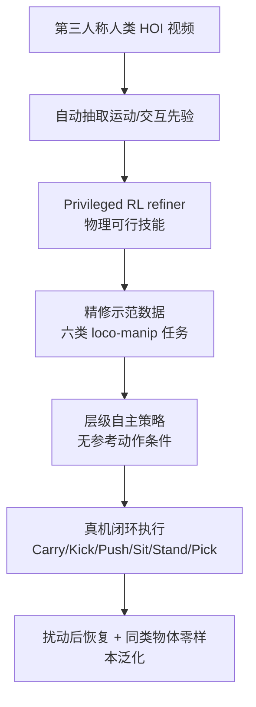
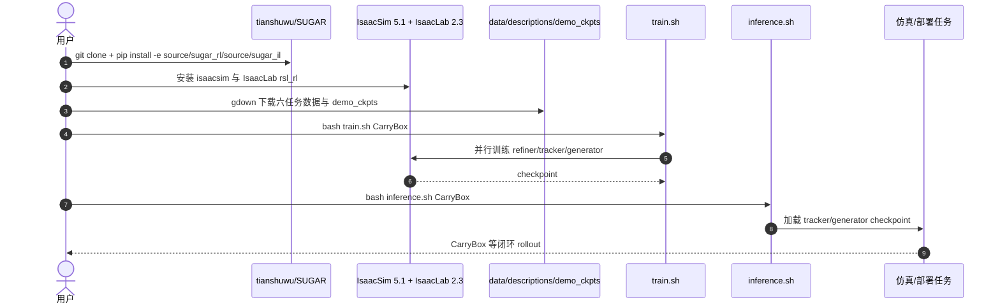

# SUGAR

**SUGAR**（*A Scalable Human-Video-Driven Generalizable Humanoid Loco-Manipulation Learning Framework*）是一条从 **第三人称人类视频** 到 **真机人形移动操作策略** 的数据闭环：先从非结构化 HOI 视频抽取运动与接触先验，再用特权 RL 将先验修正为物理可行技能，最后训练无需参考动作输入的层级自主策略。

## 一句话定义

SUGAR 用人类视频规模化生成人形 loco-manip 技能先验，并通过 RL 精修与策略蒸馏把不完美视频轨迹转成可部署的闭环机器人控制器。

## 英文缩写速查

| 缩写 | 英文全称 | 简要说明 |
|------|----------|----------|
| SUGAR | Scalable human-video-driven Generalizable humanoid loco-manipulation framework | 本文框架名，强调视频先验、技能精修与自主策略 |
| HOI | Human-Object Interaction | 人-物交互，SUGAR 的原始数据来源 |
| RL | Reinforcement Learning | privileged policy 用于把视频先验修正成物理可行技能 |
| IL | Imitation Learning | 最终层级自主策略从精修示范中学习 |
| RGB-D | Red-Green-Blue + Depth | 待发布数据处理链路涉及的人类视频输入形态 |
| IsaacLab | Isaac Lab | 官方训练实现所基于的 manager-based 仿真框架 |

## 为什么重要

- **补齐接触数据入口**：人形 HOI 真机遥操作成本高，SUGAR 直接面向人类视频，适合覆盖 carry、kick、push、sit、stand、pick 等接触多样任务。
- **不把视频轨迹直接当真值**：项目页明确指出人类视频先验有遮挡、接触伪影、重定向误差；SUGAR 用 privileged RL 先修正，再让部署策略学习。
- **部署时不依赖参考运动**：最终策略不是每步追踪视频参考，而是从观测闭环生成动作，适合长期执行、扰动恢复和同类物体零样本泛化。
- **工程开放度较高**：官方仓库已发布 inference demo、checkpoint、六任务处理数据、完整训练管线；仍未发布 RGB-D 视频到训练数据的处理管线与 sim-to-sim 管线。

## 流程总览

## 核心原理（详细）

### 1. 视频先验不是最终控制目标

SUGAR 的第一阶段只把视频变成 **kinematic interaction priors**。这些先验有两个价值：给出人类如何接近、接触和移动物体；给出可扩展的数据来源。但它们也有明显缺陷：单目/多视角视频中的接触点不精确，遮挡会造成手物穿模，人体到人形的比例差异会使脚底支撑和物体轨迹失配。

### 2. Privileged RL 技能精修

第二阶段用仿真中特权信息修正先验。其作用类似「物理清洗器」：在知道完整状态、接触和物体信息时，把原始重定向轨迹推向机器人可执行的技能分布。这样避免最终策略直接继承视频伪影，也减少为每个任务手写奖励的需求。

### 3. 层级自主策略

第三阶段训练部署策略。项目页强调推理时 **without task-specific reward engineering or reference-motion conditioning**，因此最终策略更接近可执行 skill policy，而不是离线轨迹播放器。对于长时程任务，这一点比单帧跟踪误差更关键：失败后策略还能重新进入任务状态。

### 4. 任务覆盖与泛化

项目页展示六类真实任务：Carry Box、Kick Box、Pick Bottle、Sit Chair、Stand Bottle、Push Box；并展示 significant external perturbations 后恢复、unexpected failures 后继续，以及 Carry Box、Sit Chair、Kick Box 的同类未见物体泛化。

## 评测与结果

SUGAR 的评测以项目页真机演示为主，覆盖六类接触多样的 loco-manip 任务：Carry Box、Kick Box、Pick Bottle、Sit Chair、Stand Bottle、Push Box。核心评测维度是**任务可完成性**与**闭环鲁棒性**，而非单帧跟踪误差：

- **任务完成**：六类任务均展示真机成功执行，说明「视频先验 → 特权 RL 精修 → 层级自主策略」这条链路能把非结构化人类视频转成可部署技能。
- **抗扰恢复**：项目页展示 significant external perturbations 后策略仍能稳定并继续任务，unexpected failures 后能重新进入任务状态，印证部署策略是闭环 skill policy 而非离线轨迹回放。
- **零样本泛化**：Carry Box、Sit Chair、Kick Box 在同类未见物体上展示零样本泛化能力。

> 指标说明：截至归档核查（2026-07-22），公开材料以定性真机演示与任务覆盖为主，未给出跨任务统一的量化成功率/误差表；本页对成功率、跟踪精度等指标只做**索引级**记录，具体数字以论文与项目页为准，不在此处臆造。

## 源码运行时序图

官方代码仓库 [tianshuwu/SUGAR](https://github.com/tianshuwu/SUGAR) 为 MIT 许可，根目录含 `train.sh`、`inference.sh`、`source/sugar_rl`、`source/sugar_il`、六任务数据下载和 checkpoint。一次典型复现实验如下：

## 工程实践（含开源状态）

| 项 | 结论 |
|----|------|
| 官方项目页 | <https://tianshuwu.github.io/sugar-humanoid/> |
| 官方代码 | <https://github.com/tianshuwu/SUGAR>，MIT，非空仓库 |
| 可运行入口 | `bash inference.sh TASK_NAME`、`bash train.sh TASK_NAME`；任务含 CarryBox、KickBox、PushBox、SitChair、StandBottle、PickBottle |
| 依赖 | Python 3.11、IsaacSim 5.1.0、IsaacLab v2.3.0、`source/sugar_rl`、`source/sugar_il` |
| 已开放 | inference demo、checkpoint、六任务处理数据、完整训练管线 |
| 待开放 | RGB-D human videos 到训练数据的数据处理管线、sim-to-sim 管线 |

## 与其他工作对比

SUGAR 在「以人类视频/示范规模化生成人形 loco-manip 技能」这条线上，与同库的 [HumanX](./paper-hrl-stack-05-humanx.md)、[HumanoidMimicGen](./paper-humanoidmimicgen.md) 定位相邻但取舍不同。下表为定性对照，不含跨论文可比的统一指标。

| 维度 | SUGAR | HumanX | HumanoidMimicGen |
|------|-------|--------|------------------|
| 数据来源 | 第三人称人类 HOI 视频 | 人类运动视频 | 少量 VR 遥操作示范（单 demo/任务） |
| 核心机制 | 视频抽取先验 → 特权 RL 精修 → 策略蒸馏 | XGen 合成物理合理交互数据 + XMimic 统一 imitation | 全身 IK/cuRobo + 技能 DAG 规则化合成 + Homie RL 下肢 |
| 对「不完美来源」的处理 | privileged RL 修正接触穿模/重定向误差 | XGen 恢复并增强物理合理数据（mesh/尺寸/轨迹） | 不以视频为源，用规划保证物理可行 |
| 部署接口 | 无参考动作条件的层级自主策略 | 统一交互策略，10 技能 zero-shot 迁移 G1 | GR00T N1.6 VLA / Flow / Diffusion |
| 任务侧重 | 通用移动操作（carry/kick/push/sit/stand/pick） | 敏捷交互（篮球/足球/羽毛球/搬货/反应格斗） | 桌面/搬运九任务 loco-manip 基准 |
| 开源边界 | MIT，训练/推理/checkpoint/六任务数据已开放，视频处理管线待发布 | 项目页 Code 链接失效，未确认可运行实现 | 论文+基准，强调规划驱动数据生成 |

## 局限与风险

- **上游视频处理未完全开源**：真正最难的「RGB-D 人类视频 → 训练数据」仍待发布，复现者可训练/推理但难完整复刻数据生产。
- **任务类别仍有限**：六个展示任务覆盖典型接触，但离厨房、仓储等长程开放场景仍有距离。
- **人类视频伪影仍可能残留**：privileged RL 可缓解接触穿模和重定向误差，但无法保证所有生成先验都可物理化。
- **依赖重型仿真栈**：IsaacSim/IsaacLab 版本钉定，工程复现成本高于纯 MuJoCo sim2sim。

## 关联页面

- [Loco-Manipulation](../tasks/loco-manipulation.md)
- [Loco-Manip 接触分类 01：接触数据](../overview/loco-manip-contact-category-01-contact-data.md)
- [161 篇 · 03 视觉感知驱动](../overview/loco-manip-161-category-03-visuomotor.md)
- [Imitation Learning](../methods/imitation-learning.md)
- [AMP Reward](../methods/amp-reward.md)
- [HumanX](./paper-hrl-stack-05-humanx.md)
- [HumanoidMimicGen](./paper-humanoidmimicgen.md)

## 参考来源

- [loco_manip_161_survey_076_sugar.md](../../sources/papers/loco_manip_161_survey_076_sugar.md)
- [humanoid_loco_manip_161_catalog.md](../../sources/papers/humanoid_loco_manip_161_catalog.md)
- [wechat_embodied_ai_lab_humanoid_loco_manip_161_survey.md](../../sources/blogs/wechat_embodied_ai_lab_humanoid_loco_manip_161_survey.md)
- [loco-manip-contact-category-01-contact-data](../overview/loco-manip-contact-category-01-contact-data.md)
- [wechat_embodied_ai_lab_loco_manip_contact_survey.md](../../sources/blogs/wechat_embodied_ai_lab_loco_manip_contact_survey.md)
- Wu et al., *SUGAR: A Scalable Human-Video-Driven Generalizable Humanoid Loco-Manipulation Learning Framework*, arXiv:2605.20373, 2026. <https://arxiv.org/abs/2605.20373>
- 官方代码：<https://github.com/tianshuwu/SUGAR>

## 推荐继续阅读

- [SUGAR 项目页](https://tianshuwu.github.io/sugar-humanoid/)
- [SUGAR GitHub](https://github.com/tianshuwu/SUGAR)
- [机器人论文阅读笔记：SUGAR](https://imchong.github.io/Humanoid_Robot_Learning_Paper_Notebooks/papers/04_Loco-Manipulation_and_WBC/SUGAR__A_Scalable_Human-Video-Driven_Generalizable_Humanoid_Loco-Manipulation_Learning_Framework/SUGAR__A_Scalable_Human-Video-Driven_Generalizable_Humanoid_Loco-Manipulation_Learning_Framework.html)
