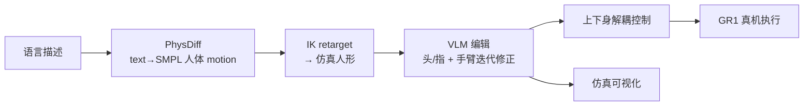

# Harmon：语言驱动的人形全身 motion 生成

**Harmon**（*Whole-Body Motion Generation of Humanoid Robots from Language Descriptions*，[arXiv:2410.12773](https://arxiv.org/abs/2410.12773)，[项目页](https://ut-austin-rpl.github.io/Harmon/)）由 **UT Austin** 与 **NVIDIA Research** 提出：在缺少大规模 **language–humanoid motion** 配对数据时，用 **人体 motion 先验 + VLM 常识编辑** 把自由文本变成可执行的 **全身参考 motion**，并在 **Fourier GR1** 上验证。

> **161 篇地图索引：** 本页同时是 [Loco-Manip 161 · #097/161](../overview/loco-manip-161-category-04-generative-language-trajectory.md) 的 **canonical 深读节点**（取代早期策展 stub 中的错误机制描述）。

## 一句话定义

**先用 PhysDiff 从语言生成 SMPL 人体 motion 并重定向到人形，再用 VLM 看渲染结果补头/指、修手臂语义，最后上下身解耦控制落地真机——Harmon 卖的是「生成 + 语义编辑」，不是端到端关节 RL 策略。**

## 英文缩写速查

| 缩写 | 英文全称 | 简要说明 |
|------|----------|----------|
| VLM | Vision-Language Model | 对渲染 motion 做常识推理与编辑 |
| IK | Inverse Kinematics | 人体→人形骨架的运动重定向 |
| SMPL | Skinned Multi-Person Linear Model | PhysDiff 输出的人体参数化表示 |
| GR1 | Fourier GR1 Humanoid | 项目页真机平台（T1/T2 两外观） |
| Loco-Manip | Loco-Manipulation | 行走与上身/操作耦合的全身任务语境 |
| WBC | Whole-Body Control | 真机侧上下身/步态与上身协调控制 |

## 为什么重要

- **数据瓶颈的务实解：** 不等待人形 scale 语言–motion 数据集，而是复用 **人体 text-to-motion**（PhysDiff）再 **跨 embodiment 映射**。
- **VLM 当编辑器而非 planner：** 解决 retarget 丢 **指/头** 与 **语义漂移**——与「更大 diffusion 直接吐关节角」路线不同。
- **与 NVIDIA 运动栈对照：** [MaskedMimic](./paper-bfm-17-maskedmimic.md) 在 [ProtoMotions](./protomotions.md) 里做 **masked inpainting 物理控制**；Harmon 更偏 **语言→参考轨迹 + VLM 修**。执行层仍可能需要跟踪/WBC，而非本文主贡献。
- **评测语境：** 操作/VLA 侧 scalable eval 见 [SIMPLER / SimplerEnv](./paper-simplerenv-real2sim-eval.md)（real-to-sim）；Harmon 解决的是 **人形全身 motion 生成**，问题域不同但同属「仿真 + 真机」闭环文化。

## 核心信息

| 项 | 内容 |
|----|------|
| **机构** | 德克萨斯大学奥斯汀分校（UT Austin）；英伟达研究院（NVIDIA Research） |
| **作者** | Zhenyu Jiang、Yuqi Xie、Jinhan Li、Ye Yuan、Yifeng Zhu、Yuke Zhu |
| **出处** | arXiv:2410.12773（2024-10） |
| **真机** | Fourier GR1-T1 / GR1-T2；手语分段（GPT-4 切句）与自由描述 |
| **开源** | **未开源**（2026-09-27 项目页无 GitHub） |

## 核心原理

### 流程总览

### 机制要点

1. **PhysDiff 先验：** 在大规模人体 motion 上训练的 **物理约束扩散** text-to-human，产出 SMPL 序列作为 **初始化**。
2. **Retarget 局限：** 人体数据缺 finger/head； kinematic mismatch 会 **改语义**（项目页 failure：T 形 timeout 手势过远）。
3. **VLM 编辑：** 渲染 humanoid motion + 原语言 → 生成 **head/finger** 子 motion；**迭代** 检查对齐并调手臂（缺 wrist orientation primitive 时会卡住）。
4. **真机：** Locomotion 与 upper-body **分开控制** 以合成全身行为。

## 源码运行时序图

**不适用**（截至 2026-09-27：官方未发布训练/推理仓库）。若未来开源，预期节点为：PhysDiff 采样 → IK → 渲染循环 → VLM API 编辑 → 轨迹导出 → 上下身控制器。

## 工程实践

| 项 | 建议 |
|----|------|
| **复现入口** | [arXiv PDF](https://arxiv.org/pdf/2410.12773) + [项目页视频](https://ut-austin-rpl.github.io/Harmon/) |
| **与执行栈衔接** | 生成物是 **参考 motion**；落地需 WBC/tracker（可参考 [ProtoMotions](./protomotions.md)、[SONIC](../methods/sonic-motion-tracking.md)） |
| **VLM 依赖** | 编辑质量受 VLM 视觉推理与 **editing primitive 覆盖** 限制；高频/大偏差人体先验错误难救 |
| **数据策略** | 若自建 pipeline，优先保证 **language–render–edit** 闭环日志，而非只堆 IK 对 |

## 评测与指标

- 论文与项目页以 **定性视频**（仿真 before/after VLM、真机跟做、手语）为主；本库未搬运 Table 级 sim 数字。
- 161 篇清单 **#097/161** 归类：**04 生成式运动、语言控制与轨迹规划**。

## 结论

**Harmon 把「语言→人形全身 motion」拆成：人体生成先验 + 跨 embodiment 映射 + VLM 语义修补，而不是一条端到端关节策略。**

1. **PhysDiff 负责 breadth**，IK 负责 embodiment，**VLM 负责 expressivity（头/指/语义）**。
2. **失败模式在编辑层暴露**——primitive 不全或人体先验大错时，VLM 不能魔法修复。
3. **真机需解耦控制**；与 loco-manip 执行文献（WBC/tracking）联读，勿把生成层当控制层。
4. **代码未开源** 前，以项目页与 arXiv 机制描述做架构参考即可。

## 局限与风险

- **无公开代码/权重**，复现成本高。
- **VLM + GPT-4 分句** 带来 API 依赖与延迟，难上高频闭环。
- **GR1 特定**；迁移其他人形需重做 retarget 与控制解耦。
- 与 [MaskedMimic](./paper-bfm-17-maskedmimic.md) 的 **物理 inpainting** 互补，不能互相替代。

## 关联页面

- [Loco-Manip 161 · 分类 04](../overview/loco-manip-161-category-04-generative-language-trajectory.md)
- [Diffusion Motion Generation](../methods/diffusion-motion-generation.md)
- [ProtoMotions](./protomotions.md) · [MaskedMimic](./paper-bfm-17-maskedmimic.md)
- [SimplerEnv 论文页](./paper-simplerenv-real2sim-eval.md) — VLA real-to-sim 评测（对照域）
- [Loco-Manipulation 任务](../tasks/loco-manipulation.md)

## 参考来源

- [Harmon arXiv 归档](../../sources/papers/harmon_arxiv_2410_12773.md)
- [Harmon 项目页归档](../../sources/sites/harmon-ut-austin-rpl.md)
- [161 篇策展摘录](../../sources/papers/loco_manip_161_survey_097_harmon.md)
- [Paper Notebooks 进度锚点](../../sources/papers/humanoid_pnb_harmon-whole-body-motion-generation-of-humanoid.md)

## 推荐继续阅读

- [arXiv:2410.12773](https://arxiv.org/abs/2410.12773)
- [Harmon 项目页](https://ut-austin-rpl.github.io/Harmon/)
- [MaskedMimic PDF（NVIDIA PAR)](https://research.nvidia.com/labs/par/maskedmimic/assets/SIGGRAPHAsia2024_MaskedMimic.pdf)
- [ProtoMotions（GitHub）](https://github.com/NVlabs/ProtoMotions)
