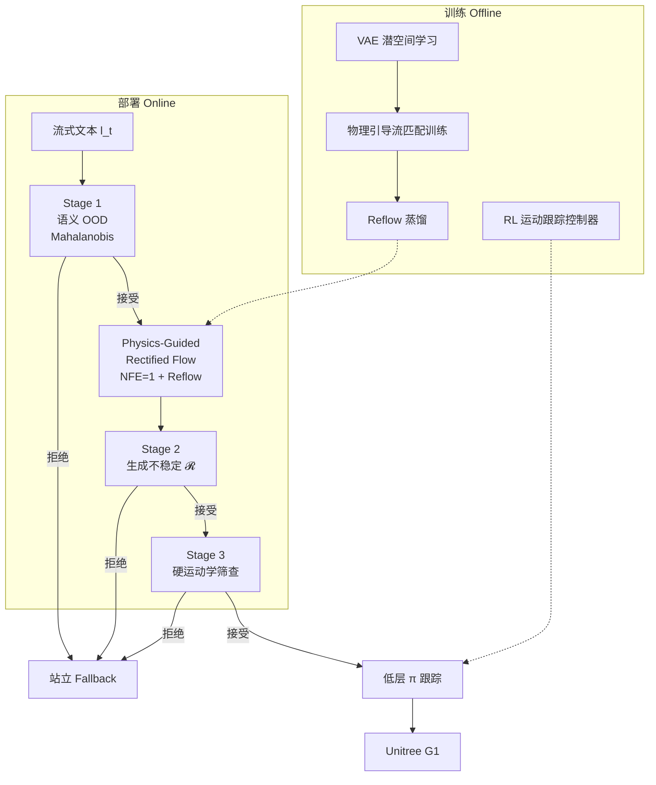

# SafeFlow

**SafeFlow**（[arXiv:2603.23983](https://arxiv.org/abs/2603.23983)，[项目页](https://hanbyelcho.info/safeflow/)）由 **三星电子（Samsung Electronics）** Future Robot AI Group 提出：在 **实时流式文本驱动人形全身控制** 场景下，把 **物理引导整流流匹配** 与 **部署时三阶段安全门** 写进同一闭环，解决纯运动学生成器的物理幻觉与 OOD 文本下的不安全参考。收录于 [人形 Loco-Manip 161 篇](../overview/humanoid-loco-manip-161-papers-technology-map.md) **#104 / 分类 04**。

## 一句话定义

**用物理引导的整流流在 VAE 潜空间实时生成可跟踪的全身参考轨迹，再用训练无关的三阶段安全门在语义、生成稳定性与运动学三层筛掉不安全输出，否则 fallback 站立。**

## 英文缩写速查

| 缩写 | 英文全称 | 简要说明 |
|------|----------|----------|
| SafeFlow | Safe Flow-based text-driven humanoid control | 本文框架：物理引导流匹配 + 选择性安全门 |
| RF / Flow | Rectified Flow Matching | 高层运动生成骨干；经 Reflow 蒸馏至 NFE=1 |
| NFE | Number of Function Evaluations | 采样步数；SafeFlow 生成器 NFE=1 以达实时 |
| OOD | Out-of-Distribution | 开放域 / 分布外文本或生成，安全门主要防御对象 |
| WBC | Whole-Body Control | 低层 RL 运动跟踪将参考转为关节指令 |
| JV / SC | Joint Violation / Self-Collision | 生成器侧关节越界率与自碰撞率 |
| MPJPE | Mean Per Joint Position Error | 跟踪误差；与不稳定分数 \(\mathcal{R}\) 单调相关 |

## 为什么重要

- **直击 TextOp 类系统的部署痛点：** 语义对齐≠物理可执行；纯运动学扩散/自回归生成在 ID 指令下也会关节越界、自碰撞，OOD 下更易结构崩塌。
- **把物理与安全写进生成链路：** 物理引导在采样期约束可执行性；Reflow 把多步引导内化到单步流，兼顾 **92.6 Hz 生成器** 与 **67.7 Hz 含安全门全栈**。
- **训练无关安全门可插拔：** Mahalanobis 语义 OOD + 方向敏感性差异 \(\mathcal{R}\) + 硬运动学筛查，不额外训分类器即可拦截如 "double backflip" 类高风险 prompt。
- **G1 真机证据硬：** 相对 TextOp，系统成功率 **80.6%→98.5%**，关节越界 **43.14%→3.08%**，并保持多样表达性行为。

## 核心信息

| 项 | 内容 |
|----|------|
| **机构** | 三星电子（Samsung Electronics）Future Robot AI Group |
| **作者** | Hanbyel Cho, Sang-Hun Kim, Jeonguk Kang, Donghan Koo |
| **venue** | arXiv 预印本（2026-03-25；arXiv:2603.23983） |
| **平台** | Unitree G1 人形；低层 RL 运动跟踪控制器（仿真训练） |
| **基线** | [TextOp](./paper-loco-manip-161-022-textop.md)（实时交互文本驱动扩散生成） |
| **开源** | **未开源**（2026-08-31：项目页无 Code/GitHub/权重链接） |
| **161 坐标** | #104 · [04 生成式运动、语言控制与轨迹规划](../overview/loco-manip-161-category-04-generative-language-trajectory.md) |

## 流程总览

## 核心原理

### 两层控制栈

| 模块 | 作用 |
|------|------|
| 高层生成器 \(G\) | 条件于历史参考 \(T_{\mathrm{hist}}=2\) 与当前文本，输出未来 \(T_{\mathrm{fut}}=8\) 帧 kinematic 参考 |
| 物理引导 | 采样期优化关节可行性、自碰撞回避、稳定性、平滑性，使参考落在真机可跟踪流形上 |
| Reflow | 蒸馏多步物理引导为 **单步** 流轨迹，生成器 **10.80 ms / 92.6 Hz** |
| 低层 \(\pi\) | RL 运动跟踪：将接受参考段转为关节指令；与 TextOp 同「流式参考 + 跟踪」范式 |
| 安全门 | 训练无关；仅 **3.98 ms** 额外开销（Stage 2 为主） |

### 三阶段安全门

1. **Stage 1 — 语义 OOD：** 文本嵌入空间 Mahalanobis 分数；拦截分布外指令。
2. **Stage 2 — 生成不稳定：** 方向敏感性差异 \(\mathcal{R}\)；高 \(\mathcal{R}\) 窗口与跟踪 MPJPE 单调相关；超阈则注入站立 prompt 并插值到预定义站姿。
3. **Stage 3 — 硬运动学：** 关节/速度极限等最后一道筛查，再交给跟踪器。

### 与 TextOp 的关键差异

| 维度 | TextOp | SafeFlow |
|------|--------|----------|
| 生成骨干 | 自回归扩散 | 物理引导整流流 + Reflow |
| 物理约束 | 主要依赖下游跟踪兜底 | 生成期物理引导 + 部署安全门 |
| OOD 处理 | 无显式运行时拒执 | 三阶段选择性执行 + fallback |
| 生成器 JV | 43.14% | 3.08%（+ Guid. & Reflow） |
| 系统 Succ. | 80.6% | 98.5% |

## 源码运行时序图

**不适用** — 截至 **2026-08-31** [项目页](https://hanbyelcho.info/safeflow/) 未列官方 GitHub、Hugging Face 或权重下载；无可辨识的训练 / 推理 / 部署入口。复现需自备 TextOp 类流式接口、整流流 + Reflow 训练栈与 G1 跟踪控制器。

## 工程实践

| 项 | 内容 |
|----|------|
| 实时预算 | 生成器 **92.6 Hz**；含三阶段安全门全栈 **67.7 Hz**（14.78 ms）；相对 TextOp 生成器 42.4 Hz 更快 |
| 安全门开销 | Stage 1 **0.006 ms**；Stage 2 **3.96 ms**；Stage 3 **0.013 ms** |
| 部署读法 | 开放域文本接口必须假设 OOD；SafeFlow 示范「生成改进 + 运行时拒执」双轨，而非只调大跟踪增益 |
| 硬件 | Unitree G1；长时域多行为（上身手势 + 全身动作）连续切换 |
| 开源 | **未开源** — 见 [safeflow-hanbyelcho.md](../../sources/sites/safeflow-hanbyelcho.md) 核查记录 |

## 评测与指标

| 方法 | JV ↓ | SC ↓ | Succ. ↑ | Empjpe ↓ | Evel ↓ | Eacc ↓ |
|------|------|------|---------|----------|--------|--------|
| TextOp | 43.14% | 11.05% | 80.6% | 81.42 | 0.23 | 10.61 |
| SafeFlow (Flow) | 12.75% | 7.25% | 92.7% | 55.32 | 0.17 | 7.98 |
| SafeFlow (+ Guid.) | 6.32% | 4.39% | 98.0% | 46.39 | 0.11 | 5.48 |
| **SafeFlow (+ Guid. & Reflow)** | **3.08%** | **1.42%** | **98.5%** | **40.89** | **0.09** | **4.54** |

- **不稳定分数 \(\mathcal{R}\)：** ID/OOD 序列上，10 帧窗口平均跟踪 MPJPE 随 \(\mathcal{R}\) 分位单调上升，支持 Stage 2 作为 leading indicator。
- **真机：** 含高风险 prompt「double backflip」；安全门拦截后机器人保持平衡并继续后续指令。

## 结论

**SafeFlow 把「实时文本人形控制」从语义生成问题推进为「可部署的物理+安全」问题：物理引导整流流负责把参考拉进可跟踪流形，三阶段安全门负责在开放域输入下拒执不可信生成，二者缺一不可。**

- 相对 TextOp，**关节越界与成功率** 的跃升主要来自 **生成期物理引导 + Reflow**，而非仅靠更大跟踪增益。
- **67.7 Hz 全栈** 说明安全门可负担——Stage 2 的 \(\mathcal{R}\) 检测是主要延迟来源，但仍是毫秒级。
- OOD 场景下 **站立 fallback** 是产品化必需模式；无安全门的流式生成在真机上不可接受。
- 与 [π₀ Policy](../methods/π0-policy.md) 等同属流匹配动作生成族，但 SafeFlow 聚焦 **人形全身运动学参考 + 跟踪栈**，而非桌面操作 chunk。
- 截至入库日 **未开源**；工程复现需对齐 TextOp 流式接口、VAE 潜空间流训练与 G1 RL 跟踪器。
- 横向对照见 [分类 04 hub](../overview/loco-manip-161-category-04-generative-language-trajectory.md) 与 [Loco-Manipulation 任务页](../tasks/loco-manipulation.md)。

## 局限与风险

- **未开源：** 物理引导目标权重、Reflow 训练细节与安全门阈值需等官方发布或自行复现。
- **平台绑定：** 实验集中在 Unitree G1 + 特定跟踪控制器；换平台需重训低层 \(\pi\) 并重标定安全阈值。
- **安全门非万能：** 训练无关筛查可降低 OOD 风险，但不能替代硬件急停与操作员监督。
- **表达性边界：** 物理引导可能抑制极端高难度动作；「double backflip」类指令被设计为拒执对象。

## 与其他页面的关系

- 技术地图：[humanoid-loco-manip-161-papers-technology-map.md](../overview/humanoid-loco-manip-161-papers-technology-map.md)
- 分类 hub：[loco-manip-161-category-04-generative-language-trajectory.md](../overview/loco-manip-161-category-04-generative-language-trajectory.md)
- 基线对照：[TextOp](./paper-loco-manip-161-022-textop.md)
- 硬件平台：[Unitree G1](./unitree-g1.md)
- 流匹配方法族：[π₀ Policy](../methods/π0-policy.md)

## 参考来源

- [safeflow_arxiv_2603_23983.md](../../sources/papers/safeflow_arxiv_2603_23983.md) — arXiv 论文归档
- [safeflow-hanbyelcho.md](../../sources/sites/safeflow-hanbyelcho.md) — 项目页与开源核查
- [loco_manip_161_survey_104_safeflow.md](../../sources/papers/loco_manip_161_survey_104_safeflow.md) — 161 篇策展摘录

## 推荐继续阅读

- [SafeFlow 项目页](https://hanbyelcho.info/safeflow/)
- [arXiv:2603.23983](https://arxiv.org/abs/2603.23983)
- [TextOp 实体页](./paper-loco-manip-161-022-textop.md) — 直接基线与流式接口对照
- [Loco-Manipulation 任务页](../tasks/loco-manipulation.md)
