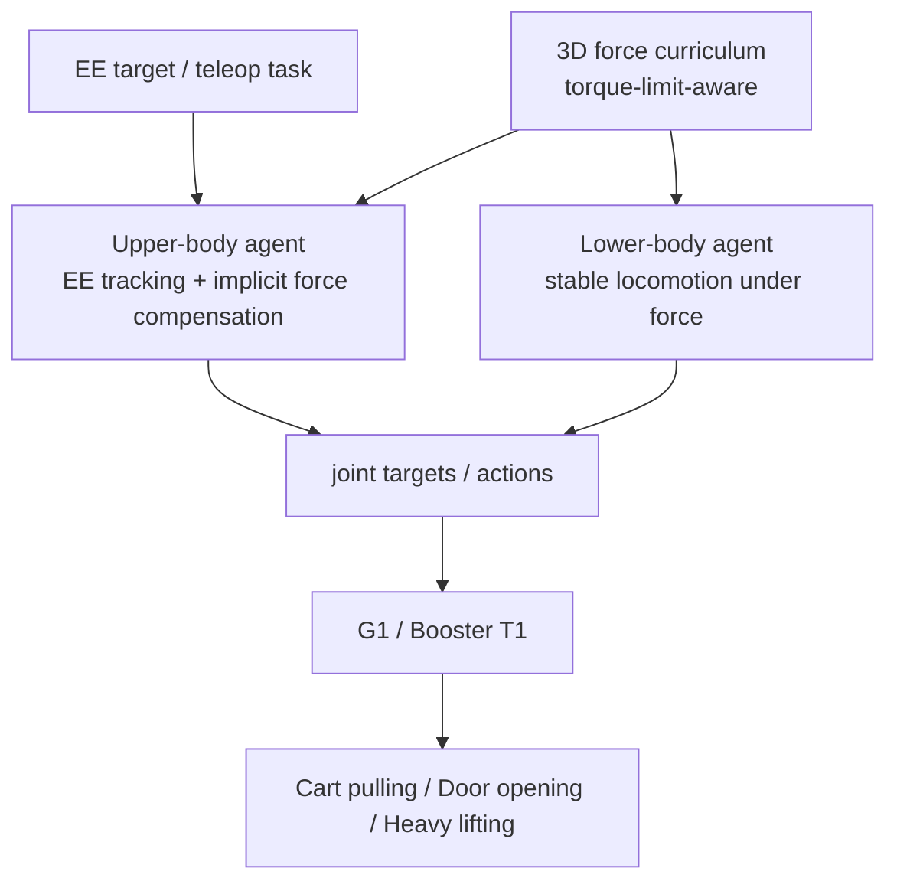
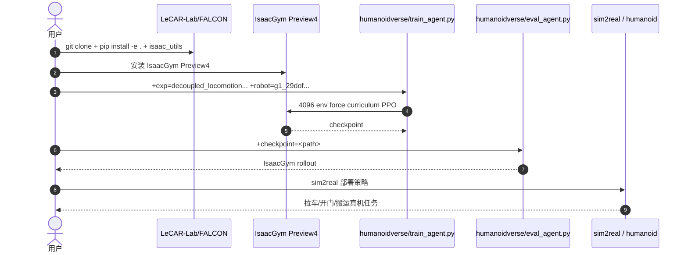

# FALCON

**FALCON**（*Learning Force-Adaptive Humanoid Loco-Manipulation*）面向拉车、开门、重物搬运等 **强力交互**，用双 agent RL 将下肢抗扰稳定和上肢末端/力交互分开训练，再通过 3D force curriculum 提升对外力的适应能力。

## 一句话定义

FALCON 是一个 force-adaptive 双 agent 人形 loco-manip 框架：下肢负责受力下稳定行走，上肢负责末端跟踪与隐式力补偿。

## 英文缩写速查

| 缩写 | 英文全称 | 简要说明 |
|------|----------|----------|
| FALCON | Force-Adaptive Loco-manipulation Control | 本文框架名 |
| RL | Reinforcement Learning | 双 agent 策略训练范式 |
| WBC | Whole-Body Control | 上下肢协调执行基础 |
| DoF | Degree of Freedom | G1/T1 策略配置均为 29 DoF |
| IsaacGym | NVIDIA Isaac Gym | 官方训练仿真后端 |
| Sim2Real | Simulation to Real | 官方仓库已发布 sim2real 代码 |

## 为什么重要

- **力不是扰动，而是任务本体**：door-opening、cart-pulling、heavy-lifting 需要持续施力；仅靠低层 locomotion + upper-body IK 容易失稳或跟踪失败。
- **上下肢分工明确**：lower-body agent 处理外力扰动下稳定，upper-body agent 跟踪末端位置并隐式补偿力。
- **跨平台叙事强**：同一训练设置部署到 Unitree G1 与 Booster T1，无需 embodiment-specific reward/curriculum tuning。
- **开源可复现**：官方 LeCAR-Lab/FALCON 已发布 training、sim2sim、sim2real 代码。

## 流程总览

## 核心原理（详细）

### 1. Dual-agent decomposition

FALCON 不把所有奖励塞给单一全身策略，而是将任务拆为两个专门 agent。这样训练时 reward 更干净：下肢不必解释复杂手部目标，上肢不必单独解决强外力下的步态稳定。

### 2. Torque-limit-aware 3D force curriculum

训练时对末端施加逐步增强的 3D 外力，同时尊重关节 torque limit。课程的目的不是让策略盲目输出更大力，而是在安全力矩边界内学习身体姿态、步态与上肢补偿的协同。

### 3. 真实任务范围

项目页报告真实任务力范围：payloads transporting **0-20 N**、cart-pulling **0-100 N**、door-opening **0-40 N**。相比 baseline（低层 RL locomotion + 上身 IK、无 force curriculum），FALCON 在重载和开门中更稳定。

### 4. 训练收敛与跟踪

摘要报告 FALCON 相对 baseline 达到 **2×** 更准确的 upper-body joint tracking，并保持受力下 locomotion 鲁棒性与更快收敛。

## 评测与结果

FALCON 的评测围绕**受力下的稳定性**与**上肢末端跟踪精度**两条主线，覆盖仿真训练与真机部署：

- **真实任务力范围**：项目页报告 payloads transporting **0-20 N**、cart-pulling **0-100 N**、door-opening **0-40 N**，说明策略能在持续外力而非瞬时扰动下维持任务。
- **跟踪精度**：摘要报告相对 baseline（低层 RL locomotion + 上身 IK、无 force curriculum）达到约 **2×** 更准确的 upper-body joint tracking，并在受力下保持 locomotion 鲁棒性与更快收敛。
- **跨平台一致性**：同一训练设置部署到 Unitree G1 与 Booster T1，无需 embodiment-specific reward/curriculum tuning，佐证 torque-limit-aware 3D force curriculum 的可迁移性。

> 指标说明：上述力范围与 2× 跟踪均为论文/项目页报告值；本页不额外补充未在原文出现的量化数字。

## 源码运行时序图

官方代码 [LeCAR-Lab/FALCON](https://github.com/LeCAR-Lab/FALCON) 为 MIT，含 `humanoidverse/train_agent.py`、`eval_agent.py`、`sim2real/`、`isaac_utils/`。

## 工程实践（含开源状态）

| 项 | 结论 |
|----|------|
| 项目页 | <https://lecar-lab.github.io/falcon-humanoid> |
| 官方代码 | <https://github.com/LeCAR-Lab/FALCON>，MIT，已发布 training/sim2sim/sim2real |
| 平台 | Unitree G1、Booster T1 |
| 训练入口 | `python humanoidverse/train_agent.py ... num_envs=4096 ...` |
| 评估入口 | `python humanoidverse/eval_agent.py +checkpoint=<path>` |
| 典型任务 | Cart-Pulling、Door-Opening、Heavy-Lifting、Payloads-Transporting、Tug-of-War |

## 与其他工作对比

FALCON 属于「强力/受力 loco-manip」路线，与 [Thor](./paper-hrl-stack-42-thor.md)、[HMC](./paper-loco-manip-161-039-hmc.md)、[WoCoCo](./paper-loco-manip-161-116-wococo.md) 在接触/发力问题上相邻但侧重不同。下表为定性对照。

| 维度 | FALCON | Thor | HMC | WoCoCo |
|------|--------|------|-----|--------|
| 核心问题 | 受力下稳定 + 上肢末端跟踪/隐式力补偿 | 强接触下人类式全身反应 | 接触模式（位置/阻抗/力位）自适应 | 顺序接触全身控制 |
| 关键机制 | 双 agent 解耦 + torque-limit-aware 3D force curriculum | FAT2 力自适应躯干倾斜 + 分体共享观测 | torque-space blending + MoE 专家路由 | 接触相位 MDP/reward + RSL-RL |
| 力/接触侧重 | 持续外力（拉车 0-100 N / 开门 0-40 N / 载荷 0-20 N） | 峰值大力（后拉 167 N 级） | 精细接触的力位模式切换 | 多端接触的时序建立/切换 |
| 跨平台 | G1 + Booster T1，无需按 embodiment 重调 | Unitree G1 | 依赖硬件力矩/阻抗接口 | H1 等示例任务 |
| 开源 | MIT，training/sim2sim/sim2real 已发布 | 代码 Coming Soon | 未开放可运行代码 | CC BY-NC，示例框架需工程化 |

## 局限与风险

- **偏 forceful tasks**：对精细接触、灵巧手、视觉语言任务规划不是主贡献。
- **课程设计仍是工程核心**：虽然无需按 embodiment 重调，但 force curriculum 与 reward 配置仍影响复现。
- **IsaacGym 依赖旧栈**：Preview4 与 Python 3.8 复现环境有维护成本。

## 关联页面

- [Loco-Manip 接触分类 04：接触后如何稳住](../overview/loco-manip-contact-category-04-post-contact-stability.md)
- [161 篇 · 05 动捕/交互动作规划](../overview/loco-manip-161-category-05-mocap-human-video.md)
- [HMC](./paper-loco-manip-161-039-hmc.md)
- [WoCoCo](./paper-loco-manip-161-116-wococo.md)
- [Thor](./paper-hrl-stack-42-thor.md)
- [Whole-Body Control](../concepts/whole-body-control.md)

## 参考来源

- [loco_manip_161_survey_109_falcon.md](../../sources/papers/loco_manip_161_survey_109_falcon.md)
- [humanoid_loco_manip_161_catalog.md](../../sources/papers/humanoid_loco_manip_161_catalog.md)
- [wechat_embodied_ai_lab_humanoid_loco_manip_161_survey.md](../../sources/blogs/wechat_embodied_ai_lab_humanoid_loco_manip_161_survey.md)
- [loco-manip-contact-category-04-post-contact-stability](../overview/loco-manip-contact-category-04-post-contact-stability.md)
- [wechat_embodied_ai_lab_loco_manip_contact_survey.md](../../sources/blogs/wechat_embodied_ai_lab_loco_manip_contact_survey.md)
- Zhang et al., *FALCON: Learning Force-Adaptive Humanoid Loco-Manipulation*, arXiv:2505.06776, 2025. <https://arxiv.org/abs/2505.06776>
- 官方代码：<https://github.com/LeCAR-Lab/FALCON>

## 推荐继续阅读

- [FALCON 项目页](https://lecar-lab.github.io/falcon-humanoid)
- [FALCON GitHub](https://github.com/LeCAR-Lab/FALCON)
- [机器人论文阅读笔记：FALCON](https://imchong.github.io/Humanoid_Robot_Learning_Paper_Notebooks/)
