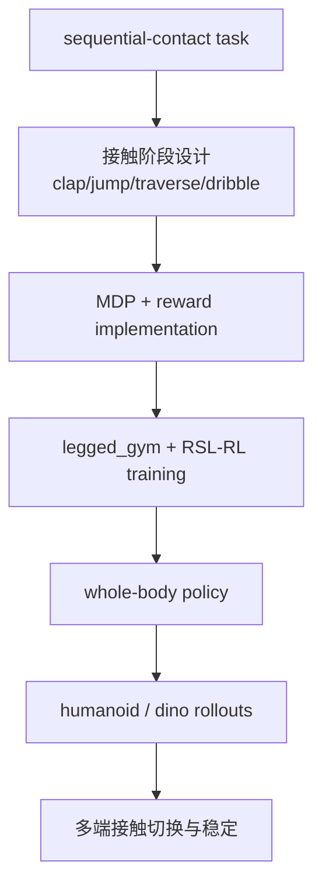
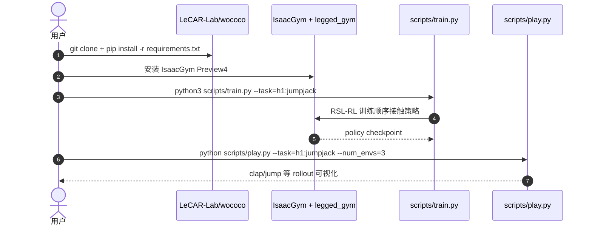

# WoCoCo

**WoCoCo**（*Learning Whole-Body Humanoid Control with Sequential Contacts*）把人形控制的难点从单次接触扩展到 **顺序接触**：脚、手、身体不同部位在任务中按阶段建立/断开接触，策略必须在接触切换中维持全身稳定和任务进展。

## 一句话定义

WoCoCo 是一个顺序接触全身控制框架，用 RL 学习跨接触阶段的人形/多体机器人运动与 loco-manip 技能。

## 英文缩写速查

| 缩写 | 英文全称 | 简要说明 |
|------|----------|----------|
| WoCoCo | Whole-Body Control with Sequential Contacts | 本文方法名 |
| RL | Reinforcement Learning | 策略学习主框架 |
| MDP | Markov Decision Process | README 鼓励按任务扩展 reward/MDP |
| RSL-RL | Rudin et al. legged RL library | 官方代码依赖的 RL 框架 |
| IsaacGym | NVIDIA Isaac Gym | 官方代码仿真后端 |
| H1 | Unitree H1 Humanoid | README 示例任务 `h1:jumpjack` |

## 为什么重要

- **接触有时序，不是静态标签**：clap、jump、cliff traversal、dribble ball 都要求多个身体部位按阶段接触。
- **与 OmniContact 的接触流问题意识相邻**：两者都强调接触建立/保持/切换/断开，只是 WoCoCo 更偏底层 RL 控制。
- **展示跨形态迁移思想**：项目页把 dino 用左前脚、右前脚、后脚、头、尾等不同端点控球，说明 sequential contact 不限于人形手脚。
- **官方代码可跑但偏示例化**：README 明确提供 clap-and-dance 示例，并鼓励用户为具体任务工程化 reward/MDP。

## 流程总览

## 核心原理（详细）

WoCoCo 的核心价值在于将全身运动任务写成顺序接触问题：不同阶段允许/鼓励不同身体部位承担支撑、推动、击打或操控。相较纯 motion tracking，它更关注 contact schedule 与 reward 如何让策略主动建立、利用和退出接触。

官方 README 也很诚实：代码「de-engineered」了很多任务特定技巧，提供 clap-and-dance 的 reward 与 MDP 示例，鼓励研究者根据地形设计、curiosity observation、sim-to-real 技巧自行工程化。这说明 WoCoCo 更像一个顺序接触 RL 模板，而不是开箱即用的通用人形操作系统。

## 源码运行时序图

## 工程实践（含开源状态）

| 项 | 结论 |
|----|------|
| 项目页 | <https://lecar-lab.github.io/wococo/> |
| 官方代码 | <https://github.com/LeCAR-Lab/wococo>，CC BY-NC 4.0 + inherited licenses |
| 依赖 | Python 3.8、IsaacGym Preview4、legged_gym、RSL-RL |
| 入口 | `legged_gym/legged_gym/scripts/train.py --task=h1:jumpjack` |
| 注意 | 非商业许可；示例框架需按任务工程化 |

## 局限与风险

- **不是完整产品级复现**：README 明确鼓励用户自己工程化环境和 sim-to-real。
- **任务 reward 仍需设计**：顺序接触能力依赖 MDP/reward 组织。
- **商业使用受限**：CC BY-NC 4.0 与继承许可证限制。
- **与视觉/语言无直接耦合**：WoCoCo 解决身体层顺序接触，不处理高层语义调度。

## 关联页面

- [Loco-Manip 接触分类 04：接触后如何稳住](../overview/loco-manip-contact-category-04-post-contact-stability.md)
- [161 篇 · 05 动捕、人类视频与交互动作规划](../overview/loco-manip-161-category-05-mocap-human-video.md)
- [OmniContact](./paper-omnicontact-humanoid-loco-manipulation.md)
- [FALCON](./paper-loco-manip-161-109-falcon.md)
- [Whole-Body Control](../concepts/whole-body-control.md)

## 参考来源

- [loco_manip_161_survey_116_wococo.md](../../sources/papers/loco_manip_161_survey_116_wococo.md)
- [humanoid_loco_manip_161_catalog.md](../../sources/papers/humanoid_loco_manip_161_catalog.md)
- [wechat_embodied_ai_lab_humanoid_loco_manip_161_survey.md](../../sources/blogs/wechat_embodied_ai_lab_humanoid_loco_manip_161_survey.md)
- [loco-manip-contact-category-04-post-contact-stability](../overview/loco-manip-contact-category-04-post-contact-stability.md)
- [wechat_embodied_ai_lab_loco_manip_contact_survey.md](../../sources/blogs/wechat_embodied_ai_lab_loco_manip_contact_survey.md)
- Zhang et al., *WoCoCo: Learning Whole-Body Humanoid Control with Sequential Contacts*, arXiv:2406.06005 / CoRL 2024 Oral. <https://arxiv.org/abs/2406.06005>
- 官方代码：<https://github.com/LeCAR-Lab/wococo>

## 推荐继续阅读

- [WoCoCo 项目页](https://lecar-lab.github.io/wococo/)
- [WoCoCo GitHub](https://github.com/LeCAR-Lab/wococo)
- [OmniContact](./paper-omnicontact-humanoid-loco-manipulation.md)
