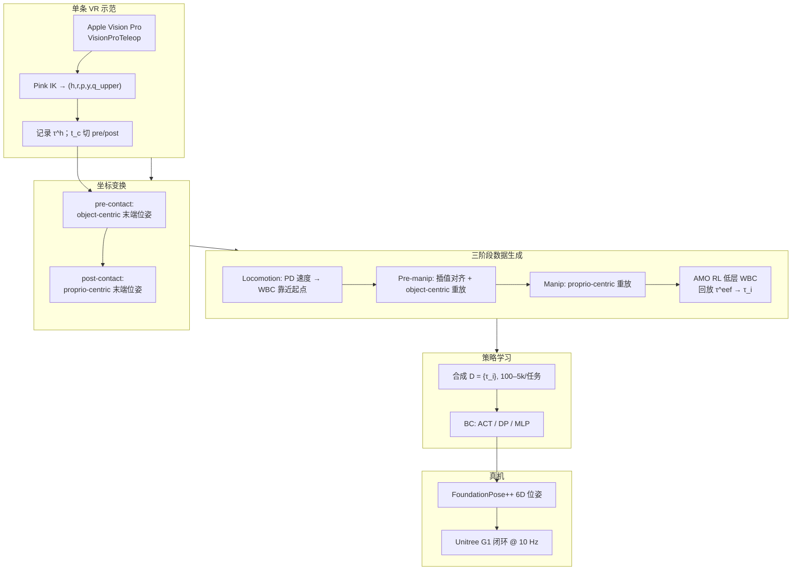

# DemoHLM：一条仿真示范通吃十项人形 Loco-Manipulation

**DemoHLM**（*From One Demonstration to Generalizable Humanoid Loco-Manipulation*；[arXiv:2510.11258](https://arxiv.org/abs/2510.11258)，[项目页](https://beingbeyond.github.io/DemoHLM/)）由 **北京大学** 与 **超越智能（BeingBeyond）** 提出：在 **IsaacGym 仿真** 中仅采集 **每条任务 1 条 VR 遥操作示范**，通过 **MimicGen 式物体/本体坐标系轨迹重放** 与 **AMO 式 RL 全身控制器**，自动合成 **数百–数千** 条成功轨迹，再经 **行为克隆** 学习 **闭环视觉操纵策略**，并在 **Unitree G1** 上 **zero-shot** 验证 **10 项 loco-manipulation** 的空间泛化。

本页同时是 [人形 Loco-Manip 161 篇长文](https://mp.weixin.qq.com/s/pACh9EhsISiyPGdiiR0C3A) **#136/161**（08 硬件平台、感知配置与部署扩展）的 **arXiv 深读升格**。

## 一句话定义

**用「单示范 → 三阶段 object/proprio-centric 重放 → RL 低层 WBC + BC 高层命令」的层次栈，把 MimicGen 数据放大推到双足人形 loco-manipulation，并以合成数据规模驱动策略泛化。**

## 英文缩写速查

| 缩写 | 英文全称 | 简要说明 |
|------|----------|----------|
| DemoHLM | Demo Humanoid Loco-Manipulation | 本文框架：单示范驱动的人形 loco-manip 数据生成与策略学习 |
| WBC | Whole-Body Control | 低层 RL 控制器，跟踪 torso/上肢/基座速度等高层命令 |
| BC | Behavior Cloning | 从合成轨迹监督学习高层操纵策略 |
| ACT | Action Chunking with Transformers | 本文主 BC 基线之一，预测 action chunk |
| DP | Diffusion Policy | 扩散式 visuomotor BC，与 ACT 性能接近 |
| Loco-Manip | Loco-Manipulation | 行走与操作动力学耦合的全身任务 |

## 为什么重要

- **把 MimicGen 推到双足人形：** 固定臂上的 object-centric 重放无法直接用于需 **全身平衡与行走** 的 loco-manip；DemoHLM 用 **locomotion / pre-manip / manip 三阶段** + **低层 WBC 回放** 解决适配难题。
- **数据效率与可扩展性：** 每任务 **1 条** VR 示范即可合成 **5k** 级轨迹；仿真中成功率随数据量 **单调上升**（LiftBox 86%→99%），且同一数据对 **ACT / DP / MLP** 均有效。
- **真机闭环 sim2real：** G1 + RealSense D435 + FoundationPose++ 物体位姿；7 项已报告真机 trial 与仿真 **量级可比**（如 LiftBox 5/5）。
- **与 BeingBeyond 谱系衔接：** 同组作者有 [Being-0](./paper-loco-manip-161-057-being-0.md) 模块化 agent；与 [HumanoidMimicGen](./paper-humanoidmimicgen.md) 同属 **「少量示范 → 大规模 IL 数据」** 主线，但 DemoHLM 强调 **AMO 命令空间 + 仿真单示范**，HumanoidMimicGen 强调 **cuRobo IK + 技能 DAG + VLA**。

## 核心信息

| 项 | 内容 |
|----|------|
| **机构** | 北京大学（PKU）；超越智能（BeingBeyond） |
| **作者** | Yuhui Fu*、Feiyang Xie*、Chaoyi Xu、Jing Xiong、Haoqi Yuan、Zongqing Lu § |
| **发表** | arXiv:2510.11258（2025-10-11）；IEEE RA-L（2026-02-19） |
| **平台** | 仿真 Unitree G1（IsaacGym + SAPIEN/PartNet 资产）；真机 G1 + 2-DoF 颈 + D435 |
| **低层控制** | AMO 式 RL WBC @ 50 Hz；真机 Unitree SDK v2 PD @ 500 Hz |
| **高层策略** | BC @ 10 Hz；观测：关节状态 + torso r/p + **相机系物体 6D 位姿** |
| **开源** | **部分开源**：[BeingBeyond/DemoHLM](https://github.com/BeingBeyond/DemoHLM) 公开，但 **截至 2026-09-20 无可运行训练/部署代码**（仅 README + 项目站镜像）；见 [sources/sites/demohlm.md](../../sources/sites/demohlm.md) |

## 流程总览

## 核心机制（归纳）

### 层次控制

- **低层：** 输入 $(v_x,v_y,\omega,h,r,p,y,\mathbf{q}_{upper})$，输出全身关节 PD 目标；基于 [AMO](https://arxiv.org/abs/2505.03738) 预训练 RL 控制器，负责 **平衡与 omnidirectional 移动**。
- **高层：** 观测 $[\mathbf{q}_{pos},\mathbf{q}_{vel},r,p,\mathbf{p}_{obj}^{camera}]$，输出上述低层命令；**10 Hz** 决策 vs 低层 **50 Hz**，体现长时程推理与快速跟踪分工。
- **主动视觉：** 2-DoF 颈 proportional 控制，使目标物体保持在图像中心。

### 数据生成（相对 MimicGen 的人形扩展）

1. **Locomotion：** 随机初始位姿远离物体时，PD 产生 $(v_x,v_y,\omega_{yaw})$ 引导 WBC 靠近示范起点。
2. **Pre-manipulation：** object-centric 目标 $\hat{T}^{eef}=T^{eef}_{obj}\bar{T}^{obj}$；若当前末端与目标起点有偏差，先 **插值轨迹** 对齐。
3. **Manipulation：** 接触后切换 **proprio-centric** $\hat{T}^{eef}=\bar{T}^{eef}(T^{eef}_{pro})^{-1}$，处理「相对物体近似静止」的操纵段（如抬箱、倒水）。

### 十项评测任务

| 橡胶手 | 平行夹爪 |
|--------|----------|
| LiftBox、PressCube、PushCube、Handover | GraspCube、OpenCabinet、PushCart、EraseBoard、PourWater、ExchangeCube |

初始 **机器人 + 物体位姿随机化**（默认最大区域 $R_3$），考察 **空间泛化**。

## 源码运行时序图

**不适用**（截至 2026-09-20）：官方 [BeingBeyond/DemoHLM](https://github.com/BeingBeyond/DemoHLM) 仅含 README 与 `docs/` 项目站镜像，**无** 可辨识的训练 / 数据生成 / 真机部署入口（见 [sources/repos/demohlm.md](../../sources/repos/demohlm.md)）。后续若发布 IsaacGym 环境与脚本，应在此补 `sequenceDiagram` 并对齐 README 入口。

## 工程实践

| 项 | 建议 |
|----|------|
| 数据规模 | 优先 **≥1k–5k** 合成轨迹/任务；论文显示 100→5k 成功率持续提升，边际递减 |
| BC 架构 | **ACT 或 Diffusion Policy** 优于 plain MLP+chunk；双手/长时序任务差距更大 |
| 低层 WBC | 依赖 AMO 式控制器；真机速度跟踪弱于仿真时，靠 **高层闭环** 高频修正位姿 |
| 感知 | 真机需 **FoundationPose++** 等动态 6D 跟踪；未建模物体与遮挡是主要瓶颈 |
| 复现预期 | 官方代码未发布前，按论文 §3–4 + IsaacGym/G1 资产自建管线；关注 GitHub release |

## 实验与评测

### 仿真（合成数据规模，Table 1 摘要）

- **趋势：** 所有任务成功率随数据集 **100→5k** 单调上升。
- **代表（5k，%）：** LiftBox **98.8**、PushCart **95.8**、GraspCube **87.9**、PressCube **85.2**；Handover **57.5**、ExchangeCube **52.9** 仍较难。
- **BC 对比（5k）：** ACT 与 DP 接近；MLP 在 OpenCabinet（41.6 vs 67.3）、ExchangeCube（15.0 vs 52.9）等任务显著落后。

### 数据生成成功率（Appendix A.2）

- 最大随机区域下：PushCube **99.3%**、LiftBox **91.2%**；Handover **79.2%**、ExchangeCube **72.7%** 较低（IK/碰撞失败）。

### 真机 zero-shot（Table 4）

| 任务 | LiftBox | PressCube | PushCube | Handover | GraspCube | OpenCabinet | EraseBoard |
|------|---------|-----------|----------|----------|-----------|-------------|------------|
| 成功 | 5/5 | 5/5 | 4/5 | 4/5 | 3/5 | 2/5 | 2/5 |

论文 §4.4 展示 sim–real **LiftBox** 时序对齐；低层速度跟踪存在 sim2real 差距，但闭环高层策略仍完成任务。

## 结论

**DemoHLM 的核心贡献是「单示范 + 仿真数据放大 + 层次 WBC/BC」的可扩展 loco-manip 范式，而非新的低层控制结构；合成数据量与 BC 架构选择决定实际上限。**

1. **单条 VR 示范足够启动流水线** — 三阶段 object/proprio-centric 重放 + WBC 回放是跨 MimicGen 与双足人形的关键桥接。
2. **合成数据量是真影响因子** — 仿真成功率随 100→5k 轨迹单调提升；部署前应规划数据生成预算而非只调网络。
3. **BC 需时序表达能力** — ACT/DP 显著优于 MLP；长时序/双手任务（Handover、ExchangeCube）仍是短板。
4. **低层用现成 AMO WBC，高层闭环补 sim2real** — 真机速度跟踪弱于仿真，但 10 Hz 视觉闭环可修正到达误差。
5. **感知依赖 FoundationPose 系 6D 位姿** — 限制未建模物体与重度遮挡场景；单 RGB-D 是工程瓶颈。
6. **开源尚不完整** — GitHub 仅有项目站镜像；复现需跟论文自建或等待官方 release。
7. **161 篇地图坐标** — 归类 08 部署扩展，强调 **数据闭环可扩展性**；量化指标以本文 Table 1/4 为准。

## 局限与风险

- **纯仿真训练数据** → 动力学与视觉 sim2real 间隙（论文 §5 自述）。
- **物体 6D 位姿需模型/跟踪器** → 难直接迁移到未知几何物体。
- **官方代码/权重未发布** → 截至 2026-09-20 无法一键复现（[sources/repos/demohlm.md](../../sources/repos/demohlm.md)）。

## 与其他页面的关系

- 任务页：[loco-manipulation.md](../tasks/loco-manipulation.md)
- 同类数据生成：[HumanoidMimicGen](./paper-humanoidmimicgen.md)、[DexMimicGen](./paper-notebook-dexmimicgen-automated-data-generation-for-bimanu.md)
- 同机构 agent：[Being-0](./paper-loco-manip-161-057-being-0.md)
- 硬件：[unitree-g1.md](./unitree-g1.md)
- 161 地图：[humanoid-loco-manip-161-papers-technology-map.md](../overview/humanoid-loco-manip-161-papers-technology-map.md)、[loco-manip-161-category-08-hardware-deployment.md](../overview/loco-manip-161-category-08-hardware-deployment.md)

## 参考来源

- [DemoHLM arXiv 摘录](../../sources/papers/demohlm_arxiv_2510_11258.md)
- [DemoHLM 项目页归档](../../sources/sites/demohlm.md)
- [DemoHLM 代码归档](../../sources/repos/demohlm.md)
- [loco_manip_161_survey_136_demohlm.md](../../sources/papers/loco_manip_161_survey_136_demohlm.md) — 161 篇策展索引

## 推荐继续阅读

- 论文 PDF：<https://arxiv.org/pdf/2510.11258>
- 项目页视频：<https://beingbeyond.github.io/DemoHLM/>
- MimicGen 原文：<https://arxiv.org/abs/2310.17598>
- AMO 低层 WBC：<https://arxiv.org/abs/2505.03738>
