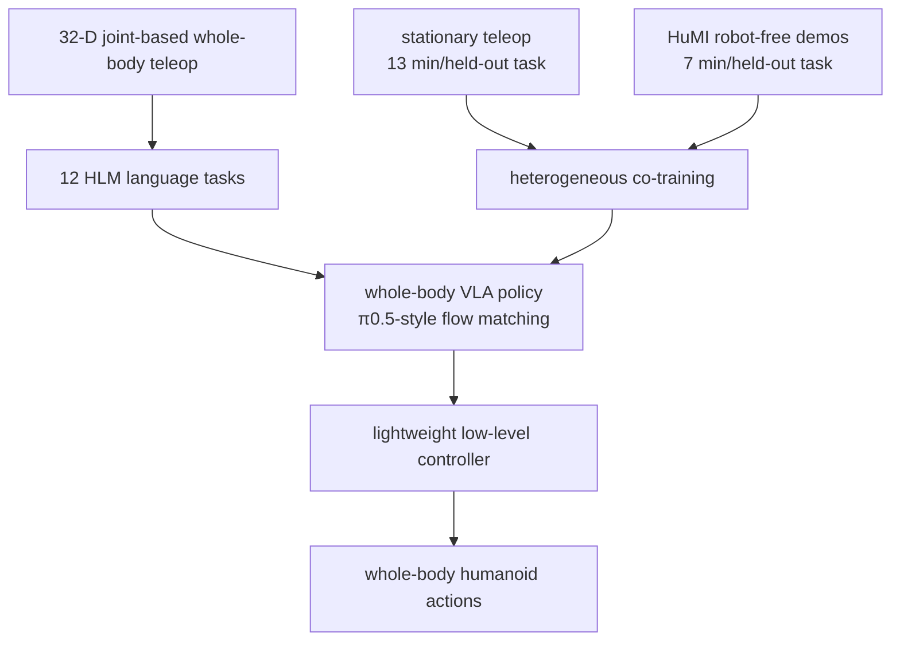

# OpenHLM

**OpenHLM**（*An Empirical Recipe for Whole-Body Humanoid Loco-Manipulation*）不是只提出一个模型结构，而是系统比较人形 VLA 的数据接口、动作空间、预训练和异构 co-training，形成一套能让人形在室内外执行全身语言条件任务的经验配方。

## 一句话定义

OpenHLM 用全身关节遥操作、whole-body VLA 适配和 HuMI/站立遥操作 co-training，让语言指令直接映射到人形全身自由度命令。

## 英文缩写速查

| 缩写 | 英文全称 | 简要说明 |
|------|----------|----------|
| HLM | Humanoid Loco-Manipulation | OpenHLM 的任务对象 |
| VLA | Vision-Language-Action | 视觉语言动作策略 |
| HuMI | Humanoid/robot-free Manipulation Interface | 低成本 wearable 示范数据源 |
| GR00T | Generalist Robot 00 Technology | 对比/基座 VLA 系列 |
| π0.5 | Pi-zero-point-five | OpenHLM 适配的人形策略基线/预训练 |
| DoF | Degree of Freedom | 32-D joint-based whole-body teleop 覆盖的全身接口 |

## 为什么重要

- **直接比较数据接口**：21-D decoupled control、24-D VR 3-point、32-D joint-based whole-body teleop，同任务同数据闭环比较。
- **证明 robot pretraining 可迁移**：π0.5 预训练初始化达到约 **91%**，PaliGemma init 约 **60%**，random init 约 **42%**。
- **异构数据能补 held-out tasks**：只用任务 1-8 whole-body teleop 时 held-out 9-11 平均 **36%**；加 HuMI 到 **84%**，加站立遥操作到 **89%**，全量 oracle **96%**。
- **有野外演示**：混入 **20 outdoor demos** 后，展示户外自主校园清理任务。

## 流程总览

## 核心原理（详细）

### 1. 低层控制和遥操作接口

OpenHLM 固定两层框架：高层 operator/VLA 输出全身 reference commands，低层轻量 controller 跟踪。关键变量是接口。项目页结论很清楚：decoupled control 和 VR 3-point 因自由度缺失，无法表达脚踩踏板、全身下蹲到货架下等任务；最终采用 **32-D joint-based whole-body teleoperation**。

### 2. VLA 设计消融

人形动作空间适配的细节（projection initialization、action ordering、absolute vs relative actions、proprioception）单项影响都不大；真正关键的是 robot action pretraining 与 multi-step inference。页面指出 one-step alternatives validation MSE 更低，但真机 task progress 比 10-step flow matching 低约 **20 points**。

### 3. 异构 co-training

OpenHLM 把昂贵 whole-body teleop 与便宜数据源混合：whole-body teleop **21 min/held-out task**，stationary teleop **13 min/held-out task**，HuMI **7 min/held-out task**。这说明全身任务不必所有数据都来自完整真机移动操作。

## 关键实验数字

| 对比 | Demonstration time | Task progress |
|------|--------------------|---------------|
| OpenHLM (HuMI co-training) | **1.14 h** | **87.5%** |
| GR00T N1.6 | 2.70 h | 57.5% |
| Ψ0 | 2.70 h | 48.8% |

另外，OpenHLM 在 **12** 个语言条件任务上平均 task progress 超 **90%**，任务覆盖 pick-and-place with locomotion、workspace extension、body-as-tool、environmental constraints 四类。

## 源码运行时序图

**不适用**：项目页未列 GitHub 或可运行代码；截至 2026-07-22 未确认官方训练/部署仓库。页面主要提供视频、指标和 BibTeX。

## 工程实践（含开源状态）

| 项 | 结论 |
|----|------|
| 项目页 | <https://openhlm-project.github.io/> |
| 代码 | 未列出官方代码仓库 |
| 关键数据接口 | 32-D joint-based whole-body teleoperation |
| 便宜数据源 | stationary teleop、HuMI robot-free demos |
| 任务 | 12 language-conditioned whole-body tasks + outdoor janitor demo |

## 局限与风险

- **配方依赖数据接口**：若没有 portable whole-body mocap/teleop rig，复现实验难。
- **开源缺失**：目前无法验证模型训练细节和低层 controller。
- **任务指标为 progress**：不是所有任务都以二值成功率呈现，横向比较要看定义。
- **高层 VLA 仍依赖低层可跟踪接口**：若 low-level controller 不稳，语言策略无法补偿身体层失效。

## 关联页面

- [Loco-Manip 接触分类 05：VLA 与世界模型调用](../overview/loco-manip-contact-category-05-vla-world-models.md)
- [161 篇 · 09 VLA/WM](../overview/loco-manip-161-category-09-vla-world-models.md)
- [VLA](../methods/vla.md)
- [WholeBodyVLA](./paper-hrl-stack-30-wholebodyvla.md)
- [HumanoidMimicGen](./paper-humanoidmimicgen.md)
- [HAIC](./paper-haic.md)

## 参考来源

- [loco_manip_161_survey_154_openhlm.md](../../sources/papers/loco_manip_161_survey_154_openhlm.md)
- [humanoid_loco_manip_161_catalog.md](../../sources/papers/humanoid_loco_manip_161_catalog.md)
- [wechat_embodied_ai_lab_humanoid_loco_manip_161_survey.md](../../sources/blogs/wechat_embodied_ai_lab_humanoid_loco_manip_161_survey.md)
- [loco-manip-contact-category-05-vla-world-models](../overview/loco-manip-contact-category-05-vla-world-models.md)
- [wechat_embodied_ai_lab_loco_manip_contact_survey.md](../../sources/blogs/wechat_embodied_ai_lab_loco_manip_contact_survey.md)
- Hu et al., *OpenHLM: An Empirical Recipe for Whole-Body Humanoid Loco-Manipulation*, arXiv:2606.22174, 2026. <https://arxiv.org/abs/2606.22174>
- 官方项目页：<https://openhlm-project.github.io/>

## 推荐继续阅读

- [OpenHLM 项目页](https://openhlm-project.github.io/)
- [π0.5 / GR00T 系列](./paper-hrl-stack-34-gr00t_n1.md)
- [HumanoidUMI](./paper-humanoidumi.md)
