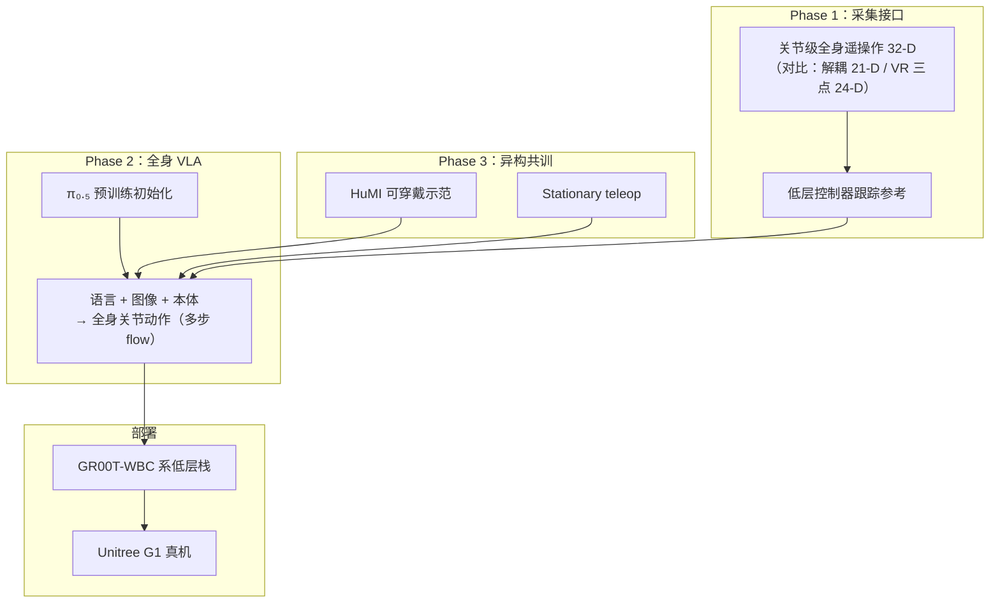
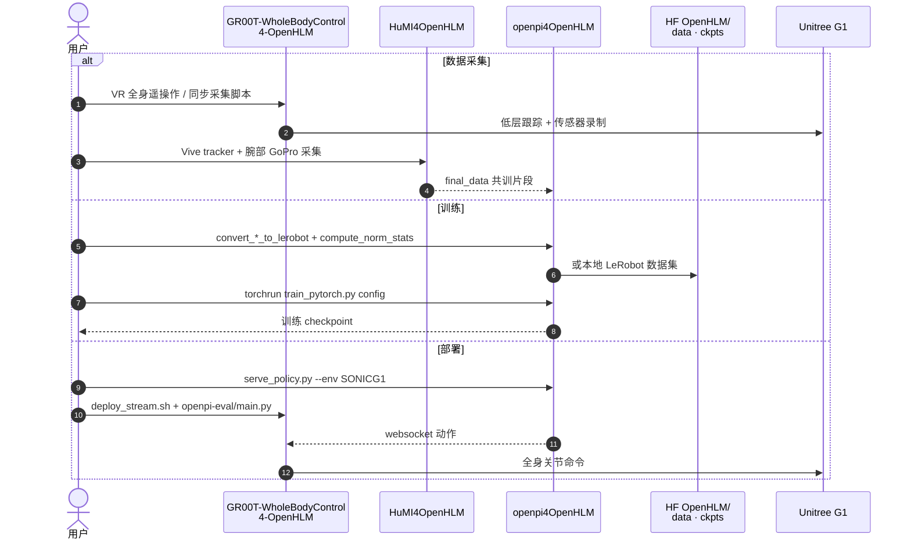

# OpenHLM

**OpenHLM**（*An Empirical Recipe for Whole-Body Humanoid Loco-Manipulation*，[项目页](https://openhlm-project.github.io/)，[代码](https://github.com/OpenHLM-project/OpenHLM)，arXiv:2606.22174）用 **单变量消融路线图** 回答：如何把语言与像素映射到人形 **全部自由度**，而不是上下身解耦的「轮式双臂」行为。产出是可复现的 **全身原生 VLA 配方**（采集接口 → 模型设计 → 异构共训），并在系统级长程任务上以 **更少演示时长** 超过 GR00T N1.6 与 Ψ₀。

> 亦收录于 [人形 Loco-Manip 161 篇](https://mp.weixin.qq.com/s/pACh9EhsISiyPGdiiR0C3A) **#154/161**（09 VLA / 世界模型）；本页以官方项目页与 arXiv 为准，策展摘要见 [survey 摘录](../../sources/papers/loco_manip_161_survey_154_openhlm.md)。

## 一句话定义

**用关节级全身遥操作 + 机器人预训练 VLA + HuMI 异构共训，做出整条运动链协调的人形 loco-manipulation recipe。**

## 英文缩写速查

| 缩写 | 英文全称 | 简要说明 |
|------|----------|----------|
| VLA | Vision-Language-Action | 视觉-语言-动作多模态策略 |
| HuMI | Humanoid-UMI（项目命名） | 无机器人、可穿戴式人手/身体示范采集 |
| WBC | Whole-Body Control | 低层全身跟踪 / 控制栈 |
| Loco-Manip | Loco-Manipulation | 行走与操作耦合的全身任务 |
| VR | Virtual Reality | PICO 等头显遥操作接口对照 |

## 为什么重要

- **把「全身原生」做成可证伪配方：** 不是又一个黑盒 checkpoint，而是三阶段 **one-variable-at-a-time** 结论——接口、预训练、共训各自贡献清晰。
- **接口决定任务可达集：** 解耦 / VR 三点 **构造上** 无法表达踩踏板、蹲身穿架；**32-D 关节全身遥操作** 是后续一切的数据前提。
- **异构共训降本：** HuMI / stationary 把 held-out 任务从 ~36% 抬到 ~84–89%，接近全全身遥操作 oracle，而无需对每个新物体再采全身遥操作。
- **开源闭环完整：** 代码（Apache-2.0）+ HF 数据/权重 + 基于 [GR00T-WBC](./gr00t-wholebodycontrol.md) 的采集部署栈，可对照复现。

## 核心信息

| 字段 | 内容 |
|------|------|
| 机构 | 清华大学、上海期智研究院、千寻智能（Spirit.AI） |
| 出处 | 2026-06-20 · arXiv:2606.22174 |
| 项目 / 代码 | <https://openhlm-project.github.io/> · <https://github.com/OpenHLM-project/OpenHLM> |
| 数据 / 权重 | HF `OpenHLM/OpenHLM-data` · `OpenHLM/OpenHLM-ckpts` |
| 机体 | Unitree G1（腕夹爪 + 腕/头相机 + PICO4U） |
| 161 地图 | #154 · 09 人形 VLA、世界模型与通用操作 |

## 流程总览

## 核心机制（归纳）

### 1）分层控制契约

高层（人 / VLA）发 **全身参考命令**，轻量低层跟踪；**接口维度**同时决定操作员表达力与 VLA 动作空间。

### 2）遥操作对照结论

| 方法 | 动作维 | 项目页结论 |
|------|--------|------------|
| Decoupled Control | 21-D | 仅部分自由度；部分任务 **N/A** |
| VR 3-Point | 24-D | 头/腕 + 导航；仍缺全身关节表达 |
| **Joint-based Whole-Body（采用）** | **32-D** | **唯一**完成对照三任务全集 |

### 3）VLA 设计消融（4 任务子集）

- **接口适配**（随机投影、人形排序、相对动作、去本体）单点翻转仅轻微掉点——**不是主瓶颈**。
- **预训练：** π₀.₅ ≈ **91.3%** ≫ PaliGemma **59.6%** ≫ random **41.7%** —— 跨具身机器人预训练远强于纯 VLM / 随机。
- **推理：** 多步 flow 优于 one-step / drifting（约 **+20** task-progress；尽管后者验证 MSE 可能更低）。

### 4）异构共训（held-out Tasks 9–11）

| 设定 | Task Progress |
|------|---------------|
| 仅 Tasks 1–8 全身遥操作 | 36% |
| + HuMI | **84%** |
| + Stationary teleop | **89%** |
| 11 任务全全身遥操作 oracle | 96% |

## 实验与评测

| 轴 | 口径（项目页） |
|----|----------------|
| 长程果盘（低/中/高架、双手分拣、20 果对） | OpenHLM **87.5%** @ **1.14 h** vs GR00T N1.6 **57.5%** / Ψ₀ **48.8%** @ **2.70 h** |
| 12 任务四类 | Pick&Place / Workspace / Body-as-Tool / Constraints；平均 progress **>90%** |
| 户外 | 约 **20** 条户外 demo 混入实验室数据 → 校园清扫类自主行为（页面叙事） |

## 开源状态（2026-07-22）

| 产物 | 状态 |
|------|------|
| 代码 | [OpenHLM-project/OpenHLM](https://github.com/OpenHLM-project/OpenHLM) · Apache-2.0 |
| 数据 | HF `OpenHLM/OpenHLM-data` |
| 权重 | HF `OpenHLM/OpenHLM-ckpts` |
| 低层栈 | 仓内 GR00T-WBC 改写块 + openpi 训练/服务 |

## 源码运行时序图

节点对齐 [`sources/repos/openhlm.md`](../../sources/repos/openhlm.md)。

关键复现路径：先通 GR00T-WBC 部署/遥操作文档 → 用示例示范跑 LeRobot 转换与 `openhlm_example` 训练 → `serve_policy` + `deploy_stream` 真机闭环。

## 工程实践

| 项 | 要点 |
|----|------|
| 硬件 | G1 + ChangingTek 腕夹爪 + D405 腕摄 + SV1-25 头摄 + PICO4U |
| 训练入口 | `src/openpi4OpenHLM/scripts/train_pytorch.py` |
| 部署入口 | `serve_policy.py` + `GR00T-…/scripts/deploy_stream.sh` |
| 检查点示例 | `12tasks_*` / `20fruit-arrangement_*`（含 full-teleop / HuMI / stationary 变体） |

## 局限与风险

- **配方依赖全身遥操作质量**；解耦接口无法「事后补自由度」。
- **真机栈重**：依赖 GR00T-WBC / TensorRT / VR 标定，工程门槛高于「只下权重」。
- **户外结果偏定性**；系统级数字以室内长程果盘与 12 任务为主。
- **勿与 161 策展旧摘要等同：** 公众号条目为地图坐标；消融与开源以本页与官方仓为准。

## 与其他工作对比

| 工作 | 关系 |
|------|------|
| **GR00T N1.6 / Ψ₀** | 项目页系统级基线；OpenHLM 以 **更少演示时长** 取得更高长程 progress |
| **[GR00T-WholeBodyControl](./gr00t-wholebodycontrol.md)** | 低层采集/部署栈上游；OpenHLM 仓内为其改写块，非替代 SONIC 训练 |
| **解耦上下身 VLA** | 仅暴露部分自由度；OpenHLM 强调 **32-D 关节全身** 才可达踩踏板/蹲穿架等任务 |
| **[HumanoidArena](./paper-humanoidarena.md)** | 仿真分层 **GMT 接口基准**；OpenHLM 是真机 **全身原生 VLA 配方**——可对照中间动作 vs 全关节动作空间 |
| **HuMI / UMI 系** | OpenHLM 把 HuMI 用作 **异构共训** 降本通道，而非唯一数据源 |

## 关联页面

- [Loco-Manip 接触分类 05：VLA 与世界模型调用](../overview/loco-manip-contact-category-05-vla-world-models.md)
- [Loco-Manipulation](../tasks/loco-manipulation.md) — 全身移动操作任务坐标
- [VLA](../methods/vla.md) — π₀.₅ / GR00T 等对照语境
- [Teleoperation](../tasks/teleoperation.md) — 全身遥操作与 HuMI 采集
- [GR00T-WholeBodyControl](./gr00t-wholebodycontrol.md) — 低层控制与部署上游
- [Foundation Policy](../concepts/foundation-policy.md) — 人形基础策略分层叙事
- [161 分类 hub](../overview/loco-manip-161-category-09-vla-world-models.md) — 策展地图位置

## 参考来源

- [wechat_embodied_ai_lab_loco_manip_contact_survey.md](../../sources/blogs/wechat_embodied_ai_lab_loco_manip_contact_survey.md)
- [OpenHLM 论文摘录（arXiv:2606.22174）](../../sources/papers/openhlm_arxiv_2606_22174.md)
- [OpenHLM 项目页归档](../../sources/sites/openhlm-project-github-io.md)
- [OpenHLM 代码归档](../../sources/repos/openhlm.md)
- [161 策展摘录 #154](../../sources/papers/loco_manip_161_survey_154_openhlm.md)

## 推荐继续阅读

- [OpenHLM 项目页](https://openhlm-project.github.io/) — 视频、12 任务与消融数字
- [arXiv:2606.22174](https://arxiv.org/abs/2606.22174)
- [GR00T-WholeBodyControl 文档](https://nvlabs.github.io/GR00T-WholeBodyControl/) — 低层栈安装对照
