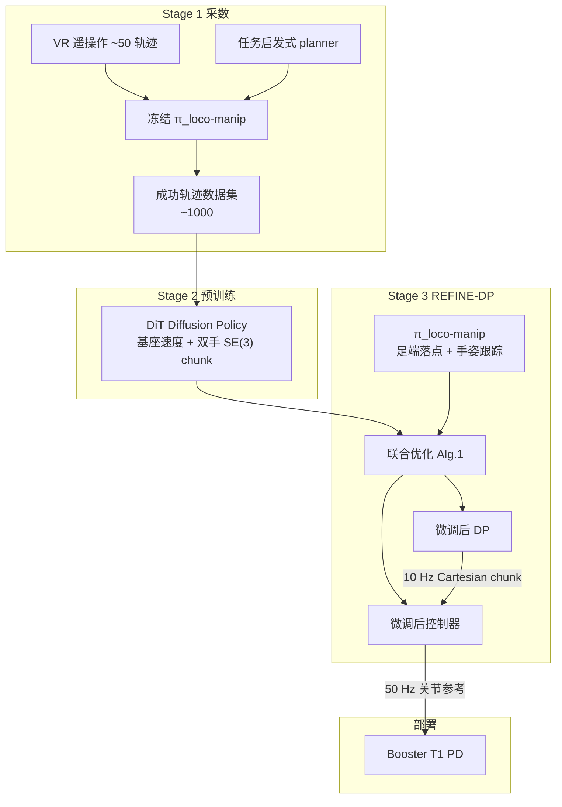

# REFINE-DP

**REFINE-DP**（*REinforcement learning FINE-tuning of Diffusion Policy*，[arXiv:2603.13707](https://arxiv.org/abs/2603.13707)，[项目页](https://refine-dp.github.io/REFINE-DP/)，IEEE *Robotics and Automation Letters*）由 **佐治亚理工学院（Georgia Tech）** IRIM 提出：在人形 loco-manipulation 上把 **扩散策略（DP）** 当作紧凑笛卡尔运动规划器，与 **RL 低层 loco-manip 控制器** 组成层次栈，并用 **DPPO/PPO 联合微调** 同时抬任务成功率与命令跟踪质量。收录于 [人形 Loco-Manip 161 篇](../overview/humanoid-loco-manip-161-papers-technology-map.md) **#157 / 分类 09**。

## 一句话定义

**用「DP 规划器 + RL 跟踪器」分层，再以强化学习联合微调两者，在少量示教上把人形长程 loco-manip 从离线模仿的分布错配里救回来。**

## 英文缩写速查

| 缩写 | 英文全称 | 简要说明 |
|------|----------|----------|
| REFINE-DP | REinforcement learning FINE-tuning of Diffusion Policy | 本文框架：DP 与低层控制器联合 RL 微调 |
| DP | Diffusion Policy | 高层：多模态动作块生成（基座速度 + 双手 SE(3)） |
| DPPO | Diffusion Policy Policy Optimization | 把去噪步嵌入增广 MDP，对 DP 做 PPO 式更新 |
| PPO | Proximal Policy Optimization | 低层控制器与 DP 微调共用的 on-policy 优化器 |
| DiT | Diffusion Transformer | 预训练/微调主干；相对 MLP/LSTM 更擅多模态 |
| Loco-Manip | Loco-Manipulation | 行走与操作动力学耦合的全身任务 |
| RLFT | Reinforcement Learning Fine-Tuning | 用交互数据适配离线预训练策略，而非只扩示教 |

## 为什么重要

- **直击人形 DP 部署痛点：** 离线规划器与低层控制器解耦 → 跟踪差、误差累积、长程失败；高维人形「靠堆示教」成本不可接受。
- **联合优化而非只调规划器：** 单独微调 DP 可能学会「过度发令」来凑成功率，反而恶化跟踪；同步更新控制器才能把新命令分布拉回可跟踪区。
- **数据效率证据硬：** 约 **50** 条遥操作轨迹 + REFINE-DP ≈ 纯预训练约 **1000** 条才到的 **90%+** 仿真 SR（约 **20×**）。
- **真机闭环：** Booster T1 上开门穿越、长程搬箱等；支持 MoCap 或机载 RGB+AprilTag，强调部署可不依赖特权状态。
- **与残差 RL / 纯扩数据对照清晰：** 基线含 Residual RL、DiT/LSTM/MLP、MLP-FT；结论偏向「调 DP 本体 + 联合控制器」而非只加残差修正。

## 核心信息

| 项 | 内容 |
|----|------|
| **机构** | 佐治亚理工学院（Georgia Tech）IRIM |
| **venue** | IEEE RA-L（2026；arXiv:2603.13707） |
| **平台** | Booster T1（29 DoF）；训练与微调在 [Isaac Lab](./isaac-lab.md) |
| **仿真 SR** | 预训练约 **50–70%** → 微调后 **>90%**（每任务 100 trials） |
| **真机 SR（N=20）** | 拾箱 **70%** / 长程 pick-place **50%** / 开门 **75%** |
| **开源** | **未开源**（2026-08-02：项目页 Code 无链接；GitHub 仅为站点） |
| **161 坐标** | #157 · [09 人形 VLA、世界模型与通用操作](../overview/loco-manip-161-category-09-vla-world-models.md) |

## 流程总览

## 核心原理

### 方法栈

| 模块 | 作用 |
|------|------|
| 低层 \(\pi_{\mathrm{loco\_manip}}\) | 解耦：下身足端落点跟踪 + 上身双手 SE(3) 跟踪 → 关节位置偏移 + PD |
| 命令接口 | 基座速度（再经 velocity→footstep）+ 双手位姿 + 夹爪；避免「仅全局双手」导致躯干歧义 |
| DP 规划器 \(\bar\pi_\theta\) | 条件动作块 \(p_\theta(\mathbf{A}_{t}^{0:K}\mid\mathbf{S}_t)\)；观测 horizon 8、chunk 12、0.1 s |
| DPPO 微调 | 去噪步写入增广 MDP，似然可算 → PPO/GAE 更新 DP |
| 联合优化 | 交替：PPO 更新低层（跟踪/平滑奖励）↔ DPPO 更新 DP（任务稀疏奖励） |

### 关键机制

1. **层次降维：** DP 不直接出全身关节，只出可遥操作、可解释的笛卡尔动作块；全身稳定交给 RL 控制器（对照 OmniH2O / SONIC 类「可解释命令接口」叙事）。
2. **为何要 RLFT：** 预训练 DP 未显式建模闭环执行误差；稀疏奖励下的仿真交互可探索 OOD 状态–动作，比继续堆示教更划算。
3. **为何要联合：** DP 命令是连续轨迹上的非平稳目标，与控制器预训练时的独立静止命令分布不一致；只冻控制器调 DP 会诱导「过猛命令」，跟踪与抖动变差。
4. **课程 OOD：** 按径向距离 / 极角 / 航向扩大初始化随机化；达 90% SR 再加难，避免无课程时高随机化放大 PPO 抖动。

## 源码运行时序图

**不适用** — 截至 **2026-08-02** 项目页 Code 按钮无仓库链接；`REFINE-DP/REFINE-DP` 仅为 GitHub Pages 站点源，无可辨识的训练 / 推理 / 部署入口。复现需自备 Isaac Lab、DPPO 与 Booster T1 栈。

## 工程实践

| 项 | 内容 |
|----|------|
| 仿真栈 | Isaac Lab；低层预训约 10 h（4096 并行）；小数据集 DP 预训约 18 h；联合微调外环约 L=2×9 h（H200 叙事） |
| 部署机 | AMD 7945HX + RTX 4060；低层 **50 Hz**，DP **10 Hz**（TensorRT） |
| 感知 | MoCap 90 Hz 或 RealSense D435i + AprilTag 30 Hz 物体相对躯干位姿 |
| 真机限速 | 步行夹紧约 **0.2 m/s**、手速约 **0.05 m/s** 以提高接触精度 |
| 调试信号 | 任务 SR；上肢位置/姿态跟踪误差；EE 线速度（平滑）；完成时间 / 吞吐 |
| 开源状态 | **未开源**（见上） |
| 源码运行时序图 | **不适用**（无可运行官方入口） |

## 实验与评测

| 任务 | 要点 |
|------|------|
| Task 1 走拾箱 | 短程；真机约 **70%**（N=20） |
| Task 2 长程 pick-place | ~40 s；只调低层即可 **+18%** SR；真机约 **50%** |
| Task 3 开门穿越 | 作者称「首次把 DP 用于人形开门穿越」；真机约 **75%**；对照 heuristic / DoorMan 类 RL / StageACT |
| Task 4 上台取物 | 非平地 + 操作；足端落点接口的用武之地 |

**基线（同冻低层）：** 预训练 DiT / LSTM / MLP；MLP-FT（OU 探索）；Residual RL。DiT 多模态优于 MLP 平均化；LSTM 短程尚可、长程塌；Pure RL from scratch 在稀疏奖励下几乎抬不动；微调宜从约 **50–70%** 预训练 SR 起步。

**效率：** 联合优化使达 **90%** SR 的迭代约 **40→20**；朝向误差可降约 **50%**，EE 速度约 **−15%**；仿真完成时间平均约 **−15%**，真机拾箱/开门约 **−10% / −20%**。

## 结论

**REFINE-DP 的真贡献不是「又一个人形 DP」，而是证明：在层次 loco-manip 栈里，规划器与跟踪器必须一起被 RL 拉回同一命令分布——数据效率与运动质量都来自这次联合，而不是继续堆示教或只加残差补丁。**

1. **先层次、后微调** — 笛卡尔动作块让 DP 可学、可遥操作；全身稳定留给足端落点 + 手姿 RL。
2. **50 条遥操作可以够用** — 关键是 RLFT + 启发式扩覆盖，不是魔法；纯扩到 1000 条才是对照成本。
3. **联合 > 只调 DP** — SR 平台期后，跟踪误差与抖动才是联合优化的主收益。
4. **残差 RL 不是同构替代** — 本文直接更新 DP 参数并同步控制器，与冻结 DP + 加性残差对照。
5. **真机仍吃感知与动力学 gap** — 仿真 90%+ vs 真机 50–75%；标定/遮挡与滑步是主因。
6. **状态条件规划器有上限** — 需显式物体位姿；作者指向未来 RGB 端到端 DP。
7. **选型边界** — 适合已有可跟踪 loco-manip 低层、愿在仿真做 PPO/DPPO 的团队；要开箱复现需等代码。

## 与其他工作对比

| 维度 | REFINE-DP | Residual RL on DP | DoorMan / 像素开门 RL | OmniH2O 类跟踪 |
|------|-----------|-------------------|----------------------|----------------|
| 高层 | DiT DP 笛卡尔 chunk | 冻结 DP + 加性残差 | 端到端 / 任务 RL | 外部参考（VR 等） |
| 低层 | 可联合微调的 RL 跟踪 | 通常冻结 | 任务耦合 | 运动跟踪 WBC/RL |
| 数据策略 | 少示教 + RLFT | 示教 + 残差 RL | 大量仿真交互 | 示教/重定向 |
| 开门叙事 | DP + 联合微调 | — | 像素 Sim2Real 强基线 | 非任务自主 |
| 开源 | **未开源**（2026-08-02） | 视具体工作 | DoorMan 栈多已开 | 视具体工作 |

## 局限与风险

- **代码未发布：** 无法按官方入口复现；项目页 Code 易被误读为已开源。
- **状态条件规划：** 依赖物体相对位姿；遮挡与标定偏差直接打真机 SR。
- **每任务数据与启发式：** VR + 任务启发式 rollout，扩展新技能仍贵；作者亦指向 egocentric 人类数据。
- **失败模式：** 低层绊跌、抓箱/拉手失败；预训练策略更易「卡死」，微调后更多重试。
- **误区：「联合优化只为再涨几个点 SR。」** 文中 SR 已高时，联合的主价值是跟踪与平滑，以及减半微调迭代。

## 关联页面

- [Loco-Manipulation](../tasks/loco-manipulation.md) — 任务页与分层/生成式路线谱系
- [Diffusion Policy](../methods/diffusion-policy.md) — 动作扩散 IL 方法页
- [Reinforcement Learning](../methods/reinforcement-learning.md) — PPO/RLFT 背景
- [Residual Policy Learning](../methods/residual-policy-learning.md) — 残差微调对照轴
- [Sim2Real](../concepts/sim2real.md) — 真机 gap（感知偏移 + 动力学）
- [Isaac Lab](./isaac-lab.md) — 官方仿真/训练载体
- [DoorMan](./paper-doorman-opening-sim2real-door.md) — 人形开门像素 Sim2Real 对照
- [OmniH2O](./paper-hrl-stack-08-omnih2o.md) — 可解释全身命令接口对照
- [161 分类 09 hub](../overview/loco-manip-161-category-09-vla-world-models.md) — 地图坐标

## 参考来源

- [refine_dp_arxiv_2603_13707.md](../../sources/papers/refine_dp_arxiv_2603_13707.md) — 论文摘录与开源核查
- [refine-dp-github-io.md](../../sources/sites/refine-dp-github-io.md) — 项目页归档
- [loco_manip_161_survey_157_refine-dp.md](../../sources/papers/loco_manip_161_survey_157_refine-dp.md) — 161 策展槽位
- arXiv：<https://arxiv.org/abs/2603.13707>
- 项目页：<https://refine-dp.github.io/REFINE-DP/>

## 推荐继续阅读

- 项目页硬件四任务与附录 reward / observation 表
- Ren et al., [*Diffusion Policy Policy Optimization (DPPO)*](https://arxiv.org/abs/2409.00588) — 扩散策略 PPO 微调底座
- Chi et al., [*Diffusion Policy*](https://arxiv.org/abs/2303.04137) — 动作扩散原论文
- [DoorMan 实体页](./paper-doorman-opening-sim2real-door.md) — 同开门任务的像素 RL 路线
