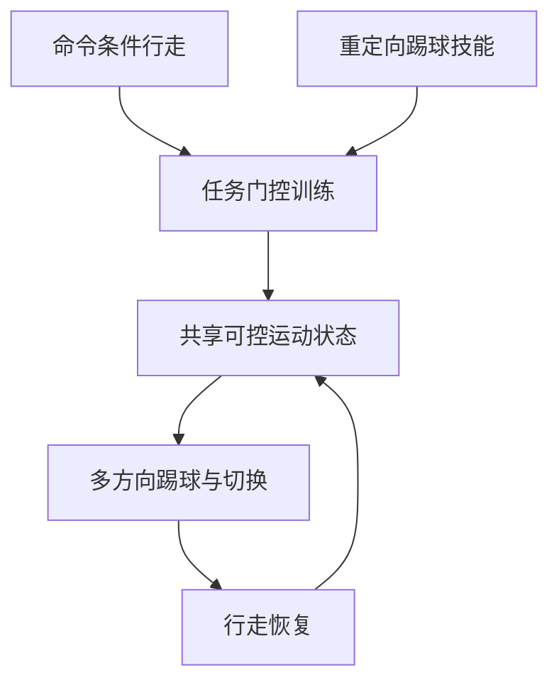

# Locomotion-Grounded Humanoid Soccer：以行走为基础的多方向踢球

**Locomotion-Grounded Humanoid Soccer**（*Task-Gated Reinforcement Learning of a Multi-Directional Kicking Library*，[arXiv:2609.38852](https://arxiv.org/abs/2609.38852)）研究如何让人形在行走与踢球间切换，并保留不同方向的踢球能力。

## 一句话理解

先训练可响应速度命令的行走策略，再把多个踢球技能接入同一可控运动状态。

## 英文缩写速查

| 缩写 | 英文全称 | 简要说明 |
|---|---|---|
| RL | Reinforcement Learning | 强化学习 |
| G1 | Unitree G1 | 人形机器人平台 |

## 流程总览

以下按本页已归纳的机制与资料绘制，表示模块或阅读路径关系。

## 方法要点

- 以通用命令条件行走策略作为运动底座。
- 用任务门控加入多方向踢球技能，并让技能共享可控的行走状态。
- 文章报告 Unitree G1 上七种重定向踢球动作与真机验证；详细指标应以论文为准。

## 与相邻工作

- [SkillX](./paper-skillx-humanoid-soccer.md)研究停球、盘带和射门的统一策略及技能交接。
- [Banana Kick](./paper-banana-kick-humanoid-soccer.md)针对脚球接触与弧线球奖励优化。

## 参考来源

- [arXiv:2609.38852](https://arxiv.org/abs/2609.38852)
- [Day 2 文章来源索引](../../sources/blogs/humanoid_motion_intelligence_day2_locomotion_motion_priors_2026_10_03.md)

## 评测

Day 2 来源给出的静止球测试中，Noetix E1 前向、侧向、后向成功率分别为 46.9%、53.3%、20.0%；不可与不同任务的足球工作直接比较。

## 与其他工作对比

与 [SkillX](./paper-skillx-humanoid-soccer.md)的停球、盘带和射门统一策略不同，本篇强调通用行走策略作为多方向踢球技能的底座。

## 结论

该工作用可命令行走作为技能组合底座，研究多方向踢球与动作交接。

## 关联页面

- [humanoid-soccer](../tasks/humanoid-soccer.md)
- [paper-skillx-humanoid-soccer](./paper-skillx-humanoid-soccer.md)
- [paper-banana-kick-humanoid-soccer](./paper-banana-kick-humanoid-soccer.md)
