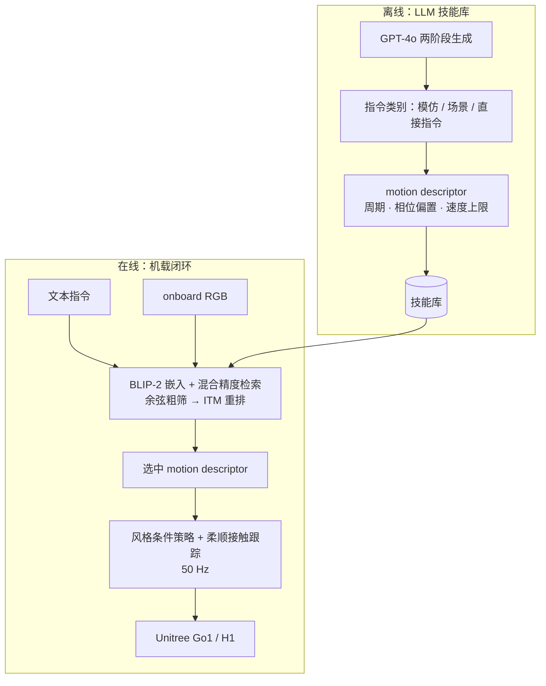

# LocoVLM

**LocoVLM**（*Grounding Vision and Language for Adapting Versatile Legged Locomotion Policies*，[arXiv:2602.10399](https://arxiv.org/abs/2602.10399)，[项目页](https://locovlm.github.io/)）由 **韩国科学技术院（KAIST）** 与 URobotics 提出，发表于 **ICRA 2025 Safe Vision-Language Models Workshop**。系统将基础模型的常识推理接到腿足 locomotion：**离线**用大语言模型扩展「语言指令 → 可执行步态参数」技能库，**在线**用视觉–语言模型把文本或 onboard 图像 ground 到库条目，再交给预训练的风格条件低层策略执行——全程 **不需要推理时访问云端 LLM**。

## 一句话定义

LocoVLM 把「听指令、看场景换步态」拆成 **离线 LLM 写技能库 + 机载 VLM 检索 motion descriptor + 50 Hz 风格条件腿足策略**，用混合精度检索与 text-as-image 把指令跟随提到约 87%，在四足 Go1 实机与人形 H1 仿真上验证语义步态适配。

## 英文缩写速查

| 缩写 | 英文全称 | 简要说明 |
|------|----------|----------|
| VLM | Vision-Language Model | 本文推理侧用 BLIP-2 做图像/文本到技能库的 grounding |
| LLM | Large Language Model | 离线用 GPT-4o 生成指令与 motion descriptor 映射 |
| ITM | Image-Text Matching | BLIP-2 中用于重排的图文匹配头 |
| RL | Reinforcement Learning | 风格条件 locomotion policy 的训练范式（仿真中学步态参数跟踪） |
| SafeVLMs | Safe Vision-Language Models | ICRA 2025 专题 workshop，本文 workshop 版本发表场合 |

## 为什么重要

- **语义进腿足闭环：** 多数感知型 locomotion 仍偏几何/高度图；LocoVLM 显式接入「图书馆要安静」「像袋鼠跳」类高层语义与环境图像语义。
- **部署友好的大模型用法：** 重计算留在 **离线建库**；机载只跑 VLM 检索（<100 ms 量级）+ 固定频率控制器，避免 Embody 式「逐步 LLM 力矩」延迟瓶颈。
- **低层仍是有界参数化：** 检索输出是步态周期、足相位偏置、速度上限等 **motion descriptor**，不是关节角序列，便于与现有 RL 步态策略栈对接。
- **跨本体复用技能库：** 人形 H1 仅重训风格策略、**复用同一 VLM 与技能库**，说明语义层与形态相关的低层可分离。

## 流程总览

## 核心机制

| 模块 | 要点 |
|------|------|
| **技能库** | LLM 先扩指令多样性，再用 prompted reasoning 映射到结构化 descriptor；相对逐条生成成本更低、非结构化步态占比更低（项目页：~300 条量级对比实验）。 |
| **检索** | 纯余弦相似度随库规模退化；**mixed-precision**：余弦 Top-K → **ITM 头**重排。**text-as-image** 将字符串渲染为图像走视觉编码器，显著抬升文本指令检索。 |
| **低层策略** | **Style-conditioned** policy 跟踪 descriptor 中的周期/相位/速度；**compliant contact tracking** 在相位「合规带」内允许暂时偏离目标步态以换扰动鲁棒性。 |
| **零样本人形** | H1 仅用前两足相位偏置（两足人形），**同一技能库** + 新训人形策略；VLM 与库无需重做。 |

## 核心信息

| 字段 | 内容 |
|------|------|
| 机构 | 韩国科学技术院（KAIST）；URobotics Corp. |
| arXiv | [2602.10399](https://arxiv.org/abs/2602.10399) |
| 演示 | [YouTube](https://youtu.be/smXBsOTeXrE) |
| 平台 | Unitree Go1（实机）；Unitree H1（MuJoCo 仿真） |
| 开源 | **待发布**（2026-09-28）：[项目页](https://locovlm.github.io/) 未列 Code；[anahrendra/locovlm](https://github.com/anahrendra/locovlm) 仅占位 README |

## 实验与评测

**检索（100 条人工标注指令，项目页表）：**

| 方法 | 文本字符串 | text-as-image | 平均 |
|------|-----------|---------------|------|
| 余弦相似度 | 21% | 30% | 20.5% |
| Top-K 余弦 | 27% | 48% | 37.5% |
| Top-K → ITM | 51% | 57% | 54.0% |
| **混合精度（本文）** | **72%** | **87%** | **79.5%** |

**系统 headline：** 指令跟随最高 **87%**（混合精度 + text-as-image）；VLM 推理 **<100 ms**；控制器 **50 Hz**；推理阶段 **无在线云 LLM 查询**。

**定性场景：** 校园 outdoor：路面 vs 雪地图像驱动不同 cautious / 快速步态；库外语义（「你是袋鼠」「这是图书馆」）可借 VLM 语义匹配到近邻库条目（项目页案例，非严格 benchmark 数字）。

**人形：** MuJoCo 中 H1 对「快点」「宝宝睡了」「像袋鼠」等指令展示不同速度/步态风格；与四足共享技能库。

## 与其他工作对比

| 路线 | 大模型角色 | 低层执行 | 与 LocoVLM 的差异 |
|------|------------|----------|-------------------|
| **LocoVLM** | 离线 LLM 建库 + 机载 VLM **检索** descriptor | 风格条件 RL 步态策略 | 强调 **实时、无云 LLM** 与 **步态参数** 接口 |
| [HumanoidVLM](./paper-notebook-humanoidvlm-vision-language-guided-impedance-con.md) | VLM 认任务 + RAG 查阻抗/夹爪角 | 固定阻抗控制器 | 操作域、参数是 K/D 而非步态周期 |
| [VLK](./paper-vlk-synthetic-loco-manipulation.md) | 语言 + 图像 → **全身运动学** 预测 | SceneBot 跟踪 | 人形 loco-manipulation 合成数据 + VLA 路线，非检索式步态库 |
| [LLM 控制接口](../concepts/llm-robotics-control-interfaces.md) 直接力矩 | 逐步输出 τ | 无预训练策略 | Embody 显示不可行；LocoVLM 属于 **策略控制 + 外部顾问** 台阶 |

## 结论

**LocoVLM 的价值在于把 VLM/LLM 放在「语义 → 有界步态参数」的顾问层，而不是替代 50 Hz 腿足控制器；87% 衡量的是检索是否选对 descriptor，不是长时域导航成功率。**

- 离线 LLM 规模化技能库 + 机载 BLIP-2 **混合精度检索** 是工程上可落地的组合；**text-as-image** 对文本指令检索是关键实现细节。
- **柔顺步态跟踪** 解释「跟风格」与「抗扰动」如何同时成立——过 rigid 跟踪会在崎岖地形牺牲稳定性。
- 读 **87%** 时限定在 **100 条标注指令的检索实验**；户外场景与库外语义案例是定性展示，不宜与 loco benchmark 成功率混读。
- **H1 零样本** 说明语义库可跨四足/人形复用，但低层策略仍需按本体重训。
- 截至 2026-09-28 **代码待发布**，复现前以 PDF/项目页与演示视频为准。

## 工程实践

| 项 | 内容 |
|----|------|
| 源码运行时序图 | **不适用** — 项目页无官方 Code 链，GitHub 占位仓库无可运行入口（见 [anahrendra-locovlm.md](../../sources/repos/anahrendra-locovlm.md)）。 |
| 频率分工 | VLM 检索慢于控制环 → 与 [控制/推理频率解耦](../concepts/control-inference-frequency-decoupling.md) 同构：语义层可低于 50 Hz，步态环保持固定频率。 |
| 技能库维护 | 库规模增大时必须 **两阶段检索**；纯余弦在项目页实验中仅 ~20% 量级平均准确率。 |
| 安全与 workshop 语境 | SafeVLMs workshop 强调视觉–语言模型在机器人中的安全使用；本文通过 **离线 LLM + 有界低层参数** 限制在线 Foundation Model 暴露面。 |

## 局限与风险

- **检索 ≠ 规划：** 选对 descriptor 不保证全局可达或长期任务完成；无显式路径/障碍几何规划层。
- **库覆盖与幻觉：** 库外指令依赖 VLM「就近」匹配，可能语义合理但物理不最优；未报告系统性安全约束过滤。
- **评测规模：** 检索准确率基于 **100** 条人工标注；headline 87% 不应外推到开放域指令分布。
- **人形证据在仿真：** H1 结果为 MuJoCo；与 Go1 实机 sim-to-real 风险不同。
- **依赖 BLIP-2 与 GPT-4o 离线管线：** 换 VLM/LLM 需重测检索与库质量；GPT-4o 成本与许可影响库构建 reproducibility。
- **开源：** 待发布，无法本地复现检索表与策略训练细节。

## 与其他页面的关系

- [LLM 机器人控制接口](../concepts/llm-robotics-control-interfaces.md) — 大模型应停在预训练策略之上的顾问/检索层
- [Locomotion](../tasks/locomotion.md) — 腿足任务语境
- [步态生成](../concepts/gait-generation.md) — 周期/相位/速度参数化
- [控制频率与推理频率解耦](../concepts/control-inference-frequency-decoupling.md) — 50 Hz 控制 vs 较慢 VLM
- [HumanoidVLM](./paper-notebook-humanoidvlm-vision-language-guided-impedance-con.md) — 同族「VLM + 检索参数 + 固定低层控制器」
- [VLK](./paper-vlk-synthetic-loco-manipulation.md) — 语言–视觉–运动学合成与人形部署对照
- [Unitree](../entities/unitree.md) — Go1 / H1 硬件语境

## 参考来源

- [locovlm_arxiv_2602_10399.md](../../sources/papers/locovlm_arxiv_2602_10399.md)
- [locovlm 项目页](../../sources/sites/locovlm.md)
- [anahrendra-locovlm.md](../../sources/repos/anahrendra-locovlm.md)
- [arXiv:2602.10399](https://arxiv.org/abs/2602.10399)
- [Workshop PDF（SafeVLMs）](https://locovlm.github.io/static/images/workshop_final.pdf)

## 推荐继续阅读

- [LocoVLM 项目页与视频](https://locovlm.github.io/)
- [BLIP-2（arXiv:2301.12597）](https://arxiv.org/abs/2301.12597) — 本文检索用 VLM 骨干
- [Anthropic Embody](../entities/anthropic-embody.md) — 对比「逐步 LLM 控腿」失败与高层接口必要性
