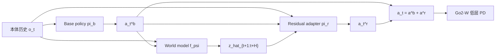
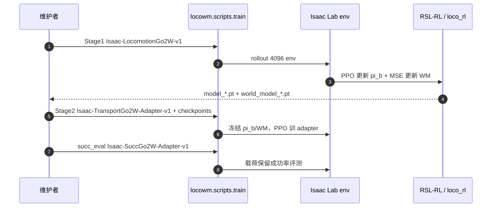

# LocoWM：世界模型引导的预动残差高精度行走

**LocoWM**（*High-Precision Locomotion through World-Model-Guided Residual Adaptation*，[arXiv:2609.39179](https://arxiv.org/abs/2609.39179)，[项目页](https://zhaozijie2022.github.io/LocoWM)）由 **中国科学院自动化研究所（CASIA）**、**中国科学院大学（UCAS）**、**北京邮电大学（BUPT）**、**北京交通大学（BJTU）** 提出：用 **action-conditioned 世界模型** 在 **一次前向** 中预测未来 **task substate** 序列，**残差适配器** 据此在偏差可观测之前做 **preactive** 修正 \(a_t=a_t^b+a_t^r\)。**两阶段训练** 先学行走与子状态动力学，再冻结 base 与 WM 专训精度适配器。主实验在 **Unitree Go2-W** 背载非固定载荷上覆盖 **地形调平、加减速倾角补偿、推扰恢复**；附录在 **Unitree G1** 双手托盘仿真达 **94.1%** 载荷保留成功率。[代码](https://github.com/zhaozijie2022/LocoWM)

## 一句话定义

**高精度行走 = 跟命令 + 全程调节任务相关物理量；LocoWM 用学到的 short-horizon 子状态预测把残差控制从「看见偏差再改」推进到「按预测后果先改」。**

## 英文缩写速查

| 缩写 | 英文全称 | 简要说明 |
|------|----------|----------|
| LocoWM | Locomotion World Model (framework name) | 本文：世界模型引导的行走残差框架 |
| WM | World Model | 动作条件 task substate 序列预测器 |
| PPO | Proximal Policy Optimization | Stage 1 base 与 Stage 2 adapter 的策略优化 |
| Go2-W | Unitree Go2 Wheeled-Legged | 主实验轮足平台与真机部署 |
| G1 | Unitree G1 | 附录人形双手托盘仿真扩展 |
| RL | Reinforcement Learning | 仿真两阶段 RL 训练栈 |

## 为什么重要

- **联合端到端** 常把稀疏精度目标淹没在密集速度跟踪奖励里；**反应式残差** 只能等偏差进入观测再补。
- **MPC 式预见** 依赖解析模型与在线优化；LocoWM 用 **学习动力学 + 单步前向预测** 给残差控制器喂 **未来 task substate**，不做 rollout 规划。
- **同一 substate 接口** 统一精度奖励、WM 监督与 adapter 输入，便于在「背载平台调平」类任务上模块化扩展（轮足真机 + 人形仿真托盘）。
- 与 [WM-LOCO](./paper-wm-loco.md)（人形落脚 RSSM）**缩写相近、问题不同**；读文献时按 arXiv 区分。

## 核心信息

| 项 | 内容 |
|----|------|
| **机构** | 中国科学院自动化研究所（CASIA）；中国科学院大学（UCAS）；北京邮电大学（BUPT）；北京交通大学（BJTU） |
| **平台** | 仿真与真机 **Go2-W**（背载平台 + 非固定载荷）；附录 **G1** 双手托盘（仿真） |
| **训练** | Isaac Lab + RSL-RL；4096 并行 env；Stage1 域随机（物理/地形/外推） |
| **开源** | **已开源** — [zhaozijie2022/LocoWM](https://github.com/zhaozijie2022/LocoWM)；README 未附现成 checkpoint |

## 核心原理

任务建模为带命令 \(g_t\) 的 MDP；**task substate** \(z_t=h(s_t)\) 为精度相关的物理量（Go2-W：**平台 pitch/roll、线加速度、角速度** 等，训练期可由特权量构造）。Base policy \(\pi^b(o_t)\) 只优化 \(r^{\mathrm{track}}\)。World model \(f_\psi(o_t,a_t^b)\mapsto \hat{z}_{t+1:t+H}\) 在同 rollout 上 MSE 监督。Stage 2 冻结 \(\pi^b,f_\psi\)，adapter \(\pi^r\) 输出加性残差，优化 \(r^{\mathrm{track}}+r^{\mathrm{prec}}\)，其中 \(r^{\mathrm{prec}}\) 驱动平台朝向 **有效重力方向**（式 (1)：载荷面内无力、减少滑动/倾覆）。

**对照链（论文消融）：** Base → End-to-End（单阶段联合）→ **React**（仅 \(o_t\) 的反应式残差，对齐 SteadyTray 类设定）→ **Recon**（重建当前 \(z_t\)，无未来预测）→ **LocoWM**（未来 substate 预测 + preactive）。

### 流程总览

## 源码运行时序图

Stage 1/2 与 `succ_eval` 入口见 [`sources/repos/locowm.md`](../../sources/repos/locowm.md)；环境 pin 为 Isaac Sim 5.1 + Isaac Lab `c91a125c73`。

## 工程实践

| 项 | 建议 |
|----|------|
| 复现顺序 | 先 Stage1 得到 **成对** policy/WM checkpoint，再 Stage2 adapter；勿跳过 WM 路径做 React 对照 |
| 消融 | 仓库提供 `Isaac-TransportGo2W-Adapter-NoWM-v1`（React）、`ReconWM` 变体，与论文表格对齐 |
| 与 SteadyTray | [SteadyTray](./paper-notebook-steadytray.md) 为人形 **反应式** 托盘残差 + 四阶段课程；LocoWM 强调 **WM 预测 preactive**，G1 结果在附录仿真 |
| 真机 | 论文 **零样本** 部署 Go2-W；仓库侧重 Isaac 训练/评测，真机栈以论文与项目页视频为准 |
| 命名冲突 | 勿与 [WM-LOCO](./paper-wm-loco.md)（arXiv:2609.02542）混为同一方法 |

## 实验与评测

**仿真（Go2-W）：** terrain leveling（slope / bump / one-sided bridge / rough）、flat 上 **±1 m/s** 加减速 pitch 协调、0.5 m/s 前进下多方向推扰 **载荷保留率**。

**相对 Recon（当前态重建、仍反应式）：** 成功率最多 **+29.6 pp**；roll RMS 最多 **−91.8%**；峰值 \(|a_z|\) 最多 **−83.0%**。Bridge 上 LocoWM **98.1%** 载荷成功、roll RMS **0.92°**（Table 1 量级）。

**真机：** 非固定杯/瓶/叠块等于 one-sided bridge、slope、bump、wave 等地形调平；平地加减速平台倾角；前/后/左/右推扰下瓶仍留在平台（项目页视频）。

**G1 仿真（附录）：** 双手托盘行走 **94.1%** vs ReST-RL **91.0%**（项目页引 Table 6）。

## 结论

**在「行走已会、精度不够」的设置里，用 action-conditioned 子状态 **预测** 做残差条件，比端到端或纯反应式残差更能同时抬成功率和 ride smoothness。**

1. **接口设计是主贡献之一** — task substate 同时服务奖励、WM 目标与 adapter，避免三套互不相关的表征。
2. **两阶段是刻意因子化** — Stage1 只跟命令，避免精度信号被 tracking 淹没；Stage2  adapter 不能破坏已冻结的行走先验。
3. **Recon → LocoWM 的增益说明「未来」而非「更多特权维」** — Recon 已有当前 substate 重建，仍不如预测序列。
4. **Bridge / bump 上成功率与 RMS 同向改善** — 不是牺牲跟踪换精度（bridge 上跟踪误差仍低于多数残差基线）。
5. **真机零样本** — 三类任务同一套推理管线（顺序：base → WM → adapter），无任务特调再训练描述。
6. **范围** — 主文 Go2-W + 三任务；更长 horizon、更复杂 substate、其他人形真机留 future work。
7. **复现** — 官方仓库完整；无一键权重时需按 README 自训两阶段。

## 与其他工作对比

| 对照 | 差异读法 |
|------|----------|
| End-to-End | 单阶段联合 tracking+precision；LocoWM 显式两阶段 + 残差 |
| React / [SteadyTray](./paper-notebook-steadytray.md) | 残差只条件 **deployable 观测**；LocoWM 额外条件 **预测 substate 序列** |
| Recon (Sun et al., 2025 类) | 重建 **当前** \(z_t\)；无 explicit future forecast |
| [WM-LOCO](./paper-wm-loco.md) | RSSM 特征共训 **落脚稀疏地形** 行走；非背载精度残差 |
| [ResMimic](./paper-resmimic.md) | GMT+物体条件残差做 **全身搬运**；LocoWM 聚焦 **平台/载荷物理量** 与 WM 预见 |
| MPC / Residual MPC | 在线优化动作序列；LocoWM **单前向** 映射到加性残差 |

## 局限与风险

- **主实验平台** 为 Go2-W 与预设三任务；复杂非结构户外与更长预测窗口未充分验证。
- **G1 托盘** 仅在仿真附录；与 SteadyTray 真机零样本不可直接类比。
- **WM 误差** 会传导到 adapter；论文未展开 failure mode 的系统性安全边界。
- **依赖栈重** — Isaac Sim 5.1 + 固定 Lab commit；升级需自行对齐 `robot_lab` 链路。

## 关联页面

- [轮足四足机器人](../concepts/wheel-legged-quadruped.md)
- [Loco-Manipulation](../tasks/loco-manipulation.md)
- [Generative / 预测世界模型](../methods/generative-world-models.md)
- [SteadyTray](./paper-notebook-steadytray.md) / [WM-LOCO](./paper-wm-loco.md) / [ResMimic](./paper-resmimic.md)
- [robot_lab](./robot-lab.md)

## 参考来源

- [locowm_arxiv_2609_39179](../../sources/papers/locowm_arxiv_2609_39179.md)
- [LocoWM 项目页归档](../../sources/sites/locowm.md)
- [LocoWM 官方仓库归档](../../sources/repos/locowm.md)

## 推荐继续阅读

- [arXiv:2609.39179](https://arxiv.org/abs/2609.39179) — 全文与附录 G1 托盘设置
- [LocoWM 项目页](https://zhaozijie2022.github.io/LocoWM) — 真机三任务视频
- [GitHub: zhaozijie2022/LocoWM](https://github.com/zhaozijie2022/LocoWM) — 训练与 succ_eval 命令
