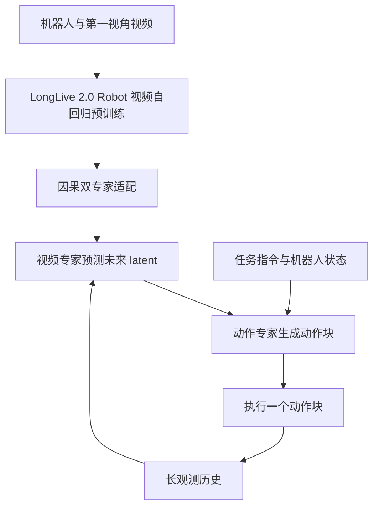
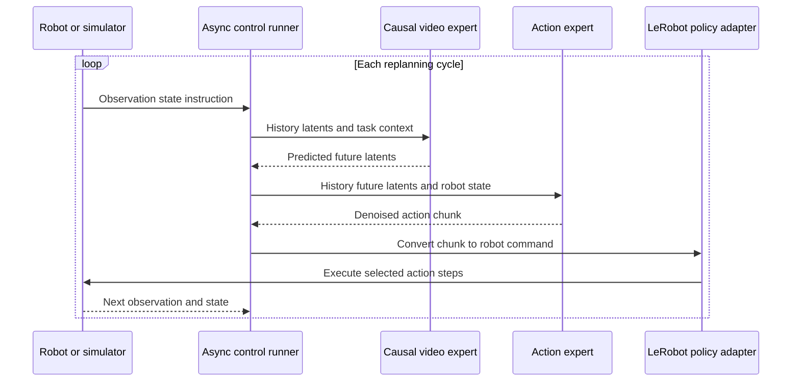

# Long-WAM：Scaling the Context of World-Action Models

**Long-WAM**（*Long-WAM: Scaling the Context of World-Action Models*）研究因果世界–动作模型（WAM）如何利用更长的观测历史。它保持未来预测跨度与动作块长度固定，只扩展模型可见的过去上下文，并将因果视频预测专家与动作专家组合成一套策略。

- **论文：** [arXiv:2610.10528](https://arxiv.org/abs/2610.10528) · [HTML v1](https://arxiv.org/html/2610.10528v1) · [PDF](https://arxiv.org/pdf/2610.10528)
- **项目页：** [Long-WAM](https://nvlabs.github.io/LongLive/Long-WAM/)
- **官方代码：** [NVlabs/LongLive/Long-WAM](https://github.com/NVlabs/LongLive/tree/main/Long-WAM)（项目子目录；Apache-2.0，第三方组件按各自许可）
- **模型：** [Hugging Face collection](https://huggingface.co/collections/Efficient-Large-Model/long-wam)
- **作者：** Wei Huang、Bohan Zhang、Chenzhi Liu、Isabella Liu、Shuai Yang、Weian Mao、Luozhou Wang、Yicheng Xiao、Weifeng Lin、Qixin Hu、Bryan Chu、Sifei Liu、Linxi Fan、Xiaojuan Qi、Song Han、Yukang Chen
- **机构：** NVIDIA、MIT、The University of Hong Kong、UC San Diego；Wei Huang 与 Bohan Zhang 为共同第一作者。
- **范围：** Long-WAM 与同仓库的 LongLive 视频生成代码是不同项目；本节点把论文、Long-WAM 代码子目录和模型资源合并为一个独立实体。

## 一句话理解

**在稳定阶段继续较长动作，在抓取、接触等关键阶段利用更长视觉历史预测未来，再据此生成动作。**

## 英文缩写速查

| 缩写 | 英文全称 | 本文含义 |
|---|---|---|
| WAM | World-Action Model | 联合学习环境未来变化与机器人动作的具身模型 |
| AR | Autoregressive | 自回归；按时间顺序逐步预测未来视频 latent |
| MoT | Mixture-of-Transformers | 多个模态专家通过注意力接口交换上下文的架构 |
| IDM | Inverse Dynamics Model | 从状态变化估计动作监督或动作条件的逆动力学模型 |
| SR | Success Rate | 成功率，需结合具体 benchmark 协议解释 |
| KV cache | Key-Value cache | Transformer 历史注意力键值缓存 |

## 方法：记住过去、预测未来、生成动作

常见策略根据当前观测生成一段动作（action chunk），再按固定步数重规划。稳定搬运时频繁重规划会增加成本；接触、抓取和放置时，细小状态变化又可能改变后续动作。Long-WAM 的问题是怎样让因果策略利用更长历史，而不是把“长动作块”与“长观测历史”混为一谈。

视频专家在因果约束下预测未来视觉 latent；动作专家读取观测历史和预测 latent，生成动作块。视频专家不读取动作 token，以保持从观测历史向未来预测的方向。推理时在 latent 空间工作，无需解码完整未来 RGB 视频。

- **视频专家：** 按自回归次序从历史视觉 latent 预测未来 latent，学习场景和交互变化。
- **动作专家：** 条件去噪/动作生成，利用历史、任务信息、未来表征生成连续动作。
- **非对称注意力：** 动作侧读取预测未来；视频侧不读取动作 token。两侧通过 MoT 风格接口交换上下文。
- **上下文扩展：** 将历史扩展至 38.4 秒，同时不同比例增加动作块或未来跨度。评估配置包括 0、2.4、4.8、9.6、19.2、38.4 秒。
- **训练数据：** 项目页称 LongLive-2.0-Robot 从 LongLive-2.0 checkpoint 继续训练，汇集约 10,000 个窗口等价小时的机器人/第一视角视频，包括 RoVid-X、AgiBot World、EgoDex、EgoVerse、VITRA；未来视频预测适配不需要动作标签。

## 论文报告结果

以下是作者/项目页报告值，本次 ingest 未在模拟器或真机上复测。

| 设置 | 报告结果 | 阅读边界 |
|---|---:|---|
| RoboCasa GR-1，历史从 0 秒扩至 19.2 秒 | SR 从 **63.3%** 升至 **78.7%** | 项目页另列 2.4 秒为 66.3%，应按原始配置区分 |
| LIBERO-Long | **99.5% SR** | 特定仿真基准与评估协议 |
| RoboTwin 2.0 | **94.4% SR** | 不代表任意机器人平台 |
| 动态杯叠放真机演示 | **19/20（95%）** | 单项任务、样本量有限 |
| 单动作块延迟 | **107.4 ms** | 作者报告 RTX 5090 测量，包含未来 latent 预测，不是独立复测 |
| 38.4 秒历史配置 | 相较 19.2 秒结果回落 | 页面指出长窗口受较短训练轨迹和 padding 影响；不能直接推断记忆上限 |

项目页还展示 G1/YAM 等真机结果。需区分真实执行任务结果与未来视频预测演示：生成的视频展示可能未来，不表示机器人已按该序列成功执行动作。

## 代码、权重与复现范围

代码位于 [NVlabs/LongLive 的 Long-WAM/ 子目录](https://github.com/NVlabs/LongLive/tree/main/Long-WAM)，不是独立 Git 仓库。README 提供模型配置、训练/评估脚本和异步部署组件；任务涉及 LIBERO、RoboTwin 2.0、DOMINO、RoboCasa GR-1 / RoboCasa365。官方 Hugging Face collection 有不同机器人和上下文长度的模型。

- 各 benchmark 使用独立配置；README 描述 LIBERO、RoboTwin 的 IDM 与 CodeDenoise 路径，以及 RoboCasa GR-1 多历史长度评估。
- 异步部署将模型推理和机器人动作执行流水化；包含 LeRobot policy interface 和 LIBERO、RoboTwin 2、YAM、Franka、Unitree G1 等适配/转换器。
- 项目描述 RTX 5090、DGX Spark、Jetson AGX Thor 部署路径；实际运行仍依赖 checkpoint、依赖、模拟器资产和适配的机器人接口。
- 单张 GR-1 checkpoint 卡示例采用 20 Hz、动作块 16、单路第一视角 RGB、58 维本体状态和 29 维动作。不可泛化到所有本体或 checkpoint。
- Long-WAM 代码标注 Apache-2.0；第三方代码、模型、数据和模拟器资产按各自许可。部分 Hugging Face 模型卡标注为 `other`，使用前应逐个检查权重条款。

## 复现边界与局限

- `Long-WAM/docs/VERIFICATION.md` 记录源代码快照上的 CPU 回归测试和 CLI 检查通过；GPU benchmark、完整模拟器评测和物理机器人任务未在该验证记录中运行。
- `Long-WAM/docs/BENCHMARKS.md` 将完整 benchmark reproduction 标为未验证。CPU 测试不能验证论文成功率、GPU 延迟或真机结果；验证环境也不是针对官方依赖锁定的全新安装。
- 长于训练轨迹的历史可能大量由 padding 占据，因此 38.4 秒结果下降不能简单归因为上下文机制失效或模型记忆上限。
- 增长观测历史不等于自适应改变动作块长度；动作何时中断或重规划还取决于部署控制逻辑。
- 基准结果与特定本体、数据和任务划分绑定；不能据此推断在所有环境下都优于短历史策略。

## 关联页面

- [World Action Models（WAM）](../concepts/world-action-models.md) — 定义、谱系与代表项目索引。
- [UniWAM](./paper-uniwam-unified-world-action-model.md) — 将物理语言推理、未来视频和动作生成联合到 MoT 的另一种配方。
- [VLA](../methods/vla.md) — 视觉语言动作策略。
- [生成式世界模型](../methods/generative-world-models.md) — 视频/latent 未来预测背景。
- [机器人操作](../tasks/manipulation.md) — 操作任务和评测背景。
- [论文来源归档](../../sources/papers/long-wam-arxiv-2610-10528.md)
- [代码来源归档](../../sources/repos/nvlabs-longlive-long-wam.md)
- [项目页归档](../../sources/sites/long-wam-project-page.md)

## 结论

Long-WAM 展示了增加可见历史可以提升若干 WAM 长程操作基准表现，并让未来视频 latent 为动作生成提供预测线索。论文报告了 LIBERO-Long、RoboTwin 2.0、RoboCasa GR-1 和真机动态杯叠放结果；但仓库说明完整 benchmark 尚未复现，长窗口收益依赖训练轨迹覆盖，真机任务样本有限。使用它作基线时，应核对 checkpoint、历史长度、动作块和机器人接口，并分别验证仿真成功率与实际部署延迟。

## 源码运行时序图

## 参考来源

- [论文 arXiv](https://arxiv.org/abs/2610.10528) · [HTML v1](https://arxiv.org/html/2610.10528v1)
- [Long-WAM 官方项目页](https://nvlabs.github.io/LongLive/Long-WAM/)
- [代码与复现文档](https://github.com/NVlabs/LongLive/tree/main/Long-WAM)
- [Hugging Face 检查点集合](https://huggingface.co/collections/Efficient-Large-Model/long-wam)
- [GR-1 检查点示例卡](https://huggingface.co/Efficient-Large-Model/Long-WAM-RoboCasa-GR1-4.8s)
