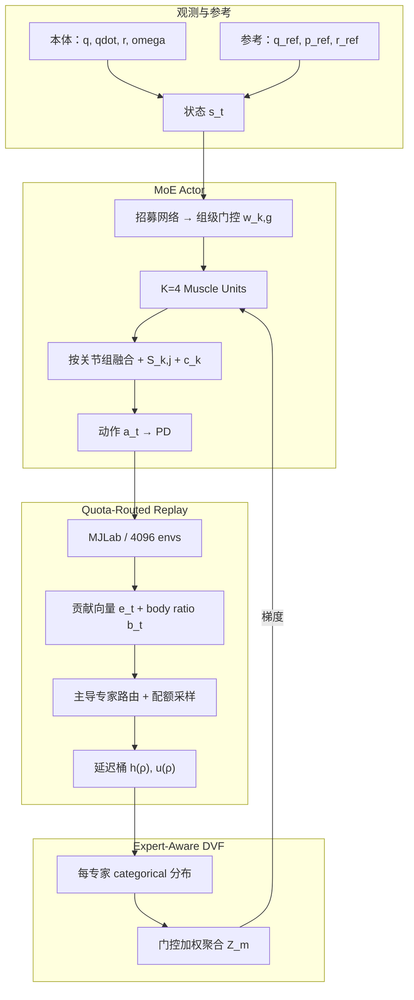
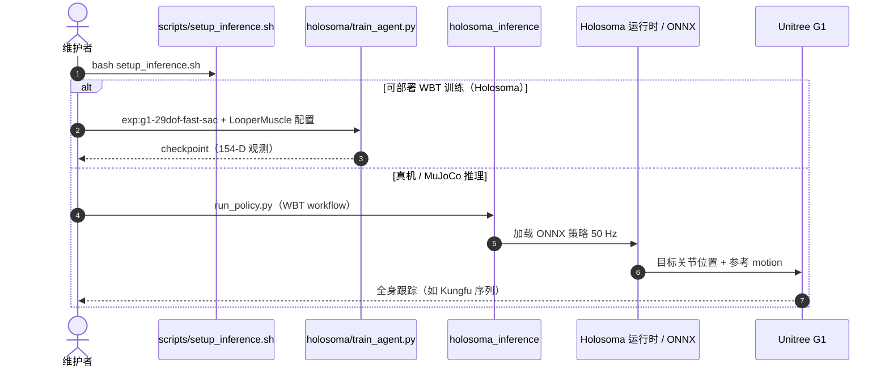

# LooperMuscle：结构化 MoE 加速人形全身跟踪

**LooperMuscle**（*LooperMuscle: Fast and Stable Learning of Humanoid Whole-Body Tracking via Structured Mixture-of-Experts*，深镜智能 × 香港科技大学 × MBZUAI，arXiv:[2608.00820](https://arxiv.org/abs/2608.00820)，[项目页](https://loopermuscle.github.io/)）针对 **FastSAC 类 off-policy 方法在全身跟踪（WBT）上「快但差」、PPO「好但慢」** 的速度–性能鸿沟，提出 **组合专家 actor–critic 框架**：语义分组 **MoE actor**、**专家感知分布式 critic** 与 **配额路由 replay + 延迟课程** 形成闭环训练。在 MJLab 上 40 条 LAFAN1、29-DoF G1 基准中，约 **45 min** 墙钟达到 PPO（~6 h）**72%** 归一化奖励，相对 FastSAC-MLP（~15 min）body 误差 **↓34%**；真机在 Holosoma 可部署观测接口上重训后完成 KungfuBot2 格斗序列跟踪。

## 一句话定义

**全身跟踪要同时快又好，光换更大 MLP 不够——把上下身拆成语义 MoE、让 critic 与 replay 都「认识专家」，才能在 FastSAC 墙钟里追回大部分 PPO 质量。**

## 英文缩写速查

| 缩写 | 英文全称 | 简要说明 |
|------|----------|----------|
| WBT | Whole-Body Tracking | 29-DoF 参考动作全身跟踪任务 |
| MoE | Mixture-of-Experts | 多专家策略，按关节组门控融合 |
| DVF | Distributional Value Function | 分布式价值函数（C51 原子） |
| FastSAC | Fast Soft Actor-Critic | 大规模并行调参的 off-policy 基座 |
| PPO | Proximal Policy Optimization | 论文质量上界（~6 h 训练） |
| SAC | Soft Actor-Critic | LooperMuscle 所扩展的 RL 算法族 |
| G1 | Unitree G1 | 论文仿真与真机平台（29 DoF） |
| LAFAN1 | — | 40 条六类动作评测集 |

## 为什么重要

- **补齐 FastSAC 在 WBT 的短板：** [15 分钟人形行走](./paper-notebook-learning-sim-to-real-humanoid-locomotion-in-15-m.md) 已证明 off-policy 墙钟可行，但 **dense 29-DoF 跟踪** 上 PPO 仍明显更强；LooperMuscle 把「快」从 locomotion 延伸到 **全身跟踪迭代**。
- **MoE 不是 PPO 专利：** 与 [GMT](./paper-gmt.md)、KungfuBot2 等 **PPO+MoE** 并发；LooperMuscle 证明在 **FastSAC 体制** 下 MoE 相对 MLP 的 body err 降幅可达 **34%**（Table IV 跨体制对照）。
- **三线闭环而非堆模块：** actor 贡献 → replay 路由 → 分布式 critic → 梯度反哺专家特化；消融显示去 MoE 退化最大（+51.5% body err）。
- **工程可读的开源边界：** [官方仓](https://github.com/LooperMuscle/Code) 提供 Holosoma 训练/部署；论文 MJLab 数字用 **特权 anchor 观测**，真机需 **154-D 可部署接口重训**——避免把基准当部署承诺。

## 核心信息

| 项 | 内容 |
|----|------|
| **机构** | 深镜智能（DeepMirror Inc.，广州）；香港科技大学（HKUST）；穆罕默德·本·扎耶德人工智能大学（MBZUAI）；通讯 Xingxing Zuo |
| **平台** | Unitree G1，29 DoF；PD 目标关节位置；真机 50 Hz ONNX |
| **数据** | 40 LAFAN1：Walk 12 / Run 6 / Jump 3 / Dance 8 / Fight 5 / Fall&GetUp 6 |
| **仿真** | 论文主表 MJLab，4096 envs，50 Hz 控制，单卡 RTX 4090D |
| **对比** | PPO ~6 h；FastSAC-MLP ~15 min；LooperMuscle ~45 min（$K{=}4$ 专家，$G{=}2$ 上下身组） |
| **开源** | **部分开源** — [LooperMuscle/Code](https://github.com/LooperMuscle/Code)：Holosoma 训练/推理/重定向；MJLab 特权基准 ≠ 真机 checkpoint |

## 流程总览

## 核心机制（归纳）

### 语义分组 MoE Actor

- $d{=}29$ 关节按 **上下身** 分为 $G{=}2$ 组；$K{=}4$ 专家经组级 softmax 门控融合，配 **per-joint scaling** $S_{k,j}$（按名义关节范围初始化）与 **output alignment** $c_k$。
- **KL 负载均衡** $\mathcal{L}_{\text{lb}}$ 防止门控塌缩，使弱专家全程参与；t-SNE 显示专家按 **控制模式**（stance vs swing）而非动作类别聚类。

### 专家感知分布式 Critic

- 双 critic、每专家 **C51 分布式头**；用 actor 门控 $\tilde{w}_k$ 聚合，**结构与 actor 同构**，细粒度 credit assignment 同时保留 SAC 稳定性。

### 配额路由 Replay + 延迟课程

- 转移附带专家贡献 $\mathbf{e}_t$ 与 body tracking ratio $b_t$；按主导专家 $k^*$ 路由，mini-batch 内 **$N_k=\lfloor q_k N_{\text{exp}}\rfloor$** 保证配额。
- **延迟桶** 用进度函数 $h(\rho)$、$u(\rho)$ 控制难样本释放时机，稳定早期、抬高后期上限。

### 与 FastSAC / PPO 的关系

- 基座为 [FastSAC](./paper-notebook-learning-sim-to-real-humanoid-locomotion-in-15-m.md) 配方（分布式 critic、归一化等）；**不替换算法族，而是改策略结构、价值结构与数据分配**。
- PPO 在 WBT 上仍是最强参考（norm. reward 1.0）；FastSAC-MLP 即使延长到 197–360 min 也难追上，作者归因 **单体 actor 表达瓶颈** 而非算力不足。

## 实验要点

| 设定 | 内容 |
|------|------|
| 主表（Table I） | LooperMuscle body **0.101 m** / joint **0.285 rad** / norm. reward **0.723** / **~45 min** |
| vs FastSAC-MLP | body **0.153 m** / **0.648** / **~15 min**；全类别 body err 改善 26.7%–40.6% |
| vs PPO | body **0.082 m** / **1.000** / **~360 min** |
| 消融（Table III） | 去 MoE +51.5%；去 quota replay +25.7%；去 deferred +17.8%；去 expert critic +11.9% |
| 真机 | Holosoma 154-D 可部署观测 **重训**；KungfuBot2 格斗序列；MJLab checkpoint **不直接迁移** |

## 源码运行时序图

官方仓 [LooperMuscle/Code](https://github.com/LooperMuscle/Code) **部分开源**：Holosoma 训练与真机/MuJoCo 推理可跑；论文 MJLab 特权基准与部署策略接口不同。

- **复现路径：** 克隆仓 → `setup_inference.sh` → 按 `src/holosoma/README.md` 训练或 `holosoma_inference` WBT workflow 部署。
- **论文 Table I 数字：** MJLab 特权接口；读数时与 Holosoma 部署结果 **分开对照**。

## 工程实践

| 项 | 实践要点 |
|----|----------|
| 开源状态 | **部分开源**：训练/推理/重定向在 GitHub；MJLab 基准 ≠ 真机 ckpt |
| 观测接口 | 主表含仿真器 GT anchor；真机仅 IMU/编码器/相对参考 → **必须重训** |
| 墙钟预算 | ~45 min 为论文单卡设定；快速迭代 WBT 时优先于 6 h PPO |
| 对比基线 | 与 FastSAC-MLP 比质量、与 PPO 比上限；勿用 locomotion 15 min 数字代替 WBT |
| 专家数 | $K{=}4$、$G{=}2$ 为论文固定超参；系统性扫参留作后续工作 |

## 结论

**LooperMuscle 把 FastSAC 的墙钟优势真正用到全身跟踪上：MoE 分解是最大增益源，配额 replay 与专家 critic 把闭环训稳。**

1. **问题定义准** — WBT 是 dense 29-DoF 跟踪，不是低维速度跟踪；FastSAC-MLP 15 min 快但 body err 0.153 m，PPO 6 h 才是质量参考。
2. **MoE 是主因** — 去 MoE actor 等价回 FastSAC-MLP（+51.5% body err）；上下身分组门控 + KL 防塌缩是核心结构。
3. **闭环三线缺一不可** — quota replay（+25.7% 若移除）与 deferred 课程（+17.8%）解决弱专家欠训；expert-aware DVF（+11.9%）对齐 credit assignment。
4. **墙钟–质量甜点** — ~45 min 达 PPO norm. reward 的 **72%**，8× 快于 PPO；难动作（Fall&GetUp）改善最大（40.6%）。
5. **读数要分接口** — MJLab 特权基准 ≠ Holosoma 154-D 真机策略；官方 README 明确要求重训，勿直接迁 checkpoint。
6. **选型定位** — 需要 **快速 WBT 策略迭代** 且接受 off-policy 配方时，优先于裸 FastSAC-MLP；要绝对上限仍看 PPO 或更长预算。

## 局限与风险

- **观测口径分裂：** 主表与消融在 MJLab 特权接口；真机仅定性验证，完整 benchmark 尚未在可部署接口重跑。
- **固定结构超参：** $K$、$G$、温度、路由比例未系统扫参；仅 G1 29-DoF。
- **与 GMT/KungfuBot2 不可横比绝对误差：** Table IV 仅支持「MoE > MLP」方向性结论。
- **部分开源：** 论文 MJLab 实验与 Holosoma 部署栈并存，复现时以仓内 README 为准。

## 与其他工作对比

| 路线 | 算法 | MoE | 墙钟 | 典型局限 |
|------|------|-----|------|----------|
| FastSAC-MLP | off-policy | 无 | ~15 min | WBT 质量明显弱于 PPO |
| **LooperMuscle** | FastSAC + 结构化 MoE | 组级门控 $K{=}4$ | ~45 min | 特权基准 vs 部署需重训 |
| PPO | on-policy | 可选 | ~6 h | 墙钟贵，WBT 质量上界 |
| GMT | PPO + Motion MoE | 软 MoE | 长 | 单策略大规模 MoCap，不同算法族 |
| KungfuBot2 | PPO + Orth. MoE | 正交 MoE | 长 | 追求通用性而非 per-task 快训 |

## 关联页面

- [Whole-Body Tracking Pipeline](../concepts/whole-body-tracking-pipeline.md)
- [人形策略网络架构](../concepts/humanoid-policy-network-architecture.md)
- [人形运动跟踪方法选型](../queries/humanoid-motion-tracking-method-selection.md)
- [FastSAC 15-min](./paper-notebook-learning-sim-to-real-humanoid-locomotion-in-15-m.md)
- [FlashSAC](../methods/flashsac.md)
- [GMT](./paper-gmt.md)
- [PPO vs SAC](../comparisons/ppo-vs-sac.md)
- [Unitree G1](./unitree-g1.md)

## 参考来源

- [loopermuscle_arxiv_2608_00820.md](../../sources/papers/loopermuscle_arxiv_2608_00820.md)
- [loopermuscle-github-io.md](../../sources/sites/loopermuscle-github-io.md)
- [loopermuscle-code.md](../../sources/repos/loopermuscle-code.md)

## 推荐继续阅读

- 论文 PDF：<https://arxiv.org/pdf/2608.00820>
- 官方代码：<https://github.com/LooperMuscle/Code>
- FastSAC 前驱：[Learning Sim-to-Real Humanoid Locomotion in 15 Minutes](https://arxiv.org/abs/2512.01996)
