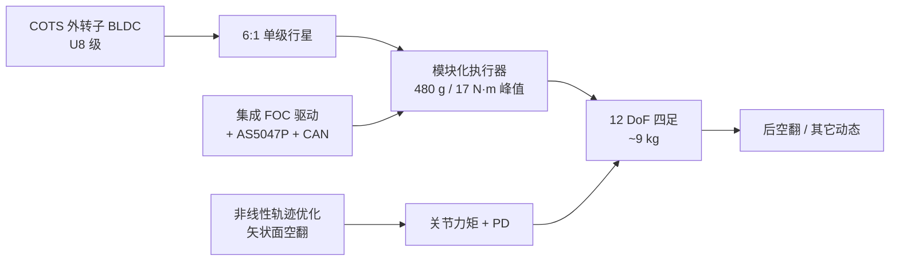
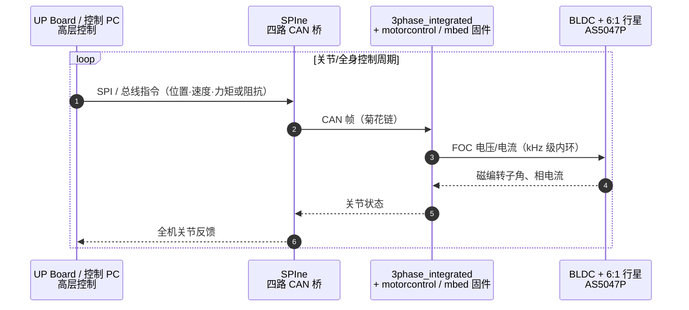

# A Low Cost Modular Actuator for Dynamic Robots（Katz / Mini Cheetah）

## 一句话定义

**Benjamin G. Katz（MIT，Sangbae Kim 指导，[S.M. thesis 2018](https://dspace.mit.edu/entities/publication/b85069e2-f1cd-470e-a92a-9bf0dadfa7ee)）** 给出面向高动态机器人的**低成本模块化本体感受执行器**：成品航模外转子电机 + **6:1** 单级行星 + 集成驱动/磁编/CAN，并用 12 个相同模块装成约 **9 kg** 四足，完成站立起飞的 **360° 后空翻**——即日后通称 **MIT Mini Cheetah** 执行器线的工程蓝本。

## 英文缩写速查

| 缩写 | 英文全称 | 简要说明 |
|------|----------|----------|
| QDD | Quasi-Direct Drive | 准直驱：低减速比、高背驱动性的力控作动方案 |
| FOC | Field-Oriented Control | 磁场定向控制；关节力矩主要由电流环实现 |
| BLDC | Brushless DC Motor | 无刷直流/永磁同步外转子电机（文中 U8 级 COTS） |
| CAN | Controller Area Network | 执行器菊花链通信总线 |
| BOM | Bill of Materials | 物料成本；文中子 50 件量级约 $300/执行器 |
| CoT | Cost of Transport | 运输代价（文中对照 Cheetah 2 生物可比叙事） |

## 为什么重要

- **把 Cheetah 范式「平民化」**：[Wensing et al. 本体感受执行器](./paper-notebook-proprioceptive-actuator-design-in-the-mit-cheeta.md) 用定制电机；本文改用量产航模电机与现成齿轮，BOM 低 1–2 个数量级，整机硬件成本可低于 Cheetah 单执行器。
- **模块即关节**：驱动、减速、结构承弯、电源/CAN 菊花链一体，显著缩短「从执行器到可跑跳四足」的集成时间。
- **工程教材密度高**：冲击载荷估计、离散电流环、磁编标定、四象限效率/损耗/热、弱磁，以及空翻轨迹优化→真机回放，都写进同一本 thesis。
- **开源边界清晰**：附录 A **已开**驱动 PCB/固件/SPIne/表征数据；**未开**完整机械 CAD——后续 DIY/开源 QDD（OpenTorque、ODRI、Urs 等）多在此范式上补齐「可复制机械」。

## 核心信息

| 项 | 内容 |
|----|------|
| **机构** | 麻省理工（MIT）机械工程系 / Biomimetic Robotics Lab |
| **形态** | 模块化执行器 + 12 DoF 四足（约 Cheetah 3 的 60% 尺度） |
| **电机** | U8 形性能的 COTS 外转子（约 $60–90）；气隙直径约 81 mm、叠厚 8.2 mm、**21** 极对 |
| **传动** | **6:1** 单级行星（Misumi / KHK 现成齿）；输出背隙约 **0.005 rad** |
| **规格** | 质量 **480 g**；Ø96 × 40 mm；峰值 **17 N·m**；连续 **6.9 N·m**；约 **40 rad/s @ 24 V**；输出惯量 **0.0023 kg·m²** |
| **功率** | 正功峰值约 **+250 W**；负功峰值约 **−680 W** |
| **电流环** | 带宽约 **4.5 kHz @ 4.5 N·m**、**1.5 kHz @ 17 N·m**；10 A 上升约 **75 µs** |
| **通信** | CAN 菊花链；上位机 UP Board + **SPIne**（四路 CAN） |
| **整机** | 含电池约 **9 kg**；单腿竖直力约 **1.6** 倍体重 |
| **开源** | **部分开源**（电子/固件/数据已开；机械 CAD 未在附录列出） |

## 流程总览

## 核心原理

### 1）本体感受 QDD，而非 SEA

- 继承 MIT Cheetah：**高扭矩密度电机 + 低减速透明传动**，用电流估计关节力矩，强调冲击可背驱与高带宽力交互（对照 [Wensing 计划页](./paper-notebook-proprioceptive-actuator-design-in-the-mit-cheeta.md)）。
- 明确**不为**定位精度、齿隙、静力矩精度优化：齿槽约 **0.25 N·m** 输出纹波、背隙约 **0.28°**；对腿足平均功率与厘米级落足通常可接受，对高精度力反馈则明显。

### 2）冲击下的传动选型

- 用输入柔顺 / 输出柔顺 / 末端柔顺三案例估计碰撞时太阳轮载荷；太阳轮许用约 **11 N·m**。
- 关键论：传动强度应按**最大冲击速度下的惯量碰撞**留裕度，而不是只匹配电机能发出的稳态力矩——否则高带宽力控与抗冲击不可兼得。

### 3）集成驱动与电流力矩

- 无输出力矩计；\(\tau_{out} \approx n\,\tau_{rotor} + \tau_{friction}\)。
- 摩擦模型（文中）：静摩擦约 **0.09 N·m**，力矩相关约 **0.04 N·m/N·m**，对应传动效率约 **90–95%**。
- 磁编非线性与齿槽用旋转查表标定；弱磁（\(i_d\) 至约 10 A）可扩展转速/功率包络。

### 4）四足与空翻控制

- 机械：近端布置执行器、轻质腿环节流惯量；髋部大 ROM，便于任意姿态脚先着地。
- 空翻：离线 2D 矢状面非线性优化生成力矩轨迹 → 真机回放 + 关节 PD；着陆宽站姿、中等刚度高阻尼。COM 峰值约 **0.65 m**，整机机械输出峰值约 **690 W**。

## 源码运行时序图

论文附录 A 给出的**可运行**入口以驱动固件 + SPIne 为主（机械 CAD 不适用）。典型关节力矩环：

- **复现入口**：PCB/BOM → [`bgkatz/3phase_integrated`](https://github.com/bgkatz/3phase_integrated)；固件优先 [`bgkatz/motorcontrol`](https://github.com/bgkatz/motorcontrol) 或 mbed `Hobbyking_Cheetah_Compact` / `HKC_MiniCheetah`；多关节桥 [`bgkatz/SPIne`](https://github.com/bgkatz/SPIne)；表征数据 [`bgkatz/actuator`](https://github.com/bgkatz/actuator)。
- **机械**：thesis **未**提供壳体/行星箱完整 CAD——复制机械需自行按文中尺寸/齿号反求或参考后续社区项目。
- **整机控制栈**：日后 `mit-biomimetics/Cheetah-Software` 等与 Mini Cheetah 生态相关，但不在本 thesis 附录承诺范围内。

## 工程实践

| 项 | 建议 |
|----|------|
| 读文顺序 | Ch.2 规格与冲击 → 驱动/电流环 → 台架图 → Ch.3 四足与空翻 → 附录 A/C |
| 选型指标 | 分开记峰值 **17 N·m** vs 连续 **6.9 N·m**；有风冷可按文中热阻近似「连续近翻倍」 |
| 电气复现 | 先单板 `3phase_integrated` + 固件电流阶跃，再挂行星与测功/对拖 |
| 摩擦/齿槽 | 腿足可先不补偿；力反馈/慢速精密任务再考虑前馈表 |
| 空翻类动作 | 优化动力学模型精度优先；着陆用高阻尼宽站姿比追求完美跟踪更稳 |
| 版权 | 从 DSpace 下载 PDF 自用；**勿把 MIT thesis PDF 再分发进公开仓库** |

## 实验与评测

| 实验 | 要点 |
|------|------|
| 稳态 TN / 效率 | 无箱体电机全工况；带箱受测功机 **11 N·m** 限幅；正功约 250 W、负功约 −680 W |
| 力矩精度 | 无闭环输出力矩；摩擦 + 齿槽主导误差；传动效率约 90–95% |
| 热 | 绕组热阻约 1.23 K/W，平均 &lt;60 W 以控温 &lt;100 °C；风扇 → 约 0.34 K/W |
| 电流阶跃 | 10 A / 20 A 上升约 75 / 110 µs（感抗与电压限） |
| 四足空翻 | COM≈0.65 m；机械峰值≈690 W；优化轨迹首次上真机即可成功（作者叙述） |
| 部署规模 | 文中称实验室已造 **26** 个模块（四足 + 双足 + 力反馈臂） |

## 与其他工作对比

| 对照 | 差异 |
|------|------|
| [Wensing / Cheetah 本体感受](./paper-notebook-proprioceptive-actuator-design-in-the-mit-cheeta.md) | 同范式；本文用 COTS 电机换成本与模块化 |
| [Solo / ODRI](./paper-open-torque-controlled-modular-robot-solo.md) | Solo 更强调**完整开源**皮带 QDD + 接触开关；本文性能/空翻更猛，但机械开源不完整 |
| [Urs 3D 打印 QDD](./paper-3d-printed-open-source-actuators-legged.md) | Urs 热/寿命/背隙教材更系统；本文台架 + 整机动态演示更强 |
| [OpenTorque](./opentorque-actuator.md) / [Doggo](./stanford-doggo-and-pupper.md) | 同为成品电机低减速；Katz 是工业/学术影响力最大的「模块化集成驱动」先例之一 |
| ANYDrive / HEBI（文中对照） | 闭源商品；ANYDrive 大力矩下带宽掉得快；HEBI 软件友好但峰值功率有限 |

## 结论

**这是 Mini Cheetah 线把「Cheetah 式本体感受 QDD」做成可量产模块的关键工程文档：成本与集成度是主贡献，空翻是能力上限的演示，而不是算法新颖性声明。**

1. **先抄系统边界**：成品大直径外转子 + 个位数减速比 + 集成电流力矩 + CAN 菊花链，再谈自研电磁。
2. **指标分栏**：峰值 / 连续 / 热连续（有无风冷）三套数字；不要只用 17 N·m 做行走热设计。
3. **传动按冲击选型**：太阳轮与轴承裕度要对最大碰撞速度，不单对电机峰值。
4. **开源预期管理**：可复现的是**驱动与固件**；机械需自行机加或另寻社区 CAD。
5. **高动态动作**：准模型 + 离线优化力矩回放，在透明执行器上可以「第一次就成功」；着陆策略往往比起飞跟踪更关键。
6. **读完下一步**：对照 [开源 QDD 对比](../comparisons/open-source-qdd-actuator-projects.md) 选 ODRI/OpenTorque 等补齐可复制机械，或沿 [力矩电机纵深](../../roadmap/depth-torque-motor-design.md) 进入驱动与热设计。

## 局限与风险

- **部分开源**：无官方完整执行器机械 CAD；社区克隆件质量参差。
- 静力矩精度与齿槽对力反馈不友好；文中已承认。
- 行星现成齿有背隙；精密定位任务不适合。
- MIT thesis **版权限制再分发**；引用以 DSpace handle 为准。
- 空翻演示依赖当时软硬件共设；今日复现需自行对接当代控制栈。

## 关联页面

- [开源 QDD 执行器项目对比](../comparisons/open-source-qdd-actuator-projects.md)
- [Proprioceptive actuator design in the MIT Cheetah（计划页）](./paper-notebook-proprioceptive-actuator-design-in-the-mit-cheeta.md)
- [Solo / ODRI 架构论文](./paper-open-torque-controlled-modular-robot-solo.md)
- [3D 打印开源腿式执行器（Urs）](./paper-3d-printed-open-source-actuators-legged.md)
- [执行器驱动链选型闭环](../queries/actuator-drive-chain-selection-loop.md)
- [力矩电机设计纵深](../../roadmap/depth-torque-motor-design.md)
- [moteus](./moteus.md) · [OpenTorque](./opentorque-actuator.md) · [ODRI](./odri-solo-and-bolt.md)
- [四足机器人](./quadruped-robot.md) · [Locomotion](../tasks/locomotion.md)

## 参考来源

- [sources/papers/low_cost_modular_actuator_katz_mit_2018.md](../../sources/papers/low_cost_modular_actuator_katz_mit_2018.md)
- [Robot Daycare · Mini Cheetah 叙事](../../sources/sites/robot_daycare_mini_cheetah.md)
- [bgkatz/3phase_integrated](../../sources/repos/bgkatz_3phase_integrated.md)
- [bgkatz/motorcontrol](../../sources/repos/bgkatz_motorcontrol.md)
- [bgkatz/SPIne](../../sources/repos/bgkatz_spine.md)

## 推荐继续阅读

- MIT DSpace：<https://dspace.mit.edu/entities/publication/b85069e2-f1cd-470e-a92a-9bf0dadfa7ee>
- PDF（handle）：<http://hdl.handle.net/1721.1/118671>
- 作者博客：<https://robot-daycare.com/posts/2019-03-04-hello-there-mini-cheetah/>
- 驱动硬件仓：<https://github.com/bgkatz/3phase_integrated>
- Wensing et al., *Proprioceptive Actuator Design in the MIT Cheetah*（IEEE T-RO 2017）— 范式论文
