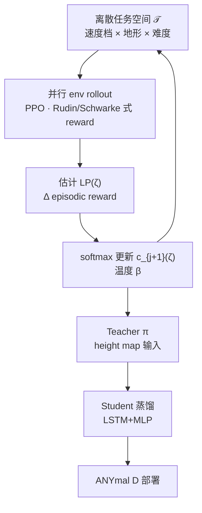

# LP-ACRL（Scaling Rough Terrain Locomotion）

**LP-ACRL**（*Scaling Rough Terrain Locomotion with Automatic Curriculum Reinforcement Learning*，Ziming Li、Chenhao Li、Marco Hutter；ETH Zurich RSL × ETH AI Center；arXiv:[2601.17428](https://arxiv.org/abs/2601.17428)，RA-L [DOI:10.1109/LRA.2026.3703486](https://doi.org/10.1109/LRA.2026.3703486)，[项目页](https://sites.google.com/view/lp-acrl)）提出 **Learning Progress-based Automatic Curriculum RL**：在 **无先验难度结构** 的多轴离散任务空间上，用 **episodic reward 的 LP** 在线更新任务采样分布，并经 **Teacher–Student 蒸馏** 在 **ANYmal D** 上实现 **rough terrain 高速** 统一速度跟踪策略。

## 一句话定义

**把 locomotion 任务空间离散成 hundreds 级实例，用相邻阶段 reward 差作 learning progress、softmax 重采样替代手工课程轴，再在 height-map teacher 上蒸馏 LSTM 学生部署真机。**

## 英文缩写速查

| 缩写 | 英文全称 | 简要说明 |
|------|----------|----------|
| LP-ACRL | Learning Progress-based Automatic Curriculum RL | 本文框架 |
| LP | Learning Progress | $R_{c_j}(\zeta)-R_{c_{j-1}}(\zeta)$，驱动采样 |
| ACL | Automatic Curriculum Learning | 自动课程总类；LP-ACRL 属 LP 系 |
| ALP | Absolute Learning Progress | Portelas 等基线；对 \|LP\| 加权，易放大回归 |
| PLR | Prioritized Level Replay | Jiang 等基线；TD/value error 优先级 |
| EPTE-SP | Episodic Percentage Tracking Error with Stability Penalty | 跟踪误差 + 跌倒惩罚联合指标 |
| CRL | Curriculum Reinforcement Learning | 课程式 RL 训练 |
| RSL | Robotic Systems Lab | ETH Zurich 机器人系统实验室 |

## 为什么重要

- **多轴任务空间的可扩展课程：** 线/角速度档位 × 地形类型 × 几何难度 **无单一排序** 时，手工 CRL（legged_gym 式地形 level、Ji 式速度上界）难以维护；LP-ACRL 用 **统一 LP 信号** 覆盖 **600 实例** scaled 实验。
- **ANYmal 系速度标杆：** 真机 **2.5 m/s（rough）/ 3.0 m/s（flat）/ 3.0 rad/s** 的统一策略，相对「平地高速 OR 复杂地形低速」的常见折中更激进。
- **与 RSL rough-loco lineage 对齐：** 观测/reward 框架延续 Rudin / Schwarke 并行 rough terrain 训练，**创新集中在 $c_j$ 更新**——便于在已有 Isaac Lab + rsl_rl 栈上 **只换采样模块** 做 ablation。
- **自动课程选型参考：** 相对 ALP/PLR/手工 SC，论文给出 **EPTE-SP + success rate** 上更稳定的 **sample efficiency** 证据（1500 vs 3000 iter）。

## 核心信息

| 字段 | 内容 |
|------|------|
| **机构** | 苏黎世联邦理工学院（Robotic Systems Lab）；Chenhao Li @ ETH AI Center |
| **平台** | ANYmal D（12 DoF）；Isaac Lab 仿真 |
| **Teacher 感知** | 局部 height map（108 点网格 + 本体 + 指令） |
| **Student 部署** | LSTM + MLP；应对 elevation mapping 噪声 |
| **Scaled 任务空间** | 600 离散实例（5×6 速度组合 × 5 地形 × 4 难度） |
| **开源** | **确认未开源**（2026-10-01 项目页无 GitHub；见 [`sources/sites/lp-acrl.md`](../../sources/sites/lp-acrl.md)） |
| **邻近栈** | [rsl_rl](https://github.com/leggedrobotics/rsl_rl)、[legged_gym](https://github.com/leggedrobotics/legged_gym)（手工课程，非 LP-ACRL） |

## 流程总览

## 核心原理

### LP 驱动的自动课程

- 任务实例 $\zeta$：categorical（楼梯上/下、gravel…）+ 连续指令 **分箱**。
- $LP_{c_j}(\zeta)=R_{c_j}(\zeta)-R_{c_{j-1}}(\zeta)$；$c_{j+1}(\zeta)\propto\exp(LP/\beta)$。
- **行为：** 早期聚焦 **高 LP 的易任务**；随能力增长采样 **向难任务扩散**；难任务 plateau 后 **概率回流** 至仍有 LP 的中低难实例，稳定已掌握技能。

### 相对基线的 failure mode（论文 §IV-C 口径）

| 方法 | 典型问题 |
|------|----------|
| Uniform / LRPC | 在 **持续失败** 实例上浪费样本 |
| SC（手工速度上界递增） | 引入高速后 **易任务样本比例下降**，中低速性能 **退化** |
| ALP | 难任务早期波动 → **欠采样易任务**；后期 **过采样易任务振荡** |
| PLR | value error **任务区分弱**，方差大 |

## 实验与评测

**三层 ablation：**

1. **平地 8 档线速度**（$|v_x^*|\in[0,4]$ m/s）— 有结构难度，验证 LP 曲线与采样热图。
2. **6 类 rough terrain** — 速度在 $[0,1]$ 随机，**无显式难度序**。
3. **Scaled 600 实例** — Success（>900 steps & EPTE-SP<30%）；LP-ACRL **~1500 iter 达 ~80% success**。

**真机：** Student 策略；rough **2.5 m/s**、flat **3.0 m/s**、角速度 **3.0 rad/s**（论文 claim）。

## 工程实践

| 检查项 | 建议 |
|--------|------|
| 任务离散化 | 先定义 **可解释实例 ID**（速度箱 × 地形 × 难度参数），再挂 LP 统计 |
| LP 估计窗口 | 对齐论文 **阶段 $c_j$** 更新频率；$\beta$ 控制探索/利用 |
| 指标 | 除 reward 外跟踪 **EPTE-SP** 与 **跌倒步 $k_f$** |
| Sim2Real | Teacher height map → **时序学生** 应对 mapping 噪声（与 PITW 深度学生 **不同传感路线**） |
| 基线复现 | 同框架下实现 ALP/PLR/SC，避免换 reward 混淆课程贡献 |
| 栈选型 | PPO + Isaac Lab + rsl_rl 惯例；**课程模块可插拔** |

## 源码运行时序图

**不适用** — 截至 2026-10-01，**无官方 LP-ACRL 训练/部署仓库**（见 [`sources/sites/lp-acrl.md`](../../sources/sites/lp-acrl.md)）。复现路径为：在现有 RSL rough-loco 训练循环中 **插入 LP 统计与 $c_j$ 重采样**，真机侧自研 teacher–student 蒸馏与 elevation mapping 接口。

## 结论

**LP-ACRL 把「learning progress → 采样分布」做成多轴 legged 任务空间的默认自动课程基线：在 600 实例 scaled 设定上样本效率与 success 集覆盖优于 ALP/PLR/手工课，并用 ANYmal D 真机高速 rough 部署闭合 sim2real 叙事。**

- **先离散、再 LP：** 连续 velocity/地形参数 **必须分箱** 才有 per-task LP；粒度决定课程分辨率与算力。
- **LP softmax 不是 ALP：** 只用 **正向 progress** 的 softmax，避免 |LP| 放大回归导致的 **易任务过采样**。
- **Teacher–Student 是部署必选项之一：** height map teacher 训得再强，真机 mapping 噪声仍推 **时序学生**。
- **与手工地形课互补而非替代：** legged_gym 式 **per-env terrain level** 管 **几何难度轴**；LP-ACRL 管 **全笛卡尔积实例**——大空间优先 LP，小空间可仍用手工轴。
- **开源缺口：** 当前价值在 **方法读法 + EPTE-SP 指标 + 基线对照**；工程复现需自研模块。
- **后续 ingest 跟进点：** 若项目页发布 GitHub，应补 `sources/repos/` 与运行时序图。

## 局限与风险

- **离散化敏感：** 速度/难度分箱过粗会 **合并异质任务**；过细则 LP 估计方差大。
- **仅 episodic reward LP：** 未利用 per-step TD「surprise」；与 PLR 系方法 **inductive bias 不同**。
- **ANYmal + Isaac Lab 绑定：** 迁移到人形或其他 sim 需重做任务空间与 reward 标定。
- **无权重/代码：** 数字为论文/视频 claim，第三方 **独立复现** 尚未有公开仓佐证。

## 与其他工作对比

| 维度 | LP-ACRL | [legged_gym 地形课](./legged-gym.md) | [Parkour in the Wild](./paper-parkour-in-the-wild.md) |
|------|---------|--------------------------------------|------------------------------------------------------|
| 课程信号 | episodic LP softmax | 成功率阈值 **升/降 terrain level** | 分地形 **手工** expert 课 |
| 任务空间 | 600 实例多轴 | 主要为 **单轴地形难度** | 9 地形 + 蒸馏扩展 |
| 感知部署 | height map → LSTM student | 常见 proprio / 高度 scan | 4 深度 + LSTM |
| 目标 | **高速 uniform velocity** on rough | 鲁棒 traversability | 敏捷 parkour / wild |
| 开源 | 未开源 | 开源 | 未开源 |

## 关联页面

- [Curriculum Learning](../concepts/curriculum-learning.md)
- [Privileged Training](../concepts/privileged-training.md)
- [Reinforcement Learning](../methods/reinforcement-learning.md)
- [Locomotion](../tasks/locomotion.md)
- [RSL RL](./rsl-rl.md)
- [Parkour in the Wild](./paper-parkour-in-the-wild.md)

## 参考来源

- [lp_acrl_arxiv_2601_17428.md](../../sources/papers/lp_acrl_arxiv_2601_17428.md)
- [lp-acrl.md（项目页归档）](../../sources/sites/lp-acrl.md)

## 推荐继续阅读

- [arXiv HTML 2601.17428](https://arxiv.org/html/2601.17428) — LP 公式与 Fig. 5/9 采样热图
- [RA-L DOI](https://doi.org/10.1109/LRA.2026.3703486) — 正式版
- [LP-ACRL 项目页与视频](https://sites.google.com/view/lp-acrl)
- [Learning to Walk in Minutes（Rudin 2022）](https://arxiv.org/abs/2109.11978) — 并行 rough terrain 训练框架先验
- [Portelas et al., ALP-GMM 系自动课程](https://arxiv.org/abs/1907.04287) — ALP 基线来源
